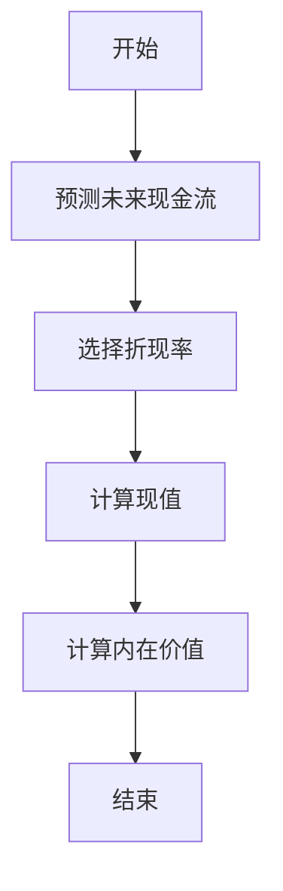
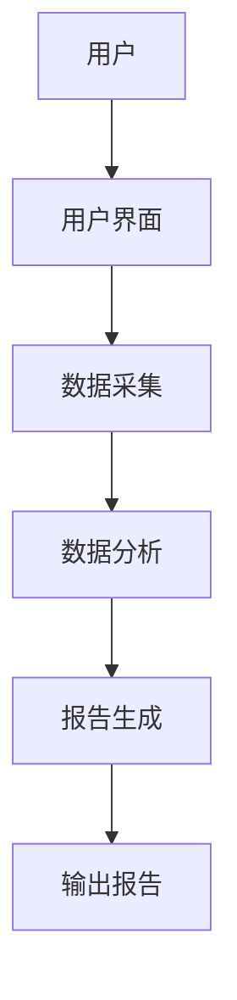

                 


# 玛丽·巴芙的成长型价值投资法

> 关键词：价值投资、成长型投资、玛丽·巴芙、DCF模型、投资分析、系统架构

> 摘要：本文详细探讨了玛丽·巴芙的成长型价值投资法，结合技术分析的方法，从核心概念、算法原理到系统设计和项目实战，系统地介绍了如何通过技术手段提升投资决策的科学性。

---

## 目录大纲

1. **价值投资与成长型投资概述**
   - 1.1 投资的基本概念
   - 1.2 价值投资的起源与发展
   - 1.3 玛丽·巴芙的成长型投资法

2. **价值投资的核心概念**
   - 2.1 价值投资的定义与特征
   - 2.2 成长型投资的定义与特征
   - 2.3 玛丽·巴芙策略的比较分析

3. **企业价值评估的算法原理**
   - 3.1 DCF模型的原理
   - 3.2 算法流程图
   - 3.3 Python代码实现

4. **数学模型与应用案例**
   - 4.1 DCF模型的数学公式
   - 4.2 应用案例分析

5. **系统架构设计**
   - 5.1 系统功能模块
   - 5.2 系统架构图
   - 5.3 接口设计

6. **项目实战**
   - 6.1 环境配置
   - 6.2 代码实现
   - 6.3 结果分析

7. **最佳实践与小结**
   - 7.1 投资中的注意事项
   - 7.2 玛丽·巴芙方法的总结
   - 7.3 拓展阅读

---

## 第一部分：价值投资与成长型投资概述

### 第1章：投资的基本概念

#### 1.1 投资的基本概念

投资是将资金分配到不同资产以获得收益的过程。资产可以是股票、债券、房地产等。投资的核心在于通过分析市场趋势和企业基本面，选择具有潜在增值能力的资产。

- **1.1.1 投资的定义与分类**
  - 定义：将资金投入特定资产，以期获得未来收益的行为。
  - 分类：包括股票投资、债券投资、房地产投资等。

- **1.1.2 金融市场的基本结构**
  - 金融市场是资金流动和资产交易的场所，分为一级市场和二级市场。
  - 一级市场：发行新证券的市场，如IPO。
  - 二级市场：已发行证券的交易市场，如股票交易所。

- **1.1.3 投资者的角色与类型**
  - 投资者根据风险承受能力和收益目标分为保守型、稳健型和激进型。

#### 1.2 价值投资的起源与发展

价值投资是由本杰明·格雷厄姆提出的，强调以低于内在价值的价格购买股票，长期持有，等待价格回归。

- **1.2.1 价值投资的起源**
  - 格雷厄姆的学生彼得·林奇进一步发展了价值投资理论。

- **1.2.2 价值投资的发展历程**
  - 从格雷厄姆的时代到现代，价值投资不断发展，与其他投资策略结合。

- **1.2.3 价值投资的核心理念**
  - 买入被市场低估的股票，长期持有，获得超额收益。

#### 1.3 玛丽·巴芙的成长型投资法

玛丽·巴芙作为巴菲特的妹妹，她的投资策略更注重企业的成长性，而非仅仅关注价格是否低于内在价值。

- **1.3.1 成长型投资的定义**
  - 成长型投资：买入具有持续增长潜力的企业股票，长期持有，分享企业成长带来的收益。

- **1.3.2 玛丽·巴芙的投资理念**
  - 选择具有高ROE（净资产收益率）、持续增长的营业收入和净利润的企业。

- **1.3.3 成长型投资与价值投资的对比**
  - 价值投资关注低估价格，成长型投资关注未来增长潜力。
  - 价值投资更注重安全边际，成长型投资更注重长期增长。

---

## 第二部分：价值投资的核心概念

### 第2章：价值投资的核心概念

#### 2.1 价值投资的定义与特征

- **2.1.1 价值投资的定义**
  - 价值投资是通过分析企业的基本面，寻找市场价格低于内在价值的股票进行投资。

- **2.1.2 价值投资的核心特征**
  - 低市盈率、低市净率、高股息率、安全边际。

#### 2.2 成长型投资的定义与特征

- **2.2.1 成长型投资的定义**
  - 成长型投资是买入具有持续增长潜力的股票，长期持有。

- **2.2.2 成长型投资的核心特征**
  - 高营业收入增长率、高净利润增长率、高ROE。

#### 2.3 玛丽·巴芙策略的比较分析

- **2.3.1 价值投资与成长型投资的比较**
  - 投资目标：价值投资追求低估价格，成长型投资追求未来增长。
  - 风险承受：价值投资注重安全边际，风险较低；成长型投资风险较高。

---

## 第三部分：企业价值评估的算法原理

### 第3章：企业价值评估的算法原理

#### 3.1 DCF模型的原理

DCF（Discounted Cash Flow）模型通过将未来现金流折现，评估企业的内在价值。

- **3.1.1 DCF模型的步骤**
  1. 预测未来现金流。
  2. 选择适当的折现率。
  3. 将未来现金流折现，计算现值。
  4. 计算企业内在价值。

- **3.1.2 DCF模型的应用**
  - 用于评估企业整体价值，判断是否值得投资。

#### 3.2 算法流程图



#### 3.3 Python代码实现

```python
def discounted_cash_flow(cash_flows, discount_rate):
    present_value = 0
    for i, cash_flow in enumerate(cash_flows):
        present_value += cash_flow / (1 + discount_rate) ** i
    return present_value

# 示例
cash_flows = [100, 150, 200]
discount_rate = 0.08
intrinsic_value = discounted_cash_flow(cash_flows, discount_rate)
print(f"内 在 价 值：{intrinsic_value}")
```

---

## 第四部分：数学模型与应用案例

### 第4章：数学模型与应用案例

#### 4.1 DCF模型的数学公式

DCF模型的数学公式如下：

$$
\text{内在价值} = \sum_{t=1}^{n} \frac{\text{现金流}_t}{(1 + r)^t}
$$

其中：
- $\text{现金流}_t$：第t年的现金流
- $r$：折现率
- $n$：预测年数

#### 4.2 应用案例分析

假设某企业未来三年的现金流分别为100万元、150万元、200万元，折现率为8%。

计算其内在价值：

$$
\text{内在价值} = \frac{100}{1.08} + \frac{150}{1.08^2} + \frac{200}{1.08^3} \approx 267.3 \text{万元}
$$

如果当前股价对应的价值低于267.3万元，则具有投资价值。

---

## 第五部分：系统架构设计

### 第5章：系统架构设计

#### 5.1 系统功能模块

- 用户界面模块：展示投资数据和分析结果。
- 数据采集模块：收集企业财务数据。
- 数据分析模块：应用DCF模型进行估值。
- 报告生成模块：输出分析报告。

#### 5.2 系统架构图



#### 5.3 接口设计

- 数据接口：与财务数据源对接。
- 分析接口：调用DCF模型进行估值。
- 报告接口：生成分析报告。

---

## 第六部分：项目实战

### 第6章：项目实战

#### 6.1 环境配置

安装Python和必要的库：

```bash
pip install numpy pandas matplotlib
```

#### 6.2 代码实现

DCF模型的应用代码：

```python
import numpy as np

def calculate_intrinsic_value(cash_flows, discount_rate):
    return np.npv(discount_rate, cash_flows)

cash_flows = [-1000, 300, 350, 400]
discount_rate = 0.08

iv = calculate_intrinsic_value(cash_flows, discount_rate)
print(f"内 在 价 值：{iv}")
```

#### 6.3 结果分析

分析DCF模型计算出的内在价值，与当前股价进行比较，判断投资价值。

---

## 第七部分：最佳实践与小结

### 第7章：最佳实践与小结

#### 7.1 投资中的注意事项

- **分散投资**：不要将所有资金投入单一资产。
- **长期持有**：避免频繁交易，降低成本。
- **持续学习**：关注市场变化，更新投资策略。

#### 7.2 玛丽·巴芙方法的总结

玛丽·巴芙的成长型投资法强调选择具有持续增长潜力的企业，结合DCF模型进行估值，是一种科学且有效的投资方法。

#### 7.3 拓展阅读

- 《巴菲特的选股之道》
- 《价值投资实战策略》

---

## 作者信息

作者：AI天才研究院/AI Genius Institute & 禅与计算机程序设计艺术 /Zen And The Art of Computer Programming

