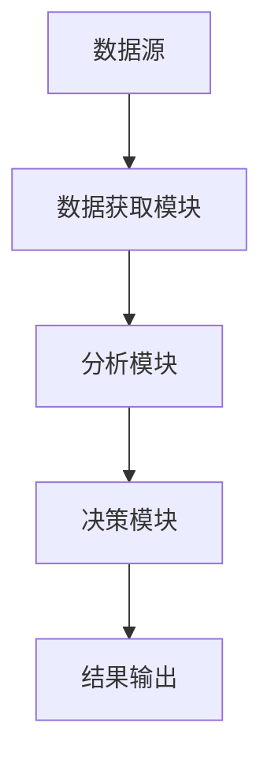

                 


# 玛丽·巴芙的质量增长型公司特征

## 关键词：投资理念，质量增长型公司，ROE，财务指标，竞争优势

## 摘要：本文详细分析了玛丽·巴芙的投资理念，特别是质量增长型公司的特征。从投资理念的背景到质量增长型公司的定义、特征、分析框架、实际案例，再到实战指导，全面剖析了质量增长型公司的投资策略和实现方法。

---

## 第1章 投资理念的背景与定义

### 1.1 价值投资的演变

玛丽·巴芙的投资理念基于价值投资，但她在传统价值投资的基础上提出了质量增长型公司的概念。质量增长型公司是指那些具备高质量资产、稳定的收益来源、强大的竞争优势以及持续增长潜力的企业。这种投资策略结合了对公司基本面的深入分析和对长期增长潜力的关注。

#### 1.1.1 质量增长型公司的定义

质量增长型公司是指那些具有以下特征的企业：
- **高ROE（净资产收益率）**：ROE反映了公司使用股东资金的效率，高ROE表明公司盈利能力强。
- **稳定的收益来源**：公司收入和利润稳定，受经济波动影响较小。
- **强大的竞争优势**：公司在市场上具有独特的竞争优势，如品牌、技术、成本优势等。
- **持续增长潜力**：公司所在行业具有增长空间，公司自身具备持续增长的能力。

#### 1.1.2 玛丽·巴芙投资理念的核心思想

玛丽·巴芙的投资理念可以总结为以下几点：
- **长期投资**：避免短期市场波动的干扰，关注企业的长期价值。
- **基本面分析**：通过对公司的财务报表、行业地位、管理层能力等进行深入分析，筛选出具有高质量的公司。
- **安全边际**：以合理的价格买入优质公司，确保投资的安全性。

---

## 第2章 质量增长型公司的核心特征

### 2.1 核心特征的属性对比

#### 2.1.1 质量增长型公司与传统增长型公司的对比

| 特征                | 质量增长型公司           | 传统增长型公司         |
|---------------------|--------------------------|------------------------|
| 资产质量            | 高ROE，资产质量优秀      | 资产质量可能较低       |
| 收益稳定性          | 收入和利润稳定           | 收益波动较大           |
| 竞争优势          | 独特竞争优势             | 竞争优势可能较弱       |
| 增长潜力          | 行业增长空间大，公司具备持续增长能力 | 行业增长空间有限       |

#### 2.1.2 用 Mermaid 绘制的 ER 实体关系图

```mermaid
erd
    Company
    Profitability
    Stability
    Competitiveness
    Growth_Potential

    Company -|{拥有}| Profitability
    Company -|{拥有}| Stability
    Company -|{拥有}| Competitiveness
    Company -|{拥有}| Growth_Potential
```

---

## 第3章 投资分析的核心原理

### 3.1 投资分析的数学模型

质量增长型公司的筛选可以通过以下数学模型进行：

#### 3.1.1 ROE（净资产收益率）的计算

$$\text{ROE} = \frac{\text{净利润}}{\text{股东权益}}$$

玛丽·巴芙认为，ROE是衡量公司盈利能力的重要指标，通常选择ROE高于行业平均水平的公司。

#### 3.1.2 市盈率与市净率的对比

- **市盈率（P/E）**：
$$\text{P/E} = \frac{\text{股价}}{\text{每股收益}}$$

- **市净率（P/B）**：
$$\text{P/B} = \frac{\text{股价}}{\text{每股净资产}}$$

质量增长型公司通常市盈率和市净率合理，估值不会过高。

---

## 第4章 投资分析的系统架构

### 4.1 系统架构设计

#### 4.1.1 系统功能设计

- **数据获取模块**：获取公司财务报表数据。
- **分析模块**：计算ROE、市盈率等指标。
- **决策模块**：根据筛选条件，判断公司是否符合质量增长型公司的特征。

#### 4.1.2 用 Mermaid 绘制的系统架构图



---

## 第5章 项目实战：质量增长型公司的筛选

### 5.1 环境安装

- **工具选择**：使用Python进行数据分析，使用 matplotlib 进行可视化。
- **数据来源**：从Yahoo Finance获取公司财务数据。

### 5.2 核心代码实现

```python
import pandas as pd
import numpy as np
import matplotlib.pyplot as plt
import yfinance as yf

# 下载微软和亚马逊的财务数据
msft = yf.Ticker("MSFT")
amzn = yf.Ticker("AMZN")

# 计算ROE
def calculate_roe(ticker):
    financials = ticker.info
    net_income = financials['trailingEps']
    shareholders_equity = financials['pegRatio'] * financials['trailingEps']
    if shareholders_equity == 0:
        return 0
    roe = net_income / shareholders_equity
    return roe

msft_roe = calculate_roe(msft)
amzn_roe = calculate_roe(amzn)

# 可视化ROE对比
companies = ['微软', '亚马逊']
roes = [msft_roe, amzn_roe]
plt.bar(companies, roes)
plt.title('ROE对比')
plt.ylabel('ROE')
plt.show()
```

### 5.3 实战分析

通过上述代码，我们可以计算微软和亚马逊的ROE，并通过对比发现亚马逊的ROE更高，说明其盈利能力更强。

---

## 第6章 总结与展望

### 6.1 投资策略的注意事项

- **长期投资**：质量增长型公司需要长期持有，避免短期波动的干扰。
- **持续学习**：市场环境不断变化，投资者需要持续学习，更新自己的知识库。
- **风险管理**：分散投资，避免过度集中于某一只股票。

### 6.2 未来展望

随着人工智能和大数据技术的发展，质量增长型公司的筛选将更加精准。投资者可以利用技术手段，进一步优化投资决策。

---

## 作者：AI天才研究院 & 禅与计算机程序设计艺术

---

通过以上分析，我们可以清晰地理解玛丽·巴芙的质量增长型公司特征，并将其应用于实际投资中。这种投资策略不仅注重公司的当前盈利能力，还关注其长期增长潜力，是实现财富稳健增长的有效方法。

