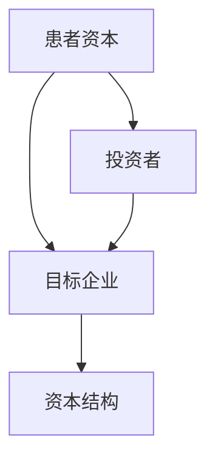
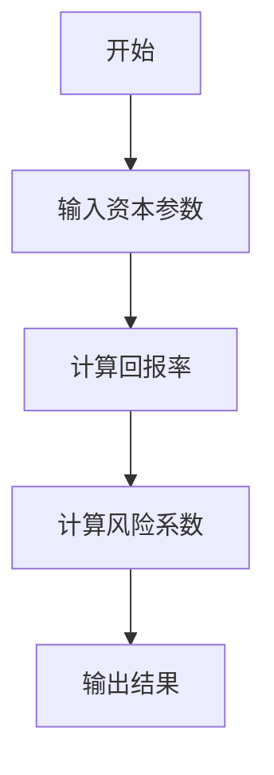
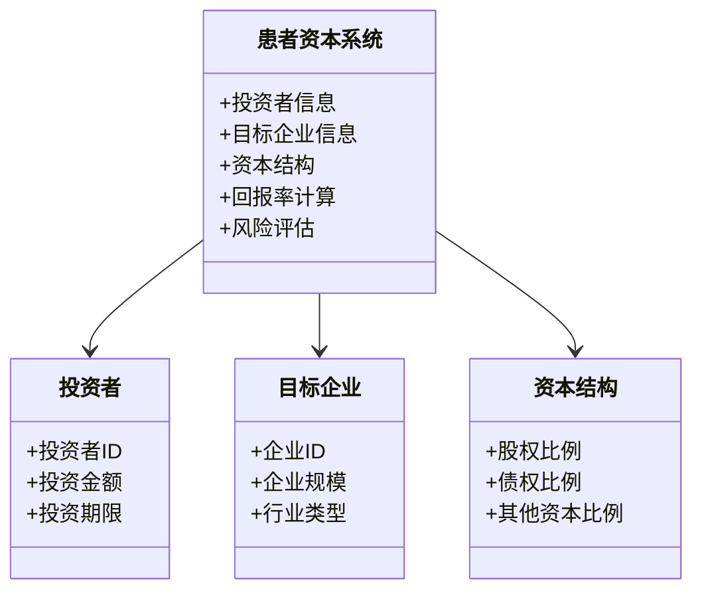
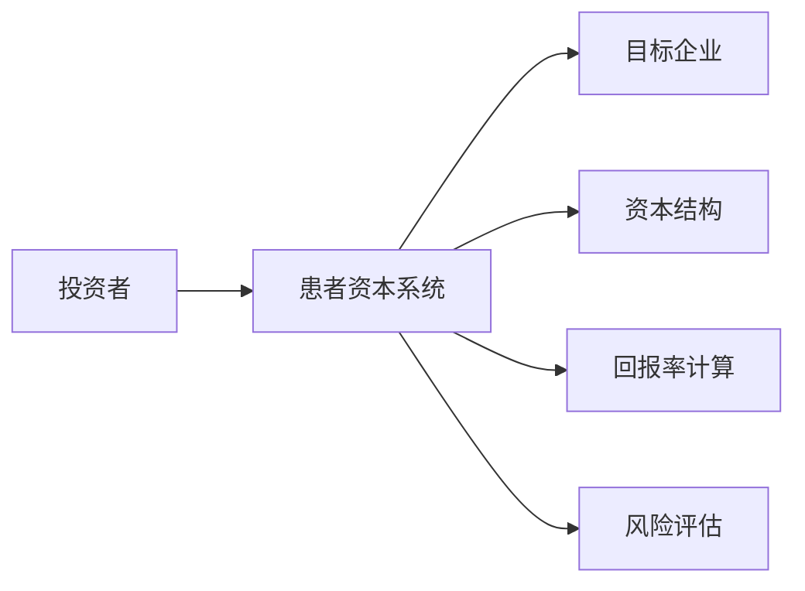

                 


# 《玛丽·巴芙达的患者资本理论》

**关键词**：患者资本理论，资本运作，投资策略，系统架构，算法原理，项目实战

**摘要**：本文深入探讨玛丽·巴芙达提出的患者资本理论，从理论基础到实际应用，结合算法与系统架构，详细分析其在投资决策中的应用。通过案例分析和项目实战，揭示如何在现代资本运作中优化投资组合，降低风险，实现可持续回报。

---

## 第一部分: 患者资本理论基础

### 第1章: 患者资本理论概述

#### 1.1 患者资本理论的定义与核心要素
- 1.1.1 什么是患者资本理论
  - 患者资本理论的定义
  - 其他资本理论的对比
- 1.1.2 患者资本理论的核心要素
  - 投资周期
  - 资本结构
  - 风险管理
- 1.1.3 患者资本理论的边界与外延
  - 理论的适用范围
  - 相关理论的联系

#### 1.2 患者资本理论的背景与问题背景
- 1.2.1 当代资本运作中的问题背景
  - 传统资本运作的局限性
  - 患者资本理论的提出动机
- 1.2.2 理论解决的核心问题
  - 投资周期的优化
  - 资本结构的调整
  - 风险管理的创新

---

## 第二部分: 患者资本理论的核心概念与联系

### 第2章: 核心概念原理

#### 2.1 核心概念原理
- 2.1.1 患者资本的定义与特征
  - 患者资本的定义
  - 患者资本的特征
- 2.1.2 患者资本与传统资本的区别
  - 投资周期的差异
  - 资本结构的差异
  - 风险管理的差异
- 2.1.3 患者资本与其他资本形式的联系
  - 与其他资本形式的比较

#### 2.2 核心概念对比表
- 2.2.1 患者资本与风险资本对比
  - 投资周期
  - 资本结构
  - 风险管理
- 2.2.2 患者资本与杠杆资本对比
  - 投资周期
  - 资本结构
  - 风险管理
- 2.2.3 患者资本与权益资本对比
  - 投资周期
  - 资本结构
  - 风险管理

#### 2.3 ER实体关系图


---

### 第3章: 患者资本理论的数学模型与公式

#### 3.1 核心数学模型
- 3.1.1 患者资本回报率计算公式
  $$ R = \frac{C}{I} \times 100\% $$
  其中，R为回报率，C为资本收益，I为初始投资。
- 3.1.2 患者资本风险评估模型
  $$ Risk = \sqrt{\sigma^2 + \beta^2} $$
  其中，σ为标准差，β为贝塔系数。

#### 3.2 案例分析与公式应用
- 3.2.1 案例一：某企业的患者资本回报计算
- 3.2.2 案例二：患者资本风险评估

---

### 第4章: 患者资本理论的算法原理

#### 4.1 算法流程图


#### 4.2 患者资本理论的Python实现
```python
import numpy as np

def calculate_return_rate(initial_investment, capital_gain):
    return (capital_gain / initial_investment) * 100

def calculate_risk(standard_deviation, beta_coefficient):
    return np.sqrt(standard_deviation**2 + beta_coefficient**2)

# 示例
initial_investment = 1000000
capital_gain = 200000
standard_deviation = 0.12
beta_coefficient = 1.5

return_rate = calculate_return_rate(initial_investment, capital_gain)
risk = calculate_risk(standard_deviation, beta_coefficient)

print(f"回报率: {return_rate}%")
print(f"风险系数: {risk}")
```

---

## 第三部分: 患者资本理论的系统架构设计

### 第5章: 系统功能设计

#### 5.1 问题场景介绍
- 投资者如何优化投资组合
- 如何降低投资风险
- 如何实现可持续回报

#### 5.2 系统功能设计


---

### 第6章: 系统架构设计

#### 6.1 系统架构图


#### 6.2 接口设计与交互流程


---

## 第四部分: 项目实战

### 第7章: 环境安装与系统实现

#### 7.1 环境安装
- 安装Python
- 安装必要的库（如numpy、pandas）

#### 7.2 核心功能实现
```python
import numpy as np

def calculate_return_rate(initial_investment, capital_gain):
    return (capital_gain / initial_investment) * 100

def calculate_risk(standard_deviation, beta_coefficient):
    return np.sqrt(standard_deviation**2 + beta_coefficient**2)

# 示例
initial_investment = 1000000
capital_gain = 200000
standard_deviation = 0.12
beta_coefficient = 1.5

return_rate = calculate_return_rate(initial_investment, capital_gain)
risk = calculate_risk(standard_deviation, beta_coefficient)

print(f"回报率: {return_rate}%")
print(f"风险系数: {risk}")
```

---

### 第8章: 项目小结与扩展阅读

#### 8.1 最佳实践 tips
- 保持投资的多样性
- 定期评估和调整投资组合
- 与专业的投资顾问合作

#### 8.2 小结
总结患者资本理论的核心观点和实际应用，强调理论在现代资本运作中的重要性。

#### 8.3 注意事项
- 投资者需具备相关知识
- 风险评估的重要性
- 定期审视投资策略

#### 8.4 拓展阅读
推荐相关书籍和资源，供读者深入学习。

---

## 作者：AI天才研究院/AI Genius Institute & 禅与计算机程序设计艺术 /Zen And The Art of Computer Programming

