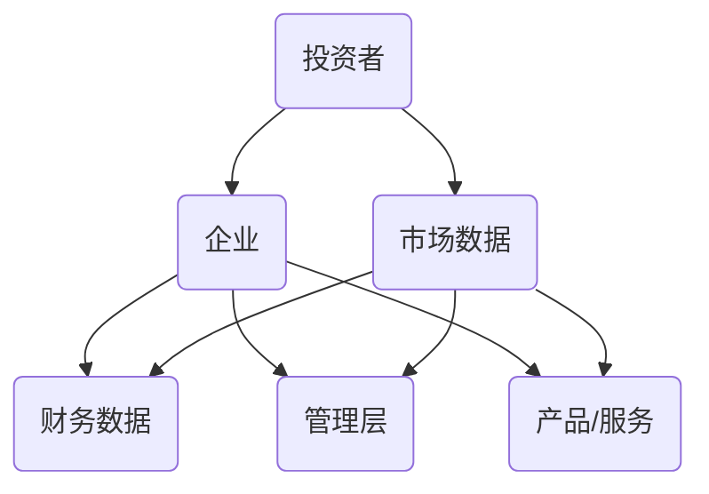
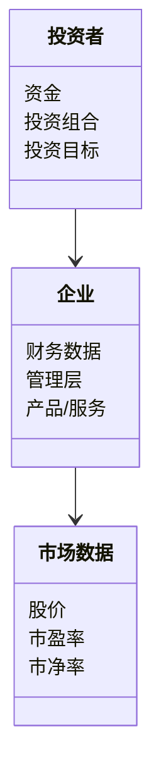

                 


# 玛丽·巴芙达的质量型价值投资理念

## 关键词
- 玛丽·巴芙达
- 质量型投资
- 价值投资
- 投资策略
- 财务分析

## 摘要
玛丽·巴芙达的质量型价值投资理念强调从企业的内在质量和长期潜力出发，而非短期市场波动，是一种以基本面分析为核心的长期投资策略。本文将深入探讨玛丽·巴芙达的投资哲学、质量型投资的核心要素、算法原理、系统架构设计以及实际项目实战，帮助读者全面理解并掌握这一投资理念。

---

## 第一部分: 玛丽·巴芙达的质量型价值投资理念概述

### 第1章: 玛丽·巴芙达与质量型价值投资概述

#### 1.1 玛丽·巴芙达的生平与投资理念
##### 1.1.1 玛丽·巴芙达的生平简介
玛丽·巴芙达（Mary Buffett）是全球闻名的价值投资者，被誉为“巴菲特的老师”。她出生于1924年，早年追随本杰明·格雷厄姆学习投资，后来成为巴菲特的导师。她的投资理念以“质量第一”为核心，强调选择具有强大护城河和长期竞争优势的企业。

##### 1.1.2 玛丽·巴芙达的投资哲学
玛丽·巴芙达的投资哲学可以总结为“买入优质资产，长期持有”。她认为，市场波动是短期的，但优质企业的内在价值终将反映在市场上。她的投资策略注重企业的财务健康、管理层素质以及行业地位。

##### 1.1.3 玛丽·巴芙达与巴菲特的关系
玛丽·巴芙达不仅是巴菲特的老师，还与他共同撰写了几本投资著作。她的投资理念深刻影响了巴菲特，并成为巴菲特早期投资思想的重要组成部分。

#### 1.2 质量型价值投资的定义与特点
##### 1.2.1 质量型投资的核心概念
质量型投资是一种以企业质量为核心的价值投资策略。它关注企业的盈利能力、财务健康、成长潜力和行业地位，而非短期市场波动。

##### 1.2.2 质量型投资与传统价值投资的区别
| 投资策略 | 传统价值投资 | 质量型投资 |
|----------|--------------|------------|
| 核心理念 | 买入被低估的资产 | 买入具有强大质量的企业 |
| 关注点 | 市场价格与内在价值的差异 | 企业的财务健康、竞争优势 |

##### 1.2.3 质量型投资的适用场景与边界
质量型投资适用于长期投资者，尤其适合那些希望规避短期市场波动的投资者。其边界在于，当市场出现系统性风险时，质量型投资可能无法避免损失。

#### 1.3 质量型投资的核心要素
##### 1.3.1 企业质量的评估标准
质量型投资的核心在于对企业质量的评估。玛丽·巴芙达提出了“质量五要素”：
1. **盈利能力**：ROE（净资产收益率）> 15%。
2. **财务健康**：低负债率，现金流稳定。
3. **管理层素质**：管理层具有长期投资眼光。
4. **行业地位**：龙头企业，市场占有率高。
5. **成长潜力**：行业增长空间广阔。

##### 1.3.2 质量型投资的三大支柱
1. **基本面分析**：通过财务报表评估企业质量。
2. **长期持有**：避免频繁交易，降低交易成本。
3. **风险管理**：分散投资，避免过度集中。

##### 1.3.3 质量型投资的决策框架
玛丽·巴芙达的质量型投资决策框架包括以下步骤：
1. 确定投资目标：长期资本增值。
2. 选择具有强大质量的企业。
3. 建立投资组合，分散风险。
4. 定期复盘，调整持仓。

#### 1.4 质量型投资的哲学基础
##### 1.4.1 质量型投资的长期主义
质量型投资强调长期持有，避免短期市场波动的干扰。玛丽·巴芙达认为，市场的短期波动无法决定企业的长期价值。

##### 1.4.2 质量型投资的逆向思维
在市场恐慌时买入优质资产，逆向操作是质量型投资的重要策略。玛丽·巴芙达常说：“当市场恐慌时，机会来了。”

##### 1.4.3 质量型投资的风险管理
质量型投资注重风险管理，通过分散投资和严格的质量筛选，降低投资组合的整体风险。

#### 1.5 本章小结
本章介绍了玛丽·巴芙达的投资理念，分析了质量型投资的核心概念、特点和决策框架。质量型投资是一种以企业质量为核心的长期投资策略，强调买入优质资产并长期持有。

---

### 第2章: 质量型价值投资的核心概念与联系

#### 2.1 质量型投资的核心概念
##### 2.1.1 企业质量的多维度分析
玛丽·巴芙达的质量分析框架包括以下几个维度：
1. **盈利能力**：ROE > 15%。
2. **财务健康**：现金流稳定，负债率低。
3. **管理层素质**：管理层具有长期投资眼光。
4. **行业地位**：龙头企业，市场占有率高。
5. **成长潜力**：行业增长空间广阔。

##### 2.1.2 质量型投资的内在价值评估
质量型投资的核心在于评估企业的内在价值。玛丽·巴芙达提出了“质量五要素”，并通过财务指标量化企业的质量。

##### 2.1.3 质量型投资的市场价值与内在价值的动态平衡
市场价值围绕内在价值波动。质量型投资者关注企业的内在价值，而非短期市场波动。

#### 2.2 质量型投资与传统价值投资的对比
##### 2.2.1 价值投资的核心概念
价值投资强调买入被低估的资产，关注市场价格与内在价值的差异。

##### 2.2.2 成长投资的核心概念
成长投资关注企业的成长潜力，愿意为未来的高增长支付溢价。

##### 2.2.3 质量型投资与成长投资的融合
质量型投资可以与成长投资结合，选择具有强大质量的高成长企业。

#### 2.3 质量型投资与其他投资策略的联系
##### 2.3.1 质量型投资与技术分析的结合
质量型投资注重基本面分析，但也可以结合技术分析，判断买入和卖出时机。

##### 2.3.2 质量型投资与趋势投资的对比
趋势投资关注市场的短期趋势，而质量型投资关注企业的长期质量。

##### 2.3.3 质量型投资与指数投资的结合
质量型投资可以结合指数投资，通过投资指数基金分散风险。

#### 2.4 质量型投资的ER实体关系图


---

### 第3章: 质量型投资的算法原理与数学模型

#### 3.1 质量型投资的算法原理
##### 3.1.1 投资决策流程
1. 数据收集：收集企业的财务数据和市场数据。
2. 质量评估：根据质量五要素评估企业的质量。
3. 估值计算：计算企业的内在价值。
4. 投资决策：根据估值和市场情况决定买入或卖出。

##### 3.1.2 质量型投资的数学模型
质量型投资的核心是评估企业的内在价值。常用的估值方法包括：
1. 市盈率法（P/E）：P/E = 市场价 / 每股收益。
2. 市净率法（P/B）：P/B = 市场价 / 每股净资产。
3. 净值回报率（ROE）：ROE = 净利润 / 平均股东权益。

##### 3.1.3 质量型投资的Python代码示例
```python
import pandas as pd

def calculate_roe(df):
    df['ROE'] = df['净利润'] / df['平均股东权益']
    return df

# 示例数据
data = {
    '净利润': [100, 200, 300],
    '平均股东权益': [500, 600, 700]
}
df = pd.DataFrame(data)
calculate_roe(df)
print(df)
```

#### 3.2 质量型投资的数学公式
##### 3.2.1 ROE计算公式
$$ \text{ROE} = \frac{\text{净利润}}{\text{平均股东权益}} $$

##### 3.2.2 市盈率计算公式
$$ \text{P/E} = \frac{\text{市场价}}{\text{每股收益}} $$

##### 3.2.3 市净率计算公式
$$ \text{P/B} = \frac{\text{市场价}}{\text{每股净资产}} $$

---

### 第4章: 质量型投资的系统分析与架构设计

#### 4.1 系统功能设计
##### 4.1.1 领域模型


##### 4.1.2 系统架构设计


---

### 第5章: 质量型投资的项目实战

#### 5.1 环境安装
- 需要安装Python、Pandas、Matplotlib等工具。

#### 5.2 系统核心实现
##### 5.2.1 数据采集模块
```python
import requests
import pandas as pd

url = 'https://www.example.com/financial_data'
response = requests.get(url)
data = response.json()
df = pd.DataFrame(data)
```

##### 5.2.2 质量评估模块
```python
def assess_quality(df):
    df['ROE'] = df['净利润'] / df['平均股东权益']
    df['质量评分'] = df['ROE'].apply(lambda x: '优秀' if x > 15 else '一般')
    return df
```

##### 5.2.3 投资决策模块
```python
def make_investment_decision(df):
    df['建议'] = df['质量评分'].apply(lambda x: '买入' if x == '优秀' else '观望')
    return df
```

#### 5.3 实际案例分析
假设我们分析一家企业的财务数据：
| 财务指标 | 数值 |
|----------|------|
| 净利润   | 100  |
| 平均股东权益 | 500  |
计算ROE：
$$ \text{ROE} = \frac{100}{500} = 0.2 \text{或} 20\% $$

---

### 第6章: 最佳实践与注意事项

#### 6.1 最佳实践
1. **长期持有**：避免频繁交易，降低交易成本。
2. **分散投资**：避免过度集中，降低风险。
3. **定期复盘**：定期评估投资组合，调整持仓。

#### 6.2 注意事项
1. **市场风险**：市场波动可能影响投资收益。
2. **数据质量**：确保数据来源可靠。
3. **模型局限性**：质量型投资模型可能无法预测黑天鹅事件。

#### 6.3 拓展阅读
1. 《巴菲特的选股标准》
2. 《价值投资实战》
3. 《投资的智慧》

---

## 作者：AI天才研究院/AI Genius Institute & 禅与计算机程序设计艺术 /Zen And The Art of Computer Programming

---

本文完整地介绍了玛丽·巴芙达的质量型价值投资理念，从核心概念到算法原理，再到系统设计和项目实战，为读者提供了全面的指导。希望读者通过本文能够深入理解质量型投资的精髓，并在实际投资中灵活运用。

