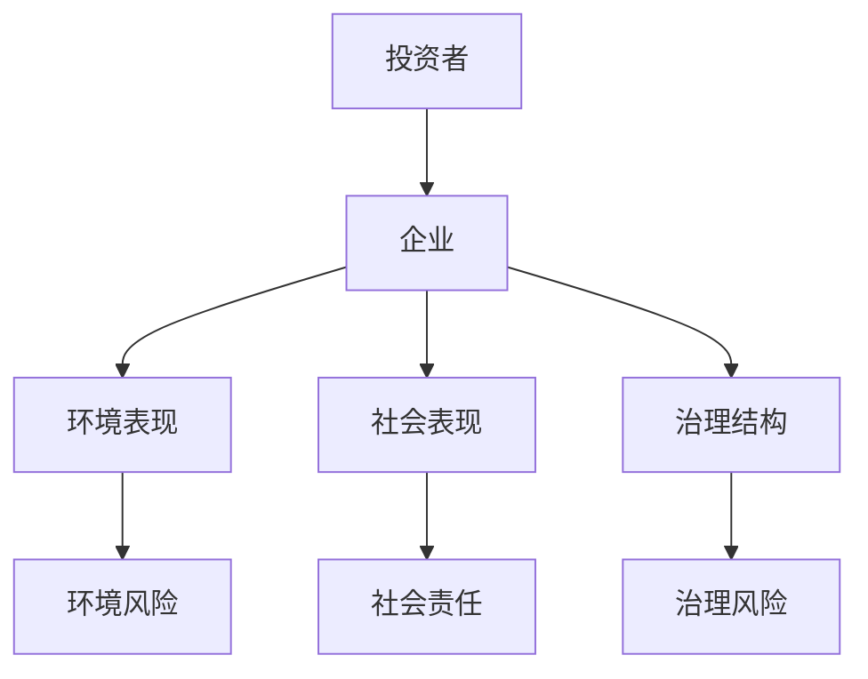
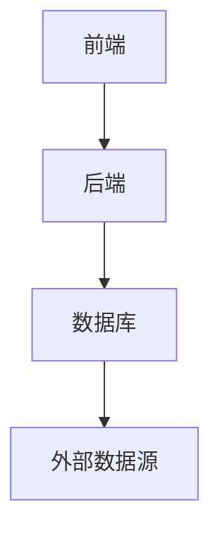
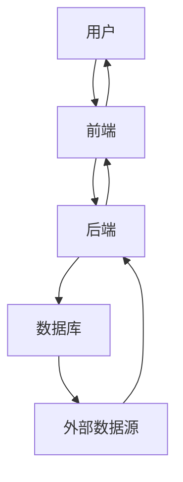

                 


# 珍妮·沙德洛的ESG价值投资：将可持续发展纳入考量

**关键词**：ESG投资、可持续发展、价值投资、环境因素、社会因素、治理因素

**摘要**：ESG（环境、社会、治理）价值投资是一种将企业社会责任和可持续发展纳入投资决策的方法，通过分析环境、社会和治理因素来评估企业的长期价值。本文详细探讨了ESG的核心概念、算法原理、系统架构以及实际应用，帮助投资者更好地理解和应用ESG价值投资。

---

## 第1章: ESG价值投资的背景与定义

### 1.1 ESG投资的起源与发展

ESG投资起源于20世纪60年代的社会责任投资（SRI），最初关注于避免投资于酒精、烟草等行业的公司。随着环境问题和社会问题的加剧，ESG投资逐渐演变为一种系统性的投资策略。全球范围内，越来越多的投资者开始关注企业的环境表现、社会责任和治理结构，ESG投资成为可持续发展的重要组成部分。

### 1.2 ESG的核心定义与内涵

- **环境（E）**：关注企业在资源使用、污染排放、气候变化等方面的表现。
- **社会（S）**：关注企业在员工权益、社区参与、产品安全等方面的表现。
- **治理（G）**：关注企业在公司治理、董事会结构、高管薪酬等方面的表现。

### 1.3 ESG与传统投资的结合

ESG投资将传统的财务分析与非财务因素相结合，通过综合评估企业的环境、社会和治理表现，帮助投资者识别企业的长期价值和风险。与传统投资相比，ESG投资更加注重企业的社会责任和可持续发展能力。

### 1.4 本章小结

本章介绍了ESG投资的背景、定义和内涵，强调了ESG投资在可持续发展中的重要作用。

---

## 第2章: ESG的核心概念原理

### 2.1 ESG的三要素分析

- **环境因素**：通过量化企业的碳排放、能源使用等指标，评估企业的环境表现。
- **社会因素**：通过评估企业的员工权益、社会责任项目等指标，衡量企业的社会影响力。
- **治理因素**：通过分析企业的董事会结构、高管薪酬、内部控制等指标，评估企业的治理能力。

### 2.2 ESG概念属性特征对比

| 特性 | 环境（E） | 社会（S） | 治理（G） |
|------|-----------|-----------|-----------|
| 重点 | 环境表现 | 社会责任 | 治理结构 |
| 数据 | 碳排放、能源使用 | 员工权益、社区参与 | 董事会结构、高管薪酬 |
| 影响 | 环境风险 | 社会声誉 | 治理风险 |

### 2.3 ESG的ER实体关系图



### 2.4 本章小结

本章详细分析了ESG的三要素及其属性特征，通过对比和图表展示了各要素之间的关系。

---

## 第3章: ESG评分模型的算法原理

### 3.1 ESG评分模型的概述

ESG评分模型旨在通过量化环境、社会和治理因素，评估企业的综合表现。模型的目标是帮助投资者识别具有可持续发展能力的企业。

### 3.2 ESG评分模型的数学公式

- **线性回归模型**：用于预测企业的ESG评分。
  $$ y = \beta_0 + \beta_1x_1 + \beta_2x_2 + \beta_3x_3 + \epsilon $$
  其中，$y$ 是ESG评分，$x_1$、$x_2$、$x_3$ 是环境、社会和治理因素的指标，$\beta_0$ 是截距，$\beta_1$、$\beta_2$、$\beta_3$ 是回归系数。

- **加权评分模型**：根据各因素的重要性分配权重。
  $$ S = w_E \cdot E + w_S \cdot S + w_G \cdot G $$
  其中，$w_E$、$w_S$、$w_G$ 是环境、社会和治理因素的权重，$E$、$S$、$G$ 是各因素的评分。

### 3.3 算法的实现与优化

- **算法实现步骤**：
  1. 收集企业的环境、社会和治理数据。
  2. 对数据进行标准化处理。
  3. 计算各因素的评分。
  4. 根据权重计算综合评分。
- **算法优化策略**：
  - 使用机器学习方法提高评分的准确性。
  - 定期更新权重以反映市场变化。

### 3.4 本章小结

本章介绍了ESG评分模型的数学公式和算法实现，强调了优化算法的重要性。

---

## 第4章: ESG投资系统的架构设计

### 4.1 系统功能设计

- **功能模块**：
  - 数据采集模块：收集企业的环境、社会和治理数据。
  - 数据处理模块：对数据进行清洗和预处理。
  - ESG评分计算模块：根据算法计算企业的ESG评分。
  - 结果输出模块：输出企业的ESG评分和分析报告。

### 4.2 系统架构设计



- **架构图**：展示前端、后端、数据库和外部数据源之间的关系。

### 4.3 系统接口设计

- **接口定义**：
  - 数据接口：从外部数据源获取企业数据。
  - 计算接口：调用评分算法计算ESG评分。
  - 输出接口：将结果输出到前端。

### 4.4 系统交互设计



### 4.5 本章小结

本章详细描述了ESG投资系统的功能设计和架构设计，展示了系统的整体结构。

---

## 第5章: ESG投资的项目实战

### 5.1 环境安装

- 需要安装Python、Pandas、NumPy等工具。

### 5.2 核心实现代码

```python
import pandas as pd
import numpy as np

def calculate_esg_score(environment, social, governance):
    # 线性回归模型
    beta0 = 0.5
    beta1 = 0.3
    beta2 = 0.2
    beta3 = 0.1
    score = beta0 + beta1*environment + beta2*social + beta3*governance
    return score

# 示例数据
environment = 80
social = 70
governance = 90
score = calculate_esg_score(environment, social, governance)
print(score)
```

### 5.3 代码应用解读与分析

- 代码通过线性回归模型计算企业的ESG评分，权重反映了各因素的重要性。

### 5.4 案例分析

- **案例**：假设某企业环境得分为80，社会得分为70，治理得分为90，计算其ESG得分为：
  $$ score = 0.5 + 0.3 \times 80 + 0.2 \times 70 + 0.1 \times 90 = 40.5 $$

### 5.5 项目小结

本章通过实际案例展示了ESG评分模型的应用，帮助投资者更好地理解和应用ESG投资。

---

## 第6章: 小结与扩展阅读

### 6.1 最佳实践tips

- 定期更新数据和模型，以反映市场变化。
- 结合行业特点调整权重，提高评分的准确性。

### 6.2 小结

ESG投资是一种将可持续发展纳入投资决策的重要方法，通过综合评估环境、社会和治理因素，帮助投资者识别具有长期价值的企业。

### 6.3 注意事项

- 数据的准确性和及时性对评分结果至关重要。
- 模型的权重需要根据行业特点和市场环境进行调整。

### 6.4 扩展阅读

- 阅读相关的学术论文和行业报告，了解ESG投资的最新发展。
- 参加ESG投资相关的研讨会和培训，提升自己的专业能力。

---

## 作者：AI天才研究院 & 禅与计算机程序设计艺术

---

通过本文的详细讲解，读者可以全面了解ESG价值投资的核心概念、算法原理和实际应用。希望本文能为投资者在可持续发展领域的投资决策提供有价值的参考。

