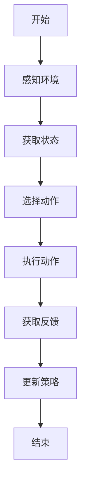
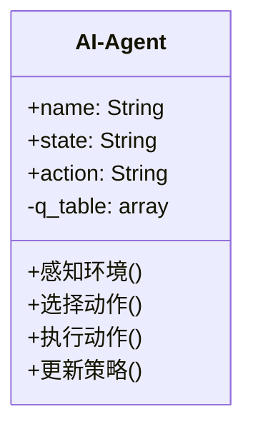
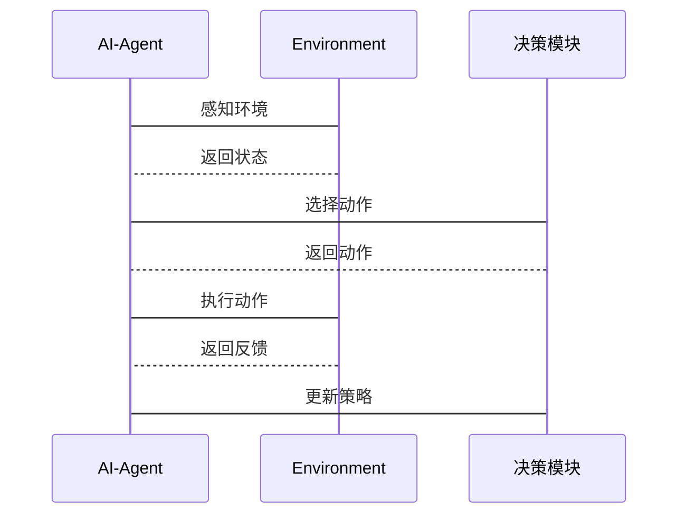

                 


# 理解AI Agent：定义、特征与基本原理

## 关键词：AI Agent, 人工智能, 智能体, 强化学习, 机器学习, 系统架构

## 摘要：  
AI Agent（人工智能代理）作为人工智能领域的重要概念，是实现智能系统的关键技术。本文将从AI Agent的定义、特征、基本原理入手，结合实际应用场景，深入分析其核心概念、算法原理、系统架构及项目实现，帮助读者全面理解AI Agent的内涵与外延。

---

# 第1章: AI Agent 的定义与特征

## 1.1 AI Agent 的定义  
AI Agent，即人工智能代理，是一种能够感知环境、自主决策并采取行动的智能实体。它通过与环境交互，实现特定目标，具备智能性和适应性。

### 1.1.1 什么是 AI Agent  
AI Agent 是一类能够执行任务的智能系统，能够根据感知的信息做出决策，并通过行动改变环境或自身状态。AI Agent 可以是软件程序、机器人或其他智能设备。

### 1.1.2 AI Agent 的核心概念  
- **自主性**：无需外部干预，自主完成任务。  
- **反应性**：能够实时感知环境并做出反应。  
- **目标导向性**：所有行为均以实现目标为导向。  

### 1.1.3 AI Agent 的边界与外延  
AI Agent 的核心是智能性，但与传统AI的区别在于其具备自主性和目标导向性。AI Agent 可以是独立的实体，也可以是复杂系统的一部分。

---

## 1.2 AI Agent 的特征与属性  
AI Agent 的特征决定了其在不同场景下的表现和能力。

### 1.2.1 智能性  
AI Agent 具备学习和推理能力，能够通过数据和经验优化自身行为。

### 1.2.2 反应性  
AI Agent 能够实时感知环境变化，并根据反馈调整行为。

### 1.2.3 主动性  
AI Agent 不需要外部指令，能够自主启动任务并采取行动。

### 1.2.4 社会性  
AI Agent 可以与其他 Agent 或人类交互，具备协作能力。

### 1.2.5 学习能力  
AI Agent 能够通过经验改进性能，适应新环境。

---

## 1.3 AI Agent 与传统 AI 的区别  
AI Agent 是一种更高级的AI形式，传统AI依赖于预设规则，而AI Agent 具备自主决策能力。

### 1.3.1 传统 AI 的特点  
- 知识驱动，依赖规则库。  
- 无法自主学习和调整。  

### 1.3.2 AI Agent 的创新点  
- 自主决策能力。  
- 实时互动与适应能力。  

### 1.3.3 两者的对比与联系  
AI Agent 是传统AI的延伸，结合了自主性和智能性。

---

## 1.4 AI Agent 的应用领域  
AI Agent 广泛应用于自动驾驶、智能助手、机器人等领域。

### 1.4.1 人工智能的典型应用  
- 自动驾驶：实时感知和决策。  
- 智能助手：提供个性化服务。  

### 1.4.2 AI Agent 在各领域的具体表现  
- 医疗领域：辅助诊断和治疗。  
- 金融领域：智能投资顾问。  

### 1.4.3 未来发展趋势  
AI Agent 将更加智能化和人性化。

---

# 第2章: AI Agent 的核心原理

## 2.1 AI Agent 的基本原理  
AI Agent 的核心是感知与决策机制。

### 2.1.1 状态、动作与环境的关系  
- **状态**：环境的当前情况。  
- **动作**：Agent 的行为。  
- **环境**：Agent 所处的外部世界。  

### 2.1.2 感知与决策机制  
AI Agent 通过感知获取信息，经过决策系统处理后，采取行动。

### 2.1.3 行为规划与执行  
AI Agent 根据目标制定计划，并执行以实现目标。

---

## 2.2 AI Agent 的核心要素  
AI Agent 包括感知系统、决策系统和执行系统。

### 2.2.1 感知系统  
负责获取环境信息，如视觉、听觉等。

### 2.2.2 决策系统  
基于感知信息做出决策，选择最优动作。

### 2.2.3 执行系统  
将决策转化为具体行动。

---

## 2.3 AI Agent 的基本模型  

### 2.3.1 简单反射模型  
基于反射机制做出快速反应。

### 2.3.2 基于规则的模型  
通过预设规则进行决策。

### 2.3.3 基于学习的模型  
通过机器学习优化决策。

---

## 2.4 核心概念属性对比表  

| **属性** | **传统AI** | **AI Agent** |
|----------|------------|--------------|
| 自主性   | 无         | 有           |
| 反应性   | 无         | 有           |
| 目标导向 | 无         | 有           |

---

## 2.5 ER 实体关系图  

```mermaid
erd
    entity AI-Agent {
        id
        name
        type
    }
    entity Environment {
        id
        state
        action
    }
    entity Task {
        id
        goal
        status
    }
    AI-Agent - Environment
    AI-Agent - Task
```

---

# 第3章: AI Agent 的算法原理

## 3.1 AI Agent 的核心算法  

### 3.1.1 强化学习算法  
通过奖励机制优化决策策略。

### 3.1.2 监督学习算法  
基于标注数据进行训练。

### 3.1.3 混合学习算法  
结合强化学习和监督学习。

---

## 3.2 算法原理流程图  



---

## 3.3 算法实现代码  

```python
import numpy as np

class AIAgent:
    def __init__(self, state_space, action_space):
        self.state_space = state_space
        self.action_space = action_space
        self.q_table = np.zeros((state_space, action_space))
    
    def感知环境(self, state):
        return state
    
    def 选择动作(self, state):
        return np.argmax(self.q_table[state])
    
    def 执行动作(self, action):
        return action
    
    def 更新策略(self, state, action, reward):
        self.q_table[state][action] += reward

agent = AIAgent(5, 3)
print(agent.q_table)
```

---

## 3.4 算法数学模型  

### 3.4.1 贝尔曼方程  
$$ V(s) = \max_{a} [ r(s,a) + \gamma V(s') ] $$  

### 3.4.2 Q-learning 更新公式  
$$ Q(s,a) = Q(s,a) + \alpha [ r + \gamma \max Q(s',a') - Q(s,a) ] $$  

---

# 第4章: AI Agent 的数学模型与公式

## 4.1 基础数学模型  

$$ Q-learning 的目标是优化 Q 表，以实现最优策略。 $$  

---

# 第5章: 系统分析与架构设计

## 5.1 问题场景介绍  
设计一个AI Agent 系统，实现智能助手功能。

## 5.2 系统功能设计  

### 5.2.1 领域模型  



---

## 5.3 系统架构设计  


---

## 5.4 系统接口设计  

### 5.4.1 接口定义  
- `get_state()`：获取当前状态。  
- `make_decision()`：做出决策。  
- `execute_action()`：执行动作。  

### 5.4.2 接口交互流程  



---

## 5.5 项目实战  

### 5.5.1 环境安装  
安装 Python 和相关库，如 numpy 和 matplotlib。

### 5.5.2 核心实现代码  

```python
import numpy as np

class AIAgent:
    def __init__(self, state_space, action_space):
        self.state_space = state_space
        self.action_space = action_space
        self.q_table = np.zeros((state_space, action_space))
    
    def感知环境(self, state):
        return state
    
    def 选择动作(self, state):
        return np.argmax(self.q_table[state])
    
    def 执行动作(self, action):
        return action
    
    def 更新策略(self, state, action, reward):
        self.q_table[state][action] += reward

# 初始化 Agent
agent = AIAgent(5, 3)
print(agent.q_table)
```

---

## 5.6 案例分析  
通过实际案例分析AI Agent 的应用场景和实现过程。

### 5.6.1 代码解读与分析  
解释代码的结构和功能，说明每部分的作用。

### 5.6.2 案例分析  
以智能助手为例，分析AI Agent 在实际应用中的流程。

---

## 5.7 项目小结  
总结项目实现的关键点和经验教训。

---

# 第6章: 最佳实践与扩展阅读

## 6.1 最佳实践 tips  
- 定期更新策略以适应环境变化。  
- 选择合适的算法以应对不同场景。  

## 6.2 小结  
AI Agent 是人工智能的重要组成部分，理解其定义、特征和原理是掌握其应用的基础。

## 6.3 注意事项  
- 确保数据质量和多样性。  
- 定期监控和优化系统性能。  

## 6.4 拓展阅读  
推荐相关书籍和论文，进一步深入学习AI Agent 的相关内容。

---

# 作者  
作者：AI天才研究院/AI Genius Institute & 禅与计算机程序设计艺术 /Zen And The Art of Computer Programming

