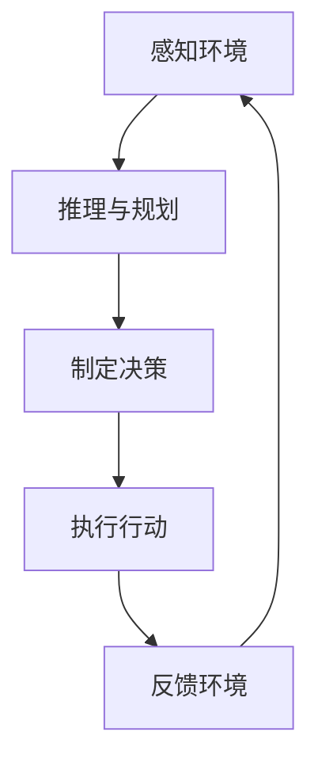
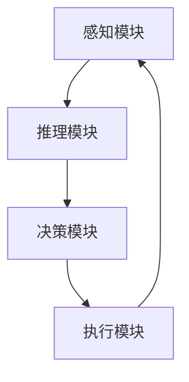

                 


# 理解AI Agent：核心概念与基本原理

> 关键词：AI Agent, 人工智能, 算法原理, 系统架构, 项目实战

> 摘要：本文系统地介绍了AI Agent的核心概念、基本原理、算法实现、系统架构设计以及实际项目中的应用。从AI Agent的背景与问题背景出发，逐步深入探讨其核心概念与联系，详细讲解算法原理与数学模型，展示系统分析与架构设计方案，并通过项目实战与最佳实践提供具体的应用指导。

---

## 第1章: AI Agent 的背景与问题背景

### 1.1 问题背景与问题描述

AI Agent（人工智能代理）是一种能够感知环境、自主决策并执行任务的智能体。随着人工智能技术的快速发展，AI Agent 在各个领域（如自动驾驶、智能助手、机器人等）得到了广泛应用。然而，传统的AI系统在处理动态环境和复杂任务时表现出明显的局限性。例如，传统基于规则的系统难以应对环境的不确定性，且缺乏灵活性和适应性。

AI Agent的引入旨在解决这些问题。它通过感知环境、推理、规划和执行行动，能够自主地完成复杂任务。AI Agent的核心目标是实现智能体在动态和不确定环境中的高效决策与行动。

### 1.2 问题解决与边界外延

AI Agent通过以下方式解决问题：
1. **感知环境**：通过传感器或其他输入方式获取环境信息。
2. **推理与决策**：基于感知信息，利用推理算法制定最优决策。
3. **执行行动**：根据决策结果执行具体行动，并反馈到环境中。

AI Agent的边界与限制包括：
- **计算资源限制**：AI Agent的性能受限于计算资源。
- **环境不确定性**：在高度不确定的环境中，AI Agent的决策可能不准确。
- **知识表示**：知识表示的复杂性和准确性直接影响AI Agent的能力。

AI Agent的外延与扩展包括：
- **多智能体系统**：多个AI Agent协作完成复杂任务。
- **人机协作**：AI Agent与人类协同工作，结合人类的决策能力。

### 1.3 核心概念与结构组成

AI Agent的核心概念包括：
- **智能体**：能够感知环境并采取行动的实体。
- **环境**：智能体所处的物理或数字空间。
- **感知**：智能体通过传感器或其他方式获取环境信息。
- **推理**：基于感知信息进行逻辑推理。
- **决策**：制定行动方案。
- **执行**：执行决策方案。

AI Agent的结构组成包括：
1. **感知模块**：负责获取环境信息。
2. **推理模块**：对感知信息进行逻辑推理。
3. **决策模块**：基于推理结果制定行动方案。
4. **执行模块**：执行决策模块的指令。
5. **学习模块**：通过经验优化AI Agent的行为。

---

## 第2章: AI Agent 的核心概念与联系

### 2.1 核心概念原理

AI Agent的核心概念包括：
1. **知识表示**：通过符号逻辑或概率模型表示知识。
2. **推理与规划**：基于知识进行推理，并制定行动计划。
3. **人机交互**：与人类用户进行自然交互。

### 2.2 概念属性特征对比

下表展示了不同AI Agent类型的核心属性特征对比：

| 类型       | 知识表示 | 决策方式 | 学习能力 | 交互能力 |
|------------|----------|----------|----------|----------|
| 反应式AI   | 基于当前感知 | 基于规则 | 无 | 实时交互 |
| 规划式AI   | 基于知识库 | 基于规划 | 有 | 支持复杂交互 |
| 学习式AI   | 基于数据 | 基于模型 | 有 | 支持自适应交互 |

### 2.3 ER实体关系架构

以下是一个简单的ER实体关系图：

```mermaid
erd
    图表标题：AI Agent 实体关系图
    图表内容：
    实体：AI Agent, 环境, 行动, 决策
    关系：感知, 决策, 执行
```

---

## 第3章: AI Agent 的算法原理

### 3.1 算法原理概述

AI Agent的算法主要包括：
1. **知识表示**：使用符号逻辑或概率模型。
2. **推理算法**：基于知识进行逻辑推理。
3. **决策算法**：基于推理结果制定行动方案。

### 3.2 算法流程图展示

以下是一个简单的AI Agent算法流程图：



### 3.3 Python代码实现

以下是AI Agent算法的Python代码实现：

```python
class AI-Agent:
    def __init__(self, environment):
        self.environment = environment

    def perceive(self):
        # 获取环境信息
        return self.environment.get_info()

    def reason(self, info):
        # 基于信息进行推理
        return self.plan(info)

    def decide(self, plan):
        # 制定决策
        return self.execute(plan)

    def execute(self, action):
        # 执行动作
        return self.environment.feedback()

# 示例环境
class Environment:
    def __init__(self):
        self.info = "初始状态"

    def get_info(self):
        return self.info

    def feedback(self):
        self.info = "新状态"
        return self.info

# 使用示例
agent = AI-Agent(Environment())
info = agent.perceive()
plan = agent.reason(info)
action = agent.decide(plan)
feedback = agent.execute(action)
print(feedback)  # 输出：新状态
```

### 3.4 数学模型与公式

AI Agent的推理与决策过程可以表示为：

$$ P(a|e) = \frac{P(e|a)P(a)}{P(e)} $$

其中：
- $P(a|e)$：在环境信息$e$下采取行动$a$的概率。
- $P(e|a)$：采取行动$a$导致环境信息$e$的概率。
- $P(a)$：采取行动$a$的先验概率。
- $P(e)$：环境信息$e$的总概率。

---

## 第4章: AI Agent 的系统分析与架构设计

### 4.1 问题场景介绍

AI Agent需要在动态和不确定的环境中完成任务。例如，在自动驾驶中，AI Agent需要实时感知道路状况、决策驾驶动作，并与周围环境进行交互。

### 4.2 系统功能设计

AI Agent系统的功能模块划分如下：
1. **感知模块**：负责获取环境信息。
2. **推理模块**：基于感知信息进行逻辑推理。
3. **决策模块**：制定行动方案。
4. **执行模块**：执行决策方案。
5. **学习模块**：通过经验优化AI Agent的行为。

### 4.3 系统架构设计

AI Agent系统的架构图如下：



---

## 第5章: AI Agent 的项目实战

### 5.1 环境安装

安装Python和相关库（如numpy、pandas、scikit-learn）。

### 5.2 核心代码实现

以下是AI Agent的实现代码：

```python
import numpy as np

class AI-Agent:
    def __init__(self, environment):
        self.environment = environment

    def perceive(self):
        return self.environment.get_info()

    def reason(self, info):
        return self.plan(info)

    def decide(self, plan):
        return self.execute(plan)

    def execute(self, action):
        return self.environment.feedback()

# 示例环境
class Environment:
    def __init__(self):
        self.info = "初始状态"

    def get_info(self):
        return self.info

    def feedback(self):
        self.info = "新状态"
        return self.info

# 使用示例
agent = AI-Agent(Environment())
info = agent.perceive()
plan = agent.reason(info)
action = agent.decide(plan)
feedback = agent.execute(action)
print(feedback)  # 输出：新状态
```

### 5.3 实际案例分析

在自动驾驶场景中，AI Agent通过感知模块获取道路信息，推理模块分析潜在危险，决策模块制定避让策略，并执行模块执行转向或减速操作。

### 5.4 项目小结

通过项目实战，我们可以看到AI Agent在实际应用中的潜力和挑战。代码实现为理论提供了验证，案例分析帮助我们更好地理解AI Agent的实际应用。

---

## 第6章: 最佳实践

### 6.1 小结

AI Agent的核心概念与基本原理已详细阐述。通过算法原理和系统架构设计，我们可以更好地理解和实现AI Agent。

### 6.2 注意事项

在实际应用中，需注意：
1. **数据质量**：确保感知模块获取高质量的环境信息。
2. **模型选择**：根据任务需求选择合适的推理与决策算法。
3. **持续优化**：通过反馈机制不断优化AI Agent的行为。

### 6.3 拓展阅读

推荐阅读以下内容：
- **书籍**：《AI Agent原理与应用》
- **论文**：关于强化学习和决策树的最新研究。

---

作者：AI天才研究院/AI Genius Institute & 禅与计算机程序设计艺术 /Zen And The Art of Computer Programming

--- 

本文通过系统地介绍AI Agent的核心概念、算法原理、系统架构设计以及实际项目应用，帮助读者全面理解AI Agent的基本原理和实际应用。希望本文能为读者在AI Agent的研究与实践中提供有价值的参考与指导。

