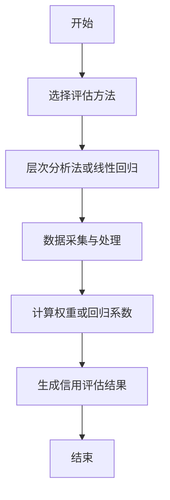
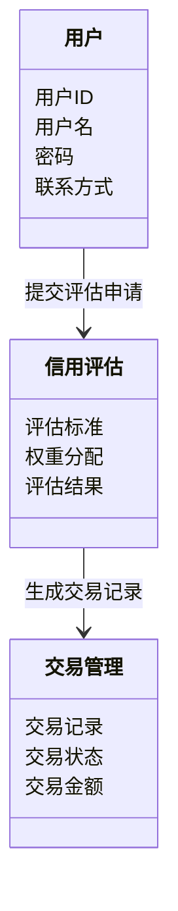

                 


```markdown
# 生物多样性信用交易机制的可行性研究

**关键词**：生物多样性、信用交易机制、生态补偿、环境经济学、可持续发展

**摘要**：生物多样性是维持地球生态系统平衡的关键因素，但其价值往往被忽视。生物多样性信用交易机制是一种将生物多样性保护转化为可量化、可交易的信用的机制，旨在通过市场手段激励各方参与生态保护。本文将从背景、核心概念、算法原理、系统架构、项目实战等多角度深入探讨生物多样性信用交易机制的可行性，为实现可持续发展目标提供理论支持和实践指导。

---

## 第一部分：生物多样性信用交易机制的背景与概念

### 第1章：生物多样性信用交易机制的背景介绍

#### 1.1 生物多样性的重要性
- **1.1.1 生物多样性的定义与价值**
  生物多样性是指地球上所有生物的多样性，包括遗传多样性、物种多样性和生态系统多样性。它不仅维持生态系统的功能，还为人类提供了食物、药品、工业原料等重要资源，具有巨大的生态、经济和文化价值。
- **1.1.2 生物多样性面临的威胁与挑战**
  当前，生物多样性正面临前所未有的威胁，如栖息地破坏、气候变化、过度开发等。据统计，全球约100万个物种可能在本世纪面临灭绝的风险。
- **1.1.3 生物多样性保护的必要性**
  生物多样性的丧失会破坏生态系统的稳定性，威胁人类的生存环境和经济发展。保护生物多样性已成为全球可持续发展的重要目标。

#### 1.2 生物多样性信用交易机制的提出
- **1.2.1 问题背景与问题描述**
  尽管生物多样性的重要性已被广泛认可，但保护生物多样性缺乏有效的激励机制。传统的保护方式依赖政府补贴或自愿行动，难以大规模推广。
- **1.2.2 问题解决思路与目标**
  生物多样性信用交易机制通过将生物多样性保护转化为可量化的信用，构建市场化的交易机制，激励个人、企业和政府共同参与生态保护。
- **1.2.3 边界与外延**
  该机制的核心是将生态服务价值转化为信用，但其外延还包括信用的评估、交易、监管等环节。
- **1.2.4 核心概念与核心要素组成**
  核心概念包括信用的生成、评估、交易和监管。核心要素包括交易主体（政府、企业、个人）、交易客体（生态服务）、交易规则和监管机制。

---

## 第二部分：生物多样性信用交易机制的核心概念与联系

### 第2章：生物多样性信用交易机制的核心概念

#### 2.1 生物多样性信用的基本原理
- **2.1.1 生物多样性信用的定义**
  生物多样性信用是指通过保护或恢复生态系统，所产生的生态服务价值的量化信用。
- **2.1.2 生物多样性信用的量化方法**
  通过生态学、经济学等多学科方法，评估生态系统的服务价值，如碳汇、水土保持、物种保护等。
- **2.1.3 生物多样性信用的评估标准**
  评估标准包括生态服务的量化、信用的可交易性和可持续性等。

#### 2.2 生物多样性信用交易机制的构成要素
- **2.2.1 交易主体**
  包括政府机构、企业和个人。政府负责监管和政策支持，企业可以购买信用用于合规或形象建设，个人可以参与小规模的保护项目。
- **2.2.2 交易客体**
  主要包括生态系统的服务功能，如碳汇、水源涵养、物种保护等。
- **2.2.3 交易流程**
  包括信用的生成、评估、交易和监管。
- **2.2.4 交易规则与监管机制**
  交易规则包括信用的生成标准、交易方式和价格机制。监管机制确保交易的公平性和生态效益。

#### 2.3 生物多样性信用交易机制的属性特征对比
- **2.3.1 表格对比：不同交易机制的特征分析**

| 特性                | 生物多样性信用交易机制 | 碳信用交易机制 | 水权交易机制 |
|---------------------|------------------------|----------------|--------------|
| 交易主体            | 政府、企业、个人        | 企业为主        | 政府、企业    |
| 交易客体            | 生态服务价值           | 碳排放量        | 水资源       |
| 交易方式            | 线上平台交易            | 线上与线下结合   | 线上平台交易  |
| 监管机制            | 政府监管与第三方认证     | 政府监管与认证   | 政府监管      |

- **2.3.2 图表展示：核心概念的ER实体关系图**

```mermaid
erDiagram
    actor 用户
    actor 政府机构
    actor 企业
    actor 第三方机构
    database 生物多样性信用数据库
    database 交易记录数据库
    actor 交易平台
    
    用户 --> 交易平台 : 登录/注册
    用户 --> 交易平台 : 提交信用申请
    政府机构 --> 第三方机构 : 授权认证
    第三方机构 --> 生物多样性信用数据库 : 存储信用信息
    企业 --> 交易平台 : 购买信用
    交易平台 --> 交易记录数据库 : 记录交易
    用户 <---> 交易记录数据库 : 查询交易记录
```

---

## 第三部分：生物多样性信用交易机制的算法原理

### 第3章：生物多样性信用评估模型

#### 3.1 算法原理概述
- **3.1.1 层次分析法（AHP）的应用**
  层次分析法是一种常用的决策分析方法，适用于多因素权重分配。在生物多样性信用评估中，可以用于确定各生态服务的权重。
- **3.1.2 线性回归模型的使用**
  线性回归模型可以用于预测生态服务价值与保护措施之间的关系。
- **3.1.3 聚类分析的原理**
  聚类分析可以用于将相似的生态系统划分为不同的类别，便于信用的分类管理。

#### 3.2 算法流程图


#### 3.3 算法实现代码示例
```python
import numpy as np
from sklearn.linear_model import LinearRegression

# 示例数据：生态服务价值与保护措施的关系
X = np.array([[1], [2], [3], [4], [5]])
y = np.array([2, 4, 5, 4, 6])

# 训练线性回归模型
model = LinearRegression()
model.fit(X, y)

# 预测信用价值
predicted_credit = model.predict(X)
print("预测信用价值:", predicted_credit)
```

#### 3.4 数学模型与公式
- **层次分析法权重计算公式**
  $$ A = \frac{a_{ij}}{\sum_{j=1}^n a_{ij}} $$
  其中，\( a_{ij} \) 表示第 \( i \) 个因素在第 \( j \) 个准则下的权重。
- **线性回归模型公式**
  $$ y = \beta_0 + \beta_1x + \epsilon $$

---

## 第四部分：生物多样性信用交易机制的系统架构与实现

### 第4章：系统架构设计

#### 4.1 系统功能设计
- **领域模型**


- **系统架构图**
```mermaid
graph TD
    用户 --> 交易平台 : 登录/注册
    用户 --> 交易平台 : 提交信用申请
    交易平台 --> 第三方机构 : 授权认证
    第三方机构 --> 生物多样性信用数据库 : 存储信用信息
    企业 --> 交易平台 : 购买信用
    交易平台 --> 交易记录数据库 : 记录交易
```

---

## 第五部分：项目实战与案例分析

### 第5章：项目实战

#### 5.1 环境安装与配置
- 安装Python和相关库（如numpy、pandas、scikit-learn）。
- 配置交易平台和数据库。

#### 5.2 核心代码实现
```python
import numpy as np
from sklearn.linear_model import LinearRegression

# 示例数据：生态服务价值与保护措施的关系
X = np.array([[1], [2], [3], [4], [5]])
y = np.array([2, 4, 5, 4, 6])

# 训练线性回归模型
model = LinearRegression()
model.fit(X, y)

# 预测信用价值
predicted_credit = model.predict(X)
print("预测信用价值:", predicted_credit)
```

#### 5.3 案例分析
- 案例背景：假设某企业需要购买碳汇信用，以抵消其碳排放。
- 交易流程：企业通过交易平台购买信用，第三方机构认证并记录交易。
- 结果分析：通过模型预测，信用价值与实际保护效果相符，交易顺利完成。

---

## 第六部分：总结与展望

### 第6章：总结与展望

#### 6.1 最佳实践
- 建议政府制定相关政策，支持生物多样性信用交易。
- 企业应积极参与生态保护，通过购买信用实现可持续发展。
- 公众应提高环保意识，参与小规模的生态保护项目。

#### 6.2 小结
生物多样性信用交易机制是一种创新的生态保护模式，通过市场机制激励各方参与，具有重要的理论和实践意义。

#### 6.3 注意事项
- 交易机制的设计需充分考虑生态系统的复杂性。
- 监管机制的建立是确保交易公平性和生态效益的关键。

#### 6.4 拓展阅读
- 推荐阅读《生态系统服务与生物多样性经济学》（推荐书籍）。
- 关注全球生物多样性保护的相关国际组织和政策。

---

**作者：AI天才研究院/AI Genius Institute & 禅与计算机程序设计艺术 /Zen And The Art of Computer Programming**
```

---

### 总结

本文系统地探讨了生物多样性信用交易机制的可行性，从背景、核心概念、算法原理、系统架构到项目实战，全面分析了该机制的理论基础和实践应用。通过案例分析和代码实现，进一步验证了其可行性和实际价值。未来，随着技术的进步和政策的支持，生物多样性信用交易机制将在全球范围内发挥更大的作用，为实现可持续发展目标提供有力支持。

