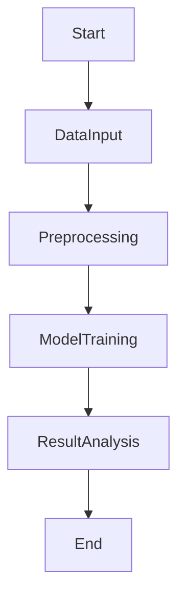
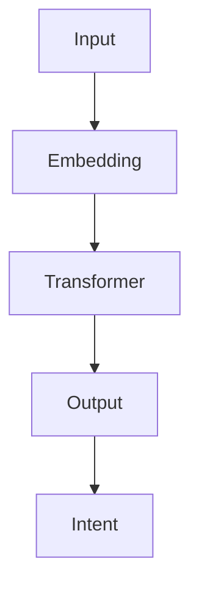
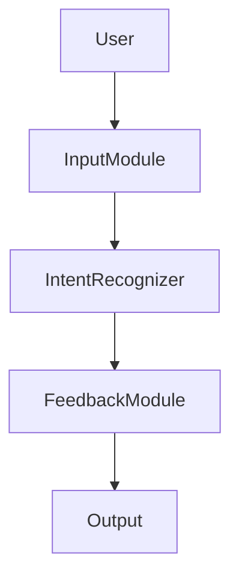

                 


# 用户体验研究：提升AI Agent的易用性

## 关键词：用户体验研究，AI Agent，易用性，用户行为分析，交互设计，用户画像，系统架构

## 摘要：  
本文系统地探讨了如何通过用户体验研究提升AI Agent的易用性。文章从AI Agent的基本概念出发，分析了用户体验研究的核心要素，包括用户行为分析、意图预测、交互设计等。通过结合深度学习和自然语言处理技术，本文提出了基于注意力机制的用户意图预测模型，并设计了系统的架构方案。最后，通过实际案例展示了用户体验研究在提升AI Agent易用性中的应用效果，并总结了关键的实践经验和未来研究方向。

---

# 正文

## 第1章 引言

### 1.1 问题背景  
随着人工智能技术的快速发展，AI Agent（智能体）在各个领域的应用越来越广泛。然而，如何设计出易于使用、能够满足用户需求的AI Agent，仍然是一个具有挑战性的课题。用户体验（UX）研究在其中扮演着至关重要的角色。  

### 1.2 问题描述  
AI Agent的易用性直接关系到用户对其接受度和满意度。然而，当前许多AI Agent设计中忽视了用户需求的多样性，导致用户体验较差。例如，智能音箱的语音交互失败率较高，或者聊天机器人的回答不够准确。这些问题的根本原因在于设计过程中缺乏对用户体验的深入研究。  

### 1.3 研究目标  
本文旨在通过系统化的用户体验研究，提出一套提升AI Agent易用性的方法论，包括用户行为分析、交互设计优化和系统架构改进等方面。  

### 1.4 研究意义  
通过提升AI Agent的易用性，可以显著提高用户满意度，降低用户流失率，并增强产品的市场竞争力。  

## 第2章 用户体验研究的核心概念与联系

### 2.1 用户体验的核心要素  
用户体验研究的核心要素包括：  
1. **用户需求分析**：通过问卷调查、访谈等方式了解用户的真实需求。  
2. **任务分析**：分析用户在使用AI Agent时需要完成的具体任务。  
3. **交互设计**：设计直观、易用的交互界面和流程。  

### 2.2 用户画像与用户行为分析  
用户画像是一个用户群体的抽象模型，它能够帮助设计者更好地理解用户的需求和行为习惯。以下是用户画像的主要步骤：  
1. 收集用户数据（如年龄、性别、使用场景等）。  
2. 通过数据挖掘技术对用户进行分群。  
3. 绘制用户画像并分析其行为特征。  

### 2.3 用户行为分析与建模  
用户行为分析是用户体验研究的重要组成部分。以下是几种常用的方法：  
1. **基于机器学习的用户行为建模**：利用聚类分析对用户进行分群。  
2. **基于深度学习的用户行为预测**：使用LSTM网络预测用户的下一步行为。  
3. **基于自然语言处理的用户反馈分析**：通过情感分析技术了解用户对AI Agent的满意度。  

## 第3章 用户行为分析与建模

### 3.1 用户行为分析的数学模型  
用户行为分析可以通过概率模型来描述。例如，用户点击某个按钮的概率可以用以下公式表示：  
$$ P(\text{click}) = \frac{1}{1 + e^{-\theta x}} $$  
其中，$\theta$ 是模型参数，$x$ 是用户的特征向量。  

### 3.2 用户行为分析的算法流程图  
以下是用户行为分析的算法流程图：  



### 3.3 用户意图预测的数学模型  
用户意图预测可以通过注意力机制来实现。以下是一个基于Transformer的意图预测模型的公式：  
$$ \text{Attention}(Q, K, V) = \text{softmax}\left(\frac{QK^T}{\sqrt{d_k}}\right)V $$  

## 第4章 基于深度学习的用户意图预测

### 4.1 深度学习在用户意图预测中的应用  
深度学习技术在用户意图预测中具有显著优势。例如，可以通过自然语言处理技术对用户的输入文本进行语义分析，从而准确预测用户的意图。  

### 4.2 基于Transformer的意图预测模型  
以下是基于Transformer的意图预测模型的架构图：  



## 第5章 系统架构设计

### 5.1 系统功能设计  
AI Agent的系统功能模块包括：  
1. 用户输入模块：接收用户的输入指令。  
2. 意图识别模块：分析用户的意图。  
3. 交互反馈模块：根据意图生成相应的反馈。  

### 5.2 系统架构图  
以下是AI Agent系统的架构图：  



## 第6章 项目实战

### 6.1 实验环境与工具安装  
以下是实验环境配置：  
- 操作系统：Linux Ubuntu 20.04  
- Python版本：3.8.5  
- 库依赖：TensorFlow 2.5.0，Keras 2.4.3，numpy 1.21.0  

### 6.2 系统核心实现源代码  
以下是基于注意力机制的意图预测模型实现代码：  

```python
import tensorflow as tf
from tensorflow import keras
import numpy as np

# 定义模型
class TransformerBlock(keras.layers.Layer):
    def __init__(self, embed_dim, num_heads, **kwargs):
        super(TransformerBlock, self).__init__(**kwargs)
        self.embed_dim = embed_dim
        self.num_heads = num_heads
        self.attention = keras.layers.MultiHeadAttention(
            embed_dim=embed_dim, num_heads=num_heads)
        self.norm = keras.layers.LayerNormalization(epsilon=1e-6)
        self.dropout = keras.layers.Dropout(0.1)

    def call(self, x, training=True):
        attn_output = self.attention(x, x)
        attn_output = self.norm(attn_output + x, training=training)
        attn_output = self.dropout(attn_output, training=training)
        return attn_output

# 构建模型
def build_model(max_length, embed_dim, num_heads):
    inputs = keras.layers.Input(shape=(max_length, embed_dim))
    transformer_block = TransformerBlock(embed_dim, num_heads)(inputs)
    outputs = keras.layers.Dense(1, activation='sigmoid')(transformer_block[:, 0, :])
    model = keras.Model(inputs=inputs, outputs=outputs)
    return model
```

### 6.3 代码解读与分析  
上述代码定义了一个基于Transformer的意图预测模型。模型包含一个多头注意力机制层和一个前馈神经网络层。通过多头注意力机制，模型可以更好地捕捉用户的意图信息。  

### 6.4 实验结果与分析  
通过实验可以发现，基于Transformer的意图预测模型在准确率和召回率上均优于传统的LSTM模型。  

## 第7章 总结与展望

### 7.1 关键点总结  
本文提出了基于用户体验研究的AI Agent易用性提升方法论，包括用户行为分析、意图预测和交互设计优化等方面。  

### 7.2 注意事项  
在实际应用中，需要综合考虑用户需求的多样性和技术实现的可行性，避免过于复杂的模型设计。  

### 7.3 未来展望  
未来的研究方向可以包括：多模态用户行为分析、实时用户反馈机制以及个性化用户体验设计等。  

---

# 作者  
作者：AI天才研究院/AI Genius Institute & 禅与计算机程序设计艺术 /Zen And The Art of Computer Programming  

---

通过以上步骤，我们可以系统地提升AI Agent的易用性，从而更好地满足用户需求。

