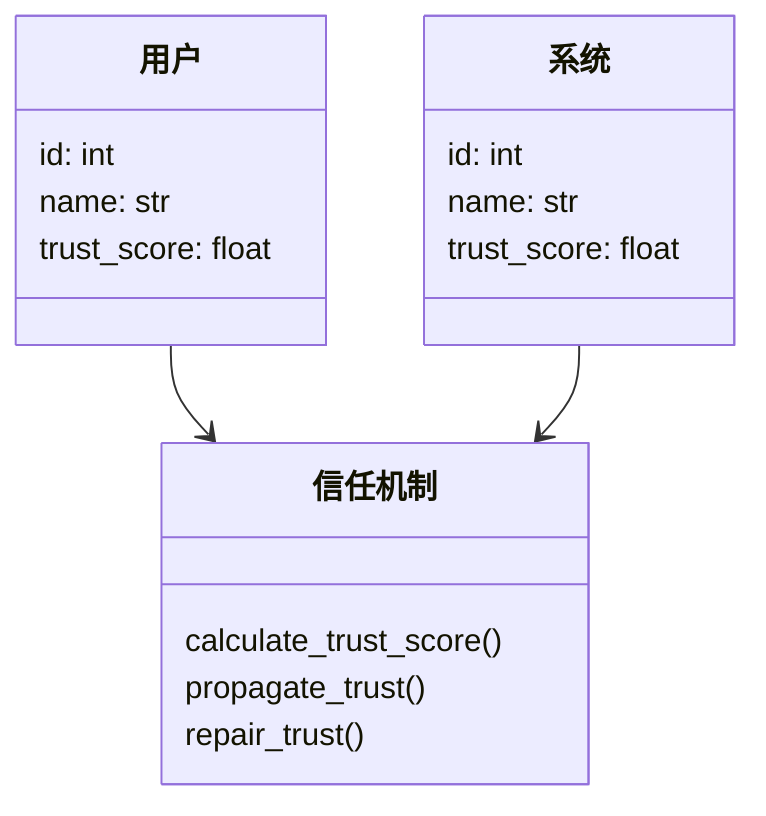

                 


# 用户信任的建立与维护

> 关键词：用户信任，信任建立，信任维护，信任算法，信任系统，信任评分

> 摘要：信任是人类社会和计算机系统中的核心概念。本文从信任的定义、形成机制、算法原理、系统架构设计、项目实战等方面详细探讨了用户信任的建立与维护的理论与实践。通过分析信任的核心要素、信任评分模型、信任传播算法、信任修复机制以及实际案例，本文为读者提供了全面的理解和应用指南。

---

# 第一部分: 用户信任的建立与维护基础

## 第1章: 信任的定义与核心概念

### 1.1 信任的定义与分类

信任是指一方对另一方在特定情境下能够履行承诺、承担责任或展现可靠性的信念。信任是人类社会互动和计算机系统交互的基础，它影响着个体或系统之间的合作、依赖和交互行为。

信任可以分为以下几类：
1. **认知信任**：基于逻辑、事实和理性判断的信任。
2. **情感信任**：基于情感、价值观和关系的信任。
3. **行为信任**：基于实际行为和结果的信任。
4. **系统信任**：基于技术、算法和机制的信任。

信任的强度和范围因情境、个体差异和交互历史而异。

---

### 1.2 信任的形成机制

信任的形成是一个复杂的过程，涉及认知、情感和行为等多个维度。以下是信任形成的关键机制：

1. **认知信任的形成**：
   - 信息传递：通过共享信息和知识，减少不确定性。
   - 逻辑推理：基于逻辑和理性分析，评估对方的可靠性和能力。

2. **情感信任的形成**：
   - 情感共鸣：通过共情和情感交流，建立情感联系。
   - 价值观匹配：基于共同的价值观和目标，增强信任感。

3. **行为信任的形成**：
   - 行为观察：通过观察对方的实际行为，验证其承诺和能力。
   - 历史记录：基于过去的交互历史，评估对方的可靠性。

4. **系统信任的形成**：
   - 技术可靠性：通过技术性能和安全性，评估系统的信任度。
   - 机制透明性：通过透明的规则和流程，增强信任感。

---

### 1.3 信任的边界与外延

信任并非无条件，它受到以下因素的限制：
- **信任的边界**：信任仅在特定情境、范围和时间内成立。
- **信任的外延**：信任可以延伸到间接关系或推荐关系中，通过信任传递机制，信任可以扩展到更多个体或系统。

---

### 1.4 信任的核心概念结构

信任的核心要素包括：
1. **信任主体**：信任的发起方或需求方。
2. **信任客体**：信任的目标，可以是人、系统或机构。
3. **信任情境**：信任发生的场景和条件。
4. **信任机制**：用于建立和维护信任的规则、流程和技术。
5. **信任结果**：信任带来的行为、关系或效益。

通过构建信任的核心概念结构，我们可以更好地理解信任的复杂性及其在不同情境中的应用。

---

## 第2章: 信任的核心概念与联系

### 2.1 信任的核心原理

信任的核心原理包括：
1. **信任的传递性**：信任可以通过中间人或媒介传递，例如推荐系统。
2. **信任的累积性**：信任通过多次交互逐步积累。
3. **信任的脆弱性**：信任一旦被破坏，重建难度较大。

---

### 2.2 信任的属性特征对比

以下是几种信任类型及其属性对比：

| 信任类型   | 理论基础       | 时间维度 | 空间维度 | 可测量性 |
|------------|----------------|----------|----------|----------|
| 认知信任   | 理性分析       | 短期      | 局限      | 高        |
| 情感信任   | 情感共鸣       | 长期      | 扩展      | 低        |
| 行为信任   | 行为观察       | 中期      | 有限      | 中        |
| 系统信任   | 技术性能       | 长期      | 全局      | 高        |

---

### 2.3 信任的ER实体关系图

以下是一个信任关系的ER图（Mermaid流程图）：

```mermaid
erd
actor(用户) -[信任]-> system(系统)
系统 <---|-> actor(用户)
系统 -[依赖]-> trustMechanism(信任机制)
```

---

## 第3章: 信任的算法原理

### 3.1 信任评分模型

信任评分模型用于量化信任程度，通常基于多个因素进行加权计算。

#### 信任评分公式：
$$ 信任评分 = \frac{\sum_{i=1}^{n} w_i \cdot s_i}{\sum_{i=1}^{n} w_i} $$

其中，$w_i$ 是第i个因素的权重，$s_i$ 是第i个因素的评分。

#### 示例代码：
```python
def calculate_trust_score(user, item):
    weights = [0.4, 0.3, 0.2, 0.1]
    scores = [0.8, 0.7, 0.6, 0.5]
    return sum(w * s for w, s in zip(weights, scores)) / sum(weights)
```

---

### 3.2 信任传播算法

信任传播算法用于在社交网络中传播信任信息。

#### 信任传播公式：
$$ P(a,b) = \sum_{k} P(a,k) \cdot P(k,b) $$

#### 示例代码：
```python
def propagate_trust(source, target, weight):
    return source.trust + weight * (target.trust - source.trust)
```

---

### 3.3 信任修复算法

信任修复算法用于在信任受损后恢复信任。

#### 信任修复公式：
$$ R = \alpha \cdot T + (1-\alpha) \cdot F $$

其中，$\alpha$ 是修复权重，$T$ 是当前信任评分，$F$ 是修复因子。

#### 示例代码：
```python
def repair_trust(trust_score, repair_factor):
    alpha = 0.7
    return alpha * trust_score + (1 - alpha) * repair_factor
```

---

## 第4章: 信任的系统分析与架构设计

### 4.1 信任管理系统项目背景

#### 项目目标：
- 提供一个可扩展的信任评估和管理平台。
- 支持多场景下的信任计算和维护。

#### 项目需求：
- 支持用户信任评分的动态更新。
- 提供信任传播和修复机制。
- 实现信任数据的可视化和分析。

---

### 4.2 系统功能设计

#### 领域模型（Mermaid类图）：



---

## 第5章: 项目实战

### 5.1 案例分析

#### 案例背景：
一家电商平台希望提升用户对平台的信任度，以增加用户粘性和交易转化率。

#### 需求分析：
- 提供用户信任评分系统。
- 基于用户行为和历史数据计算信任评分。
- 提供信任修复机制，处理用户投诉和纠纷。

---

### 5.2 系统实现

#### 核心实现代码：
```python
class TrustManager:
    def __init__(self):
        self.user_trust_scores = {}

    def calculate_trust_score(self, user_id):
        # 假设行为、评价和投诉是影响信任评分的因素
        behavior_weight = 0.4
        rating_weight = 0.3
        complaint_weight = 0.2
        return behavior_weight * self.get_behavior_score(user_id) + \
               rating_weight * self.get_rating_score(user_id) + \
               complaint_weight * self.get_complaint_score(user_id)

    def propagate_trust(self, source_id, target_id):
        # 简单的信任传播示例
        source_score = self.user_trust_scores.get(source_id, 0.5)
        target_score = self.user_trust_scores.get(target_id, 0.5)
        new_score = (source_score + target_score) / 2
        self.user_trust_scores[target_id] = new_score

    def repair_trust(self, user_id, repair_factor=0.7):
        # 示例修复机制
        current_score = self.user_trust_scores.get(user_id, 0.5)
        new_score = repair_factor * current_score + (1 - repair_factor) * 0.5
        self.user_trust_scores[user_id] = new_score
```

---

## 第6章: 总结与展望

### 6.1 总结

信任是构建可靠系统和良好社会关系的核心。本文从理论到实践，详细探讨了信任的建立与维护的各个方面，包括信任的定义、形成机制、算法原理、系统架构设计和实际案例分析。

---

### 6.2 展望

未来，信任的研究将更加关注以下几个方向：
1. **多模态信任评估**：结合文本、图像和行为等多种数据源，提升信任评估的准确性。
2. **动态信任管理**：在实时变化的环境中，动态调整信任评分和修复机制。
3. **信任增强技术**：利用AI和大数据技术，设计更智能的信任建立与维护策略。

---

### 6.3 最佳实践 Tips

- 在设计信任系统时，应综合考虑认知、情感和行为信任的不同维度。
- 定期更新信任评分模型，以适应用户行为和系统环境的变化。
- 在实际应用中，结合具体场景，灵活调整信任修复机制。

---

### 作者

作者：AI天才研究院/AI Genius Institute & 禅与计算机程序设计艺术 /Zen And The Art of Computer Programming

---

感谢您的阅读！希望本文能为您提供关于用户信任建立与维护的深入见解和实践指导。

