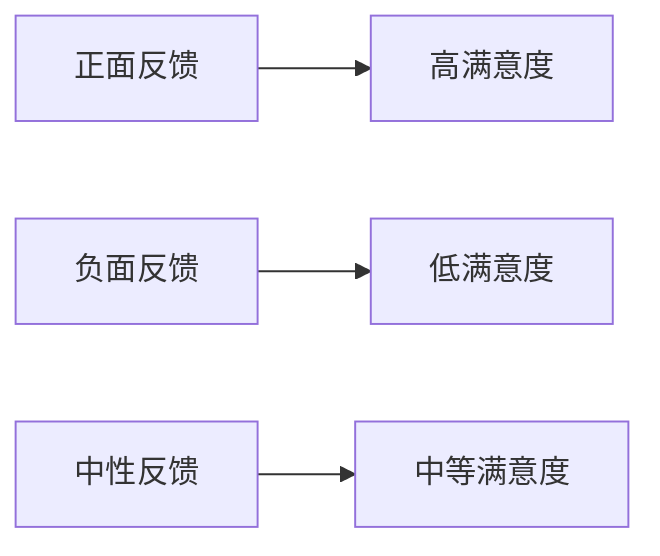
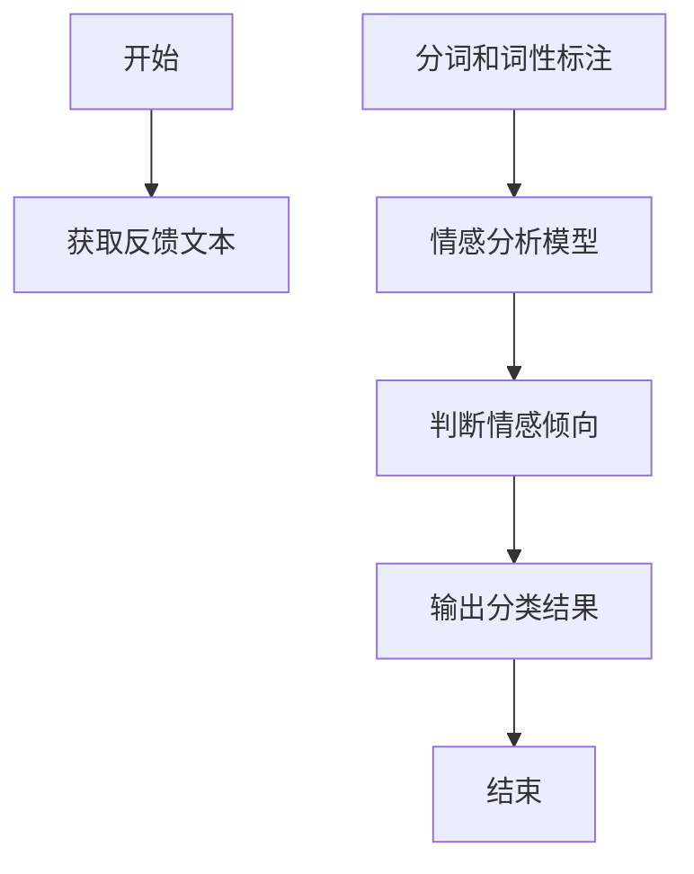
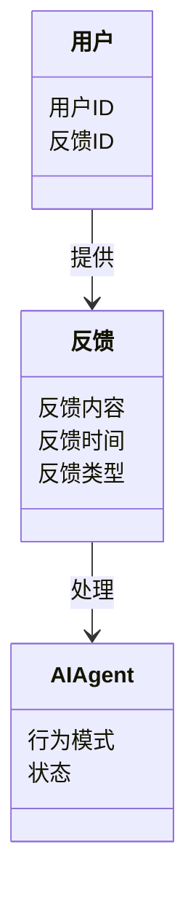
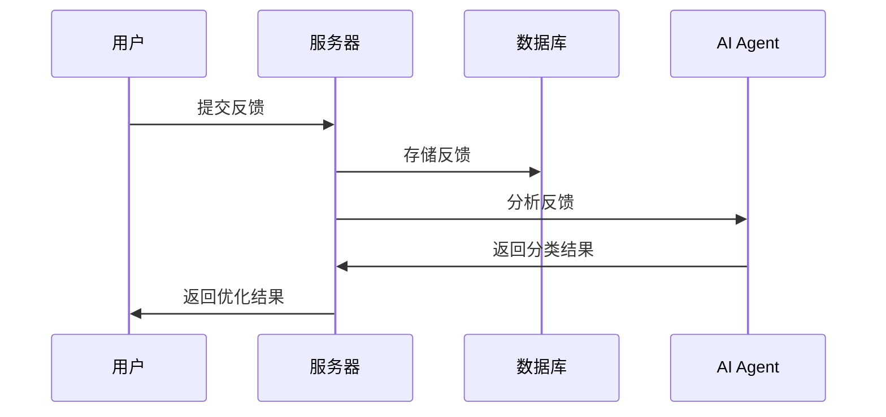

                 


# 用户反馈处理：不断改进AI Agent的表现

> 关键词：用户反馈，AI Agent，自然语言处理，机器学习，系统架构，实时反馈

> 摘要：用户反馈是优化AI Agent表现的重要手段，本文将从背景、核心概念、算法原理、系统架构设计、项目实战等多个维度，详细分析用户反馈处理的实现方法和优化策略。通过本篇文章，读者将能够掌握如何有效收集、分析、处理用户反馈，并将其应用于AI Agent的性能优化中。

---

## 第1章: 用户反馈处理的背景与核心概念

### 1.1 用户反馈的重要性

#### 1.1.1 用户反馈的定义与分类
用户反馈是指用户在与AI Agent交互过程中，对AI Agent的行为、结果或服务质量所做出的评价、建议或投诉。用户反馈可以是显式的（如评分、评论）或隐式的（如行为日志）。用户反馈的分类主要基于以下几个维度：

- **反馈类型**：分为正面反馈、负面反馈和中性反馈。
- **反馈来源**：包括直接反馈（如用户主动提交的评价）和间接反馈（如日志数据）。
- **反馈内容**：可以是关于功能性的反馈（如建议改进某功能）或情感性反馈（如表达满意或不满）。

#### 1.1.2 用户反馈在AI Agent中的作用
用户反馈是AI Agent改进的核心驱动力。通过分析用户反馈，可以发现AI Agent在设计和实现中的不足，从而优化算法、改进交互体验并提升服务质量。

#### 1.1.3 用户反馈处理的背景与现状
随着AI Agent在各个领域的广泛应用，用户反馈处理的重要性日益凸显。然而，用户反馈的多样性和复杂性也给处理带来了挑战。如何高效地收集、分析和应用用户反馈，成为当前研究和实践的热点。

---

### 1.2 问题背景与描述

#### 1.2.1 AI Agent的定义与特点
AI Agent（人工智能代理）是指能够感知环境、自主决策并执行任务的智能实体。AI Agent的特点包括智能性、自主性、反应性和社会性。

#### 1.2.2 用户反馈处理的核心问题
用户反馈处理的核心问题是如何从用户的反馈中提取有价值的信息，并将其转化为改进AI Agent的具体行动步骤。

#### 1.2.3 反馈处理的边界与外延
用户反馈处理的边界在于如何区分有效反馈与无效反馈。外延则包括反馈的存储、分析、应用和优化。

---

### 1.3 问题解决与反馈处理

#### 1.3.1 反馈处理的目标与意义
反馈处理的目标是通过分析用户反馈，优化AI Agent的行为模式，提升用户体验和任务执行效率。

#### 1.3.2 反馈处理的核心要素
- 数据采集：如何高效地收集用户反馈。
- 数据分析：如何从反馈中提取有用的信息。
- 数据应用：如何将反馈结果应用于AI Agent的改进。

#### 1.3.3 反馈处理的实现路径
- **数据采集**：通过日志记录、用户调查等方式获取反馈。
- **数据分析**：使用自然语言处理（NLP）和机器学习技术对反馈进行分类和分析。
- **数据应用**：根据分析结果优化AI Agent的算法或调整其行为策略。

---

## 第2章: 用户反馈处理的核心概念与联系

### 2.1 核心概念原理

#### 2.1.1 用户反馈的分类与特征
用户反馈可以根据多个维度进行分类，例如基于时间（实时反馈、延迟反馈）、基于内容（功能反馈、情感反馈）等。每个反馈类型都有其独特的特征，例如：

- **实时反馈**：用户在与AI Agent交互过程中即时提供的反馈，具有较高的实时性和指导性。
- **延迟反馈**：用户在任务完成后提供的反馈，通常用于长期优化。

#### 2.1.2 反馈处理的流程与步骤
用户反馈处理的流程通常包括以下几个步骤：
1. 数据采集：通过多种渠道收集用户反馈。
2. 数据清洗：去除无效或噪声数据。
3. 数据分析：使用NLP和机器学习技术对反馈进行分类和分析。
4. 数据应用：根据分析结果优化AI Agent的行为模式。

#### 2.1.3 反馈处理的数学模型
在反馈处理中，通常需要使用一些数学模型来分析用户反馈。例如，可以使用情感分析模型来判断反馈的情感倾向，或者使用聚类算法将相似的反馈进行分组。

---

### 2.2 核心概念属性对比

#### 2.2.1 反馈类型对比表
以下是一个简单的反馈类型对比表：

| 反馈类型 | 特征描述 | 示例 |
|----------|----------|------|
| 正面反馈 | 表达满意或认可 | "您的回答非常准确！" |
| 负面反馈 | 表达不满或批评 | "您的回答不够清晰。" |
| 中性反馈 | 表达中立或建议 | "您提供的信息有误。" |

#### 2.2.2 反馈特征对比图
以下是一个简单的反馈特征对比图：



---

### 2.3 ER实体关系图

用户反馈处理的实体关系图如下：

```mermaid
er
actor: 用户
feedback: 用户反馈
agent: AI Agent
actor --> feedback: 提供
feedback --> agent: 处理
```

---

## 第3章: 用户反馈处理的算法原理

### 3.1 算法原理概述

#### 3.1.1 基于频率的反馈处理算法
基于频率的反馈处理算法是一种简单而有效的反馈分类方法。其实现步骤如下：

1. 统计每个反馈关键词的出现频率。
2. 根据关键词的频率对反馈进行分类。

#### 3.1.2 基于情感分析的反馈分类
情感分析是一种常见的反馈分类方法，通常使用自然语言处理技术来判断反馈的情感倾向。其实现步骤如下：

1. 对反馈文本进行分词和词性标注。
2. 使用情感分析模型（如SVM、LSTM）对反馈进行分类。

#### 3.1.3 基于强化学习的反馈应用
强化学习是一种有效的反馈应用方法。其实现步骤如下：

1. 定义反馈奖励机制。
2. 使用强化学习算法（如Q-Learning）优化AI Agent的行为策略。

---

### 3.2 算法流程图

基于情感分析的反馈分类流程图如下：



---

### 3.3 算法实现代码示例

以下是一个基于情感分析的反馈分类代码示例：

```python
import nltk
from nltk.sentiment import SentimentIntensityAnalyzer

def analyze_feedback(feedback_text):
    analyzer = SentimentIntensityAnalyzer()
    scores = analyzer.polarity_scores(feedback_text)
    if scores['compound'] > 0:
        return '正面反馈'
    elif scores['compound'] < 0:
        return '负面反馈'
    else:
        return '中性反馈'

# 示例
feedback = "您的回答非常准确！"
print(analyze_feedback(feedback))  # 输出：正面反馈
```

---

## 第4章: 用户反馈处理的系统架构设计

### 4.1 系统功能设计

#### 4.1.1 领域模型
以下是一个简单的用户反馈处理系统领域模型：



---

### 4.2 系统架构设计

#### 4.2.1 系统架构图
以下是一个简单的用户反馈处理系统架构图：


---

### 4.3 系统接口设计

#### 4.3.1 API接口
以下是一个用户反馈处理系统的API接口设计：

- **提交反馈接口**：`POST /api/feedback`
- **获取反馈分类接口**：`GET /api/feedback/classification`

---

### 4.4 系统交互流程

#### 4.4.1 交互流程图
以下是一个用户反馈处理系统的交互流程图：



---

## 第5章: 项目实战

### 5.1 环境安装

#### 5.1.1 安装Python
安装Python 3.x版本。

#### 5.1.2 安装依赖库
安装以下依赖库：
```bash
pip install nltk
pip install scikit-learn
pip install matplotlib
```

---

### 5.2 系统核心实现

#### 5.2.1 反馈分类实现

```python
from sklearn.feature_extraction.text import TfidfVectorizer
from sklearn.svm import SVC

def feedback_classification(feedback_list, labels):
    vectorizer = TfidfVectorizer()
    X = vectorizer.fit_transform(feedback_list)
    clf = SVC()
    clf.fit(X, labels)
    return clf

# 示例
feedbacks = ["您的回答非常准确！", "您提供的信息有误。"]
labels = ['positive', 'negative']
clf = feedback_classification(feedbacks, labels)
```

---

### 5.3 代码解读与分析

#### 5.3.1 代码解读
上述代码实现了一个基于TF-IDF和SVM的反馈分类系统。首先，使用TF-IDF对反馈文本进行特征提取，然后使用SVM进行分类。

---

### 5.4 实际案例分析

#### 5.4.1 案例背景
假设我们有一个电商客服AI Agent，用户经常对客服的响应速度和准确性提出反馈。

#### 5.4.2 反馈处理流程
1. 收集用户反馈。
2. 对反馈进行分类。
3. 根据分类结果优化AI Agent的行为模式。

---

## 第6章: 最佳实践与总结

### 6.1 关键点总结

#### 6.1.1 反馈处理的关键点
- 反馈的实时性：实时反馈对优化AI Agent行为具有重要意义。
- 反馈的多样性：不同类型的反馈需要不同的处理方法。
- 反馈的关联性：反馈之间的关联性可以帮助发现潜在问题。

#### 6.1.2 系统设计的关键点
- 系统的可扩展性：系统需要能够支持大量的反馈数据。
- 系统的实时性：反馈处理需要快速响应。
- 系统的安全性：反馈数据需要得到妥善保护。

---

### 6.2 小结

用户反馈处理是优化AI Agent表现的重要手段。通过本文的分析和实践，我们可以看到，用户反馈处理需要结合多种技术手段，包括自然语言处理、机器学习和系统架构设计。只有通过不断地优化和改进，才能让AI Agent更好地服务于用户。

---

### 6.3 注意事项

- 反馈的收集需要遵循用户的隐私保护原则。
- 反馈的分析需要结合具体的业务场景。
- 反馈的应用需要与AI Agent的行为模式紧密结合。

---

### 6.4 拓展阅读

- [《自然语言处理入门》](https://example.com/nlp)
- [《机器学习实战》](https://example.com/ml)
- [《系统架构设计》](https://example.com/architecture)

---

## 作者：AI天才研究院/AI Genius Institute & 禅与计算机程序设计艺术 /Zen And The Art of Computer Programming

