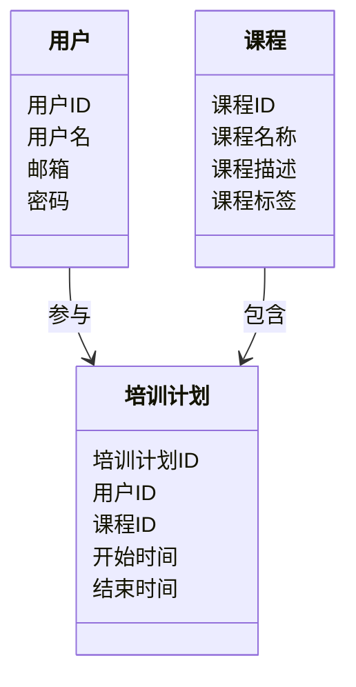
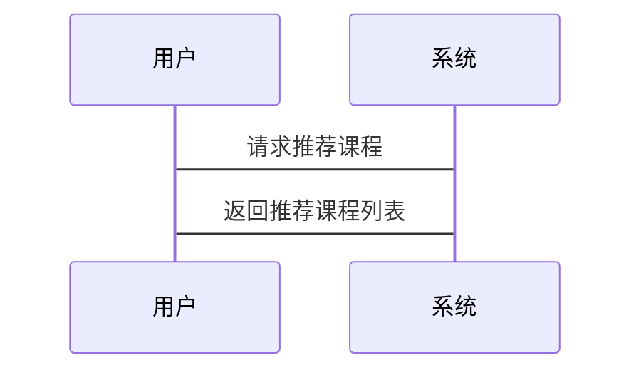

                 


# 用户教育与培训

---

## 关键词

- 用户教育
- 用户培训
- 系统架构
- 数据分析
- 算法原理

---

## 摘要

用户教育与培训是计算机领域中一个重要的主题，涉及到如何通过系统化的方法和技术手段，提升用户对软件、系统或工具的使用能力和知识水平。本文从背景、核心概念、算法原理、系统架构设计、项目实战等多个维度，全面分析和探讨用户教育与培训的理论与实践。文章首先介绍了用户教育与培训的定义、目标和特点，然后详细讲解了相关的核心概念和理论基础，接着从算法的角度分析了用户教育与培训中数据分析和个性化推荐的实现原理，最后通过系统架构设计和项目实战，展示了用户教育与培训的实际应用场景和解决方案。

---

# 第1章 用户教育与培训的背景与核心概念

## 1.1 用户教育与培训的定义与特点

### 1.1.1 用户教育与培训的定义

用户教育与培训是指通过系统化的方法，向用户传授特定软件、系统或工具的使用方法和相关知识，以提升用户的操作能力和问题解决能力。用户教育与培训的核心目标是帮助用户更好地理解和使用相关产品或服务。

### 1.1.2 用户教育与培训的核心特点

- **系统性**：用户教育与培训通常采用结构化的课程设计，确保用户能够逐步掌握相关知识。
- **针对性**：针对不同用户群体的需求，设计个性化的培训方案。
- **互动性**：通过互动式教学，增强用户的参与感和学习效果。
- **持续性**：用户教育与培训是一个持续的过程，需要根据用户反馈和需求不断优化。

### 1.1.3 用户教育与培训的边界与外延

用户教育与培训的边界在于其专注于用户对特定产品或系统的使用能力，而其外延则涉及用户行为分析、用户体验优化等多个相关领域。

---

## 1.2 用户教育与培训的核心概念

### 1.2.1 用户教育与培训的目标与意义

用户教育与培训的目标是帮助用户快速掌握产品的核心功能和使用技巧，提升用户的满意度和产品使用效率。其意义在于通过有效的培训，减少用户的认知负担，提高产品的用户留存率和用户满意度。

### 1.2.2 用户教育与培训的核心要素

| 核心要素 | 描述 |
|----------|------|
| 用户需求分析 | 了解用户的真实需求和痛点。 |
| 培训内容设计 | 根据用户需求设计课程内容。 |
| 培训方式选择 | 确定线上或线下的培训方式。 |
| 培训效果评估 | 通过测试或反馈评估培训效果。 |

### 1.2.3 用户教育与培训的理论基础

用户教育与培训的理论基础包括学习理论、认知科学和用户体验设计等多方面的知识。

---

## 1.3 用户教育与培训与其他相关概念的对比

### 1.3.1 用户教育与培训与员工培训的区别

| 方面 | 用户教育与培训 | 员工培训 |
|------|----------------|-----------|
| 目标 | 提升用户的使用能力 | 提升员工的工作能力 |
| 对象 | 产品或服务的最终用户 | 企业的员工 |
| 内容 | 产品的使用方法 | 工作技能 |

### 1.3.2 用户教育与培训与用户支持的区别

用户教育与培训注重的是预防性教育，帮助用户提前了解产品的功能和使用方法，而用户支持则是在用户遇到问题时提供即时的帮助。

### 1.3.3 用户教育与培训与用户行为分析的联系

用户行为分析可以帮助我们更好地理解用户的需求和痛点，从而为用户教育与培训提供数据支持。

---

## 1.4 本章小结

本章通过定义和特点、核心概念和理论基础、与其他相关概念的对比等方面，全面介绍了用户教育与培训的核心内容。

---

# 第2章 用户教育与培训的算法原理与数学模型

## 2.1 用户教育与培训中的数据分析与推荐算法

### 2.1.1 数据分析在用户教育中的应用

数据分析可以帮助我们了解用户的使用习惯和学习效果，从而优化培训内容和方式。

### 2.1.2 基于协同过滤的推荐算法

协同过滤是一种常用的推荐算法，通过分析用户的相似性，推荐适合他们的培训内容。

### 2.1.3 基于内容的推荐算法

基于内容的推荐算法通过分析培训内容的特征，推荐与用户兴趣匹配的内容。

---

## 2.2 用户教育与培训中的数学模型与公式

### 2.2.1 协同过滤算法的数学模型

$$相似度计算公式：sim(i,j) = \frac{\sum_{k} (r_{ik} - \bar{r_i})(r_{jk} - \bar{r_j})}{\sqrt{\sum_{k} (r_{ik} - \bar{r_i})^2} \cdot \sqrt{\sum_{k} (r_{jk} - \bar{r_j})^2}}$$

### 2.2.2 基于矩阵分解的推荐算法

$$矩阵分解公式：R = P \cdot Q^T$$

---

## 2.3 用户教育与培训中的算法实现与优化

### 2.3.1 算法实现的步骤与流程

1. 数据预处理：清洗和归一化数据。
2. 训练模型：选择合适的算法并进行参数调优。
3. 模型评估：通过指标如准确率、召回率等评估模型性能。
4. 模型优化：优化算法以提升性能和推荐效果。

### 2.3.2 算法优化的策略与方法

- 参数优化：使用网格搜索或随机搜索选择最优参数。
- 模型融合：结合多种推荐算法提升推荐效果。

---

## 2.4 本章小结

本章从数据分析和推荐算法的角度，详细讲解了用户教育与培训中的算法原理和数学模型。

---

# 第3章 用户教育与培训的系统架构设计

## 3.1 用户教育与培训的系统分析

### 3.1.1 问题场景介绍

用户教育与培训系统需要满足用户对培训内容的个性化需求，同时需要支持系统的扩展性和可维护性。

### 3.1.2 项目介绍

用户教育与培训系统是一个在线教育平台，提供课程管理、用户管理、课程推荐等功能。

---

## 3.2 用户教育与培训的系统功能设计

### 3.2.1 领域模型Mermaid类图



---

## 3.3 用户教育与培训的系统架构设计

### 3.3.1 系统架构Mermaid架构图

```mermaid
archiecture {
    title 用户教育与培训系统架构

    client -> API Gateway: 请求
    API Gateway -> 服务层: 转发请求
    服务层 -> 数据库: 查询/存储数据
    服务层 -> 推荐引擎: 获取推荐结果
    推荐引擎 -> 数据分析模块: 分析用户行为
}
```

---

## 3.4 系统接口设计与交互流程

### 3.4.1 系统接口设计

- 用户登录接口：POST /api/login
- 课程推荐接口：GET /api/course_recommend

### 3.4.2 系统交互Mermaid序列图



---

## 3.5 本章小结

本章从系统架构设计的角度，详细分析了用户教育与培训系统的实现方案。

---

# 第4章 用户教育与培训的项目实战

## 4.1 项目环境安装

### 4.1.1 安装Python环境

```bash
python --version
pip install -i https://pypi.tuna.tsinghua.edu.cn/simple
```

### 4.1.2 安装相关依赖库

```bash
pip install numpy pandas scikit-learn
```

---

## 4.2 系统核心实现源代码

### 4.2.1 协同过滤算法的实现

```python
import numpy as np
from sklearn.metrics.pairwise import cosine_similarity

# 示例数据矩阵
matrix = np.array([[1, 2, 3],
                   [4, 5, 6],
                   [7, 8, 9]])

# 计算相似度矩阵
similarity_matrix = cosine_similarity(matrix)
print(similarity_matrix)
```

### 4.2.2 基于内容的推荐算法实现

```python
from sklearn.feature_extraction.text import TfidfVectorizer
from sklearn.metrics.pairwise import linear_kernel

# 示例文本数据
texts = ['课程A：Python编程基础', '课程B：机器学习入门', '课程C：数据分析实战']

# 创建TF-IDF向量
vectorizer = TfidfVectorizer()
tfidf = vectorizer.fit_transform(texts)

# 计算相似度矩阵
cosine_sim = linear_kernel(tfidf[0].reshape(1, -1), tfidf)
print(cosine_sim)
```

---

## 4.3 项目小结

本章通过具体的项目实战，详细讲解了用户教育与培训系统中算法的实现和优化方法。

---

# 第5章 用户教育与培训的最佳实践与总结

## 5.1 最佳实践 tips

- **需求分析**：在设计培训方案前，充分了解用户的需求和痛点。
- **个性化推荐**：利用算法推荐个性化的内容，提升用户体验。
- **持续优化**：根据用户反馈不断优化培训内容和方式。

## 5.2 本章小结

用户教育与培训是一个复杂但重要的领域，通过系统的理论学习和实践，我们可以更好地设计和实施有效的用户教育与培训方案。

---

# 作者

作者：AI天才研究院/AI Genius Institute & 禅与计算机程序设计艺术/Zen And The Art of Computer Programming

