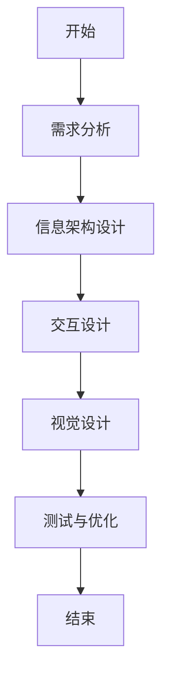

                 


# 用户界面设计

## 关键词
用户界面设计, 用户体验, 交互设计, UI设计原则, 可用性测试, 用户研究, 视觉设计

## 摘要
用户界面设计是人机交互领域的核心学科，旨在通过科学的设计原则和方法，创造高效、易用且美观的用户界面。本文将系统地探讨用户界面设计的基本概念、核心原则、设计方法论、工具与技术，以及实际项目中的应用。通过详细分析用户需求、信息架构设计、交互设计、视觉设计和可用性测试等关键环节，结合实际案例和工具使用，帮助读者全面掌握用户界面设计的精髓。文章还提供了丰富的图表和代码示例，以增强理解。

---

## 第一部分: 用户界面设计概述

### 第1章: 用户界面设计的基本概念

#### 1.1 用户界面设计的定义与背景

用户界面设计（User Interface Design，简称UID）是指通过设计用户与计算机系统或其他产品交互的界面，使其易于使用、功能明确且美观。随着信息技术的快速发展，用户界面设计已成为衡量产品用户体验的重要指标。

**背景介绍：**
- 随着数字化产品的普及，用户与产品之间的交互频率不断增加。
- 用户界面设计的目标是通过优化界面元素，提升用户的使用效率和满意度。
- 用户界面设计不仅仅是图形设计，更是一门结合心理学、人机交互和视觉艺术的综合学科。

#### 1.2 用户界面设计的核心目标

用户界面设计的核心目标是通过科学的设计方法，满足用户的实际需求，同时提升产品的市场竞争力。具体目标包括：
1. **提升用户体验：** 通过优化界面布局和交互流程，使用户能够高效完成任务。
2. **增强用户满意度：** 通过美观的设计和一致的交互风格，提升用户对产品的整体满意度。
3. **优化产品可用性：** 通过降低学习成本和操作复杂度，提高产品的易用性。

#### 1.3 用户界面设计的适用范围

用户界面设计的应用范围非常广泛，主要包括：
1. **软件界面设计：** 包括桌面应用、企业管理系统等。
2. **网站界面设计：** 包括电子商务网站、社交媒体平台等。
3. **移动应用界面设计：** 包括iOS和Android应用的设计。

#### 1.4 用户界面设计的基本原则

用户界面设计需要遵循一些基本的原则，以确保设计的科学性和有效性：
1. **简洁性原则：** �界面上的元素应尽可能简洁，避免冗余信息干扰用户。
2. **易用性原则：** 设计应符合用户的使用习惯，降低学习成本。
3. **可访问性原则：** 确保界面能够被不同能力的用户使用，包括残障人士。

### 第2章: 用户界面设计的核心概念

#### 2.1 用户界面设计的背景与问题背景

用户界面设计的背景与问题背景是理解这一学科的关键。以下是关键点：
- **问题场景介绍：** 用户在使用产品时，可能会遇到操作复杂、界面混乱等问题，导致使用效率低下。
- **领域模型设计：** 通过建立用户角色、任务流程等模型，明确设计的方向和目标。

**领域模型设计示例：**
- 用户角色：普通用户、管理员。
- 任务流程：登录、浏览、下单、支付。

#### 2.2 用户界面设计的核心概念与联系

用户界面设计的核心概念包括用户需求、信息架构、交互设计和视觉设计。通过对比表格和ER图，可以更清晰地理解这些概念之间的关系。

**核心概念对比表格：**

| 概念       | 描述                                                                 |
|------------|----------------------------------------------------------------------|
| 用户需求   | 用户在使用产品时的具体需求和期望                                       |
| 信息架构   | 信息的组织方式，包括导航、标签等                                      |
| 交互设计   | 用户与界面之间的互动流程设计                                          |
| 视觉设计   | 界面的美观性和视觉层次设计                                            |

**ER实体关系图：**
```mermaid
erd
  customer 用户
  order 订单
  product 产品

  用户 --> 订单: 下单
  订单 --> 产品: 购买
```

### 第3章: 用户界面设计的核心原理

#### 3.1 用户界面设计的算法原理

用户界面设计的流程是一个系统的过程，包括需求分析、信息架构设计、交互设计、视觉设计和测试优化。以下是流程图的详细解释：



**需求分析：** 理解用户需求和使用场景，明确设计目标。
**信息架构设计：** 确定信息的组织结构，设计导航和标签。
**交互设计：** 设计用户与界面的互动流程，优化用户体验。
**视觉设计：** 确定界面的视觉风格，包括颜色、字体等。
**测试与优化：** 进行可用性测试，收集反馈并优化设计。

#### 3.2 用户界面设计的数学公式与举例

可用性是衡量用户界面设计的重要指标，其计算公式如下：

$$可用性 = \frac{任务完成度 + 用户满意度}{2}$$

**任务完成度：** 用户在规定时间内完成任务的比例。
**用户满意度：** 用户对界面设计的主观评价。

**举例说明：**
假设任务完成度为80%，用户满意度为85%，则可用性为：
$$可用性 = \frac{80 + 85}{2} = 82.5\%$$

---

## 第四部分: 用户界面设计的优化与提升

### 第9章: 用户界面设计的优化与提升

#### 9.1 用户界面设计的持续优化

用户界面设计是一个持续优化的过程。以下是优化的关键点：
1. **用户研究：** 通过用户测试和反馈，不断优化设计。
2. **A/B测试：** 在不同的用户群体中测试不同的设计方案，选择最优方案。
3. **数据驱动设计：** 通过数据分析，找出用户行为中的痛点，并针对性地优化界面。

#### 9.2 用户界面设计的高级主题

用户界面设计的高级主题包括情感化设计和全球化设计。

**情感化设计：** 通过界面设计激发用户的情感共鸣，提升用户体验。
**全球化设计：** 考虑不同文化背景用户的使用习惯，设计通用的界面。

#### 9.3 用户界面设计的最佳实践

用户界面设计的最佳实践包括：
1. **保持一致性：** 界面元素和交互方式保持一致，减少用户的学习成本。
2. **注重细节：** 从按钮布局到字体选择，每一个细节都可能影响用户体验。
3. **简化流程：** 优化用户操作流程，减少不必要的步骤。

#### 9.4 用户界面设计的注意事项

用户界面设计的注意事项：
1. **避免过度设计：** 过多的功能和元素会增加界面的复杂性，影响用户体验。
2. **考虑移动设备：** 随着移动设备的普及，界面设计需要兼顾不同屏幕尺寸和操作方式。
3. **注重性能优化：** 界面设计不应影响产品的性能，如加载速度和响应时间。

#### 9.5 用户界面设计的拓展阅读

用户界面设计的拓展阅读：
1. **经典书籍：** 《设计心理学》、《用户体验要素》。
2. **在线资源：** 网站设计指南、交互设计博客。
3. **工具推荐：** Figma、Sketch、Adobe XD等设计工具。

---

## 结语

用户界面设计是一门结合科学与艺术的学科，需要设计师具备扎实的设计能力和对用户需求的深刻理解。通过系统地学习和实践，可以设计出高效、易用且美观的界面，为用户提供更好的使用体验。

---

## 作者

作者：AI天才研究院/AI Genius Institute & 禅与计算机程序设计艺术 /Zen And The Art of Computer Programming

