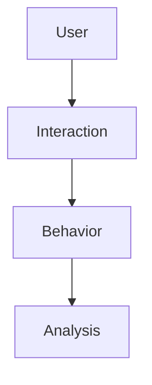
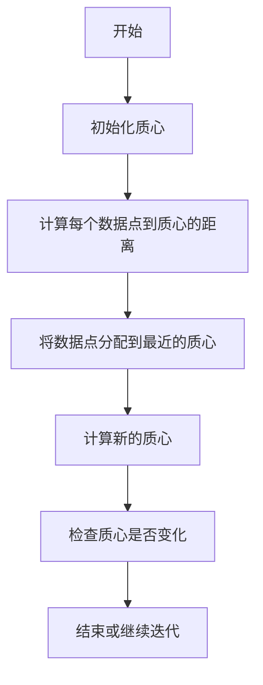
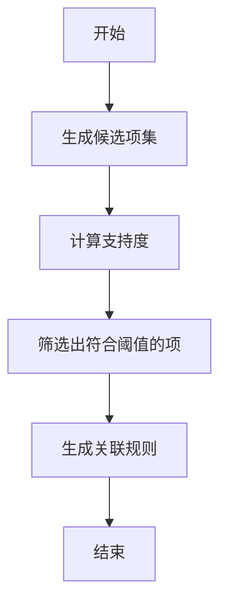
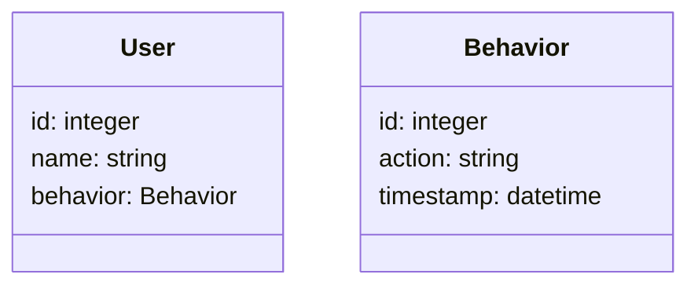
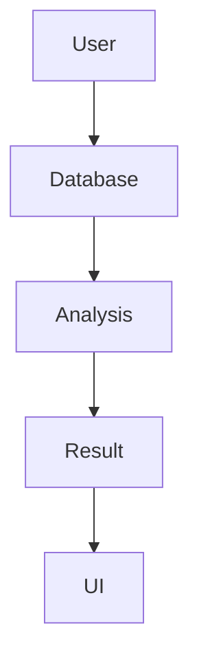
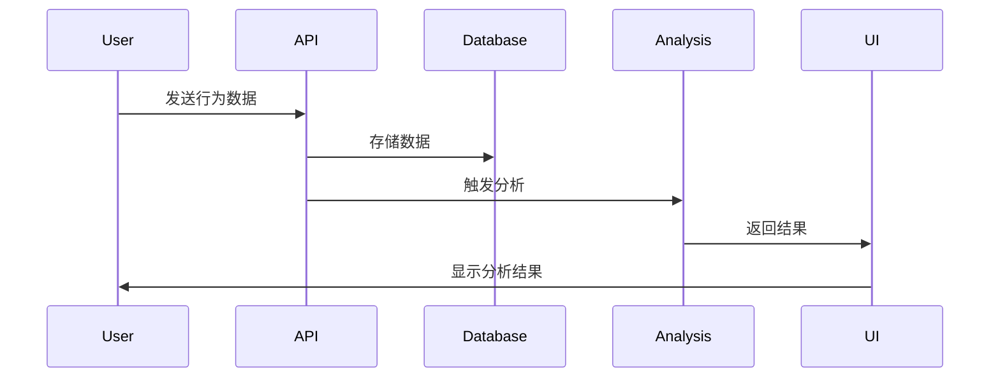

                 


# 用户行为分析

> 关键词：用户行为分析、数据分析、机器学习、用户画像、行为建模、用户路径分析

> 摘要：用户行为分析是理解用户需求、优化产品体验、提升商业决策的重要手段。本文将从用户行为分析的背景、核心概念、算法原理、系统架构到项目实战，全面深入地剖析用户行为分析的各个方面，帮助读者掌握用户行为分析的理论与实践技能。

---

# 第1章: 用户行为分析概述

## 1.1 用户行为分析的定义与背景

### 1.1.1 用户行为分析的定义
用户行为分析是通过对用户在产品或服务中的行为数据进行收集、分析和建模，以理解用户需求、行为模式和行为动机的过程。

### 1.1.2 用户行为分析的背景与重要性
随着互联网和数字化产品的普及，用户行为分析在商业决策、用户体验优化、产品设计等领域发挥着越来越重要的作用。

### 1.1.3 用户行为分析的应用场景
- 电商：分析用户购买行为，优化推荐算法。
- 网站分析：提升网站转化率。
- 移动应用：优化用户体验，提高留存率。

## 1.2 用户行为分析的核心概念

### 1.2.1 用户行为的构成要素
- 行为主体：用户。
- 行为客体：产品或服务。
- 行为时间：用户在什么时间点进行了什么行为。
- 行为环境：用户所处的环境和条件。

### 1.2.2 用户行为分析的流程与方法
1. 数据采集：通过日志、问卷等方式收集用户行为数据。
2. 数据清洗：处理缺失值、异常值等。
3. 数据建模：使用统计学或机器学习方法进行分析。
4. 数据可视化：通过图表展示分析结果。

### 1.2.3 用户行为分析的边界与外延
- 用户行为分析的边界：聚焦于用户与产品或服务的互动。
- 外延：延伸到用户心理、情感和动机的分析。

## 1.3 用户行为分析的工具与技术

### 1.3.1 数据采集工具简介
- Web日志：记录用户在网站上的行为。
- App日志：记录移动应用中的用户行为。
- 问卷调查：通过问卷收集用户反馈。

### 1.3.2 数据分析技术概述
- 统计分析：描述性统计、回归分析。
- 机器学习：聚类、分类、关联规则挖掘。

### 1.3.3 可视化工具的作用
- Tableau：数据可视化工具。
- Power BI：企业级数据可视化工具。
- Matplotlib：Python数据可视化库。

## 1.4 本章小结
本章介绍了用户行为分析的基本概念、流程、工具和技术，为后续章节的深入分析奠定了基础。

---

# 第2章: 用户行为分析的核心概念

## 2.1 用户行为分析的原理

### 2.1.1 用户行为的特征分析
- 用户行为的频率：用户在特定时间的行为次数。
- 用户行为的持续时间：用户在某项行为上花费的时间。
- 用户行为的多样性：用户的多种行为模式。

### 2.1.2 用户行为分析的数学模型
- 用户行为模型的构建：基于用户行为数据，建立数学模型。
- 模型的评估：通过准确率、召回率等指标评估模型效果。

### 2.1.3 用户行为分析的算法原理
- 聚类算法：将用户行为分组。
- 分类算法：预测用户行为类别。

## 2.2 用户行为分析的核心要素

### 2.2.1 用户特征分析
- 用户的基本属性：性别、年龄、职业。
- 用户的行为特征：浏览次数、点击率、转化率。

### 2.2.2 用户行为模式
- 单一行为模式：用户只进行单一类型的行为。
- 组合行为模式：用户进行多种行为的组合。

### 2.2.3 用户行为数据的特征
- 数据的维度：时间、空间、行为类型。
- 数据的特征：连续性、离散性。

## 2.3 用户行为分析的ER实体关系图



## 2.4 本章小结
本章深入分析了用户行为分析的核心概念和原理，通过ER实体关系图展示了用户行为分析的基本结构。

---

# 第3章: 用户行为分析的算法原理

## 3.1 常见的用户行为分析算法

### 3.1.1 聚类算法
- K-means算法：将用户行为分为不同的群组。
- DBSCAN算法：基于密度的聚类算法。

### 3.1.2 分类算法
- logistic回归：预测用户行为类别。
- 支持向量机：分类用户行为。

### 3.1.3 关联规则挖掘
- Apriori算法：挖掘用户行为的关联规则。

## 3.2 聚类算法的实现

### 3.2.1 K-means算法



### 3.2.2 K-means算法的数学模型
$$ \text{目标函数} = \sum_{i=1}^{n} \sum_{j=1}^{k} (x_i - c_j)^2 $$

## 3.3 关联规则挖掘的实现

### 3.3.1 Apriori算法的流程



---

# 第4章: 用户行为分析的系统架构设计

## 4.1 问题场景介绍
- 用户行为分析系统需要处理大规模数据，支持实时分析和离线分析。

## 4.2 系统功能设计

### 4.2.1 领域模型设计


### 4.2.2 系统架构设计



### 4.2.3 系统接口设计
- 数据采集接口：API接口接收用户行为数据。
- 数据分析接口：API接口返回分析结果。

### 4.2.4 系统交互设计



---

# 第5章: 用户行为分析的项目实战

## 5.1 电商用户行为分析案例

### 5.1.1 环境配置
- 数据库：MySQL。
- 分析工具：Python（Pandas、Scikit-learn）。
- 可视化工具：Matplotlib。

### 5.1.2 核心代码实现

```python
import pandas as pd
from sklearn.cluster import KMeans

# 加载数据
data = pd.read_csv('user_behavior.csv')

# 特征工程
features = data[['clicks', 'views', 'purchases']]

# 模型训练
kmeans = KMeans(n_clusters=3, random_state=0)
kmeans.fit(features)

# 预测结果
clusters = kmeans.predict(features)
print(clusters)
```

### 5.1.3 案例分析与结果解读
- 通过聚类分析，识别出不同的用户群体，优化推荐策略。

## 5.2 本章小结
本章通过一个具体的案例，展示了用户行为分析的项目实施过程，包括数据准备、模型训练和结果解读。

---

# 第6章: 总结与展望

## 6.1 本章总结
用户行为分析是理解用户需求、优化产品体验的重要工具，通过数据驱动的方法，帮助企业做出更明智的决策。

## 6.2 未来展望
随着人工智能和大数据技术的发展，用户行为分析将更加智能化和自动化，未来的研究方向包括实时分析、情感分析和行为预测。

## 6.3 最佳实践 tips
- 数据质量是分析的基础，确保数据的完整性和准确性。
- 选择合适的算法和工具，根据实际需求进行调整。
- 结合业务场景，深入理解用户行为背后的心理和动机。

---

# 作者：AI天才研究院 & 禅与计算机程序设计艺术

--- 

希望这篇文章能够为读者提供清晰的思路和深入的分析，帮助读者更好地理解和掌握用户行为分析的核心内容和技术。

