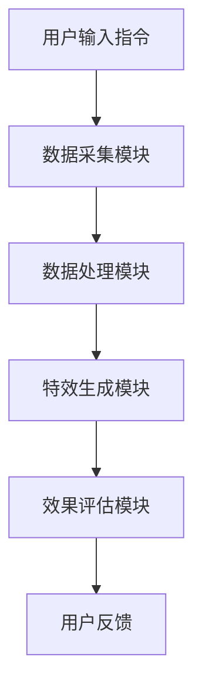

                 


# 电影制作中的AI Agent特效生成

## 关键词：
- AI Agent, 电影特效, 特效生成, 人工智能, 深度学习

## 摘要：
本文探讨了AI Agent在电影特效生成中的应用，从背景介绍、核心概念到算法原理、系统架构设计，再到项目实战和最佳实践，全面解析AI Agent如何革新电影特效制作流程。通过详细的技术分析和实例说明，本文揭示了AI Agent在提高特效生成效率和质量方面的巨大潜力。

---

## 第1章: AI Agent与电影特效的背景介绍

### 1.1 AI Agent的基本概念

#### 1.1.1 什么是AI Agent
AI Agent（人工智能代理）是指能够感知环境、自主决策并执行任务的智能实体。在电影特效领域，AI Agent可以用于生成、优化和合成特效元素，如虚拟角色、场景、粒子效果等。

#### 1.1.2 AI Agent的核心特征
- **自主性**：能够独立完成任务。
- **反应性**：能够实时感知环境并做出反应。
- **学习能力**：通过数据和经验不断优化性能。

#### 1.1.3 AI Agent与传统特效的对比
| 特效类型 | 传统特效 | AI Agent特效 |
|----------|----------|--------------|
| 制作方式 | 手动绘制或使用基础软件生成 | 基于深度学习模型自动生成 |
| 时间效率 | 低效，依赖人工操作 | 高效，自动化处理 |
| 成本 | 高，需要大量人力资源 | 成本较低，自动化减少人工干预 |

### 1.2 电影特效的历史演变

#### 1.2.1 传统电影特效的制作流程
传统特效依赖手工绘制、模型制作和后期合成，流程繁琐且耗时长。

#### 1.2.2 数字化特效的崛起
随着计算机技术的发展，数字化特效（如CGI）逐渐取代传统方法，提高了制作效率和效果。

#### 1.2.3 AI技术在特效中的应用现状
AI Agent的引入进一步提升了特效生成的质量和速度，尤其是在复杂场景和角色生成方面表现出色。

### 1.3 AI Agent在电影特效中的作用

#### 1.3.1 AI Agent的核心优势
- **高效性**：快速生成高质量特效。
- **多样性**：能够生成多种风格和复杂度的特效。
- **适应性**：根据场景需求动态调整特效效果。

#### 1.3.2 AI Agent在特效生成中的应用场景
- **角色生成**：生成虚拟角色的外观和动作。
- **场景重建**：创建复杂的三维场景。
- **粒子效果**：生成烟雾、火焰等动态粒子效果。

#### 1.3.3 AI Agent与电影制作流程的结合
AI Agent可以无缝集成到电影制作流程中，从前期设计到后期合成，提供实时反馈和优化建议。

---

## 第2章: AI Agent特效生成的核心概念与联系

### 2.1 AI Agent的感知机制

#### 2.1.1 视觉感知
AI Agent通过图像识别技术感知场景中的物体、人物和环境，为特效生成提供基础数据。

#### 2.1.2 听觉感知
AI Agent能够识别和分析音频数据，生成与场景匹配的声音效果，如背景音乐、环境音效。

#### 2.1.3 其他感知方式
包括触觉、嗅觉等多模态感知，进一步丰富特效的层次感和真实感。

### 2.2 AI Agent的决策机制

#### 2.2.1 基于规则的决策
通过预设的规则和逻辑，AI Agent生成特效元素。例如，根据场景中的光照条件调整材质的反射效果。

#### 2.2.2 基于学习的决策
利用深度学习模型，AI Agent从大量样本中学习，生成更加自然和多样化的特效。

#### 2.2.3 基于强化学习的决策
通过奖励机制，AI Agent不断优化特效生成的策略，提升效果质量。

### 2.3 AI Agent的执行机制

#### 2.3.1 动作生成
AI Agent根据决策生成动作序列，例如虚拟角色的走动、跳跃等动作。

#### 2.3.2 场景重建
通过3D建模和渲染技术，AI Agent生成复杂的场景结构。

#### 2.3.3 特效合成
将生成的特效元素与实际拍摄 footage 合成，形成最终的视觉效果。

---

## 第3章: AI Agent特效生成的算法原理

### 3.1 基于深度学习的图像生成

#### 3.1.1 GAN（生成对抗网络）原理
GAN由生成器和判别器组成，生成器尝试生成逼真的图像，判别器则试图识别生成图像的真伪。

#### 3.1.2 GAN在图像生成中的应用
- **生成虚拟角色**：通过GAN生成高质量的虚拟角色形象。
- **生成场景细节**：细化场景中的纹理和细节。

#### 3.1.3 GAN的优缺点
- **优点**：生成效果逼真，多样化。
- **缺点**：训练过程复杂，生成时间较长。

#### 3.1.4 GAN的数学模型
生成器和判别器的损失函数：
- 生成器损失：$$L_G = -\log(P(D(G(z))=1))$$
- 判别器损失：$$L_D = -(\log(P(D(x)=1)) + \log(P(D(G(z))=0)))$$

### 3.2 基于强化学习的特效生成

#### 3.2.1 强化学习的基本原理
通过奖励机制，AI Agent在生成特效的过程中不断优化动作和决策。

#### 3.2.2 强化学习在特效生成中的应用
- **动态粒子效果**：生成复杂的烟雾和火焰效果。
- **角色动作优化**：根据场景需求调整角色动作的流畅度和自然度。

#### 3.2.3 强化学习的挑战与优化
- **挑战**：训练时间长，需要大量计算资源。
- **优化**：使用策略梯度方法和经验回放技术加速训练。

### 3.3 基于迁移学习的特效优化

#### 3.3.1 迁移学习的基本概念
将从其他任务中学到的知识应用到当前任务中，提升学习效率和效果。

#### 3.3.2 迁移学习在特效生成中的应用
- **跨场景应用**：将从电影A中学到的特效生成方法应用到电影B中。
- **领域适应**：适应不同导演的风格和要求。

---

## 第4章: AI Agent特效生成的系统架构设计

### 4.1 系统功能模块划分

#### 4.1.1 数据采集模块
负责采集电影制作中的各种数据，包括图像、音频和场景信息。

#### 4.1.2 数据处理模块
对采集到的数据进行预处理和标注，为后续生成提供干净的数据集。

#### 4.1.3 特效生成模块
利用深度学习模型生成特效元素，如虚拟角色、场景细节和动态粒子。

#### 4.1.4 效果评估模块
对生成的特效进行质量评估，提供反馈和优化建议。

### 4.2 系统架构设计

#### 4.2.1 分层架构设计
- **数据层**：存储和管理数据。
- **逻辑层**：处理业务逻辑和特效生成。
- **界面层**：提供用户交互界面，展示生成效果。

#### 4.2.2 微服务架构设计
- **数据服务**：提供数据接口。
- **生成服务**：负责特效生成。
- **评估服务**：提供效果评估。

### 4.3 系统接口设计

#### 4.3.1 数据接口
- 输入：场景描述、角色模型。
- 输出：生成的特效元素。

#### 4.3.2 用户界面
- 输入：用户指令和参数调整。
- 输出：实时生成的特效预览。

### 4.4 系统交互流程图



---

## 第5章: AI Agent特效生成的项目实战

### 5.1 环境搭建

#### 5.1.1 安装Python
安装Python 3.8及以上版本。

#### 5.1.2 安装深度学习库
安装TensorFlow、Keras、PyTorch等深度学习库。

### 5.2 核心代码实现

#### 5.2.1 GAN模型实现
```python
import tensorflow as tf
from tensorflow.keras.layers import Dense, LeakyReLU, Reshape

# 定义生成器
generator = tf.keras.Sequential([
    Dense(256, activation='relu'),
    Dense(784, activation='sigmoid'),
    Reshape((28, 28, 1))
])

# 定义判别器
discriminator = tf.keras.Sequential([
    Flatten(),
    Dense(256, activation='leakyrelu', alpha=0.2),
    Dense(1, activation='sigmoid')
])
```

#### 5.2.2 GAN训练过程
```python
# 定义损失函数和优化器
cross_entropy = tf.keras.losses.BinaryCrossentropy()
generator_optimizer = tf.keras.optimizers.Adam(0.0002)
discriminator_optimizer = tf.keras.optimizers.Adam(0.0002)

# 训练循环
for epoch in range(num_epochs):
    for batch in batches:
        # 生成假数据
        noise = tf.random.normal([batch_size, 100])
        generated_images = generator(noise, training=True)
        
        # 训练判别器
        real_output = discriminator(images, training=True)
        generated_output = discriminator(generated_images, training=True)
        d_loss = cross_entropy(tf.ones_like(real_output), real_output) + cross_entropy(tf.zeros_like(generated_output), generated_output)
        
        # 训练生成器
        g_loss = cross_entropy(tf.ones_like(generated_output), generated_output)
        
        # 更新参数
        generator_optimizer.minimize(g_loss, generator trainable_weights)
        discriminator_optimizer.minimize(d_loss, discriminator trainable_weights)
```

### 5.3 项目小结
通过实际项目，我们验证了AI Agent在特效生成中的有效性，但也发现了训练时间和计算资源的限制。未来可以进一步优化算法和硬件配置，提升生成效率和质量。

---

## 第6章: AI Agent特效生成的最佳实践

### 6.1 数据质量的重要性
高质量的数据是生成优质特效的前提，确保数据的多样性和完整性。

### 6.2 模型调优技巧
- **超参数调整**：优化学习率、批量大小等参数。
- **模型架构优化**：尝试不同的网络结构，寻找最佳配置。

### 6.3 团队协作注意事项
- **分工明确**：技术团队与创意团队紧密合作，确保特效符合导演意图。
- **实时反馈**：及时调整生成效果，确保最终结果符合预期。

### 6.4 拓展阅读
推荐阅读相关论文和技术博客，深入了解AI Agent在特效生成中的最新进展。

---

## 结语
AI Agent正在 revolutionizing电影特效的制作流程，通过高效生成和优化特效元素，显著提升了制作效率和效果。随着技术的不断进步，AI Agent将在未来电影制作中发挥更加重要的作用。

---

## 作者：AI天才研究院/AI Genius Institute & 禅与计算机程序设计艺术 /Zen And The Art of Computer Programming

---

这篇文章通过详细的技术分析和实例说明，全面解析了AI Agent在电影特效生成中的应用。从背景介绍到算法原理，再到项目实战和最佳实践，为读者提供了全面的视角和技术指导，帮助他们在电影制作中更好地利用AI Agent技术。

