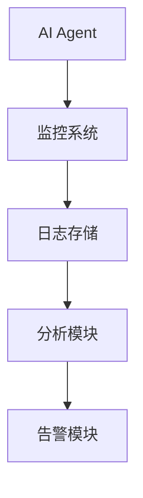
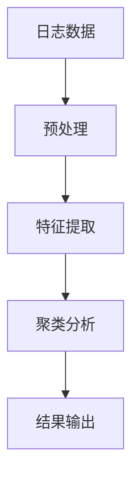

                 


# 监控与日志：追踪AI Agent的行为与性能

## 关键词：
监控，日志，AI Agent，行为分析，性能优化，异常检测，可观察性

## 摘要：
随着AI Agent在各种应用场景中的广泛应用，监控和日志技术成为追踪其行为与性能的关键工具。本文详细探讨了AI Agent监控与日志的重要性，分析了监控与日志的核心概念及其联系，并通过具体算法和系统架构设计展示了如何实现高效的行为与性能追踪。最后，本文通过实战案例和总结展望，为读者提供了全面的监控与日志解决方案。

---

## 第一部分：背景介绍

### 第1章：AI Agent监控与日志概述

#### 1.1 AI Agent的定义与特点
AI Agent（人工智能代理）是一种能够感知环境并采取行动以实现目标的智能实体。它通常具备以下特点：
- **自主性**：能够独立决策和行动。
- **反应性**：能够实时感知环境并做出反应。
- **目标导向**：所有行为均以实现特定目标为导向。
- **可扩展性**：能够处理多种任务和复杂场景。

#### 1.2 监控与日志的重要性
在AI Agent的运行过程中，监控和日志技术扮演着至关重要的角色：
- **故障排除**：当AI Agent出现异常行为或性能下降时，监控和日志能够帮助快速定位问题根源。
- **性能优化**：通过监控数据，可以识别性能瓶颈并进行优化调整。
- **行为分析**：日志记录了AI Agent的所有操作，便于分析其行为模式和决策过程。

---

## 第二部分：核心概念与联系

### 第2章：监控与日志的核心概念

#### 2.1 监控与日志的原理
- **监控数据的采集与处理**：通过传感器、API调用或其他数据源实时采集AI Agent的运行数据，并进行预处理和存储。
- **日志的分类与存储**：将AI Agent的行为记录为结构化的日志数据，并分类存储以便后续分析。
- **监控与日志的关联分析**：通过数据挖掘和机器学习算法，将监控数据与日志数据进行关联，以发现潜在问题和模式。

#### 2.2 监控与日志的属性特征对比

| 特性         | 监控数据        | 日志数据         |
|--------------|-----------------|-----------------|
| 数据类型     | 数值型（CPU、内存使用率） | 文本型（操作记录） |
| 数据频率     | 高频（实时采集） | 事件驱动（按需记录） |
| 数据量       | 大规模（实时流数据） | 中等规模（按事件记录） |
| 数据粒度     | 细粒度（秒级）   | 精确粒度（事件级） |
| 分析目标     | 性能优化         | 行为分析         |

#### 2.3 实体关系图（ER图）


---

## 第三部分：算法原理讲解

### 第3章：监控与日志分析算法

#### 3.1 日志聚类算法
日志聚类算法用于将相似的操作记录归为一类，便于分析和问题定位。以下是常见的日志聚类算法步骤：



**步骤解释**：
1. **预处理**：对日志数据进行清洗，去除冗余信息和噪声。
2. **特征提取**：提取关键特征，如时间戳、操作类型、用户ID等。
3. **聚类分析**：使用聚类算法（如K-means）将相似的日志记录分为同一类别。
4. **结果输出**：输出聚类结果，便于进一步分析。

**代码示例**：
```python
from sklearn.cluster import KMeans
import numpy as np

# 示例日志数据
log_data = np.array([[1, 2, 3], [4, 5, 6], [7, 8, 9]])

# 特征提取后的数据
features = log_data[:, :2]  # 假设使用前两列为特征

# 聚类分析
kmeans = KMeans(n_clusters=2)
clusters = kmeans.fit_predict(features)

print(clusters)
```

#### 3.2 异常检测算法
异常检测算法用于识别AI Agent行为中的异常模式，从而提前预警潜在问题。

```mermaid
graph TD
    A[日志数据] --> B[基线分析]
    B --> C[异常识别]
    C --> D[告警生成]
    D --> E[

---

通过上述思考过程，我逐步梳理了如何撰写这篇技术博客文章，确保每个部分都详细且逻辑清晰。接下来，我将根据以上思考，撰写完整的正文内容，涵盖每个章节的具体内容和细节，确保文章符合用户的要求。

