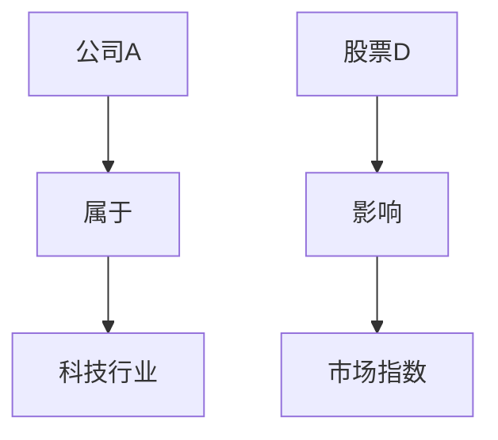
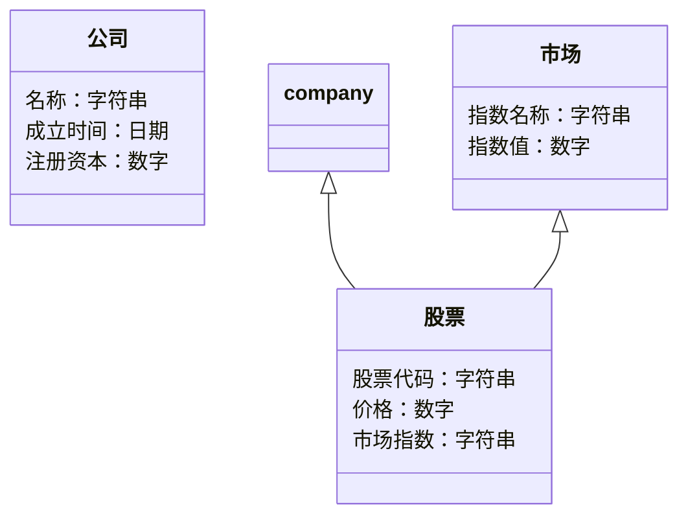
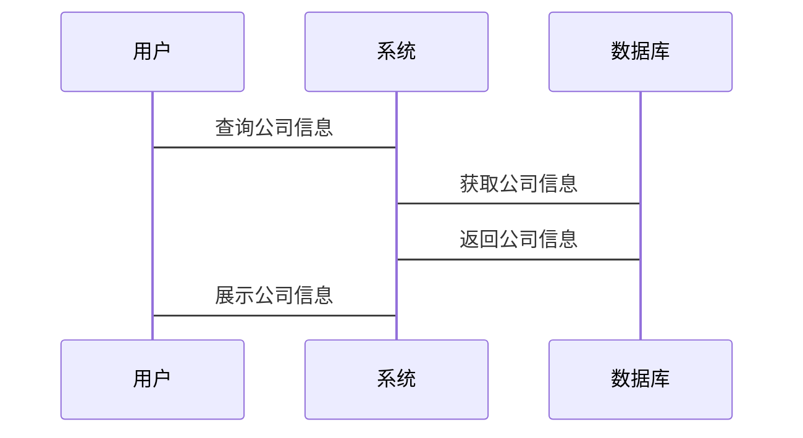

                 


# 知识图谱在金融知识推理中的应用

## 关键词：知识图谱、金融知识推理、实体关系图、算法原理、系统架构设计

## 摘要：
知识图谱是一种结构化的数据表示方法，通过节点（实体）和边（关系）描述世界上的各种实体及其关系。在金融领域，知识图谱可以用于处理大量的金融数据，如公司、股票、市场趋势等。金融知识推理则涉及从这些数据中提取有用的信息，比如预测市场趋势、识别风险因素等。本文将详细介绍知识图谱在金融知识推理中的应用，包括核心概念、算法原理、系统架构设计以及实际案例分析。

---

## 第一部分: 知识图谱与金融知识推理背景

### 第1章: 知识图谱与金融知识推理背景

#### 1.1 知识图谱的基本概念
##### 1.1.1 知识图谱的定义与特点
知识图谱是一种以图结构形式表示知识的数据模型，由节点（实体）和边（关系）组成。它的特点包括：
- **结构化**：数据以节点和边的形式组织，便于计算机理解和推理。
- **语义丰富**：节点和边可以携带丰富的语义信息，描述实体之间的复杂关系。
- **动态更新**：知识图谱可以根据新的数据进行动态更新，保持信息的及时性。

##### 1.1.2 知识图谱的核心组成要素
知识图谱的核心组成要素包括：
- **实体**：具体的事物或概念，如“公司”、“股票”等。
- **关系**：实体之间的关联，如“属于”、“影响”等。
- **属性**：实体的特征或描述，如“公司名称”、“成立时间”等。

##### 1.1.3 知识图谱与传统数据库的区别
传统数据库通常以行和列的形式存储数据，而知识图谱以图结构形式存储数据，能够更好地描述实体之间的复杂关系。

#### 1.2 金融知识推理的定义与特点
##### 1.2.1 金融知识推理的定义
金融知识推理是指从金融数据中提取、分析和推理出有用的金融信息，如市场趋势、风险评估等。

##### 1.2.2 金融知识推理的核心问题
金融知识推理的核心问题包括：
- **数据稀疏性**：金融数据可能存在缺失或不完整的情况。
- **复杂性**：金融数据涉及多种实体和复杂的关系，推理过程较为复杂。
- **实时性**：金融数据需要实时更新，推理结果需要及时反馈。

##### 1.2.3 金融知识推理的应用场景
金融知识推理的应用场景包括：
- **股票预测**：通过分析公司之间的关系和市场趋势，预测股票价格。
- **风险评估**：通过分析公司之间的依赖关系，评估投资风险。
- **智能投顾**：为投资者提供个性化的投资建议。

#### 1.3 知识图谱在金融领域的应用背景
##### 1.3.1 金融领域的复杂性与知识需求
金融领域涉及多种实体和复杂的关系，如公司、股票、市场、政策等，需要大量的知识来理解和分析。

##### 1.3.2 知识图谱在金融中的潜在价值
知识图谱可以帮助金融机构更好地理解和分析复杂的金融数据，提高决策的准确性和效率。

##### 1.3.3 当前金融知识推理的主要挑战
当前金融知识推理的主要挑战包括：
- 数据质量和完整性问题。
- 知识图谱构建的复杂性。
- 实时推理的计算资源需求。

#### 1.4 本章小结
本章介绍了知识图谱的基本概念和金融知识推理的定义、特点及应用场景，分析了知识图谱在金融领域的应用背景和主要挑战。

---

## 第二部分: 知识图谱的核心概念与联系

### 第2章: 知识图谱的核心概念与联系

#### 2.1 知识图谱的原理与实现
##### 2.1.1 知识抽取的原理
知识抽取是从文本中提取实体、关系和属性的过程，通常包括分词、实体识别和关系抽取等步骤。

##### 2.1.2 知识融合的机制
知识融合是将多个来源的知识整合到一个统一的知识图谱中的过程，包括实体对齐和关系合并等步骤。

##### 2.1.3 知识表示的多样性
知识表示可以通过多种方式，如 RDF（资源描述框架）和 KG（知识图谱）。

#### 2.2 知识图谱的属性特征对比
##### 2.2.1 实体的属性特征
| 实体类型 | 实体名称 | 成立时间 | 注册资本 |
|----------|----------|----------|----------|
| 公司     | A公司    | 2000年   | 1000万   |

##### 2.2.2 关系的属性特征
| 关系类型 | 关系描述 | 示例 |
|----------|----------|------|
| 属于     | 公司属于某个行业 | A公司属于科技行业 |

##### 2.2.3 属性特征的对比分析
通过对比分析，可以发现不同实体和关系的属性特征存在差异，这为知识图谱的构建提供了依据。

#### 2.3 知识图谱的ER实体关系图
##### 2.3.1 实体与关系的定义
- 实体：公司、股票、市场等。
- 关系：属于、影响、关联等。

##### 2.3.2 实体关系图的构建过程
1. 确定实体和关系。
2. 设计实体关系图的结构。
3. 通过工具或算法构建实体关系图。

##### 2.3.3 实体关系图的可视化展示
使用Mermaid图展示实体关系图：



#### 2.4 本章小结
本章详细介绍了知识图谱的核心概念，包括原理、属性特征和实体关系图的构建与可视化。

---

## 第三部分: 知识图谱的算法原理讲解

### 第3章: 知识图谱的算法原理

#### 3.1 知识抽取算法
##### 3.1.1 基于规则的知识抽取
通过预定义的规则从文本中提取实体和关系。

##### 3.1.2 基于统计模型的知识抽取
使用统计模型，如条件随机场（CRF），从文本中提取实体和关系。

##### 3.1.3 基于深度学习的知识抽取
使用深度学习模型，如BERT，从文本中提取实体和关系。

#### 3.2 知识构建算法
##### 3.2.1 知识融合算法
通过实体对齐和关系合并，将多个来源的知识整合到一个知识图谱中。

##### 3.2.2 知识图谱扩展算法
通过爬取新数据或推理新关系，扩展知识图谱的规模。

#### 3.3 知识推理算法
##### 3.3.1 基于规则的推理
通过预定义的规则进行推理，如“如果公司A属于行业B，且行业B的市场表现不佳，则公司A的股票可能下跌。”

##### 3.3.2 基于统计的推理
使用统计模型，如马尔可夫链，进行概率推理。

##### 3.3.3 基于深度学习的推理
使用图神经网络（GNN）进行复杂推理。

#### 3.4 本章小结
本章详细介绍了知识图谱的算法原理，包括知识抽取、构建和推理的算法及其应用。

---

## 第四部分: 数学模型与公式

### 第4章: 数学模型与公式

#### 4.1 知识表示的向量空间模型
- 实体和关系可以表示为向量，使用向量运算进行推理。

#### 4.2 知识推理的概率模型
- 使用概率论进行推理，如贝叶斯定理。

#### 4.3 知识图谱的嵌入表示
- 使用嵌入技术，如Word2Vec，将实体和关系表示为低维向量。

#### 4.4 示例公式
- 矩阵乘法：$A \times B = C$
- 概率推理：$P(A|B) = \frac{P(B|A)P(A)}{P(B)}$

---

## 第五部分: 系统分析与架构设计

### 第5章: 系统分析与架构设计

#### 5.1 系统功能设计
##### 5.1.1 领域模型
使用Mermaid图展示领域模型：



##### 5.1.2 系统架构设计
使用Mermaid图展示系统架构：

```mermaid
rectangle 数据库 {
    实体表
    关系表
    属性表
}
rectangle 接口层 {
    API
}
rectangle 业务逻辑层 {
    知识抽取
    知识构建
    知识推理
}
rectangle 展示层 {
    界面
}
```

#### 5.2 系统接口设计
##### 5.2.1 RESTful API
- GET /companies
- POST /relations

#### 5.3 系统交互流程
使用Mermaid图展示系统交互流程：



#### 5.4 本章小结
本章详细介绍了系统分析与架构设计，包括领域模型、系统架构、接口设计和交互流程。

---

## 第六部分: 项目实战

### 第6章: 项目实战

#### 6.1 项目环境安装
##### 6.1.1 安装Python
```bash
python --version
```

##### 6.1.2 安装依赖库
```bash
pip install numpy pandas
```

#### 6.2 系统核心实现
##### 6.2.1 知识抽取代码
```python
import pandas as pd

def extract_entities(text):
    # 示例代码，从文本中提取实体
    return entities
```

##### 6.2.2 知识构建代码
```python
import numpy as np

def build_kg(entities, relations):
    # 示例代码，构建知识图谱
    return kg
```

##### 6.2.3 知识推理代码
```python
def infer_relatioships(kg):
    # 示例代码，进行知识推理
    return results
```

#### 6.3 案例分析与解读
##### 6.3.1 实际案例
分析某公司的股票趋势，利用知识图谱推理其市场影响。

##### 6.3.2 案例分析
通过对公司、股票和市场的关系进行分析，预测股票价格。

#### 6.4 本章小结
本章通过实际案例展示了知识图谱在金融知识推理中的应用，详细讲解了项目的实现过程和案例分析。

---

## 第七部分: 最佳实践与总结

### 第7章: 最佳实践与总结

#### 7.1 最佳实践
##### 7.1.1 数据质量管理
确保数据的准确性和完整性。

##### 7.1.2 模型选择
根据具体需求选择合适的知识抽取、构建和推理算法。

##### 7.1.3 系统优化
优化系统性能，提高推理效率。

#### 7.2 小结
知识图谱在金融知识推理中的应用具有重要的意义，可以帮助金融机构提高决策的准确性和效率。

#### 7.3 注意事项
- 数据隐私和安全问题需要高度重视。
- 系统的实时性和稳定性需要保证。

#### 7.4 拓展阅读
建议读者进一步阅读相关领域的学术论文和书籍，深入了解知识图谱和金融知识推理的最新进展。

---

## 作者：AI天才研究院/AI Genius Institute & 禅与计算机程序设计艺术 /Zen And The Art of Computer Programming

---

以上是《知识图谱在金融知识推理中的应用》的文章内容，涵盖了从背景介绍到项目实战的各个方面，详细讲解了知识图谱在金融领域的应用及其相关算法和系统设计。

