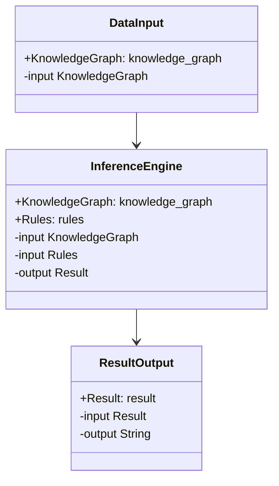
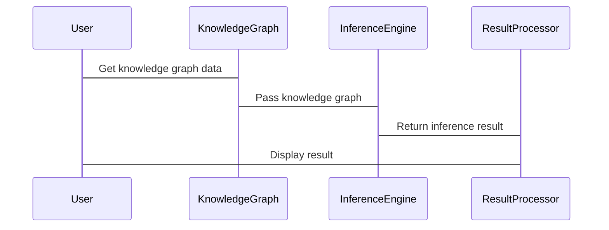

                 


# 知识图谱推理：提升AI Agent的逻辑分析

> 关键词：知识图谱推理、AI Agent、逻辑分析、知识图谱构建、推理算法

> 摘要：知识图谱推理是通过构建和应用知识图谱进行推理，以提升AI Agent的逻辑分析能力。本文从知识图谱的基本概念、推理算法、系统架构设计到项目实战，全面阐述了知识图谱推理的核心原理和应用方法，帮助读者深入理解并掌握这一技术。

---

## 第一部分：知识图谱推理的背景与基础

### 第1章：知识图谱的基本概念

#### 1.1 知识图谱的定义与特点
知识图谱是一种图结构的数据，由节点（实体）和边（关系）组成，能够表示丰富的语义信息。其特点包括结构化、语义丰富、可扩展性强等。

#### 1.2 知识图谱的构建方法
知识图谱的构建包括数据抽取、实体识别、关系抽取等步骤，常用工具包括RDF、OWL等。

#### 1.3 知识图谱的应用场景
知识图谱广泛应用于智能搜索、推荐系统、自然语言处理等领域。

---

### 第2章：知识图谱推理的核心概念

#### 2.1 知识图谱推理的定义与原理
知识图谱推理是基于知识图谱进行推断的过程，用于发现隐含知识或回答复杂问题。

#### 2.2 推理算法的分类
- 基于规则的推理：通过预定义规则进行推断。
- 基于概率的推理：利用概率论进行不确定性推理。
- 基于深度学习的推理：结合神经网络模型进行推理。

#### 2.3 知识图谱推理的评价指标
包括准确率、召回率、F1分数等。

---

## 第二部分：知识图谱推理的算法实现

### 第3章：基于规则的推理算法

#### 3.1 基于规则的推理原理
通过预定义的规则进行推理，例如“如果A是B的父亲，且B是C的父亲，则A是C的祖父”。

#### 3.2 规则表示与推理过程
规则可以表示为逻辑表达式，推理过程包括匹配和应用规则。

#### 3.3 算法实现与代码示例
使用Python编写基于规则的推理算法，示例代码如下：

```python
def rule_based_inference(rules, facts):
    inferred_facts = set()
    for rule in rules:
        antecedent, consequent = rule
        if all(fact in facts for fact in antecedent):
            inferred_facts.add(consequent)
    return inferred_facts
```

---

### 第4章：基于概率的推理算法

#### 4.1 概率推理的原理
基于概率论，计算在给定证据下结论的概率。

#### 4.2 常见概率推理算法
- 贝叶斯网络推理
- 马尔可夫逻辑网络推理

#### 4.3 算法实现与代码示例
使用贝叶斯网络进行推理，示例代码如下：

```python
from pgmpy.inference import VariableElimination

model = BayesianModel(...)

infer = VariableElimination(model)
result = infer.query(variables=['X'], evidence={'Y': y_value})
```

---

### 第5章：基于深度学习的推理算法

#### 5.1 神经符号推理的原理
结合神经网络和符号逻辑，进行端到端的推理。

#### 5.2 常见深度学习推理模型
- Transformer-based推理模型
- 图神经网络推理模型

#### 5.3 算法实现与代码示例
使用图神经网络进行推理，示例代码如下：

```python
import torch
from torch_geometric.nn import GCN

model = GCN(...)
optimizer = torch.optim.Adam(model.parameters(), lr=0.01)
loss = model(...)
```

---

## 第三部分：知识图谱推理的系统架构设计

### 第6章：系统功能设计

#### 6.1 系统功能模块
- 数据输入模块：接收知识图谱数据
- 推理引擎模块：执行推理算法
- 结果输出模块：返回推理结果

#### 6.2 系统功能设计图


---

### 第7章：系统架构设计

#### 7.1 系统架构设计图


#### 7.2 接口设计与交互流程


---

## 第四部分：知识图谱推理的项目实战

### 第8章：项目实战

#### 8.1 环境安装与配置
安装必要的库，如networkx、numpy、scikit-learn等。

#### 8.2 系统核心实现
实现知识图谱推理的核心功能，包括数据输入、推理引擎和结果输出。

#### 8.3 案例分析与解读
通过具体案例分析，展示知识图谱推理的实际应用。

---

## 第五部分：总结与展望

### 第9章：总结与展望

#### 9.1 本章总结
总结知识图谱推理的核心内容和技术实现。

#### 9.2 未来展望
探讨知识图谱推理的未来发展，包括多模态推理、实时推理等方向。

---

## 作者信息

作者：AI天才研究院/AI Genius Institute & 禅与计算机程序设计艺术/Zen And The Art of Computer Programming

---

通过这篇文章，读者可以全面理解知识图谱推理的核心原理和应用方法，掌握提升AI Agent逻辑分析能力的关键技术。

