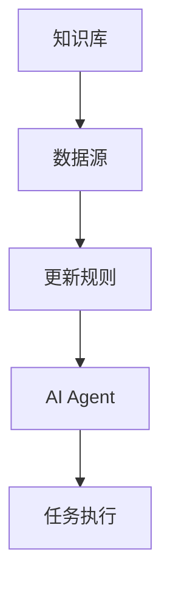
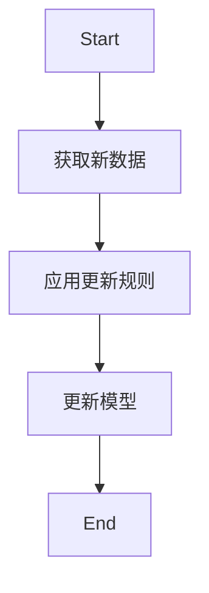
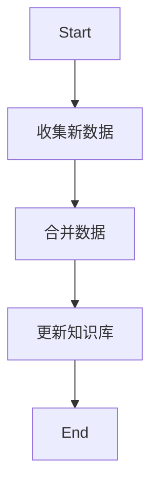
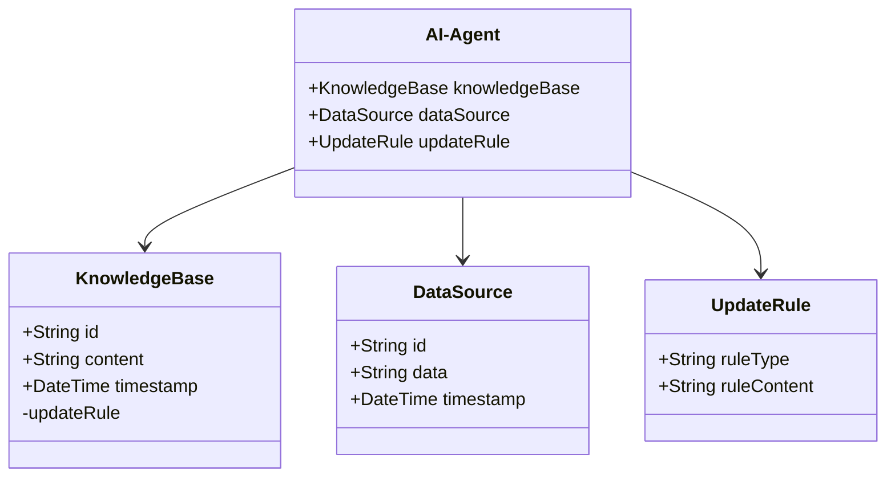
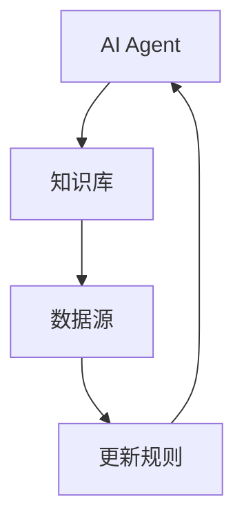
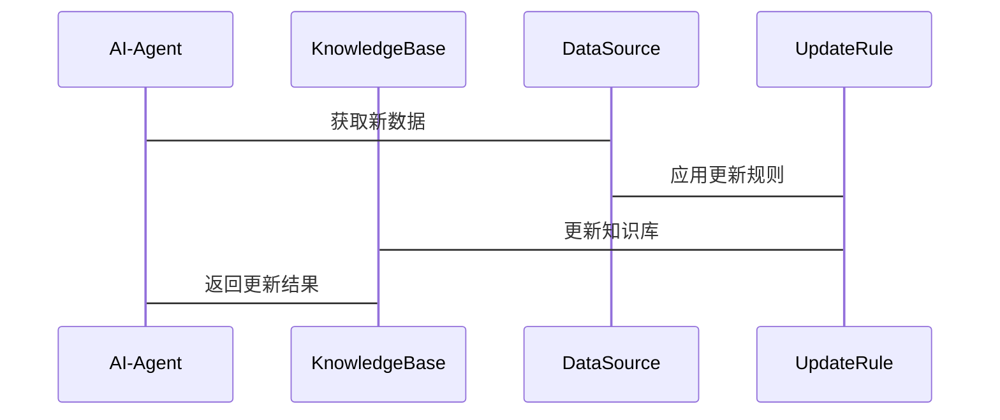

                 


# 知识更新：保持AI Agent信息的时效性

> 关键词：知识更新、AI Agent、信息时效性、增量学习、在线更新、系统架构、数据管理

> 摘要：本文深入探讨了AI Agent知识更新的重要性，分析了保持信息时效性的核心概念、算法原理和系统架构设计，结合实际案例展示了如何实现高效的AI Agent知识更新机制。

---

# 第一部分: 知识更新与AI Agent的背景介绍

## 第1章: 知识更新的核心概念

### 1.1 问题背景与描述

#### 1.1.1 知识更新的必要性  
在动态变化的环境中，AI Agent需要不断适应新信息和新任务。知识更新是确保AI Agent性能和决策能力持续优化的关键。信息过时会导致AI Agent的决策失误，因此，知识更新是维持其高效运作的核心机制。

#### 1.1.2 AI Agent的信息时效性问题  
AI Agent依赖于实时或最新的信息来执行任务。如果信息过时，AI Agent的输出可能不符合当前需求。例如，医疗AI Agent需要最新的医学研究数据来提供准确的诊断建议。

#### 1.1.3 知识更新对AI Agent性能的影响  
知识更新直接影响AI Agent的响应速度、准确性以及用户体验。及时的知识更新能够提升AI Agent的智能化水平，增强其在复杂场景中的适应能力。

### 1.2 问题解决与边界

#### 1.2.1 知识更新的解决方案  
知识更新可以通过增量学习、在线更新或定期批量更新等方式实现。选择哪种方法取决于应用场景、数据量和更新频率。

#### 1.2.2 AI Agent信息时效性的边界与外延  
信息时效性包括数据的新鲜度和准确性。边界在于如何平衡更新频率和计算资源的消耗。外延则涉及数据来源的多样性和数据质量的控制。

#### 1.2.3 知识更新与信息过时的关系  
知识更新旨在解决信息过时的问题。通过定期更新，AI Agent能够避免因信息陈旧而导致的决策失误。

### 1.3 核心概念与组成

#### 1.3.1 知识更新的定义与属性  
知识更新是通过算法和机制，将新信息整合到现有知识库中的过程。其属性包括实时性、准确性、高效性和可扩展性。

#### 1.3.2 AI Agent的信息处理机制  
AI Agent通过感知环境、接收输入、处理信息和执行任务来完成目标。信息处理机制依赖于知识库的更新和维护。

#### 1.3.3 知识更新的核心要素与组成  
知识更新的核心要素包括数据源、更新频率、更新规则和知识库管理。这些要素共同决定了知识更新的效率和效果。

---

## 第2章: 知识更新的核心概念与联系

### 2.1 核心概念原理

#### 2.1.1 知识更新的基本原理  
知识更新是通过算法将新数据整合到现有知识库中，以保持知识的准确性和时效性。例如，增量学习算法能够逐步更新模型参数，以适应新数据。

#### 2.1.2 AI Agent的信息处理流程  
AI Agent的信息处理流程包括数据采集、预处理、知识更新、推理和决策。知识更新是其中的关键步骤，确保AI Agent能够基于最新的信息做出决策。

#### 2.1.3 知识更新与信息时效性的关系  
知识更新是保持信息时效性的核心机制。通过定期更新知识库，AI Agent能够始终基于最新的信息做出决策。

### 2.2 概念属性特征对比

#### 2.2.1 知识更新的属性对比表  
| 属性       | 描述                                   |
|------------|--------------------------------------|
| 实时性     | 更新频率的快慢                       |
| 准确性     | 更新数据的正确性                     |
| 高效性     | 更新所需资源的多少                 |
| 可扩展性   | 更新能力是否支持大规模数据         |

#### 2.2.2 AI Agent信息处理的特征对比  
| 特征       | 描述                                   |
|------------|--------------------------------------|
| 数据源     | 数据的来源是否多样                   |
| 更新频率   | 更新的频率高低                       |
| 数据质量   | 数据的准确性和完整性               |

### 2.3 ER实体关系图



---

## 第3章: 知识更新的算法原理

### 3.1 算法原理讲解

#### 3.1.1 增量式更新算法

##### 原理描述  
增量式更新算法通过逐步更新模型参数，适应新数据的变化。其优点是计算资源消耗较低，适用于实时更新场景。

##### 算法流程图  


#### 3.1.2 全量式更新算法

##### 原理描述  
全量式更新算法在每个更新周期内，将所有新数据一次性整合到知识库中。其优点是能够保证知识库的准确性和一致性。

##### 算法流程图  


### 3.2 数学模型与公式

#### 3.2.1 知识更新的概率模型  
在概率模型中，知识更新可以通过贝叶斯定理来实现。公式如下：

$$ P(new\ state | old\ state, data) = \frac{P(data | new\ state, old\ state) \cdot P(new\ state | old\ state)}{P(data)} $$

#### 3.2.2 更新规则的数学表达  
增量式更新的数学表达式为：

$$ \theta_{new} = \theta_{old} + \alpha (x - \theta_{old}) $$

其中，$\alpha$ 是学习率，$x$ 是新数据点。

### 3.3 实例分析

#### 3.3.1 增量式更新案例  
假设有一个AI Agent需要预测股票价格。每当收盘价公布后，增量式更新算法会调整预测模型的参数，以反映最新的市场趋势。

#### 3.3.2 全量式更新案例  
在医疗领域，AI Agent需要定期更新疾病诊断的知识库。全量式更新算法会在每个周期结束时，整合所有新诊断案例和研究成果。

---

## 第4章: 系统分析与架构设计

### 4.1 项目介绍

#### 4.1.1 项目背景  
本项目旨在设计一个支持知识更新的AI Agent系统，用于实时更新医疗诊断知识库。

#### 4.1.2 项目目标  
通过增量式和全量式更新机制，确保AI Agent的知识库始终包含最新的医学研究和诊断指南。

### 4.2 系统功能设计

#### 4.2.1 领域模型  


#### 4.2.2 系统架构设计  


#### 4.2.3 接口设计  
- 数据源接口：提供新数据的获取方法。
- 知识库接口：提供知识库的读写和更新方法。
- 更新规则接口：提供更新规则的定义和执行方法。

#### 4.2.4 系统交互  


---

## 第5章: 项目实战

### 5.1 环境安装

#### 5.1.1 安装依赖  
安装Python和必要的库，例如numpy、pandas、scikit-learn。

#### 5.1.2 安装步骤  
```bash
pip install numpy pandas scikit-learn
```

### 5.2 核心代码实现

#### 5.2.1 知识更新实现  
```python
def incremental_update(old_model, new_data, alpha=0.1):
    # 更新模型参数
    updated_params = old_model + alpha * (new_data - old_model)
    return updated_params
```

#### 5.2.2 知识库管理  
```python
class KnowledgeBase:
    def __init__(self):
        self.data = {}
    
    def update_knowledge(self, new_data):
        # 假设new_data是一个字典
        self.data.update(new_data)
```

### 5.3 案例分析与总结

#### 5.3.1 案例分析  
在医疗诊断场景中，AI Agent通过增量式更新算法，实时更新疾病诊断指南和新研究成果，确保诊断的准确性。

#### 5.3.2 总结  
知识更新是保持AI Agent高效运作的关键。通过合理的算法设计和系统架构，可以实现高效的知识更新，提升AI Agent的性能和用户体验。

---

## 第6章: 最佳实践与注意事项

### 6.1 最佳实践

#### 6.1.1 确定更新频率  
根据应用场景，选择合适的更新频率。实时性要求高的场景适合增量式更新，而对数据一致性和准确性要求高的场景适合全量式更新。

#### 6.1.2 数据质量管理  
确保数据来源的多样性和数据质量，避免因数据问题导致的知识更新失败。

### 6.2 注意事项

#### 6.2.1 资源消耗  
知识更新可能会增加计算资源的消耗，需要在更新频率和资源消耗之间找到平衡。

#### 6.2.2 更新规则设计  
更新规则的设计直接影响知识更新的效果。需要根据具体场景，设计合适的更新规则。

---

## 第7章: 小结与拓展阅读

### 7.1 小结  
知识更新是保持AI Agent信息时效性的核心机制。通过增量式和全量式更新算法，结合合理的系统架构设计，可以实现高效的AI Agent知识更新。

### 7.2 拓展阅读  
- 建议阅读《机器学习实战》和《深度学习》等相关书籍，深入了解知识更新的具体实现方法。
- 关注最新的研究成果，探索更高效的AI Agent知识更新方法。

---

作者：AI天才研究院/AI Genius Institute & 禅与计算机程序设计艺术 /Zen And The Art of Computer Programming

