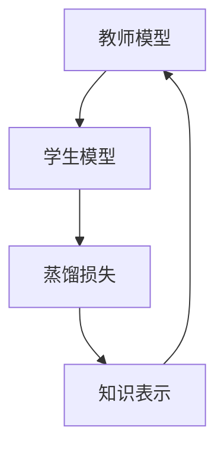
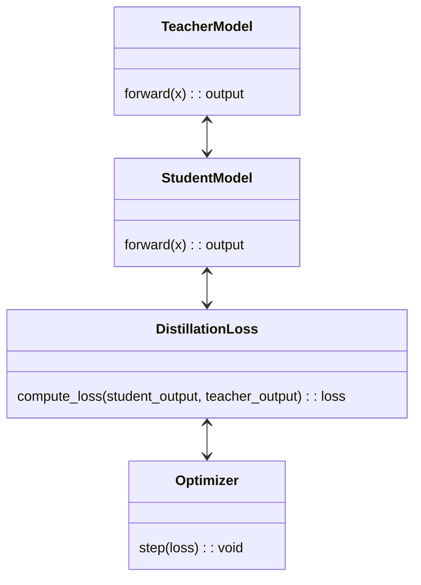
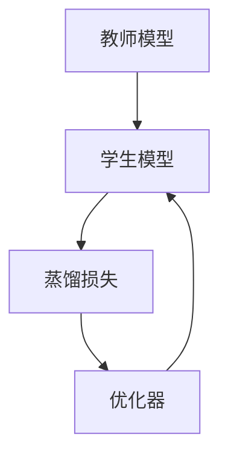
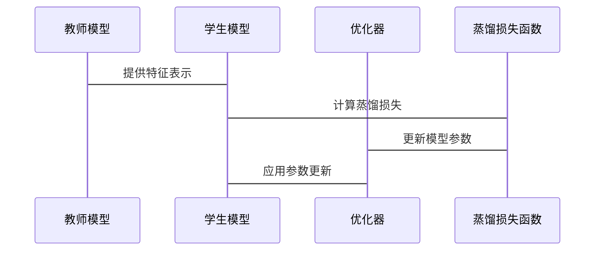

                 


# 知识蒸馏技术在AI Agent轻量化中的创新应用

## 关键词
知识蒸馏技术，AI Agent，模型轻量化，人工智能，深度学习

## 摘要
知识蒸馏技术是一种有效的模型压缩方法，通过将复杂模型的知识迁移到简单模型中，实现模型的轻量化。本文从AI Agent的角度出发，探讨知识蒸馏技术在轻量化中的创新应用，涵盖背景介绍、核心概念、算法原理、系统架构、项目实战及最佳实践等多个方面，帮助读者全面理解和掌握知识蒸馏技术在AI Agent中的应用。

## 第1章: 知识蒸馏技术与AI Agent概述

### 1.1 知识蒸馏技术的基本概念
知识蒸馏技术是一种将复杂模型的知识迁移到简单模型的技术，旨在在保持性能的同时减少模型的大小和计算成本。

### 1.2 AI Agent的定义与特点
AI Agent是一种能够感知环境、自主决策并执行任务的智能体，具有智能性、反应性、主动性、社会性和社会性等特征。

### 1.3 知识蒸馏在AI Agent中的应用价值
知识蒸馏技术在AI Agent中的应用可以显著降低模型的计算资源消耗，提升模型的部署效率和运行性能。

## 第2章: 知识蒸馏的核心概念与原理

### 2.1 知识蒸馏的原理与过程
知识蒸馏通过教师模型和学生模型的协作，将教师模型的深层知识迁移到学生模型中，实现模型的轻量化。

### 2.2 知识蒸馏的核心概念对比
通过对比知识蒸馏与迁移学习、小样本学习和模型压缩，分析其在AI Agent中的应用优势。

### 2.3 知识蒸馏的实体关系图


## 第3章: 知识蒸馏的算法原理

### 3.1 知识蒸馏的数学模型
通过公式推导，详细讲解知识蒸馏的数学模型，包括损失函数的构建和优化过程。

### 3.2 知识蒸馏的算法流程


### 3.3 知识蒸馏的Python实现
```python
import torch
import torch.nn as nn
import torch.optim as optim

class TeacherModel(nn.Module):
    def __init__(self):
        super(TeacherModel, self).__init__()
        self.fc = nn.Linear(10, 2)

class StudentModel(nn.Module):
    def __init__(self):
        super(StudentModel, self).__init__()
        self.fc = nn.Linear(10, 2)

def distillation_loss(student_logits, teacher_logits, temperature):
    student_probs = F.softmax(student_logits / temperature, dim=1)
    teacher_probs = F.softmax(teacher_logits / temperature, dim=1)
    loss = -torch.sum(teacher_probs * torch.log(student_probs))
    return loss

teacher_model = TeacherModel()
student_model = StudentModel()
optimizer = optim.SGD(student_model.parameters(), lr=0.01)
criterion = nn.CrossEntropyLoss()
distillation_loss = DistillationLoss(temperature=10)

for epoch in range(num_epochs):
    student_model.train()
    optimizer.zero_grad()
    outputs = student_model(images)
    with torch.no_grad():
        teacher_outputs = teacher_model(images)
    loss = distillation_loss(outputs, teacher_outputs)
    loss.backward()
    optimizer.step()
```

## 第4章: 系统分析与架构设计

### 4.1 系统功能设计
通过领域模型类图展示系统功能模块的构成和交互关系。



### 4.2 系统架构设计
通过架构图展示系统的整体架构和模块之间的依赖关系。



### 4.3 系统接口设计
详细描述系统中各模块之间的接口及其功能。

### 4.4 系统交互流程图
展示系统在知识蒸馏过程中的交互流程。



## 第5章: 项目实战

### 5.1 环境搭建
介绍如何搭建知识蒸馏项目的开发环境，包括安装必要的库和工具。

### 5.2 核心代码实现
详细讲解知识蒸馏的核心代码实现，包括教师模型、学生模型和蒸馏损失函数的定义。

### 5.3 代码解读与分析
通过代码示例分析知识蒸馏算法的具体实现细节和优化技巧。

### 5.4 实际案例分析
通过实际案例分析知识蒸馏技术在AI Agent中的应用效果和性能提升。

## 第6章: 最佳实践、小结、注意事项和拓展阅读

### 6.1 最佳实践
总结在实际应用中使用知识蒸馏技术的最佳实践，包括模型选择、参数调优和性能评估等方面。

### 6.2 小结
对全文进行总结，重申知识蒸馏技术在AI Agent轻量化中的创新应用及其重要性。

### 6.3 注意事项
提醒读者在实际应用中需要注意的事项，避免常见误区和问题。

### 6.4 拓展阅读
推荐相关的书籍和论文，供读者进一步深入学习和研究。

## 作者：AI天才研究院 & 禅与计算机程序设计艺术

---

以上是《知识蒸馏技术在AI Agent轻量化中的创新应用》的目录大纲，涵盖了从基础概念到实际应用的各个方面。

