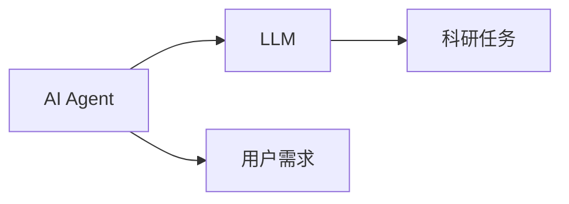
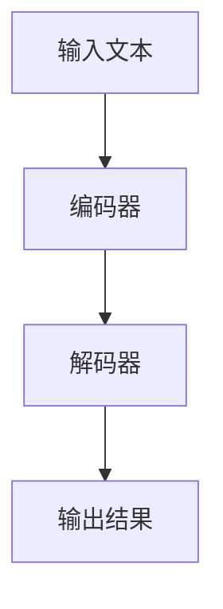
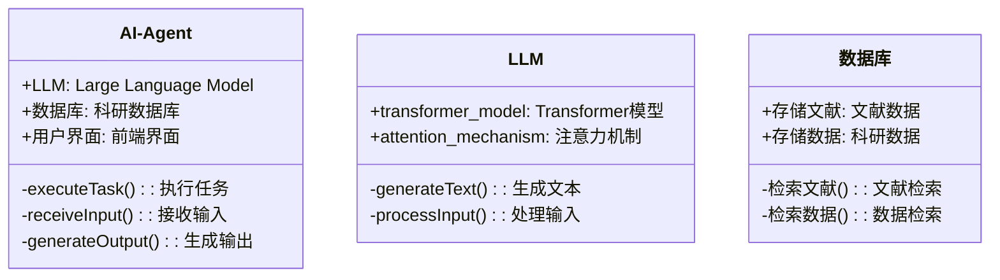
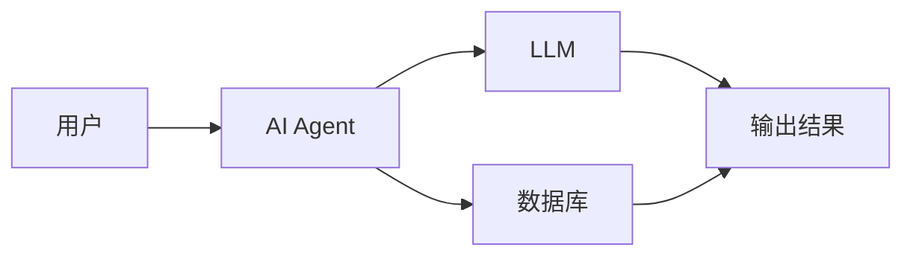

                 


# 研发助手 AI Agent：LLM 在科研过程中的辅助作用

> 关键词：AI Agent，LLM，科研辅助，大语言模型，人工智能，科研过程

> 摘要：本文探讨了大语言模型（LLM）在科研过程中的辅助作用，分析了AI Agent在科研中的具体应用场景，包括文献分析、数据分析、论文写作等。通过详细讲解LLM的算法原理和系统架构，结合实际案例，展示了AI Agent如何帮助科研人员提高效率和创新。本文适合研究人员、开发者和对人工智能感兴趣的读者阅读。

---

# 第一部分: 研发助手 AI Agent 的背景与概念

## 第1章: AI Agent 与 LLM 的基本概念

### 1.1 AI Agent 的定义与特点

#### 1.1.1 AI Agent 的定义
AI Agent（人工智能代理）是一种能够感知环境并采取行动以实现目标的智能体。它通常通过接收输入信息、处理数据、生成输出结果来完成特定任务。AI Agent 的核心目标是为用户提供智能化的辅助工具，帮助用户完成复杂任务。

#### 1.1.2 AI Agent 的核心特点
- **自主性**：AI Agent 能够自主决策，无需人工干预。
- **反应性**：能够实时感知环境变化并做出响应。
- **目标导向**：所有行动都是为了实现特定目标。
- **学习能力**：通过数据和经验不断优化自身性能。

#### 1.1.3 AI Agent 与传统 AI 的区别
| 特性         | AI Agent                     | 传统 AI                       |
|--------------|----------------------------|----------------------------|
| 行为模式      | 主动执行任务                 | 被动执行任务                 |
| 适应性       | 具备较强环境适应能力         | 环境适应能力有限             |
| 应用场景      | 多领域，如科研、医疗、金融等 | 限于特定领域                 |

### 1.2 大语言模型（LLM）的基本原理

#### 1.2.1 LLM 的基本概念
大语言模型（Large Language Model, LLM）是一种基于深度学习的自然语言处理模型，能够理解和生成人类语言。其核心是通过大量数据训练的Transformer架构。

#### 1.2.2 LLM 的核心算法
- **Transformer 模型**：由编码器和解码器组成，编码器负责将输入文本转换为向量表示，解码器负责根据向量生成输出文本。
- **注意力机制**：通过计算输入文本中每个词的重要性，聚焦关键信息。

#### 1.2.3 LLM 的优势与局限性
| 优势         | 局限性                       |
|--------------|----------------------------|
| 强大的语言理解能力 | 需要大量计算资源             |
| 多任务处理能力 | 可能存在偏见或错误             |
| 高效的生成能力 | 对小样本数据表现不佳         |

## 第2章: LLM 在科研中的作用

### 2.1 科研过程中的关键环节

#### 2.1.1 文献检索与综述
科研的第一步是文献检索与综述。传统方法需要手动筛选文献，效率低且容易遗漏关键信息。LLM可以通过自然语言处理技术快速筛选文献，生成综述报告。

#### 2.1.2 数据分析与处理
科研过程中需要处理大量数据，LLM可以帮助研究人员快速分析数据、生成可视化图表，并提供数据建模建议。

#### 2.1.3 知识整合与创新
LLM可以整合多领域的知识，帮助研究人员发现新的研究方向，提出创新性的假设和方法。

### 2.2 LLM 在科研中的具体应用

#### 2.2.1 文献分析与总结
LLM可以通过阅读大量文献，提取关键词、主题和主要结论，生成文献综述报告。

#### 2.2.2 数据建模与预测
LLM可以协助研究人员建立数学模型，预测实验结果，并提供优化建议。

#### 2.2.3 论文写作与润色
LLM可以帮助研究人员生成论文大纲，撰写初稿，并提供语法和逻辑优化建议。

## 第3章: AI Agent 的核心概念与联系

### 3.1 核心概念原理

#### 3.1.1 LLM 的基本原理
LLM通过Transformer架构和注意力机制实现自然语言处理任务。其数学模型如下：
$$
\text{输出} = \text{解码器}(\text{编码器}(输入))
$$

#### 3.1.2 AI Agent 的任务分解
AI Agent将科研任务分解为多个子任务，每个子任务由LLM或其他工具完成。

### 3.2 核心概念对比表格

| 特性         | AI Agent                     | LLM                       |
|--------------|----------------------------|----------------------------|
| 核心功能      | 执行复杂任务                 | 处理自然语言             |
| 依赖技术      | Transformer架构               | 无                       |
| 应用场景      | 多领域                      | 自然语言处理             |

### 3.3 实体关系图


---

# 第二部分: LLM 的算法原理与数学模型

## 第4章: LLM 的算法原理

### 4.1 LLM 的核心算法

#### 4.1.1 Transformer 模型
Transformer模型由编码器和解码器组成。编码器将输入序列转换为向量表示，解码器根据向量生成输出序列。

#### 4.1.2 注意力机制
注意力机制通过计算输入序列中每个词的重要性，聚焦关键信息。其数学公式如下：
$$
\text{注意力权重} = \text{softmax}(\frac{QK^T}{\sqrt{d}})
$$

#### 4.1.3 编码与解码过程
编码器和解码器通过堆叠多层变换层来提取和生成信息。

### 4.2 算法流程图


### 4.3 Python 实现示例

```python
import torch

def transformer_model(input_text):
    # 编码器部分
    encoder_input = input_text
    encoder_output = encoder(encoder_input)
    # 解码器部分
    decoder_input = encoder_output
    decoder_output = decoder(decoder_input)
    return decoder_output
```

---

# 第三部分: 系统分析与架构设计方案

## 第5章: 系统分析与架构设计方案

### 5.1 问题场景介绍
科研人员需要一个高效的工具来辅助文献检索、数据分析和论文写作。AI Agent可以通过整合LLM和其他工具，提供端到端的解决方案。

### 5.2 系统功能设计

#### 5.2.1 领域模型设计


### 5.3 系统架构设计

#### 5.3.1 系统架构图


---

# 第四部分: 项目实战

## 第6章: 项目实战

### 6.1 环境安装

```bash
pip install torch transformers
```

### 6.2 系统核心实现源代码

```python
import torch
from transformers import AutoTokenizer, AutoModelForSeq2SeqLM

class AIAssistant:
    def __init__(self):
        self.tokenizer = AutoTokenizer.from_pretrained("facebook/pattnar")
        self.model = AutoModelForSeq2SeqLM.from_pretrained("facebook/pattnar")

    def analyze_paper(self, input_text):
        inputs = self.tokenizer(input_text, return_tensors="pt")
        outputs = self.model.generate(inputs.input_ids, max_length=500)
        return self.tokenizer.decode(outputs[0], skip_special_tokens=True)
```

### 6.3 代码应用解读与分析
上述代码展示了AI Assistant的实现，通过LLM模型对输入文本进行分析和生成。

### 6.4 实际案例分析和详细讲解剖析
以文献分析为例，AI Agent可以通过输入文献内容，生成文献综述报告。

### 6.5 项目小结
通过实际案例，展示了AI Agent在科研中的强大能力。

---

# 第五部分: 最佳实践与总结

## 第7章: 最佳实践 tips、小结、注意事项、拓展阅读

### 7.1 最佳实践 tips
- **数据质量**：确保输入数据的准确性和完整性。
- **模型选择**：根据任务需求选择合适的LLM模型。
- **持续优化**：定期更新模型和优化系统架构。

### 7.2 小结
本文详细介绍了AI Agent和LLM在科研中的应用，展示了其在文献分析、数据分析和论文写作中的巨大潜力。

### 7.3 注意事项
- **隐私问题**：注意保护科研数据的隐私性。
- **计算资源**：合理配置计算资源，确保系统高效运行。

### 7.4 拓展阅读
- 推荐阅读《Large Language Models in Research》。

---

作者：AI天才研究院/AI Genius Institute & 禅与计算机程序设计艺术 /Zen And The Art of Computer Programming

