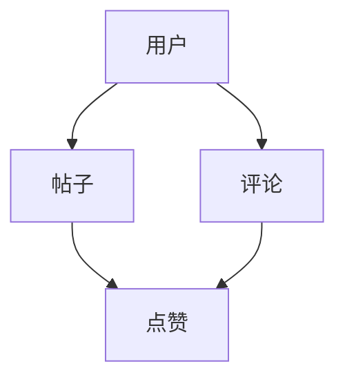
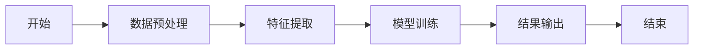
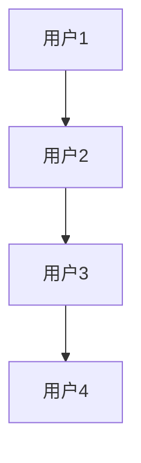
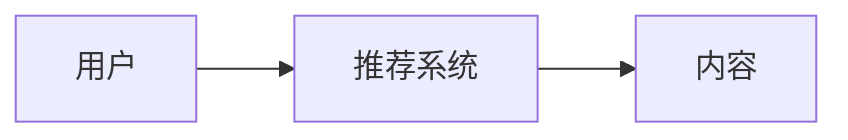
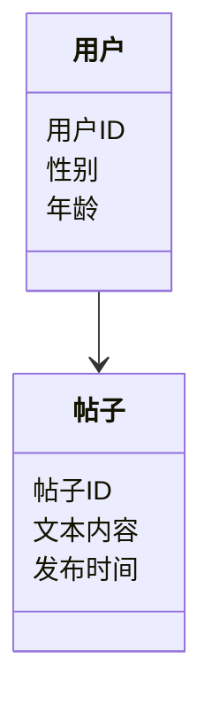
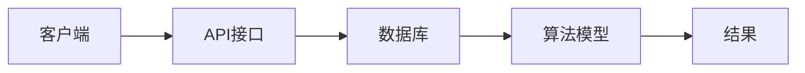

                 


# 社交媒体数据的利用

> 关键词：社交媒体数据，数据挖掘，情感分析，推荐系统，数据可视化，数据隐私

> 摘要：社交媒体数据作为当今互联网的重要组成部分，具有多样性、实时性和关联性等特点。本文将从社交媒体数据的基本概念出发，深入探讨其应用场景、处理流程、核心算法及实际案例，帮助读者全面理解并有效利用社交媒体数据。

---

## 第1章 社交媒体数据的背景与重要性

### 1.1 社交媒体数据的基本概念

#### 1.1.1 数据定义
社交媒体数据是指在社交平台上生成的所有类型的数据，包括文本、图片、视频、点赞、评论、转发等。这些数据反映了用户的社交行为、兴趣偏好和情感态度。

#### 1.1.2 数据特征
- **多样性**：社交媒体数据涵盖多种数据类型，如文本、图片、视频等。
- **实时性**：数据生成和传播的速度极快，用户行为实时更新。
- **关联性**：数据之间存在复杂的关联关系，例如用户与用户之间的互动、内容与用户的关系等。

#### 1.1.3 数据重要性
社交媒体数据为用户行为分析、情感挖掘、社交网络分析和内容推荐提供了丰富的信息，帮助企业进行精准营销和决策优化。

### 1.2 应用场景

#### 1.2.1 用户行为分析
通过分析用户的点赞、评论、转发等行为，挖掘用户的兴趣偏好和消费习惯。

#### 1.2.2 社交网络分析
研究用户之间的关系网络，识别关键用户（意见领袖）和社区结构。

#### 1.2.3 内容推荐系统
基于用户的社交行为和偏好，推荐个性化的内容，提升用户粘性和活跃度。

### 1.3 挑战与机遇

#### 1.3.1 数据隐私问题
如何在合法合规的前提下采集和使用数据，是社交媒体数据利用中的重要挑战。

#### 1.3.2 数据规模与处理难度
社交媒体数据量庞大，对存储和计算能力提出了较高要求。

#### 1.3.3 技术进步带来的机会
人工智能和大数据技术的进步为社交媒体数据的深度挖掘提供了有力支持。

---

## 第2章 社交媒体数据的核心概念与处理流程

### 2.1 数据特征分析

#### 2.1.1 数据特征对比表格
| 特征 | 描述 |
|------|------|
| 多样性 | 数据类型丰富，包括文本、图片、视频等 |
| 实时性 | 数据生成和更新速度快 |
| 关联性 | 数据之间存在复杂的关联关系 |

#### 2.1.2 数据实体关系图


### 2.2 数据分类

#### 2.2.1 用户数据
- 用户ID、昵称、性别、年龄、地理位置等。

#### 2.2.2 内容数据
- 文本、图片、视频、链接等。

#### 2.2.3 行为数据
- 点赞、评论、转发、关注等。

### 2.3 数据处理流程

#### 2.3.1 数据采集
- 使用API接口或网络爬虫获取社交媒体数据。

#### 2.3.2 数据清洗
- 去除重复数据、处理缺失值、消除噪声。

#### 2.3.3 数据分析
- 使用数据挖掘算法进行分析和建模。

---

## 第3章 文本挖掘与情感分析

### 3.1 文本挖掘的基本原理

#### 3.1.1 分词与词干提取
- 中文分词：使用jieba库对文本进行分词。
- 词干提取：去除词缀，保留词干。

#### 3.1.2 词袋模型与词嵌入
- 词袋模型：将文本表示为词频向量。
- 词嵌入：使用Word2Vec等模型生成词向量。

#### 3.1.3 文本相似度计算
- 使用余弦相似度或欧氏距离计算文本相似度。

### 3.2 情感分析算法

#### 3.2.1 机器学习情感分析
- 特征提取：使用TF-IDF提取文本特征。
- 模型训练：使用SVM或逻辑回归进行分类。

#### 3.2.2 深度学习情感分析
- 使用LSTM或Transformer模型进行情感分类。

#### 3.2.3 实现代码
```python
from sklearn.feature_extraction.text import TfidfVectorizer
from sklearn.svm import SVC

# 数据预处理
def preprocess(text):
    return text.lower()

# 特征提取
vectorizer = TfidfVectorizer()
X = vectorizer.fit_transform(corpus)

# 模型训练
model = SVC()
model.fit(X, labels)

# 预测
test_text = ["I love this"]
test_vec = vectorizer.transform([preprocess(test_text[0])])
print(model.predict(test_vec))
```

### 3.3 算法流程图


---

## 第4章 社交网络分析

### 4.1 图论基础

#### 4.1.1 图的基本概念
- 节点：用户或内容。
- 边：用户之间的互动行为。

#### 4.1.2 常见算法
- PageRank：计算节点的重要性。
- 社区检测：识别社交网络中的社区结构。

### 4.2 社交网络结构图


### 4.3 分析结果
- 关键用户识别：找到影响力最大的节点。
- 社区划分：将用户划分为不同的兴趣群体。

---

## 第5章 内容推荐系统

### 5.1 协同过滤

#### 5.1.1 基于用户的协同过滤
- 找出与目标用户兴趣相似的用户，推荐他们喜欢的内容。

#### 5.1.2 基于物品的协同过滤
- 找出与目标内容相似的物品，推荐给用户。

### 5.2 矩阵分解

#### 5.2.1 SVD分解
- 将用户-物品评分矩阵分解为用户因子和物品因子。

#### 5.2.2 实现代码
```python
from surprise import SVD
from surprise.dataset import Dataset
from surprise.model_selection import train_test_split

# 数据加载
data = Dataset.load_from_file('rating.csv', format='csv')

# 数据分割
trainset, testset = train_test_split(data, test_size=0.2)

# 模型训练
model = SVD()
model.fit(trainset)

# 预测与评估
test预测结果 = model.predict(testset)
print(test预测结果)
```

### 5.3 推荐系统架构图


---

## 第6章 数据可视化与仪表盘设计

### 6.1 数据可视化工具
- Tableau、Power BI、D3.js等工具。

### 6.2 数据可视化案例
- 用户行为分布图：展示用户活跃时间。
- 情感分析词云：显示文本中的高频情感词汇。

### 6.3 仪表盘设计
- 实时数据更新：展示最新用户行为和情感趋势。
- 多维度分析：支持按时间、地区、兴趣进行筛选。

---

## 第7章 系统架构与技术选型

### 7.1 系统功能设计

#### 7.1.1 领域模型


#### 7.1.2 系统架构图


### 7.2 技术选型

#### 7.2.1 开发工具
- 前端：React、Vue.js
- 后端：Python、Django
- 数据库：MySQL、MongoDB

#### 7.2.2 接口设计
- RESTful API：定义清晰的接口规范。

#### 7.2.3 交互设计
- 使用序列图描述用户与系统之间的交互流程。

---

## 第8章 项目实战

### 8.1 环境安装
- 安装Python、Jupyter Notebook、Pandas、Matplotlib等工具。

### 8.2 核心实现

#### 8.2.1 数据采集
```python
import requests
from bs4 import BeautifulSoup

url = 'https://example.com'
response = requests.get(url)
soup = BeautifulSoup(response.text, 'html.parser')
posts = soup.find_all('div', class_='post')
```

#### 8.2.2 数据分析
```python
import pandas as pd
import matplotlib.pyplot as plt

df = pd.DataFrame(posts)
df['发布时间'].value_counts().plot(kind='bar')
plt.show()
```

### 8.3 案例分析
- 某社交平台用户行为分析：发现用户的活跃时间集中在晚上8点至10点。

---

## 第9章 总结

### 9.1 核心内容回顾
- 社交媒体数据的背景与重要性
- 核心算法与实现
- 项目实战与最佳实践

### 9.2 建议与注意事项
- 数据隐私保护是重中之重。
- 选择合适的工具和技术，避免过度复杂化系统。

### 9.3 拓展阅读
- 《大数据分析与应用》
- 《自然语言处理实战》

---

## 作者：AI天才研究院/AI Genius Institute & 禅与计算机程序设计艺术/Zen And The Art of Computer Programming

---

希望这篇文章能够帮助读者全面了解社交媒体数据的利用，并能够在实际项目中加以应用。

