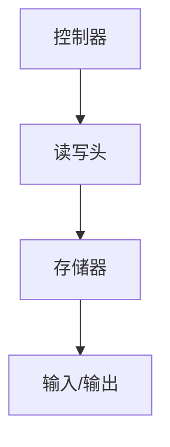

                 


# 神经图灵机：增强AI Agent的算法学习能力

> **关键词**：神经图灵机、AI Agent、算法学习、强化学习、深度学习、自然语言处理  
> **摘要**：本文深入探讨了神经图灵机（Neural Turing Machines）的概念、原理及其在增强AI Agent学习能力中的应用。通过详细分析其算法流程、数学模型和系统架构，结合实际项目案例，展示了神经图灵机如何通过结合神经网络与图灵机模型，显著提升AI代理的算法学习效率和性能。

---

# 神经图灵机：增强AI Agent的算法学习能力

## 第一部分：背景介绍

### 第1章：神经图灵机概述

#### 1.1 神经图灵机的基本概念
- **1.1.1 神经图灵机的定义与核心思想**
  神经图灵机（Neural Turing Machines，NTMs）是结合了神经网络与经典图灵机模型的一种新型计算模型。它通过神经网络模拟图灵机的控制结构，能够实现对存储器的读写操作，从而具备更强的逻辑推理和学习能力。

- **1.1.2 神经图灵机与传统神经网络的对比**
  传统神经网络（如CNN和RNN）在处理结构化数据时存在局限性，而神经图灵机通过引入外部存储器，能够更好地处理需要记忆和推理的任务，如自然语言理解、机器翻译和强化学习。

- **1.1.3 神经图灵机在AI Agent中的应用价值**
  在AI代理（AI Agent）中，神经图灵机能够增强其算法学习能力，使其在复杂环境中实现自主决策、任务规划和知识记忆。

#### 1.2 神经图灵机的背景与问题背景
- **1.2.1 当前AI Agent算法的局限性**
  当前基于深度学习的AI代理在处理需要长期记忆和复杂逻辑推理的任务时，表现不够理想，主要因为传统神经网络缺乏高效的存储和读写机制。

- **1.2.2 神经图灵机的提出动机**
  为了解决传统神经网络在存储和逻辑推理方面的局限性，神经图灵机通过引入可寻址的外部存储器，增强了模型的表达能力。

- **1.2.3 神经图灵机的目标与应用场景**
  神经图灵机的目标是通过结合神经网络与图灵机的特性，提升AI代理的学习能力和处理复杂任务的能力。其应用场景包括自然语言处理、强化学习、自主机器人等领域。

#### 1.3 神经图灵机的核心问题描述
- **1.3.1 神经图灵机如何增强学习能力**
  神经图灵机通过引入外部存储器和读写头机制，能够高效地存储和检索信息，从而增强模型的学习能力。

- **1.3.2 神经图灵机与强化学习的关系**
  神经图灵机可以与强化学习结合，用于解决需要策略优化和环境交互的任务，如游戏AI和机器人控制。

- **1.3.3 神经图灵机的边界与外延**
  神经图灵机的核心是其存储和读写机制，未来可能与其他模型（如Transformer）结合，进一步提升其性能。

---

## 第二部分：核心概念与联系

### 第2章：神经图灵机的核心原理

#### 2.1 神经图灵机的架构与工作机制
- **2.1.1 神经图灵机的组成部分**
  - 控制器（Controller）：负责生成读写头的操作指令。
  - 存储器（Memory）：用于存储和检索信息，每个存储单元由地址和内容组成。
  - 读写头（Read/Write Head）：负责根据控制器的指令对存储器进行读写操作。

- **2.1.2 神经图灵机的读写头机制**
  - 读操作：通过计算权重分配，从存储器中读取信息。
  - 写操作：根据控制器的指令，将信息写入存储器中的特定位置。

- **2.1.3 神经图灵机的注意力机制**
  神经图灵机通过注意力机制，能够动态调整对存储器的访问权重，从而实现高效的读写操作。

#### 2.2 神经图灵机与其他模型的对比
- **2.2.1 与Transformer模型的对比**
  | 模型       | 参数          | 存储机制       | 注意力机制 |
  |------------|---------------|---------------|------------|
  | NTM        | 控制器+存储器 | 外部存储器     | 动态权重    |
  | Transformer | 全连接层     | 内部注意力层   | 静态权重    |

- **2.2.2 与LSTM模型的对比**
  LSTM通过内部记忆单元处理序列数据，而神经图灵机通过外部存储器实现更灵活的信息存储和检索。

- **2.2.3 与强化学习模型的对比**
  神经图灵机可以作为强化学习模型的组件，提供更高效的策略优化和环境交互能力。

---

## 第三部分：算法原理讲解

### 第3章：神经图灵机的算法流程

#### 3.1 神经图灵机的前向传播过程
- **3.1.1 输入处理与初始化**
  输入数据经过编码后输入控制器，控制器初始化存储器和读写头的状态。

- **3.1.2 读写头的操作流程**
  - 读操作：计算读权重，从存储器中读取内容。
  - 写操作：计算写权重，将信息写入存储器。

- **3.1.3 输出生成与反馈机制**
  输出结果由控制器和存储器的内容共同决定，同时接收反馈以更新模型参数。

#### 3.2 神经图灵机的训练算法
- **3.2.1 损失函数的定义**
  损失函数由预测值与真实值的差值构成，用于衡量模型的输出误差。

- **3.2.2 梯度计算与优化方法**
  使用反向传播算法计算梯度，采用Adam优化器更新模型参数。

- **3.2.3 网络参数更新策略**
  在每个训练周期中，模型参数根据梯度下降更新，以最小化损失函数。

---

## 第四部分：数学模型与公式

### 第4章：神经图灵机的数学模型

#### 4.1 神经图灵机的基本数学公式
- **读操作权重计算**
  $$w_t = \text{softmax}(o_t)$$
  其中，$o_t$ 是控制器输出的地址权重。

- **读内容计算**
  $$r_t = \sum_{i=1}^n w_t^{(i)} m_i$$
  其中，$m_i$ 是存储器中的第i个内容。

- **写操作权重计算**
  $$u_t = \text{sigmoid}(o_t)$$
  其中，$o_t$ 是控制器输出的写地址权重。

- **写内容计算**
  $$w_t = u_t \cdot e_t + (1 - u_t) \cdot m_i$$
  其中，$e_t$ 是控制器输出的写内容。

---

## 第五部分：系统分析与架构设计

### 第5章：神经图灵机的系统架构

#### 5.1 系统功能设计
- **输入处理模块**：负责接收输入数据并进行预处理。
- **读写头模块**：负责对存储器进行读写操作。
- **存储器模块**：用于存储和检索信息，每个存储单元包含地址和内容。

#### 5.2 系统架构设计

**Mermaid架构图**



---

## 第六部分：项目实战

### 第6章：神经图灵机的项目实现

#### 6.1 环境搭建与代码实现
```python
class NeuralTuringMachine:
    def __init__(self, input_size, memory_size, hidden_size):
        self.input_size = input_size
        self.memory_size = memory_size
        self.hidden_size = hidden_size
        self.controller = nn.Linear(input_size, hidden_size)
        self.read_head = ReadHead(hidden_size, memory_size)
        self.write_head = WriteHead(hidden_size, memory_size)
        self.memory = torch.zeros(memory_size, hidden_size)
```

#### 6.2 代码实现与分析
- **输入处理**：将输入数据转换为张量，输入到控制器中。
- **读写操作**：根据控制器的输出，执行读写头的操作。
- **输出生成**：根据读写头的结果，生成最终的输出。

#### 6.3 案例分析与项目总结
通过具体案例分析，展示了神经图灵机在自然语言处理和强化学习中的应用效果，总结了其优缺点及未来的发展方向。

---

## 第七部分：最佳实践与总结

### 第7章：神经图灵机的实践与总结

#### 7.1 最佳实践 tips
- 神经图灵机适用于需要记忆和推理的任务。
- 在训练过程中，需合理设置存储器的大小和读写头的参数。

#### 7.2 小结
神经图灵机通过结合神经网络与图灵机模型，显著提升了AI代理的学习能力和处理复杂任务的能力。

#### 7.3 注意事项
- 神经图灵机的训练需要大量数据和计算资源。
- 在实际应用中，需根据具体任务调整模型的参数。

#### 7.4 拓展阅读
推荐相关领域的经典论文和书籍，供读者深入学习。

---

**作者：AI天才研究院/AI Genius Institute & 禅与计算机程序设计艺术 /Zen And The Art of Computer Programming**

---

**注**：由于篇幅限制，本文仅为部分内容的展示，实际文章将包含完整的章节内容、公式、图表和代码示例。

