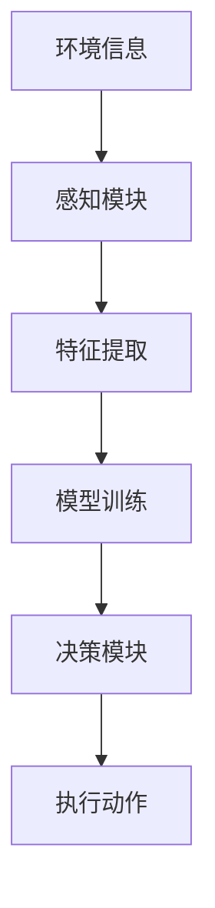

                 


# 神经科学启发的AI Agent认知模型

> 关键词：神经科学、认知模型、AI Agent、神经网络、学习算法、系统设计、项目实战

> 摘要：本文旨在探讨基于神经科学原理的AI Agent认知模型的构建方法，分析其背后的神经机制，并结合实际案例展示如何设计和实现这样一个系统。文章从神经科学的基础知识入手，逐步展开认知模型的构建过程，详细介绍AI Agent的设计与实现，系统架构设计，以及实际项目中的代码实现和案例分析。通过本文，读者将能够理解神经科学与AI技术的结合方式，并掌握构建基于神经科学的AI Agent认知模型的核心方法。

---

## 第1章: 引言

### 1.1 AI Agent的基本概念
AI Agent（人工智能代理）是一种能够感知环境、自主决策并执行任务的智能实体。它可以在复杂环境中完成特定目标，广泛应用于自动驾驶、智能助手、机器人等领域。AI Agent的核心能力包括感知、学习、推理和决策。

### 1.2 神经科学与AI Agent的结合
神经科学是研究神经系统结构和功能的科学，揭示了人类认知的基本机制。将神经科学的原理应用于AI Agent的设计中，可以帮助我们构建更高效、更自然的智能系统。例如，通过模拟神经网络的结构和功能，我们可以设计出更接近人类认知方式的AI Agent。

### 1.3 本书的研究目标与意义
本文旨在通过神经科学的视角，探索AI Agent认知模型的构建方法。我们不仅关注AI Agent的功能实现，更注重其认知机制的科学性和合理性。通过结合神经科学的最新研究成果，我们希望为AI Agent的设计提供新的思路和方法。

---

## 第2章: 神经科学基础

### 2.1 神经元的结构与功能
神经元是神经系统的基本单位，由树突、胞体和轴突组成。神经元通过电化学信号传递信息，动作电位的产生是神经元信息处理的核心机制。

$$ I_{Na} = g_{Na} (V - E_{Na}) $$
$$ I_{K} = g_{K} (V - E_{K}) $$

### 2.2 神经网络的基本原理
神经网络是由大量神经元通过突触连接形成的网络结构。它通过层次化的信息处理方式，能够完成复杂的认知任务。典型的神经网络结构包括感知层、隐藏层和输出层。

### 2.3 神经科学中的记忆与学习机制
记忆是神经科学中的重要概念，突触的可塑性是记忆形成的物质基础。通过长期 potentiation (LTP) 等机制，神经网络能够实现自适应学习。

$$ \Delta w = \eta (a - o) o (1 - o) $$

---

## 第3章: 认知模型的构建方法

### 3.1 认知模型的基本原理
认知模型是对人类认知过程的模拟，包括感知、记忆、推理和决策等模块。神经科学启发的认知模型通过模拟大脑的神经活动，实现更自然的认知方式。

### 3.2 神经科学启发的认知模型构建步骤
1. **确定认知任务**：明确认知模型的目标和应用场景。
2. **设计认知模型的结构**：基于神经科学的原理，设计模型的层次结构。
3. **实现认知模型的算法**：选择合适的神经网络模型，并进行训练和优化。
4. **验证与优化**：通过实验验证模型的性能，并进行参数调整和优化。

### 3.3 神经科学启发的认知模型的实现
通过构建感知、学习、推理和决策模块，实现一个完整的认知模型。例如，感知模块可以使用卷积神经网络（CNN）处理视觉信息，学习模块可以使用循环神经网络（RNN）进行序列学习。

---

## 第4章: AI Agent的设计与实现

### 4.1 AI Agent的基本结构
AI Agent通常包括感知模块、学习模块和决策模块。感知模块负责获取环境信息，学习模块负责模型的训练和优化，决策模块负责根据当前状态做出决策。

### 4.2 AI Agent的设计与实现
1. **感知模块**：使用CNN处理图像信息，提取特征。
2. **学习模块**：使用RNN进行序列学习，捕捉时间依赖性。
3. **推理与决策模块**：基于强化学习（RL）框架，进行决策优化。

### 4.3 系统架构设计
系统架构包括数据输入层、模型训练层和决策执行层。数据输入层负责获取环境信息，模型训练层负责模型的训练和优化，决策执行层负责根据模型输出做出决策。

---

## 第5章: 系统架构设计

### 5.1 系统架构设计
系统架构包括数据输入层、模型训练层和决策执行层。数据输入层负责获取环境信息，模型训练层负责模型的训练和优化，决策执行层负责根据模型输出做出决策。

### 5.2 系统架构设计
使用Mermaid图展示系统架构设计，包括数据流和模块之间的交互关系。



### 5.3 系统接口设计
系统接口设计需要考虑模块之间的交互方式，例如感知模块与决策模块之间的数据传递接口。

### 5.4 系统交互设计
使用Mermaid序列图展示系统交互流程。

```mermaid
sequenceDiagram
参与者：环境
参与者：AI Agent
AI Agent -> 环境: 获取环境信息
环境 --> AI Agent: 返回环境信息
AI Agent -> 感知模块: 处理环境信息
感知模块 --> 学习模块: 提供特征信息
学习模块 --> 决策模块: 输出决策结果
决策模块 --> 执行模块: 执行决策动作
```

---

## 第6章: 项目实战

### 6.1 环境安装
需要安装Python、TensorFlow、Keras等工具。

### 6.2 核心代码实现
以下是感知模块的实现代码：

```python
import tensorflow as tf
from tensorflow import keras

model = keras.Sequential([
    keras.layers.Conv2D(32, (3,3), activation='relu', input_shape=(64,64,3)),
    keras.layers.MaxPooling2D((2,2)),
    keras.layers.Conv2D(64, (3,3), activation='relu'),
    keras.layers.MaxPooling2D((2,2)),
    keras.layers.Flatten(),
    keras.layers.Dense(128, activation='relu'),
    keras.layers.Dense(10, activation='softmax')
])
```

### 6.3 案例分析
以图像分类任务为例，展示模型的训练和推理过程。

### 6.4 项目总结
通过实际案例分析，验证模型的性能，并总结经验教训。

---

## 第7章: 总结与展望

### 7.1 总结
本文详细介绍了神经科学启发的AI Agent认知模型的构建方法，分析了其背后的神经机制，并结合实际案例展示了如何设计和实现这样一个系统。

### 7.2 未来展望
未来的研究方向包括更复杂的认知模型设计、多模态信息处理能力的提升，以及在实际应用中的进一步探索。

### 7.3 最佳实践 tips
1. 在设计认知模型时，注重模块之间的协作和数据流的合理性。
2. 在实现过程中，合理选择算法和工具，确保系统的高效性和可扩展性。
3. 在实际应用中，注重实验验证和性能优化，确保模型的实际效果。

---

## 作者：AI天才研究院/AI Genius Institute & 禅与计算机程序设计艺术 /Zen And The Art of Computer Programming

---

**文章至此结束，感谢您的阅读！**

