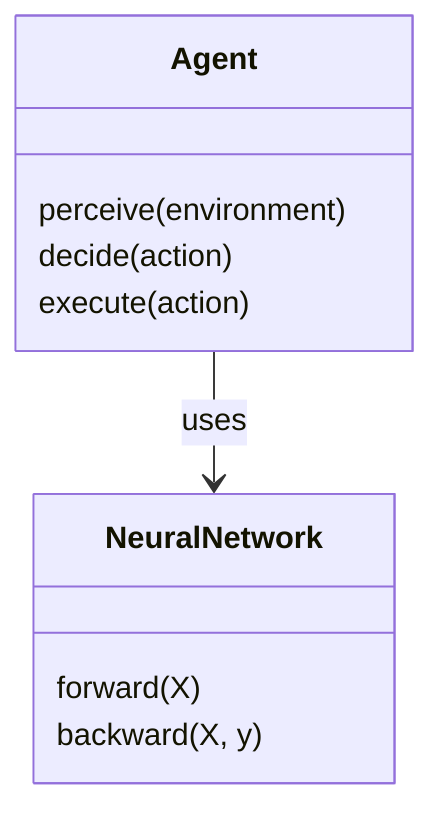
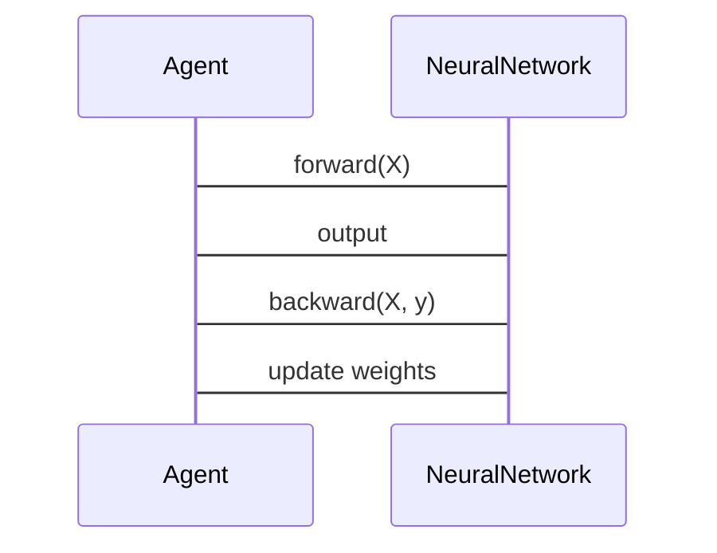

                 


# 神经科学启发的AI Agent认知模型设计

> 关键词：神经科学，AI Agent，认知模型，神经网络，机器学习，深度学习，系统设计

> 摘要：本文探讨了基于神经科学原理设计AI Agent认知模型的方法，结合神经网络和机器学习技术，详细分析了神经科学中的认知模型、AI Agent的基本原理、算法实现、系统架构设计以及实际项目案例，最后总结了设计要点和未来发展方向。

---

## 第1章 神经科学与AI Agent认知模型的背景介绍

### 1.1 神经科学的基本概念

神经科学是研究神经系统结构和功能的科学，主要关注大脑如何处理信息、记忆和学习。神经元是神经系统的基本单位，通过电化学信号传递信息。

### 1.2 AI Agent的基本概念

AI Agent是一种智能实体，能够感知环境并采取行动以实现目标。AI Agent可以分为简单反射型、基于模型的反应型、目标驱动型和效用驱动型。

### 1.3 神经科学启发AI Agent的必要性

通过模拟神经科学的原理，AI Agent可以更自然地处理复杂任务，如模式识别和决策-making。

---

## 第2章 神经科学中的认知模型

### 2.1 神经元模型

- **生物神经元**：由树突、胞体和轴突组成，传递电信号。
- **数学模型**：如霍金森方程描述神经元的电活动。

### 2.2 神经网络模型

- **层次结构**：包括输入层、隐藏层和输出层。
- **训练过程**：使用反向传播算法和梯度下降优化。

### 2.3 神经科学中的记忆模型

- **长期记忆**：通过突触可塑性实现。
- **短期记忆**：通过神经元之间的临时连接实现。

---

## 第3章 AI Agent中的认知模型

### 3.1 AI Agent的认知结构

- **感知层**：处理输入数据。
- **决策层**：基于感知做出决策。
- **执行层**：执行决策并反馈结果。

### 3.2 知识表示

- **符号表示**：使用符号逻辑表示知识。
- **连接表示**：通过神经网络表示知识。

### 3.3 推理机制

- **逻辑推理**：基于符号逻辑进行推理。
- **概率推理**：基于概率模型进行推理。

---

## 第4章 神经科学与AI Agent认知模型的结合

### 4.1 神经网络在AI Agent中的应用

- **模式识别**：使用卷积神经网络识别模式。
- **自然语言处理**：使用循环神经网络处理文本。

### 4.2 神经科学启发的算法

- **深度学习**：模拟大脑的多层处理机制。
- **强化学习**：通过奖励机制优化决策。

---

## 第5章 神经科学启发的AI Agent认知模型算法实现

### 5.1 算法原理

- **反向传播**：通过链式法则计算梯度。
- **梯度下降**：优化模型参数。

### 5.2 算法实现

```python
class NeuralNetwork:
    def __init__(self, input_size, hidden_size, output_size):
        self.W1 = np.random.randn(input_size, hidden_size)
        self.b1 = np.zeros((1, hidden_size))
        self.W2 = np.random.randn(hidden_size, output_size)
        self.b2 = np.zeros((1, output_size))

    def forward(self, X):
        self.z1 = np.dot(X, self.W1) + self.b1
        self.a1 = np.tanh(self.z1)
        self.z2 = np.dot(self.a1, self.W2) + self.b2
        self.a2 = np.sigmoid(self.z2)
        return self.a2

    def backward(self, X, y, learning_rate):
        m = X.shape[0]
        delta2 = (self.a2 - y) * self.a2 * (1 - self.a2)
        dW2 = (1/m) * np.dot(self.a1.T, delta2)
        db2 = (1/m) * np.sum(delta2, axis=0)
        delta1 = delta2.dot(self.W2.T) * (1 - self.a1**2)
        dW1 = (1/m) * np.dot(X.T, delta1)
        db1 = (1/m) * np.sum(delta1, axis=0)
        self.W2 -= learning_rate * dW2
        self.b2 -= learning_rate * db2
        self.W1 -= learning_rate * dW1
        self.b1 -= learning_rate * db1
```

---

## 第6章 系统分析与架构设计

### 6.1 问题场景介绍

设计一个基于神经科学的AI Agent，用于图像识别任务。

### 6.2 系统功能设计

- **输入处理**：接收图像数据。
- **特征提取**：使用卷积神经网络提取特征。
- **分类决策**：基于特征进行分类。

### 6.3 系统架构设计



### 6.4 接口设计

- **输入接口**：接收图像数据。
- **输出接口**：返回分类结果。

### 6.5 交互序列图



---

## 第7章 项目实战

### 7.1 环境安装

安装必要的库，如TensorFlow和Keras。

### 7.2 系统核心实现

实现一个简单的神经网络用于图像分类。

### 7.3 案例分析

训练神经网络识别手写数字。

---

## 第8章 总结与展望

### 8.1 本章总结

总结了神经科学启发的AI Agent认知模型的设计过程和关键点。

### 8.2 未来展望

探讨了未来的发展方向，如更复杂的神经网络架构和更高效的学习算法。

---

## 小结与注意事项

- **小结**：神经科学启发的AI Agent认知模型设计需要结合神经科学原理和机器学习技术，通过合理的系统架构和算法设计实现高性能的AI Agent。
- **注意事项**：在实际应用中，需注意数据质量和模型的泛化能力，避免过拟合和欠拟合问题。

---

作者：AI天才研究院 & 禅与计算机程序设计艺术

