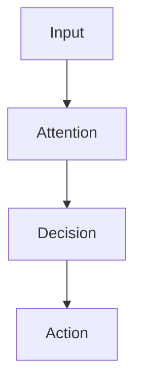

                 


# 神经科学启发的注意力机制在AI Agent中的实现

> 关键词：注意力机制，神经科学，AI Agent，自注意力模型，多头注意力，深度学习

> 摘要：本文将探讨神经科学中的注意力机制及其在AI Agent中的实现。通过分析神经科学中的注意力模型，介绍注意力机制的基本原理，并展示其在AI Agent中的应用。文章将涵盖从基础理论到算法实现再到系统设计的全过程，旨在为读者提供全面的视角，理解如何将神经科学的原理应用于AI Agent的设计与优化。

---

# 引言

随着人工智能技术的快速发展，AI Agent（智能体）在多个领域得到了广泛应用。然而，如何让AI Agent更高效地处理信息、做出决策，仍然是一个挑战。神经科学中的注意力机制为我们提供了一种新的思路，通过模拟人类大脑的信息处理方式，提升AI Agent的性能。本文将详细探讨这一机制的核心原理及其在AI Agent中的实现。

---

## 第一部分：神经科学中的注意力机制

### 第1章：注意力机制的神经科学基础

#### 1.1 注意力机制的定义与作用

注意力机制是人类大脑在信息处理过程中，选择性地关注某些信息而忽略其他信息的能力。它帮助我们快速定位关键信息，提升信息处理的效率。在神经科学中，注意力机制被认为是由大脑皮层中的特定区域（如前额叶）控制的。

- **关键词**：选择性注意，大脑皮层，信息处理效率

- **公式**：注意力权重可以表示为：
  $$ attention = f(query, key, value) $$

#### 1.2 神经科学中的注意力模型

在神经科学中，注意力机制主要通过以下模型进行解释：

- **选择性注意模型**：关注特定区域的信息。
- **持续性注意力模型**：长时间保持对目标信息的关注。
- **分布式注意力机制**：注意力分布在多个信息源之间。

通过这些模型，我们可以更好地理解注意力机制在大脑中的工作原理。

---

### 第2章：注意力机制的核心概念与原理

#### 2.1 自注意力机制的数学模型

自注意力机制是当前AI领域中广泛应用的一种注意力模型。其核心公式如下：

$$ attention(query, key, value) = softmax(\frac{query \cdot key}{\sqrt{d}}) \cdot value $$

其中，$d$ 是向量的维度，$softmax$ 是归一化函数，用于计算权重。

- **多头注意力机制**：通过并行计算多个注意力头，提升模型的表达能力。
  $$ multi-head attention = concat(head_1, head_2, ..., head_n) $$

#### 2.2 神经网络中的注意力机制

在神经网络中，注意力机制通常以以下形式实现：

- **输入编码**：将输入数据编码为向量。
- **计算权重**：通过点积或全连接层计算注意力权重。
- **加权聚合**：根据权重对输入进行加权聚合，得到最终的输出。

通过这种方式，注意力机制能够帮助模型关注重要的输入信息，提升模型的性能。

---

## 第二部分：注意力机制在AI Agent中的实现

### 第3章：AI Agent的基本概念与设计

#### 3.1 AI Agent的定义与分类

AI Agent是一种能够感知环境、自主决策并执行任务的智能实体。根据应用场景的不同，AI Agent可以分为：

- **反应式Agent**：基于当前感知做出反应。
- **认知式Agent**：具备推理和规划能力。
- **学习式Agent**：能够通过经验改进性能。

#### 3.2 基于注意力机制的AI Agent设计

为了提升AI Agent的性能，我们可以将注意力机制整合到其设计中。具体步骤如下：

1. **环境感知**：AI Agent通过传感器获取环境信息。
2. **注意力计算**：计算环境中各信息的重要性权重。
3. **决策与行动**：基于注意力权重，选择最优的决策。

---

### 第4章：基于注意力机制的系统设计与实现

#### 4.1 系统架构设计

在设计基于注意力机制的AI Agent系统时，我们通常采用以下架构：

- **输入层**：接收环境信息。
- **注意力层**：计算注意力权重。
- **决策层**：基于注意力权重做出决策。
- **输出层**：执行动作。

系统架构图如下：



#### 4.2 算法实现与代码解析

以下是基于注意力机制的AI Agent的Python实现示例：

```python
import numpy as np

def compute_attention(query, key, value):
    # 计算注意力权重
    attention_weights = np.dot(query, key.T) / np.sqrt(query.shape[1])
    attention_weights = np.softmax(attention_weights, axis=1)
    
    # 加权聚合
    output = np.dot(attention_weights, value)
    return output

# 示例数据
query = np.random.randn(1, 10)
key = np.random.randn(10, 10)
value = np.random.randn(10, 5)

# 计算注意力
output = compute_attention(query, key, value)
print("Output shape:", output.shape)
```

#### 4.3 系统优化与实际应用

在实际应用中，我们可以通过以下方式优化注意力机制：

- **多头注意力**：通过并行计算多个注意力头，提升模型的表达能力。
- **位置编码**：引入位置信息，增强模型的定位能力。
- **自适应参数**：根据任务需求动态调整注意力参数。

---

## 第三部分：总结与展望

### 5.1 总结

本文详细探讨了神经科学启发的注意力机制在AI Agent中的实现。通过分析神经科学中的注意力模型，我们提出了基于注意力机制的AI Agent设计方法，并展示了其实现步骤。通过这种方法，我们可以显著提升AI Agent的信息处理能力和决策效率。

### 5.2 未来展望

未来，随着神经科学与AI技术的进一步融合，注意力机制在AI Agent中的应用将更加广泛。我们可以从以下几个方向进行深入研究：

- **更复杂的注意力模型**：如混合型注意力机制。
- **实时性优化**：提升注意力机制的计算效率。
- **跨模态应用**：将注意力机制应用于多模态信息处理。

---

## 参考文献

1. Vaswani, A., et al. "Attention Is All You Need." arXiv, 2017.
2. Bahdanau, D., et al. "Neural Machine Translation with Bounded Attention." arXiv, 2016.

---

## 作者

作者：AI天才研究院 & 禅与计算机程序设计艺术

---

通过本文的详细分析，读者可以全面理解神经科学启发的注意力机制在AI Agent中的实现，并为后续的研究和应用提供重要的参考。

