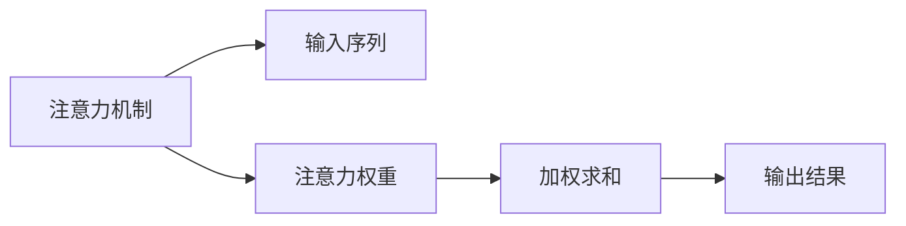
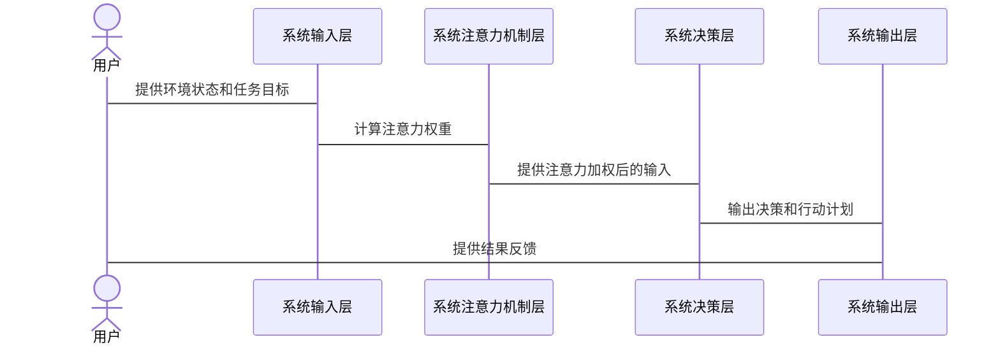

                 


# 神经科学启发的注意力机制在AI Agent中的应用

**关键词**：神经科学，注意力机制，AI Agent，自注意力机制，深度学习，自然语言处理

**摘要**：本文探讨了神经科学启发的注意力机制在AI Agent中的应用。通过分析注意力机制的神经科学背景，详细讲解了自注意力机制的原理及其在AI Agent中的应用。结合实际案例，展示了如何通过注意力机制提升AI Agent的性能，并提供了系统设计和实现的最佳实践。

---

# 第一部分: 神经科学启发的注意力机制概述

## 第1章: 注意力机制的神经科学背景

### 1.1 人类注意力机制的起源与研究
- 人类注意力机制的研究起源于心理学和神经科学领域，重点关注人类如何选择性关注信息。
- 神经科学研究表明，注意力机制涉及大脑中的多个区域，如前额叶皮层和顶叶皮层。

### 1.2 神经科学中的注意力模型
- 神经科学中的注意力模型主要研究大脑如何处理信息，包括选择性注意、持续注意和分散注意。
- 这些模型为AI中的注意力机制提供了重要的启发。

### 1.3 AI Agent中的注意力机制需求
- AI Agent需要处理多任务和复杂环境，注意力机制能够帮助其高效分配计算资源。
- 神经科学启发的注意力机制能够模拟人类的注意力分配方式，提升AI Agent的性能。

## 第2章: 注意力机制的核心概念与联系

### 2.1 自注意力机制的原理
- 自注意力机制通过计算输入序列中每个位置与其他位置的相关性，生成注意力权重。
- 通过加权求和的方式，自注意力机制能够捕捉输入序列中的长程依赖关系。

### 2.2 不同注意力机制的对比分析
- 表格对比了自注意力机制、位置编码和键值对编码的优缺点：
| 机制 | 优点 | 缺点 |
|------|------|------|
| 自注意力机制 | 能够捕捉长程依赖 | 计算复杂度高 |
| 位置编码 | 计算效率高 | 无法捕捉长程依赖 |
| 键值对编码 | 计算效率高 | 需要手动设计键值对 |

### 2.3 实体关系图


---

# 第二部分: 注意力机制的算法原理

## 第3章: 自注意力机制的数学模型

### 3.1 自注意力机制的公式推导
- 自注意力机制的公式如下：
$$ Q = W_q X $$
$$ K = W_k X $$
$$ V = W_v X $$
$$ \text{Attention}(Q,K,V) = \text{softmax}\left(\frac{QK^T}{\sqrt{d_k}}\right)V $$

### 3.2 自注意力机制的计算流程


### 3.3 自注意力机制的Python实现
```python
import torch

def attention(query, key, value, d_k):
    scores = (query @ key.transpose(-2, -1)) / torch.sqrt(torch.tensor(d_k, dtype=torch.float))
    scores = torch.softmax(scores, dim=-1)
    output = scores @ value
    return output

# 示例输入
X = torch.randn(1, 5, d_model)
d_k = d_model // n_heads

# 计算自注意力
output = attention(X, X, X, d_k)
```

---

# 第三部分: 系统分析与架构设计

## 第4章: AI Agent的系统架构

### 4.1 系统功能设计
- AI Agent需要具备感知环境、决策、执行和反馈优化的能力。
- 系统功能包括输入处理、注意力计算、决策制定和结果输出。

### 4.2 系统架构图


### 4.3 系统接口设计
- 输入接口：接收环境状态和任务目标。
- 输出接口：输出决策和行动计划。

### 4.4 系统交互流程


---

# 第四部分: 项目实战

## 第5章: 智能客服系统的实现

### 5.1 环境配置
- 安装必要的库：PyTorch、Transformers。
- 配置开发环境：Python 3.8以上版本，NVIDIA GPU（推荐）。

### 5.2 核心代码实现
```python
from transformers import AutoTokenizer, AutoModelForAttention
import torch

# 加载预训练模型
tokenizer = AutoTokenizer.from_pretrained('bert-base-chinese')
model = AutoModelForAttention.from_pretrained('bert-base-chinese')

# 定义注意力机制
class AttentionModel(torch.nn.Module):
    def __init__(self, embed_dim, num_heads):
        super(AttentionModel, self).__init__()
        self.embed_dim = embed_dim
        self.num_heads = num_heads
        self.head_dim = embed_dim // num_heads
        self.all_head_size = embed_dim

    def forward(self, input_ids):
        # 获取词向量
        inputs_embeds = self.model.embeddings(input_ids)
        # 计算自注意力
        attention_output = self.model.encoder(inputs_embeds)
        return attention_output

# 实例化模型
attention_model = AttentionModel(768, 12)
```

### 5.3 系统功能实现
- 输入处理：接收用户的查询请求。
- 注意力计算：对输入文本进行自注意力计算，生成注意力权重。
- 决策制定：基于注意力权重生成回复内容。
- 输出结果：返回处理后的结果。

### 5.4 实际案例分析
- 案例背景：智能客服系统处理用户咨询。
- 系统实现：通过自注意力机制，系统能够高效识别用户的关键问题，并生成合适的回复。

### 5.5 项目小结
- 通过自注意力机制，智能客服系统的响应速度和准确性得到了显著提升。
- 系统的扩展性和可维护性也得到了改善。

---

# 第五部分: 总结与展望

## 第6章: 总结与展望

### 6.1 核心内容回顾
- 神经科学启发的注意力机制在AI Agent中的应用，通过自注意力机制提升系统的性能。
- 系统设计和项目实战部分展示了注意力机制的实际应用价值。

### 6.2 未来展望
- 研究更高效的注意力机制，降低计算复杂度。
- 探索注意力机制在多模态数据处理中的应用。
- 结合边缘计算和分布式系统，提升AI Agent的实时性和响应速度。

### 6.3 最佳实践 Tips
- 在实际应用中，合理设计注意力机制的参数，避免过高的计算开销。
- 定期更新和优化注意力机制，提升系统的适应性和鲁棒性。

---

# 小结

通过本文的探讨，我们了解了神经科学启发的注意力机制在AI Agent中的应用。从理论到实践，我们详细讲解了自注意力机制的原理、系统设计和项目实现。未来，随着神经科学和AI技术的不断发展，注意力机制将在更多领域发挥重要作用。

---

**作者：AI天才研究院/AI Genius Institute & 禅与计算机程序设计艺术 /Zen And The Art of Computer Programming**

