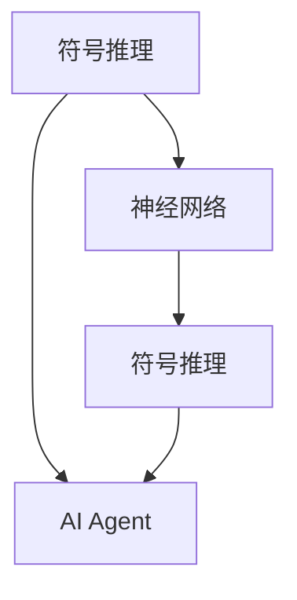
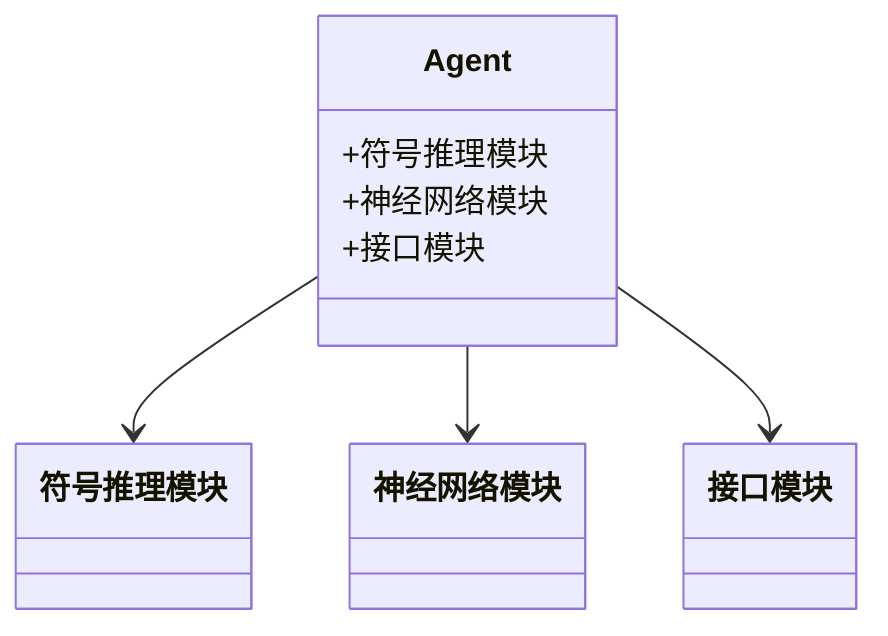
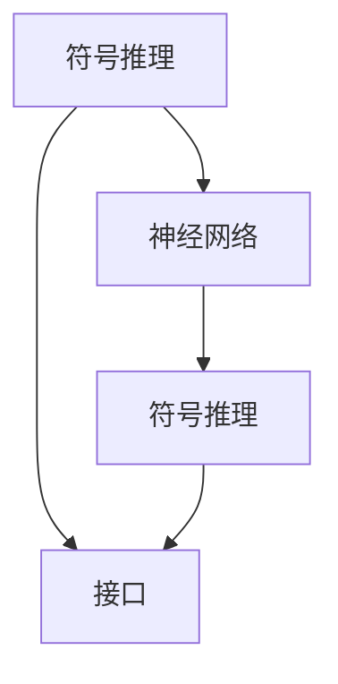

                 


# 神经符号AI：结合符号推理与神经网络的AI Agent

> 关键词：神经符号AI，符号推理，神经网络，AI Agent，深度学习，知识图谱

> 摘要：神经符号AI是一种结合了符号推理和神经网络的AI技术，旨在通过符号推理的逻辑性与神经网络的表达能力相结合，提升AI Agent在复杂任务中的推理能力和适应性。本文将详细探讨神经符号AI的核心概念、算法原理、系统架构及实际应用，帮助读者全面理解这一前沿技术。

---

# 第一部分: 神经符号AI的背景与概述

## 第1章: 神经符号AI的概述

### 1.1 神经符号AI的定义与背景

#### 1.1.1 传统符号AI的局限性
传统符号AI依赖于明确的规则和逻辑推理，例如专家系统。虽然在某些领域表现出色，但其灵活性和泛化能力有限，难以处理复杂和动态变化的环境。

#### 1.1.2 神经网络的局限性
神经网络，尤其是深度学习模型，擅长处理大量数据并提取特征，但在需要逻辑推理和符号操作的任务上表现不足，难以解释和处理符号逻辑。

#### 1.1.3 神经符号AI的提出与目标
神经符号AI结合了符号推理和神经网络的优势，旨在通过符号推理提供逻辑能力和通过神经网络提供强大的特征学习能力，以解决复杂任务中的推理和学习问题。

### 1.2 神经符号AI的核心概念

#### 1.2.1 符号推理的基本原理
符号推理基于逻辑规则和符号表示，通过规则引擎进行推理。例如，使用谓词逻辑和规则库来推导新的事实。

#### 1.2.2 神经网络的基本原理
神经网络通过层次化的特征学习，从数据中提取有用的特征表示。深度学习模型如CNN、RNN和Transformer在图像、文本和序列数据上表现出色。

#### 1.2.3 神经符号AI的结合方式
神经符号AI通过将符号推理嵌入神经网络中，或通过符号推理指导神经网络的学习，实现两者的协同工作。

---

## 第2章: 符号推理与神经网络的基础

### 2.1 符号推理的基础

#### 2.1.1 符号逻辑的基本概念
符号逻辑基于谓词逻辑，例如命题逻辑和一阶逻辑。符号表示通常包括原子命题、谓词和量词。

#### 2.1.2 符号推理算法的分类
- 一阶逻辑推理：如SMT求解器和逻辑编程语言。
- 专家系统：基于规则的推理引擎。

#### 2.1.3 符号推理在AI中的应用
- 知识图谱构建：如FreeBase和ConceptNet。
- 自然语言处理：如基于规则的句法分析。

### 2.2 神经网络的基础

#### 2.2.1 神经网络的基本结构
- 输入层、隐藏层和输出层。
- 激活函数：如ReLU、Sigmoid和Tanh。

#### 2.2.2 深度学习模型
- 卷积神经网络（CNN）：适用于图像处理。
- 循环神经网络（RNN）：适用于序列数据。
- Transformer：基于自注意力机制。

#### 2.2.3 神经网络在AI中的应用
- 计算机视觉：如目标检测和图像分割。
- 自然语言处理：如BERT和GPT。

---

# 第二部分: 神经符号AI的核心概念与联系

## 第3章: 神经符号AI的核心概念

### 3.1 符号推理与神经网络的结合

#### 3.1.1 符号推理与神经网络的协同效应
神经符号AI通过符号推理提供逻辑推理能力，通过神经网络提供强大的特征学习能力，实现两者的互补。

#### 3.1.2 符号推理与神经网络的对比分析
| 特性         | 符号推理                 | 神经网络               |
|--------------|--------------------------|------------------------|
| 表示方式       | 符号化                   | 向量化                 |
| 推理能力       | 强大                    | 较弱                  |
| 灵活性         | 低                      | 高                    |
| 解释性         | 高                      | 低                    |

#### 3.1.3 神经符号AI的实体关系图


---

## 第4章: 神经符号AI的算法原理

### 4.1 符号推理与神经网络的结合方式

#### 4.1.1 符号到神经的映射
通过将符号逻辑转换为神经网络的权重和激活函数，实现符号推理的神经化。

#### 4.1.2 神经到符号的转换
通过神经网络提取的特征表示，转换为符号逻辑进行推理。

### 4.2 神经符号AI的数学模型

#### 4.2.1 神经符号AI的符号推理模型
$$ f(x) = \text{sign}(w \cdot x + b) $$

#### 4.2.2 神经符号AI的神经网络模型
$$ h(x) = \text{ReLU}(W x + b) $$

---

## 第5章: 神经符号AI的系统分析与架构设计

### 5.1 系统架构设计

#### 5.1.1 系统功能设计


#### 5.1.2 系统架构图


---

## 第6章: 神经符号AI的项目实战

### 6.1 环境安装与配置

```bash
pip install numpy matplotlib scikit-learn
```

### 6.2 系统核心实现

#### 6.2.1 符号推理模块
```python
def symbol_inference(rules, facts):
    # 根据规则和事实进行推理
    pass
```

#### 6.2.2 神经网络模块
```python
class NeuralNetwork:
    def __init__(self):
        self.weights = np.random.randn(3, 4)
        self.bias = np.random.randn(1, 4)
    
    def forward(self, x):
        return np.maximum(0, np.dot(x, self.weights) + self.bias)
```

---

## 第7章: 最佳实践与小结

### 7.1 最佳实践

- 结合符号推理和神经网络时，需考虑数据质量和规则的准确性。
- 在实际应用中，逐步优化模型参数和推理规则。

### 7.2 小结

神经符号AI结合了符号推理和神经网络的优势，通过符号推理提供逻辑能力，通过神经网络提供强大的特征学习能力，是未来AI发展的趋势。

---

# 附录

## 附录A: 术语表

- 符号推理：基于逻辑规则的推理方法。
- 神经网络：模拟人脑结构的计算模型。

## 附录B: 参考文献

- Russell, S., & Norvig, P. (2010). Artificial Intelligence: A Modern Approach.
- Goodfellow, I., Bengio, Y., & Courville, A. (2016). Deep Learning.

---

作者：AI天才研究院/AI Genius Institute & 禅与计算机程序设计艺术 /Zen And The Art of Computer Programming

