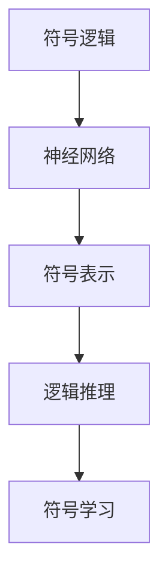
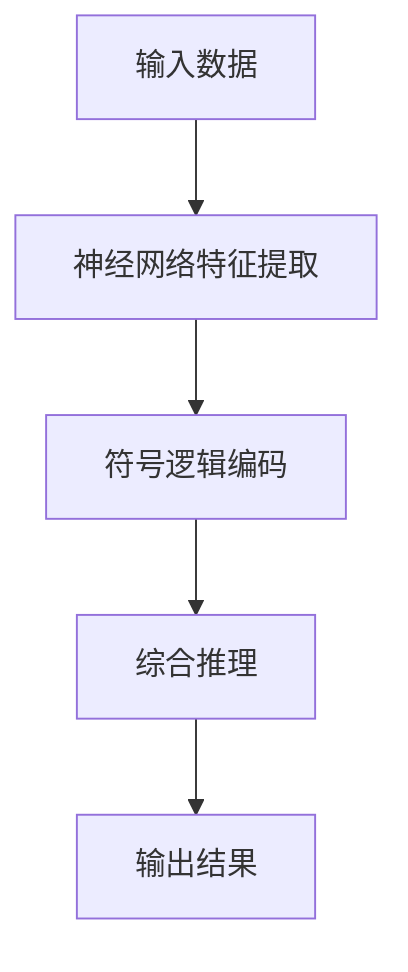
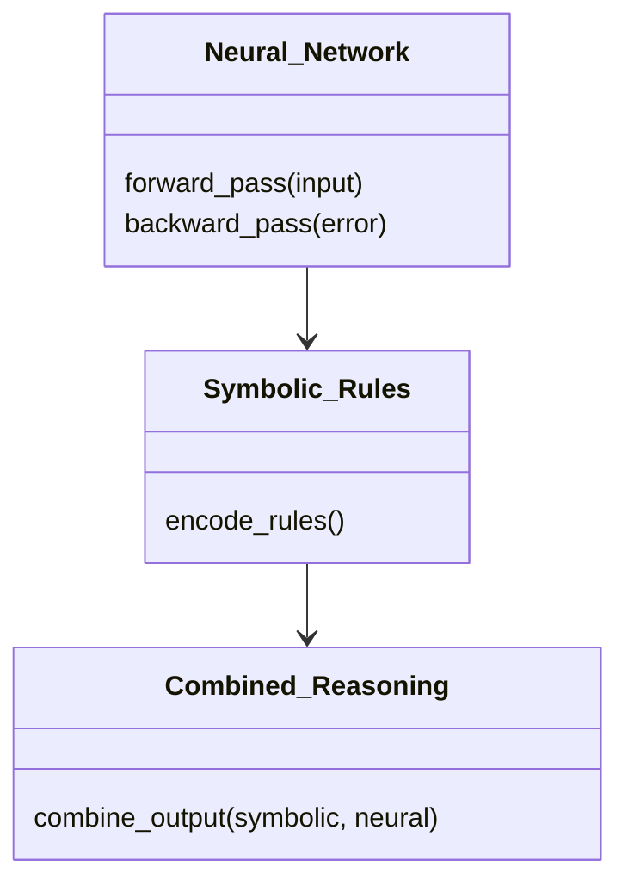
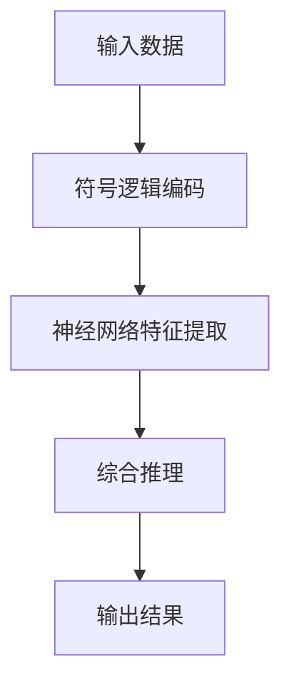
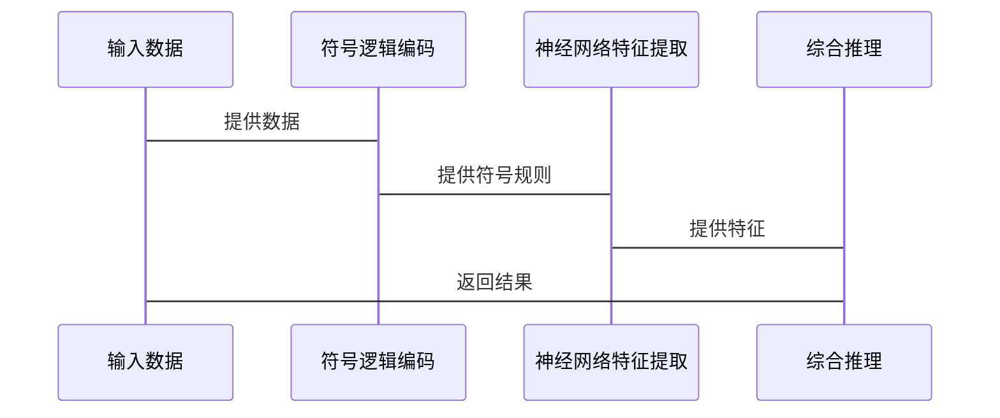

                 


# 神经符号推理：增强AI Agent的逻辑能力

> 关键词：神经符号推理, AI Agent, 逻辑推理, 神经网络, 符号逻辑, AI系统架构

> 摘要：神经符号推理是一种结合了符号逻辑与神经网络的新兴技术，旨在增强AI Agent的逻辑推理能力。本文从背景、概念、算法原理到系统架构设计，全面剖析神经符号推理的核心内容，结合实际案例和代码实现，为AI开发者和研究人员提供深入的技术解析。

---

# 第一部分: 神经符号推理的背景与概念

## 第1章: 神经符号推理的背景与概念

### 1.1 神经符号推理的定义与核心概念

#### 1.1.1 神经符号推理的基本概念
神经符号推理（Neural-Symbolic Reasoning）是一种结合了符号逻辑和神经网络的技术，旨在通过符号逻辑表达和神经网络的特征学习能力，增强AI系统的推理能力。其核心在于将符号逻辑的精确性和神经网络的鲁棒性相结合，实现更强大的逻辑推理。

#### 1.1.2 符号逻辑与神经网络的结合
神经符号推理的创新点在于将符号逻辑引入神经网络中，使AI系统能够理解符号化的规则，并通过神经网络进行推理和学习。这种结合使得AI系统不仅能够处理复杂的数据，还能够进行逻辑推理和知识表示。

#### 1.1.3 神经符号推理的核心要素
神经符号推理的核心要素包括符号逻辑、神经网络、符号表示、逻辑推理和符号学习。这些要素共同构成了神经符号推理的基础框架。

### 1.2 神经符号推理的背景与问题背景

#### 1.2.1 当前AI技术的局限性
传统AI技术在处理复杂逻辑推理和知识表示方面存在局限性，尤其是在需要结合符号逻辑和数据驱动的场景中，难以实现高效的推理和决策。

#### 1.2.2 神经符号推理的提出与目标
神经符号推理的提出是为了克服传统AI技术的局限性，通过结合符号逻辑和神经网络，提升AI系统的推理能力和知识表示能力。

#### 1.2.3 神经符号推理的应用场景
神经符号推理的应用场景包括智能问答、知识图谱推理、机器人路径规划、自动驾驶等领域，特别是在需要结合规则和数据的复杂场景中表现出色。

### 1.3 神经符号推理的核心问题与边界

#### 1.3.1 神经符号推理的核心问题
神经符号推理的核心问题在于如何将符号逻辑与神经网络有效结合，实现高效的逻辑推理和知识表示。

#### 1.3.2 神经符号推理的边界与外延
神经符号推理的边界在于符号逻辑与神经网络的结合方式，外延则涉及如何在不同场景中应用和优化这一技术。

#### 1.3.3 神经符号推理的概念结构与核心要素
神经符号推理的概念结构由符号逻辑、神经网络、符号表示、逻辑推理和符号学习组成，这些要素共同构成了其核心框架。

---

## 第2章: 神经符号推理的核心概念与联系

### 2.1 神经符号推理的核心原理

#### 2.1.1 符号逻辑的基本原理
符号逻辑通过符号表示和逻辑规则进行推理，是神经符号推理的基础之一。

#### 2.1.2 神经网络的基本原理
神经网络通过数据驱动的方式进行学习和推理，是神经符号推理的另一基础。

#### 2.1.3 神经符号推理的结合方式
神经符号推理通过将符号逻辑嵌入神经网络中，使AI系统能够同时处理符号逻辑和数据。

### 2.2 神经符号推理的核心概念对比

#### 2.2.1 符号表示与神经网络表示的对比
符号表示通过符号和规则进行推理，神经网络表示通过数据和特征进行学习，两者各有优劣。

#### 2.2.2 逻辑推理与神经网络推理的对比
逻辑推理基于符号规则，神经网络推理基于数据特征，两者在推理方式上存在本质差异。

#### 2.2.3 神经符号推理与其他AI技术的对比
神经符号推理与传统符号逻辑和深度学习相比，具有更强的综合推理能力。

### 2.3 神经符号推理的ER实体关系图



---

## 第3章: 神经符号推理的算法原理

### 3.1 神经符号推理的算法流程

#### 3.1.1 算法输入与输出
输入：符号逻辑规则和数据输入  
输出：推理结果

#### 3.1.2 算法的主要步骤
1. 符号逻辑编码
2. 神经网络特征提取
3. 综合推理

#### 3.1.3 算法的优化与改进
通过优化符号逻辑编码和神经网络结构，提升推理效率和准确率。

### 3.2 神经符号推理的数学模型

#### 3.2.1 符号表示的数学模型
符号表示通过符号和逻辑规则进行推理，例如：  
$$ \text{如果 } A \text{ 且 } B \text{，则 } C $$

#### 3.2.2 逻辑推理的数学模型
逻辑推理基于符号规则，例如：  
$$ C = A \land B $$

#### 3.2.3 神经符号结合的数学模型
神经符号结合的数学模型将符号逻辑嵌入神经网络中，例如：  
$$ f(x) = \text{神经网络}(x) \oplus \text{符号逻辑}(x) $$

### 3.3 神经符号推理的算法实现

#### 3.3.1 算法的Python实现
```python
def neural_symbolic_reasoning(input_data):
    # 符号逻辑编码
    symbolic_rules = ...  # 符号规则
    # 神经网络特征提取
    features = neural_network(input_data)
    # 综合推理
    result = combine(symbolic_rules, features)
    return result
```

#### 3.3.2 算法的流程图展示



#### 3.3.3 算法的优化与调优
通过优化神经网络结构和符号逻辑规则，提升算法的效率和准确性。

---

## 第4章: 神经符号推理的系统架构设计

### 4.1 系统问题场景介绍

#### 4.1.1 系统目标与功能
系统目标：实现神经符号推理  
系统功能：符号逻辑编码、神经网络特征提取、综合推理

#### 4.1.2 系统的输入与输出
输入：符号逻辑规则和数据输入  
输出：推理结果

#### 4.1.3 系统的运行环境
运行环境：支持神经网络和符号逻辑推理的计算环境

### 4.2 系统功能设计

#### 4.2.1 领域模型设计


#### 4.2.2 系统架构设计


#### 4.2.3 系统接口设计
系统接口包括符号逻辑编码接口、神经网络特征提取接口和综合推理接口。

#### 4.2.4 系统交互流程


---

## 第5章: 神经符号推理的项目实战

### 5.1 环境安装与配置

#### 5.1.1 环境需求
需要安装Python、神经网络框架（如TensorFlow或PyTorch）和符号逻辑推理库。

#### 5.1.2 环境配置
```bash
pip install tensorflow pytorch
```

### 5.2 神经符号推理的核心实现

#### 5.2.1 符号逻辑编码实现
```python
def encode_rules(rules):
    # 符号逻辑编码
    pass
```

#### 5.2.2 神经网络特征提取实现
```python
def neural_network(input):
    # 神经网络特征提取
    pass
```

#### 5.2.3 综合推理实现
```python
def combine(symbolic, neural):
    # 综合推理
    pass
```

### 5.3 实际案例分析与解读

#### 5.3.1 案例背景
假设我们有一个智能问答系统，需要结合符号逻辑和神经网络进行推理。

#### 5.3.2 数据准备
准备问答数据和符号逻辑规则。

#### 5.3.3 系统实现
实现神经符号推理算法，结合数据和规则进行推理。

#### 5.3.4 结果分析
分析推理结果，验证算法的有效性。

### 5.4 项目小结

#### 5.4.1 核心实现总结
神经符号推理的核心在于符号逻辑与神经网络的结合。

#### 5.4.2 项目实现的关键点
符号逻辑编码和神经网络特征提取是关键。

---

## 第6章: 神经符号推理的最佳实践

### 6.1 小结与总结

#### 6.1.1 神经符号推理的核心思想
神经符号推理通过结合符号逻辑和神经网络，实现更强大的推理能力。

#### 6.1.2 项目实施的关键点
符号逻辑编码和神经网络特征提取是关键。

### 6.2 注意事项与优化建议

#### 6.2.1 实施中的注意事项
符号逻辑编码要清晰，神经网络特征提取要充分。

#### 6.2.2 系统优化建议
优化符号逻辑和神经网络结构，提升推理效率。

### 6.3 拓展阅读与学习资源

#### 6.3.1 推荐书籍
《神经符号推理：理论与应用》

#### 6.3.2 推荐论文
《Neural-Symbolic Reasoning with Knowledge Graphs》

---

作者：AI天才研究院/AI Genius Institute & 禅与计算机程序设计艺术 /Zen And The Art of Computer Programming

