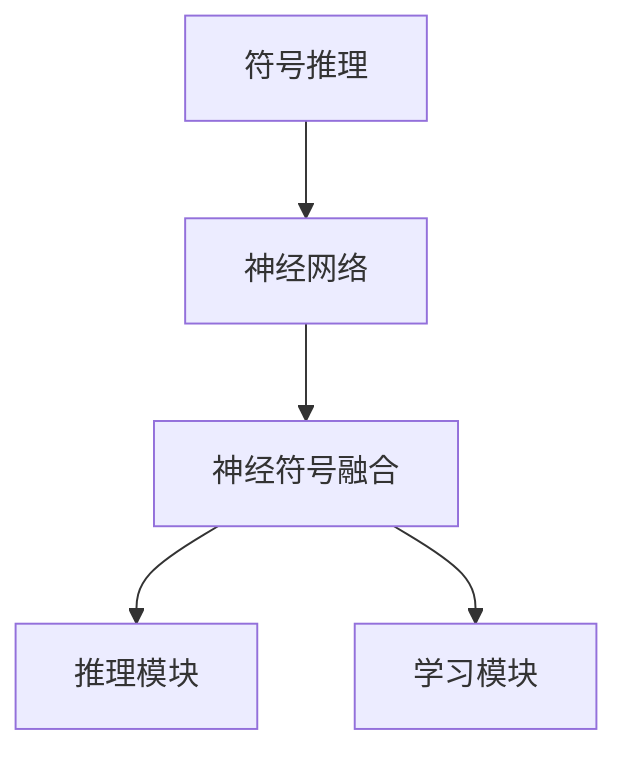
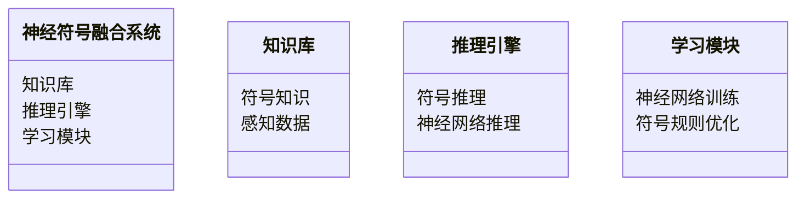
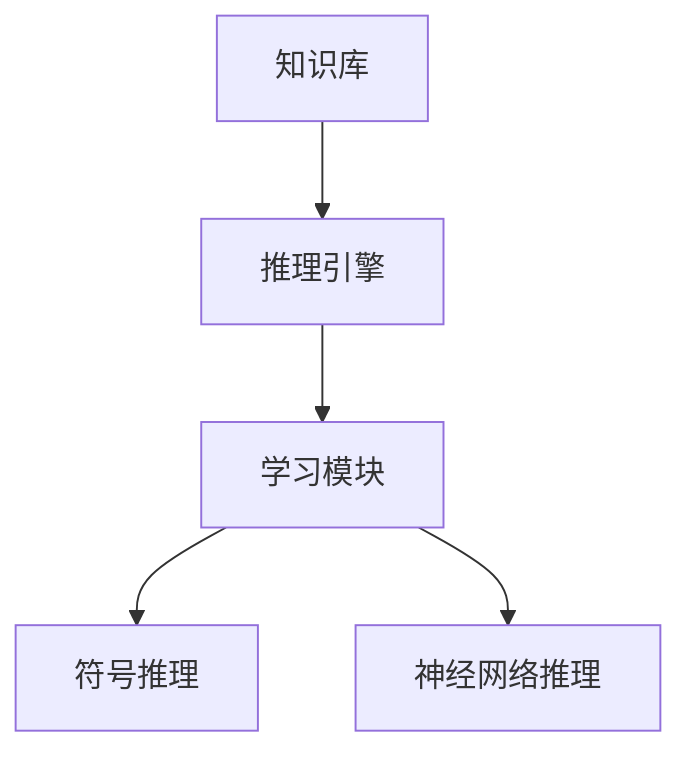
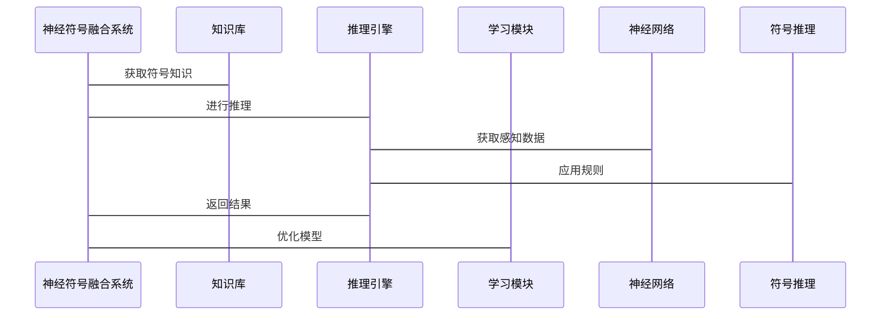

                 


# 神经符号融合：增强AI Agent的推理能力

> **关键词**：神经符号融合、AI Agent、符号推理、神经网络、增强推理能力、知识图谱、深度学习

> **摘要**：神经符号融合是一种结合符号推理和神经网络的技术，旨在提升AI Agent的推理能力。本文从背景、核心概念、算法原理、系统架构、项目实战到最佳实践等方面，详细探讨神经符号融合的理论与实践，帮助读者理解并应用这一技术。

---

## 第一部分: 神经符号融合的背景与概念

### 第1章: 神经符号融合的背景与问题背景

#### 1.1 神经符号融合的背景

##### 1.1.1 传统符号推理的局限性
传统符号推理依赖于逻辑规则和专家知识，适用于结构化数据和确定性问题，但在处理复杂、动态和模糊的问题时表现受限。

##### 1.1.2 神经网络的崛起与挑战
神经网络在感知和模式识别方面表现出色，但缺乏可解释性和逻辑推理能力，难以处理需要符号化知识的任务。

##### 1.1.3 神经符号融合的提出与意义
神经符号融合结合了符号推理的逻辑性和神经网络的学习能力，旨在解决传统符号推理和神经网络各自的局限性。

#### 1.2 问题背景与问题描述

##### 1.2.1 AI Agent推理能力的现状
当前AI Agent主要依赖统计学习，缺乏对知识的结构化理解和推理能力。

##### 1.2.2 符号推理与神经网络的结合需求
为了增强AI Agent的推理能力，需要将符号推理与神经网络相结合，实现知识表示与推理的统一。

##### 1.2.3 神经符号融合的核心问题
如何在神经网络中融入符号推理机制，实现高效的知识表示和推理。

#### 1.3 神经符号融合的边界与外延

##### 1.3.1 神经符号融合的定义域
适用于需要结合知识表示和推理的领域，如自然语言处理、机器人、自动驾驶等。

##### 1.3.2 相关概念的区分与对比
与符号推理、神经网络、知识图谱等概念进行区分，明确神经符号融合的独特性。

##### 1.3.3 神经符号融合的潜在应用场景
包括智能问答系统、机器人路径规划、复杂任务推理等。

#### 1.4 神经符号融合的概念结构与核心要素

##### 1.4.1 神经符号融合的系统架构
由知识表示层、推理层和学习层组成，实现知识的表示、推理和学习。

##### 1.4.2 核心概念与组成要素
包括符号表示、推理规则、神经网络模型、知识图谱等。

##### 1.4.3 神经符号融合的实现机制
通过符号表示嵌入神经网络，结合推理规则和学习数据，实现知识的动态更新和推理。

### 第2章: 神经符号融合的核心概念与联系

#### 2.1 神经符号融合的核心概念

##### 2.1.1 符号推理的基本原理
符号推理基于逻辑规则，通过符号操作进行推理，依赖知识库的结构化表示。

##### 2.1.2 神经网络的基本原理
神经网络通过多层感知机学习数据特征，具备强大的模式识别能力，但缺乏逻辑推理。

##### 2.1.3 神经符号融合的结合方式
符号推理与神经网络的结合主要通过嵌入符号表示、混合推理与学习、联合优化等方式实现。

#### 2.2 神经符号融合的核心原理

##### 2.2.1 符号逻辑与神经网络的结合
符号逻辑用于表示知识和规则，神经网络用于处理感知数据，两者结合实现端到端的推理。

##### 2.2.2 神经符号融合的数学模型
符号逻辑与神经网络的结合可以通过符号嵌入、逻辑门控等方法实现，具体模型依赖于具体应用场景。

##### 2.2.3 神经符号融合的实现框架
包括知识表示层、推理层、学习层和交互层，实现符号知识与感知数据的融合。

#### 2.3 神经符号融合的核心属性对比

##### 2.3.1 符号推理与神经网络的对比
| 属性 | 符号推理 | 神经网络 |
|------|---------|----------|
| 表示方式 | 符号化、结构化 | 向量化、非结构化 |
| 可解释性 | 高 | 低 |
| 推理能力 | 强 | 弱 |

##### 2.3.2 神经符号融合的性能优势
神经符号融合结合了符号推理的逻辑性和神经网络的学习能力，具备更好的可解释性和推理能力。

##### 2.3.3 神经符号融合的局限性
计算复杂度高，知识表示和推理的结合需要复杂的优化。

#### 2.4 神经符号融合的ER实体关系图



#### 2.5 本章小结

---

### 第3章: 神经符号融合的算法原理

#### 3.1 神经符号融合的算法概述

##### 3.1.1 神经符号融合的基本算法
神经符号融合算法通常包括知识表示、推理规则和学习模块，通过符号嵌入和逻辑推理实现结合。

##### 3.1.2 神经符号融合的实现步骤
1. 知识表示：将符号知识嵌入神经网络。
2. 推理规则：定义符号推理规则。
3. 学习优化：通过神经网络进行端到端优化。

##### 3.1.3 神经符号融合的算法流程
- 输入感知数据。
- 神经网络提取特征。
- 符号推理模块应用逻辑规则。
- 综合推理结果和感知特征，输出最终结果。

#### 3.2 神经符号融合的算法原理

##### 3.2.1 神经符号融合的符号逻辑
符号逻辑通过谓词逻辑表示知识，如一阶逻辑（FOL）。

##### 3.2.2 神经符号融合的神经网络
使用深度神经网络（如Transformer）进行特征提取和表示。

##### 3.2.3 神经符号融合的结合机制
通过符号嵌入、逻辑门控、混合注意力机制等方式结合符号逻辑和神经网络。

#### 3.3 神经符号融合的算法实现

##### 3.3.1 神经符号融合的符号推理模块
符号推理模块基于知识图谱进行推理，如路径查询、规则推理。

##### 3.3.2 神经符号融合的神经网络模块
使用Transformer进行编码和解码，提取符号和语义信息。

##### 3.3.3 神经符号融合的结合机制
通过符号嵌入和逻辑门控，实现符号推理与神经网络的结合。

#### 3.4 本章小结

---

## 第四部分: 系统分析与架构设计方案

### 第4章: 神经符号融合的系统架构

#### 4.1 系统功能设计

##### 4.1.1 领域模型设计


##### 4.1.2 系统架构设计


#### 4.2 系统接口设计
系统接口包括知识库接口、推理引擎接口、学习模块接口，支持符号推理和神经网络推理的结合。

#### 4.3 系统交互设计


#### 4.4 本章小结

---

## 第五部分: 项目实战

### 第5章: 神经符号融合的项目实战

#### 5.1 环境安装
安装必要的库，如TensorFlow、Keras、符号逻辑库（如PyKNITRO）。

#### 5.2 核心代码实现

##### 5.2.1 符号推理模块
```python
from sympy import symbols, And, Or, Not, Implies, deduce
```

##### 5.2.2 神经网络模块
```python
import tensorflow as tf
from tensorflow import keras
from tensorflow.keras import layers
```

##### 5.2.3 神经符号融合模块
```python
def neural_symbolic_fuse(symbolic_layer, neural_layer):
    # 符号嵌入
    symbolic_embedding = layers.Dense(128, activation='relu')(symbolic_layer)
    # 神经网络嵌入
    neural_embedding = layers.Dense(128, activation='relu')(neural_layer)
    # 结合层
    combined = layers.Add()([symbolic_embedding, neural_embedding])
    return combined
```

#### 5.3 代码解读与分析
详细解读核心代码，说明符号嵌入、神经网络嵌入和结合层的实现。

#### 5.4 实际案例分析
以智能问答系统为例，展示神经符号融合在实际中的应用。

#### 5.5 本章小结

---

## 第六部分: 最佳实践与总结

### 第6章: 神经符号融合的最佳实践

#### 6.1 小结
总结神经符号融合的核心思想和实现步骤。

#### 6.2 注意事项
在项目实施中需要注意符号表示、知识图谱构建和模型优化等问题。

#### 6.3 拓展阅读
推荐相关领域的书籍和论文，供读者进一步学习。

#### 6.4 本章小结

---

## 作者信息

作者：AI天才研究院/AI Genius Institute & 禅与计算机程序设计艺术 /Zen And The Art of Computer Programming

---

通过以上思考过程，我们可以逐步完成一篇结构完整、内容详实的神经符号融合技术博客文章。

