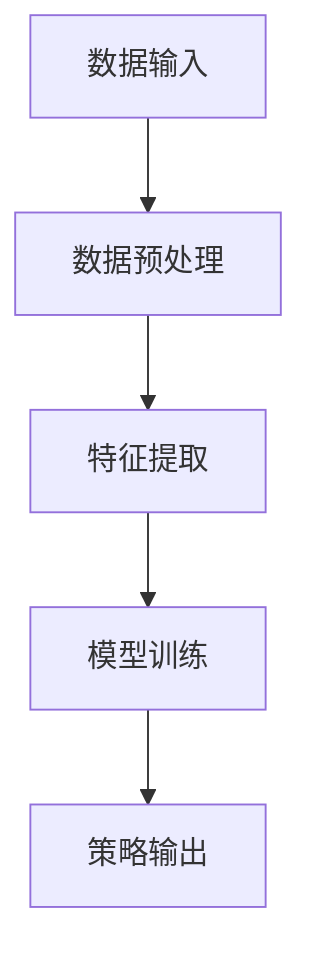

                 


# 离线强化学习：利用历史数据训练AI Agent

> 关键词：离线强化学习，AI Agent，历史数据，强化学习，算法，系统架构，项目实战

> 摘要：离线强化学习是一种利用历史数据训练AI代理的方法，无需实时与环境交互。本文从背景、核心概念、算法原理、系统架构到项目实战，全面解析离线强化学习的理论与实践。

---

## 第1章 离线强化学习概述

### 1.1 离线强化学习的基本概念

离线强化学习（Offline Reinforcement Learning）是一种强化学习方法，旨在利用历史数据训练AI代理，而无需实时与环境交互。与在线强化学习不同，离线强化学习依赖于预先收集的数据，适用于无法实时交互或环境动态变化的场景。

#### 1.1.1 强化学习的定义与特点

- **强化学习**：通过智能体与环境交互，学习策略以最大化累积奖励。
- **特点**：
  - **实时交互**：需要与环境实时互动。
  - **试错学习**：通过试错调整策略。
  - **目标导向**：基于奖励函数优化策略。

#### 1.1.2 离线强化学习的定义

- **定义**：利用历史数据训练AI代理，无需实时与环境交互。
- **数据来源**：历史交互数据，包括状态、动作和奖励。

#### 1.1.3 离线强化学习与在线强化学习的区别

| 特性 | 离线强化学习 | 在线强化学习 |
|------|--------------|--------------|
| 数据来源 | 历史数据 | 实时交互数据 |
| 交互需求 | 无实时交互 | 需要实时交互 |
| 适用场景 | 离线训练 | 在线实时应用 |

---

### 1.2 离线强化学习的背景与问题背景

#### 1.2.1 离线数据的来源与特点

- **来源**：
  - 过去的交互数据。
  - 专家经验或模拟数据。
- **特点**：
  - 数据量有限。
  - 数据分布可能不均衡。

#### 1.2.2 离线强化学习的核心问题

- **数据稀疏性**：数据不足以覆盖所有可能的状态和动作。
- **策略稳定性**：离线数据可能导致策略不稳定。

#### 1.2.3 离线强化学习的应用场景

- **游戏AI训练**：利用历史游戏数据训练AI。
- **机器人控制**：在模拟环境中训练机器人。

---

## 第2章 离线强化学习的核心概念与联系

### 2.1 离线强化学习的核心概念

#### 2.1.1 状态空间与动作空间

- **状态空间**：所有可能的状态集合。
- **动作空间**：所有可能的动作集合。

#### 2.1.2 奖励函数与目标函数

- **奖励函数**：定义每个状态和动作的奖励值。
- **目标函数**：最大化累积奖励。

#### 2.1.3 策略与价值函数的关系

- **策略**：决定动作选择的概率分布。
- **价值函数**：评估状态或策略的价值。

### 2.2 离线强化学习的原理与数学模型

#### 2.2.1 贝尔曼方程的推导

- **贝尔曼方程**：描述状态值函数的方程。
  $$ V(s) = \max_{a} [r(s,a) + \gamma V(s')] $$

#### 2.2.2 离线强化学习的数学公式

- **策略评估**：计算当前策略的值函数。
- **策略优化**：优化策略以最大化值函数。

#### 2.2.3 离线强化学习的核心算法

- **Q-learning**：基于Q值的强化学习算法。
  $$ Q(s,a) = Q(s,a) + \alpha [r + \gamma \max Q(s',a') - Q(s,a)] $$

---

## 第3章 离线强化学习的算法原理

### 3.1 离线强化学习的主要算法

#### 3.1.1 基于策略评估的算法

- **策略评估**：计算当前策略的值函数。

#### 3.1.2 基于策略优化的算法

- **策略优化**：优化策略以最大化值函数。

#### 3.1.3 基于价值函数的算法

- **价值函数**：评估状态或动作的价值。

### 3.2 离线强化学习算法的数学推导

#### 3.2.1 贝尔曼方程的数学推导

- **贝尔曼方程**：描述状态值函数的方程。
  $$ V(s) = \max_{a} [r(s,a) + \gamma V(s')] $$

#### 3.2.2 策略梯度的数学推导

- **策略梯度**：优化策略的梯度。
  $$ \nabla J(\theta) = \mathbb{E}[ \nabla \log \pi_\theta(s,a) \cdot Q(s,a) ] $$

---

## 第4章 离线强化学习的系统架构

### 4.1 离线强化学习的系统架构

#### 4.1.1 数据预处理与特征提取

- **数据预处理**：清洗和标准化数据。
- **特征提取**：提取关键特征。

#### 4.1.2 离线强化学习的系统流程

- **数据输入**：加载历史数据。
- **模型训练**：训练价值函数或策略。
- **结果输出**：输出优化策略。

#### 4.1.3 系统架构图（Mermaid）



---

## 第5章 项目实战：离线训练一个AI代理

### 5.1 环境安装与数据准备

- **环境安装**：安装必要的库和工具。
- **数据准备**：收集和整理历史数据。

### 5.2 系统核心实现

#### 5.2.1 数据预处理

```python
import numpy as np

data = np.loadtxt('data.txt')
states = data[:, 0]
actions = data[:, 1]
rewards = data[:, 2]
next_states = data[:, 3]
```

#### 5.2.2 算法实现

```python
def update_Q(s, a, r, s_prime, Q, gamma=0.99):
    Q[s][a] = Q[s][a] + alpha * (r + gamma * np.max(Q[s_prime]) - Q[s][a])
```

### 5.3 实际案例分析

#### 5.3.1 案例选择

- **案例**：训练一个游戏AI。

#### 5.3.2 系统实现

- **数据输入**：加载游戏数据。
- **模型训练**：训练AI代理。
- **结果输出**：输出AI策略。

---

## 第6章 总结与展望

### 6.1 本章总结

- **总结**：离线强化学习利用历史数据训练AI代理，无需实时交互。
- **小结**：从背景到算法，再到系统架构和项目实战，全面解析离线强化学习。

### 6.2 未来展望

- **数据质量**：提升数据质量以提高训练效果。
- **算法优化**：研究更高效的离线强化学习算法。

### 6.3 最佳实践 Tips

- **数据多样性**：确保数据多样性。
- **算法选择**：根据场景选择合适的算法。

---

## 作者：AI天才研究院 & 禅与计算机程序设计艺术

---

通过以上详细分析和分步讲解，本文全面解析了离线强化学习的核心概念、算法原理和系统架构，并通过实际案例展示了其应用。希望对读者理解离线强化学习有所帮助。

