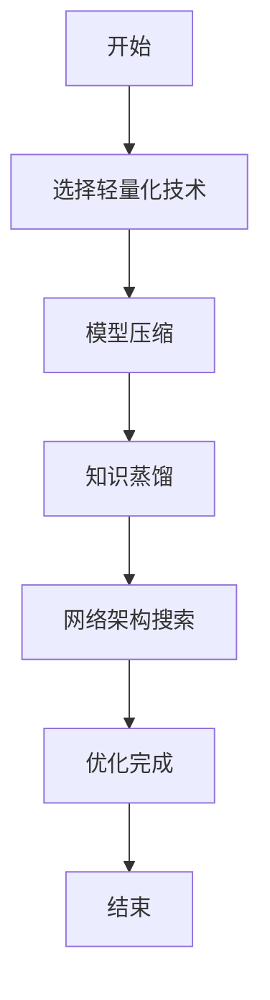
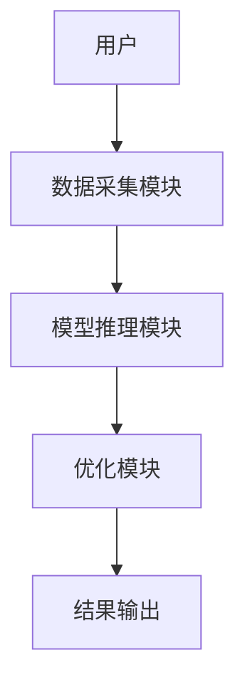
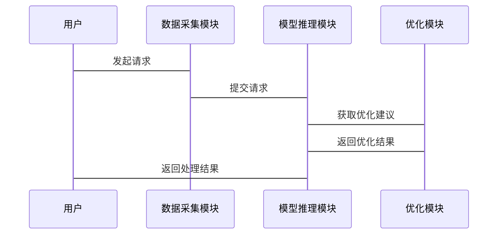

                 


# 移动端AI Agent：轻量化与性能的平衡

## 关键词：
- 移动端AI Agent
- 轻量化
- 性能优化
- 模型压缩
- 知识蒸馏

## 摘要：
本文深入探讨了移动端AI Agent的轻量化与性能平衡问题。在移动设备资源受限的环境下，如何实现高效且低功耗的AI应用是当前技术挑战的核心。本文从背景、核心概念、算法原理、系统设计到项目实战，全面分析了移动端AI Agent的设计与实现，特别强调了轻量化技术的重要性及其在性能优化中的应用。通过详细的技术解析和实际案例，本文为读者提供了系统化的解决方案，帮助他们在移动端实现高效的人工智能应用。

---

# 第1章：移动AI Agent背景介绍

## 1.1 AI Agent的基本概念
### 1.1.1 什么是AI Agent
AI Agent（人工智能代理）是指能够感知环境、自主决策并执行任务的智能实体。它通过传感器获取信息，利用算法处理数据，并通过执行器与环境互动。AI Agent广泛应用于智能助手、推荐系统、自动驾驶等领域。

### 1.1.2 AI Agent的核心特征
1. **自主性**：能够独立决策，无需外部干预。
2. **反应性**：实时感知环境并做出响应。
3. **目标导向**：具备明确的目标，驱动行为决策。
4. **学习能力**：通过数据和经验优化自身性能。

### 1.1.3 移动端AI Agent的独特性
移动端AI Agent面临资源限制，需在有限的计算能力和电池寿命下运行，同时要求快速响应和低延迟，这对设计提出了更高的挑战。

## 1.2 移动端AI Agent的应用场景
### 1.2.1 智能助手
如智能手机中的语音助手，提供实时信息查询、任务调度等服务。

### 1.2.2 智慧教育
通过AI Agent实现个性化学习推荐和教学辅助。

### 1.2.3 智慧医疗
辅助医生进行诊断建议和健康监测，提供个性化的医疗方案。

### 1.2.4 智能客服
通过自然语言处理技术，提供高效的客户支持服务。

## 1.3 轻量化与性能平衡的重要性
### 1.3.1 移动端资源限制
移动设备的计算能力、存储空间和电池寿命有限，要求AI Agent在设计上必须轻量化。

### 1.3.2 性能优化的目标
在资源受限的情况下，仍需保持响应速度和准确性，这是设计的核心目标。

### 1.3.3 轻量化技术的必要性
通过压缩模型大小、减少计算复杂度，确保AI Agent在移动设备上高效运行。

## 1.4 本章小结
本章介绍了AI Agent的基本概念和移动端的独特性，强调了轻量化与性能平衡的重要性，为后续章节奠定了基础。

---

# 第2章：核心概念与轻量化技术

## 2.1 轻量化技术的原理
轻量化技术通过减少模型大小、优化计算流程，降低资源消耗，同时保持性能不变。

### 2.1.1 模型压缩技术
模型压缩通过剪枝、量化等方法减少模型参数，降低存储需求。

### 2.1.2 知识蒸馏技术
知识蒸馏将大模型的知识迁移到小模型，通过教师模型指导学生模型学习。

### 2.1.3 网络架构搜索
通过自动搜索高效的网络结构，降低计算复杂度。

## 2.2 轻量化技术的对比分析
以下表格对比了常见轻量化技术的优缺点：

| 技术 | 优点 | 缺点 |
|------|------|------|
| 参数剪枝 | 显著减少模型大小 | 可能影响模型准确性 |
| 量化 | 降低存储需求 | 计算复杂度增加 |
| 知识蒸馏 | 保持高准确率 | 需要教师模型 |

## 2.3 轻量化技术的实现流程
使用Mermaid图展示流程：



## 2.4 本章小结
本章详细介绍了轻量化技术的原理和实现流程，对比了不同技术的优缺点，为后续章节的实现提供了理论基础。

---

# 第3章：算法原理与实现

## 3.1 模型压缩算法
### 3.1.1 参数剪枝
通过去除冗余参数，降低模型复杂度。剪枝过程可以分为权重剪枝和激活剪枝。

### 3.1.2 量化
将模型中的32位浮点数参数量化为8位整数，减少存储需求。

### 3.1.3 算法实现
以下是量化算法的Python示例代码：

```python
def quantize(tensor, bits=8):
    scale = 2 ** (bits - 10)
    tensor = tensor * scale
    tensor = tensor.round()
    return tensor
```

## 3.2 知识蒸馏算法
### 3.2.1 教师模型的选择
选择一个在高精度模型上训练好的大模型作为教师。

### 3.2.2 学生模型的设计
设计一个轻量级的学生模型，通过蒸馏损失函数学习教师模型的知识。

### 3.2.3 蒸馏损失函数
蒸馏损失函数的数学表达式：

$$ L_{distill} = -\sum_{i} (t_i \log p_i) $$

其中，$t_i$是教师模型的输出概率，$p_i$是学生模型的输出概率。

## 3.3 算法优化策略
### 3.3.1 分阶段优化
先进行参数剪枝，再进行量化，最后通过蒸馏优化模型性能。

### 3.3.2 平衡准确性与资源消耗
通过调整蒸馏温度和损失权重，在准确性和资源消耗之间找到最佳平衡点。

## 3.4 本章小结
本章详细讲解了模型压缩和知识蒸馏的算法原理，并通过代码示例展示了实现过程，为后续系统设计奠定了基础。

---

# 第4章：系统设计与实现

## 4.1 系统架构设计
### 4.1.1 系统功能模块
- 数据采集模块：负责收集用户输入和环境数据。
- 模型推理模块：执行AI推理，生成响应。
- 优化模块：动态调整模型参数，提升性能。

### 4.1.2 系统架构图
使用Mermaid图展示系统架构：



## 4.2 系统接口设计
### 4.2.1 接口定义
- 输入接口：接收用户请求和环境数据。
- 输出接口：返回处理结果和优化建议。

### 4.2.2 接口实现
以下是接口的Python代码示例：

```python
class AgentInterface:
    def __init__(self):
        self.model = self.load_model()

    def process_request(self, request):
        # 数据处理
        processed_request = self.preprocess(request)
        # 模型推理
        result = self.model.inference(processed_request)
        return result
```

## 4.3 交互设计
### 4.3.1 交互流程
- 用户发起请求，系统接收并解析。
- 系统调用模型推理模块，生成响应。
- 系统优化模块动态调整参数，提升性能。

### 4.3.2 交互序列图
使用Mermaid图展示交互流程：



## 4.4 本章小结
本章详细设计了系统架构和交互流程，展示了如何在移动端实现高效的AI Agent系统。

---

# 第5章：项目实战

## 5.1 项目环境搭建
### 5.1.1 开发工具安装
安装Python、TensorFlow Lite等开发工具。

### 5.1.2 模型下载与准备
下载预训练模型，并进行量化处理。

## 5.2 核心功能实现
### 5.2.1 模型压缩与优化
通过剪枝和量化优化模型性能。

### 5.2.2 知识蒸馏实现
使用教师模型优化学生模型，提升准确率。

## 5.3 项目案例分析
### 5.3.1 案例背景
设计一个移动端语音助手，实现语音识别和任务调度。

### 5.3.2 实现步骤
1. 数据采集与预处理。
2. 模型压缩与优化。
3. 系统集成与测试。

## 5.4 项目优化与调优
### 5.4.1 性能测试
使用基准测试工具评估系统的响应时间和资源消耗。

### 5.4.2 系统调优
根据测试结果，优化模型参数和系统架构。

## 5.5 本章小结
本章通过实际项目展示了移动端AI Agent的设计与实现过程，帮助读者掌握理论知识的实际应用。

---

# 第6章：总结与展望

## 6.1 本章总结
本文系统地探讨了移动端AI Agent的轻量化与性能平衡问题，详细介绍了核心技术和实现方法，展示了实际项目中的应用。

## 6.2 未来展望
随着技术的进步，移动端AI Agent将在更多领域发挥重要作用，轻量化技术将继续优化，性能与资源消耗的平衡将更加高效。

## 6.3 最佳实践
1. 在设计阶段充分考虑资源限制，选择合适的轻量化技术。
2. 定期优化模型和系统架构，适应新需求。
3. 利用现有工具和框架，简化开发过程。

## 6.4 本章小结
本文总结了移动端AI Agent的设计与实现，展望了未来的发展方向，并提供了实践建议。

---

# 作者：AI天才研究院 & 禅与计算机程序设计艺术

---

以上是《移动端AI Agent：轻量化与性能的平衡》的技术博客文章，详细探讨了从理论到实践的各个方面，为读者提供了全面的技术指导和实践参考。

