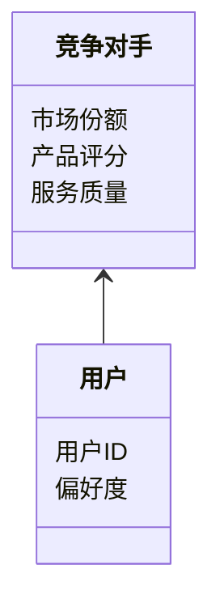
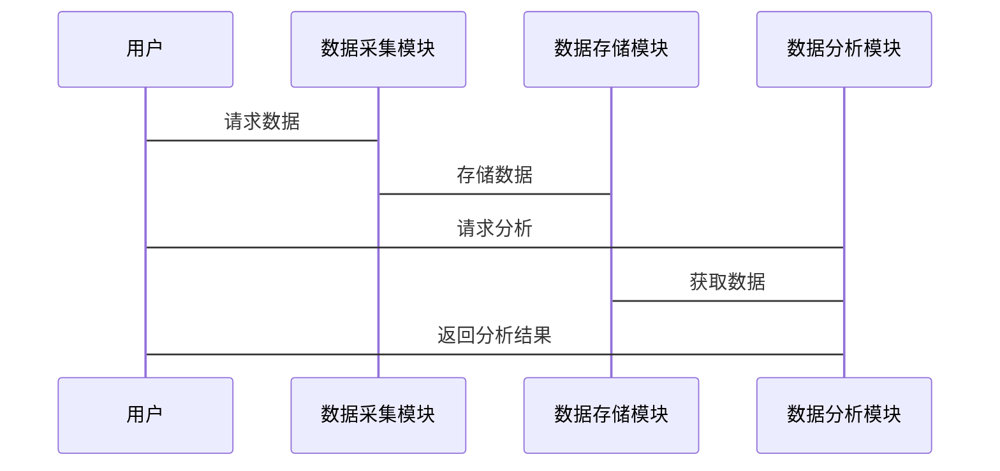

                 


# 竞争对手分析

> 关键词：竞争对手分析，商业模式，战略分析，竞争情报，系统架构

> 摘要：竞争对手分析是企业在现代商业环境中不可或缺的重要能力。本文从竞争对手分析的基本概念出发，深入探讨其核心原理、分析方法、系统架构及实际应用。通过系统化的分析框架和具体的案例分析，帮助读者掌握如何有效识别和应对竞争对手的挑战。

---

# 第一部分: 竞争对手分析概述

# 第1章: 竞争对手分析的背景与核心概念

## 1.1 竞争对手分析的定义与背景
### 1.1.1 竞争对手分析的定义
竞争对手分析是指通过研究市场上与企业具有直接或间接竞争关系的企业，了解其战略、产品、客户、市场表现等核心要素，从而为企业制定竞争策略提供依据。

### 1.1.2 竞争对手分析的重要性
- **战略制定**：帮助企业在市场中找到定位，制定有效的竞争策略。
- **风险控制**：识别潜在风险，提前做好应对准备。
- **创新与优化**：通过分析竞争对手的优缺点，优化自身产品和服务。

### 1.1.3 竞争对手分析的边界与外延
- **边界**：专注于直接竞争对手，避免过度分散资源。
- **外延**：包括潜在竞争对手和新兴市场参与者。

## 1.2 竞争对手分析的核心概念
### 1.2.1 竞争对手分析的模型与框架
- **五力模型**：迈克尔·波特的五力分析模型，包括潜在进入者、替代品威胁、供应商议价能力、买方议价能力以及现有竞争者之间的竞争程度。
- **价值链分析**：从价值链的角度分析竞争对手的成本结构和价值创造环节。

### 1.2.2 竞争对手分析的关键要素
- **战略分析**：分析竞争对手的战略目标和战略执行。
- **产品分析**：比较竞争对手的产品特性、价格、质量等。
- **客户分析**：研究竞争对手的客户群体和客户满意度。

### 1.2.3 竞争对手分析的流程与步骤
1. **确定竞争对手**：明确直接和间接竞争对手。
2. **数据收集**：通过公开资料、市场报告、客户反馈等多种渠道收集数据。
3. **数据分析**：使用统计方法和工具对数据进行分析。
4. **制定策略**：根据分析结果制定竞争策略。

## 1.3 竞争对手分析的工具与方法
### 1.3.1 竞争对手分析的常用工具
- **SWOT分析**：分析竞争对手的优势、劣势、机会和威胁。
- **KPI分析**：通过关键绩效指标对比竞争对手的表现。

### 1.3.2 竞争对手分析的主流方法
- **定性分析**：基于经验和行业知识进行分析。
- **定量分析**：通过数据和指标进行量化分析。

### 1.3.3 竞争对手分析的优劣势对比
| 方法 | 优点 | 缺点 |
|------|------|------|
| 定性分析 | 灵活性高 | 主观性较强 |
| 定量分析 | 客观性强 | 可能忽略非数据因素 |

## 1.4 本章小结
本章介绍了竞争对手分析的基本概念、重要性以及核心工具和方法，为后续的深入分析奠定了基础。

---

# 第二部分: 竞争对手分析的核心概念与联系

# 第2章: 竞争对手分析的核心概念原理

## 2.1 竞争对手分析的核心原理
### 2.1.1 竞争对手分析的理论基础
- **战略管理理论**：基于迈克尔·波特的五力模型和价值链分析。
- **竞争优势理论**：分析企业内部资源和外部环境的结合。

### 2.1.2 竞争对手分析的数学模型
- **竞争指数模型**：通过量化指标计算竞争对手的综合竞争力指数。
  $$ 竞争指数 = \sum (市场份额 \times 产品评分 \times 服务质量) $$

### 2.1.3 竞争对手分析的算法原理
- **层次分析法（AHP）**：用于多因素决策分析，确定各因素的权重。

## 2.2 竞争对手分析的概念属性特征对比
| 概念 | 特征 | 优势 | 劣势 |
|------|------|------|------|
| 战略分析 | 长期目标导向 | 战略性高 | 短期效果不明显 |
| 产品分析 | 细化产品特性 | 精准性高 | 数据收集难度大 |

## 2.3 竞争对手分析的ER实体关系图
```mermaid
er
  %%{初始化}%%
  init: public;
  %%{实体}%%
  顾客
  产品
  竞争对手
  %%{关系}%%
  顾客-产品：购买关系
  顾客-竞争对手：选择关系
  产品-竞争对手：市场竞争关系
```

# 第3章: 竞争对手分析的算法原理

## 3.1 竞争对手分析的算法概述
### 3.1.1 竞争对手分析的常用算法
- **聚类分析**：将竞争对手分为不同类别，便于制定差异化策略。
- **回归分析**：预测竞争对手的市场反应。

### 3.1.2 竞争对手分析算法的优劣势
| 算法 | 优点 | 缺点 |
|------|------|------|
| 聚类分析 | 可视化直观 | 需大量数据支持 |
| 回归分析 | 预测性强 | 数据假设严格 |

## 3.2 竞争对手分析算法的实现
### 3.2.1 算法实现的步骤与流程
1. 数据收集：获取竞争对手的市场份额、产品评分等数据。
2. 数据预处理：清洗数据，处理缺失值。
3. 算法选择：根据需求选择聚类或回归算法。
4. 模型训练：训练模型并进行验证。
5. 结果分析：解读结果并制定策略。

### 3.2.2 算法实现的代码示例
```python
import pandas as pd
from sklearn.cluster import KMeans

# 数据预处理
data = pd.read_csv('competitor_data.csv')
data.dropna(inplace=True)

# 模型训练
model = KMeans(n_clusters=3)
model.fit(data[['市场份额', '产品评分']])

# 结果分析
print(model.labels_)
```

## 3.3 竞争对手分析的数学模型
- **聚类模型**：使用K-means算法将竞争对手分为不同的集群。
  $$ \text{目标函数} = \sum_{i=1}^{n} \sum_{j=1}^{k} (x_{ij} - c_j)^2 $$

---

# 第三部分: 竞争对手分析的系统架构

# 第4章: 竞争对手分析的系统架构设计

## 4.1 问题场景介绍
企业需要实时监控竞争对手的市场动态，及时调整自己的市场策略。

## 4.2 系统功能设计
### 4.2.1 领域模型


### 4.2.2 系统架构


## 4.3 系统接口设计
- 数据接口：与第三方数据源对接。
- 用户接口：提供友好的用户界面，展示分析结果。

## 4.4 系统交互流程


---

# 第四部分: 项目实战

# 第5章: 项目实战：竞争对手分析系统实现

## 5.1 环境安装
- 安装Python、Flask框架和Scrapy爬虫框架。

## 5.2 系统核心实现
### 5.2.1 数据采集模块
```python
import scrapy

class CompetitorSpider(scrapy.Spider):
    name = 'competitor'
    def start_requests(self):
        urls = ['https://example.com/competitor']
        for url in urls:
            yield scrapy.Request(url=url, callback=self.parse)

    def parse(self, response):
        for competitor in response.xpath('//div[@class="competitor"]'):
            yield {
                'name': competitor.xpath('./h2/text()').extract_first(),
                'share': competitor.xpath('./p/text()').extract_first()
            }
```

### 5.2.2 数据分析模块
```python
from flask import Flask, jsonify
import pandas as pd

app = Flask(__name__)

@app.route('/analyze', methods=['POST'])
def analyze():
    data = pd.read_json(request.get_json())
    # 数据分析逻辑
    return jsonify({'result': 'success'})

if __name__ == '__main__':
    app.run(debug=True)
```

## 5.3 案例分析与解读
通过具体案例分析，展示如何利用上述系统实现竞争对手分析。

---

# 第五部分: 最佳实践与总结

# 第6章: 最佳实践与总结

## 6.1 小结
竞争对手分析是企业在市场中生存和发展的关键能力，通过系统化的分析方法和工具，可以帮助企业制定有效的竞争策略。

## 6.2 注意事项
- 数据来源的可靠性
- 分析模型的适用性
- 结果的可操作性

## 6.3 拓展阅读
- 《竞争战略》（迈克尔·波特）
- 《数据分析实战》

---

作者：AI天才研究院/AI Genius Institute & 禅与计算机程序设计艺术 /Zen And The Art of Computer Programming

