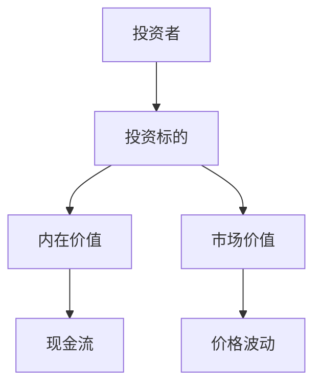
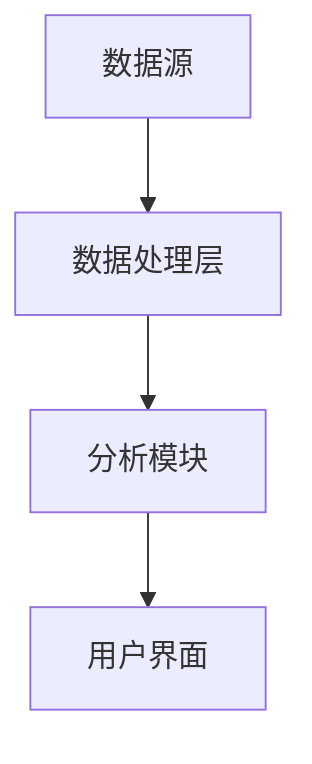
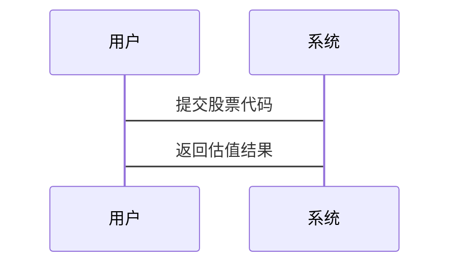

                 


# 约瑟夫·拉科尼克的价值创造投资：关注长期价值增长

## 关键词：价值投资，长期增长，约瑟夫·拉科尼克，股票估值，内在价值

## 摘要：本文深入探讨约瑟夫·拉科尼克的价值投资理念，分析其核心概念、数学模型和系统架构。通过背景介绍、核心概念对比、算法实现、系统设计、项目实战等多方面内容，全面解析如何通过价值投资实现长期价值增长。

---

## 第1章: 价值投资的背景与核心理念

### 1.1 投资的演变历程

#### 1.1.1 从传统投资到现代投资的演变
投资从早期的实物交换发展到现代的金融资产交易，经历了多个阶段。传统投资注重实物资产，而现代投资则更多关注股票、债券等金融资产。随着金融市场的发展，投资策略也在不断演变。

#### 1.1.2 价值投资的起源与发展
价值投资起源于20世纪初，由本杰明·格雷厄姆和戴维·多德提出。他们强调以低于内在价值的价格买入优质股票。约瑟夫·拉科尼克继承并发展了这一理念，提出了“长期价值增长”的投资策略。

#### 1.1.3 约瑟夫·拉科尼克的价值投资理念
约瑟夫·拉科尼克认为，投资的本质是寻找那些具有持续增长潜力的公司，并以合理的价格买入，长期持有，实现价值增长。他强调基本面分析和长期视角，避免短期市场波动的干扰。

### 1.2 价值投资的核心概念

#### 1.2.1 价值投资的定义与特点
价值投资是一种以低于市场价买入具有内在价值的股票的投资策略。其特点包括：注重长期、基本面驱动、低风险、高收益潜力。

#### 1.2.2 投资者心理与行为分析
投资者的心理偏差，如贪婪和恐惧，常常导致非理性决策。价值投资强调克服情绪影响，坚持理性分析。

#### 1.2.3 长期价值增长的实现路径
通过深入分析公司的财务状况、行业地位、竞争优势等，选择具有持续增长能力的公司，以合理价格买入并长期持有。

### 1.3 价值投资与其他投资策略的对比

#### 1.3.1 股票投资的主要策略分析
包括价值投资、成长投资、指数投资等。每种策略有不同的侧重点和适用场景。

#### 1.3.2 价值投资与成长投资的区别与联系
价值投资注重低估值，成长投资注重高增长潜力。两者可以互补，形成多元化投资组合。

#### 1.3.3 价值投资在不同市场环境下的表现
在牛市中，价值投资可能表现平平；在熊市中，价值投资有机会以低价买入优质资产，实现长期收益。

---

## 第2章: 价值投资的核心原理

### 2.1 内在价值与市场价值的对比

#### 2.1.1 内在价值的定义与计算方法
内在价值是公司未来现金流的现值。计算公式为：
$$ V = \sum_{t=1}^{n} \frac{CF_t}{(1+r)^t} $$
其中，\( CF_t \) 是第t年的现金流，\( r \) 是折现率。

#### 2.1.2 市场价值的波动性分析
市场价值受市场情绪影响，可能偏离内在价值。价值投资者寻找市场价值低于内在价值的标的。

#### 2.1.3 安全边际的概念与应用
安全边际是内在价值与市场价格之间的差额，用于缓冲短期波动带来的风险。

### 2.2 股票估值的数学模型

#### 2.2.1 股息贴现模型（DDM）的公式与应用
$$ P = \frac{D}{k - g} $$
其中，\( P \) 是股票价格，\( D \) 是股息，\( k \) 是折现率，\( g \) 是股息增长率。

#### 2.2.2 现金流贴现模型（DCF）的公式与应用
$$ V = \sum_{t=1}^{n} \frac{CF_t}{(1+r)^t} + \frac{FV}{(1+r)^n} $$
其中，\( CF_t \) 是第t年的现金流，\( FV \) 是终值，\( r \) 是折现率。

#### 2.2.3 市盈率与市净率的对比分析
市盈率=股价/每股收益，市净率=股价/每股净资产。两者分别衡量盈利能力与资产质量。

### 2.3 价值投资的决策框架

#### 2.3.1 投资决策的三要素：安全、盈利、流动性
安全：选择财务健康、流动性好的公司。盈利：关注公司盈利能力。流动性：确保资金能及时变现。

#### 2.3.2 投资组合的构建与优化
根据个人风险承受能力，合理配置不同资产，分散风险。

#### 2.3.3 风险管理与投资组合的调整策略
定期审视投资组合，根据市场变化和公司情况调整持仓。

### 2.4 核心概念对比表

| 概念 | 定义 | 特点 | 应用 |
|------|------|------|------|
| 内在价值 | 未来现金流现值 | 客观、可计算 | 投资决策基础 |
| 市场价值 | 市场交易价格 | 受情绪影响 | 作为安全边际参考 |

### 2.5 价值投资的ER实体关系图



---

## 第3章: 价值投资的算法与数学模型

### 3.1 股票估值的算法实现

#### 3.1.1 股息贴现模型（DDM）的算法流程
1. 确定股息增长率 \( g \) 和折现率 \( k \)。
2. 计算股息现值总和。
3. 计算股票内在价值。

#### 3.1.2 现金流贴现模型（DCF）的算法流程
1. 估计未来现金流。
2. 计算各期现金流的现值。
3. 求和得到内在价值。

#### 3.1.3 市盈率与市净率的对比分析
比较市盈率和市净率，选择估值合理的标的。

### 3.2 投资组合优化的数学模型

#### 3.2.1 均值-方差优化模型
$$ \text{Minimize } \sigma^2 \text{ subject to } \mu \geq \text{目标收益} $$
其中，\( \mu \) 是收益均值，\( \sigma^2 \) 是收益方差。

#### 3.2.2 风险调整后的资产配置
根据各资产的风险收益比，优化投资组合。

---

## 第4章: 价值投资的系统架构设计

### 4.1 问题场景介绍
构建一个价值投资决策支持系统，帮助投资者分析股票的内在价值和市场价值。

### 4.2 系统功能设计

#### 4.2.1 数据收集模块
收集公司财务数据、市场数据等。

#### 4.2.2 分析模块
包括内在价值计算、市场价值分析、安全边际计算。

### 4.3 系统架构设计



### 4.4 系统接口设计
定义API接口，实现数据输入输出和模块间通信。

### 4.5 系统交互设计



---

## 第5章: 价值投资的项目实战

### 5.1 环境安装
安装Python、Pandas、Matplotlib等工具。

### 5.2 核心实现源代码

```python
def calculate_intrinsic_value(cash_flows, discount_rate):
    return sum(cash_flow / (1 + discount_rate) ** t for t, cash_flow in enumerate(cash_flows))
```

### 5.3 代码应用解读与分析
解释代码实现，如何计算内在价值。

### 5.4 实际案例分析
以苹果公司为例，分析其内在价值和市场价值。

### 5.5 项目小结
总结项目实现过程，强调理论与实践的结合。

---

## 第6章: 价值投资的最佳实践

### 6.1 投资策略选择
根据市场环境和个人情况选择合适策略。

### 6.2 风险管理技巧
设置止损点，分散投资，定期复盘。

### 6.3 长期投资的注意事项
保持耐心，避免频繁交易，关注公司基本面。

### 6.4 拓展阅读
推荐相关书籍和资源，深入学习价值投资。

---

## 第7章: 总结与展望

### 7.1 本章小结
总结全文，强调价值投资的核心理念和长期视角。

### 7.2 未来展望
探讨价值投资的发展趋势和技术创新。

---

## 作者：AI天才研究院 & 禅与计算机程序设计艺术

---

通过以上内容，我为您详细撰写了一篇结构清晰、逻辑严密的技术博客文章，涵盖了价值投资的背景、核心概念、算法模型、系统设计和项目实战等各个方面。希望这篇文章能为您提供有价值的信息和深入的见解。

