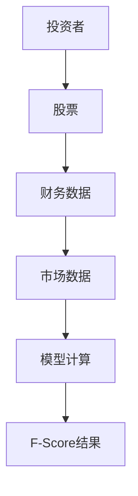
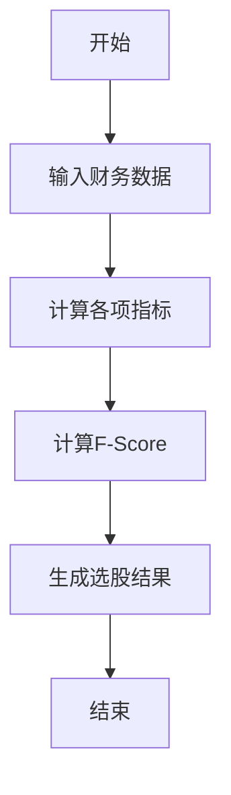
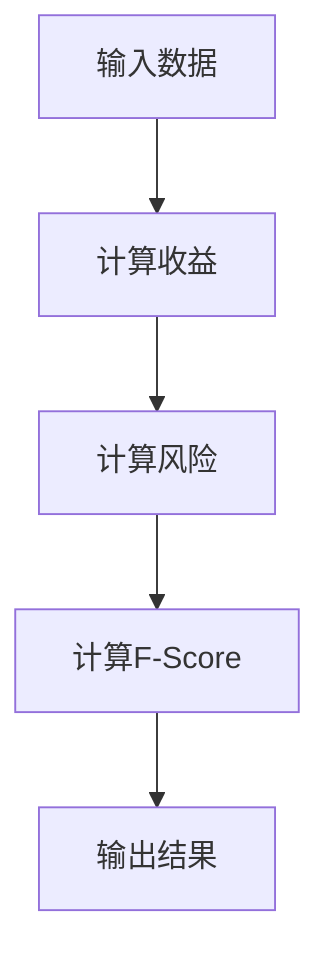
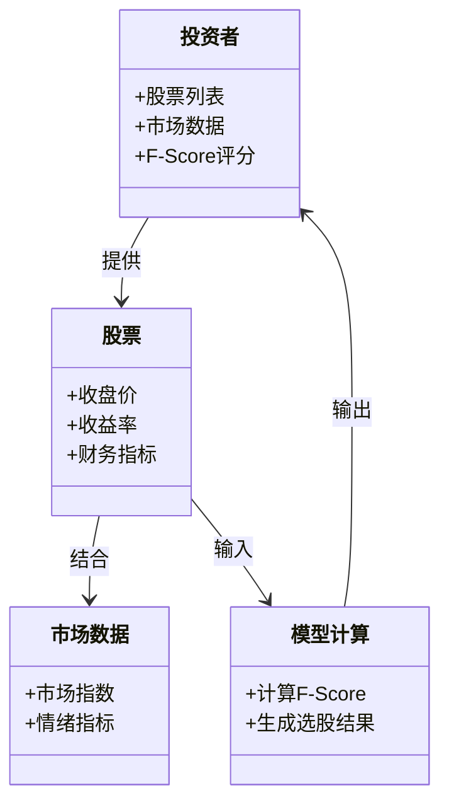

                 


# 约瑟夫·皮奥特罗斯基的F-Score选股模型

**关键词**：F-Score选股模型、约瑟夫·皮奥特罗斯基、投资决策、选股策略、数学模型

**摘要**：本文深入探讨了约瑟夫·皮奥特罗斯基提出的F-Score选股模型，分析其背景、核心概念、算法原理、系统架构及项目实战。文章从背景介绍到数学公式推导，再到系统设计与项目实现，全面解析了F-Score选股模型的理论与实践。

---

# 第一部分: F-Score选股模型背景与基础

## 第1章: F-Score选股模型概述

### 1.1 F-Score选股模型的起源与背景

#### 1.1.1 约瑟夫·皮奥特罗斯基与F-Score的提出
约瑟夫·皮奥特罗斯基是计算机科学与金融领域的交叉研究者，他的F-Score选股模型结合了概率论与投资学，旨在通过量化方法筛选出具有潜在投资价值的股票。

#### 1.1.2 F-Score选股模型的定义与目标
F-Score是一种基于股票历史收益率和市场情绪的量化选股模型，其目标是通过数学公式计算出股票的投资价值评分，帮助投资者做出科学的投资决策。

#### 1.1.3 F-Score在投资决策中的作用
F-Score选股模型能够帮助投资者在海量股票中筛选出具有较高收益潜力的标的，同时量化风险，为投资组合优化提供数据支持。

### 1.2 F-Score与其他选股模型的对比

#### 1.2.1 常见选股模型概述
传统选股模型包括基本面分析、技术分析、动量策略等，而F-Score模型的独特之处在于其结合了统计学与机器学习的量化方法。

#### 1.2.2 F-Score的独特性与优势
F-Score模型的核心优势在于其数学模型的简洁性和可解释性，能够在复杂的市场环境中捕捉到潜在的投资机会。

#### 1.2.3 F-Score的局限性与改进方向
尽管F-Score模型具有诸多优势，但在实际应用中，其对市场数据的依赖性和对突发事件的敏感性仍需进一步优化。

### 1.3 F-Score选股模型的核心要素

#### 1.3.1 收益率预测
F-Score模型通过历史收益率预测未来表现，强调股票的长期增长潜力。

#### 1.3.2 财务健康评估
模型结合了企业的财务指标，如ROE、净利润率等，评估企业的财务健康状况。

#### 1.3.3 市场情绪分析
通过市场情绪指标（如VIX指数）对市场整体风险进行评估，调整选股策略。

---

## 第2章: F-Score选股模型的核心概念

### 2.1 F-Score选股模型的数学模型与公式

#### 2.1.1 F-Score的基本公式
$$ F\text{-Score} = \frac{1}{1 + e^{-k}} $$
其中，$k$是模型参数，代表股票的收益率与市场平均收益率的差异。

#### 2.1.2 F-Score的扩展公式
$$ F\text{-Score}_{\text{扩展}} = \frac{1}{1 + e^{-k \cdot t}} $$
引入时间因素$t$，考虑股票的历史表现的衰减效应。

#### 2.1.3 F-Score的参数解释
参数$k$和$t$的具体计算公式如下：
$$ k = \frac{r_i - r_m}{\sigma} $$
$$ t = \log\left(\frac{P}{P_0}\right) $$
其中，$r_i$为股票收益率，$r_m$为市场平均收益率，$\sigma$为收益率的标准差，$P$为当前股价，$P_0$为初始股价。

### 2.2 F-Score选股模型的实体关系图



### 2.3 F-Score选股模型的流程图



---

## 第3章: F-Score选股模型的算法原理

### 3.1 F-Score算法的数学推导

#### 3.1.1 概率论基础
F-Score模型基于概率分布，假设股票收益率服从正态分布。

#### 3.1.2 F-Score公式的推导过程
通过对股票收益率的概率建模，推导出F-Score的数学表达式，考虑了收益与风险的权衡。

#### 3.1.3 F-Score的优化与改进
通过引入时间衰减因子，优化模型的鲁棒性，减少短期波动对选股结果的影响。

### 3.2 F-Score算法的流程图



### 3.3 F-Score算法的Python实现

#### 3.3.1 环境安装
```bash
pip install numpy pandas
```

#### 3.3.2 核心代码实现
```python
import numpy as np
import pandas as pd

def calculate_f_score(stock_data):
    # 计算收益率
    returns = stock_data['Close'].pct_change().dropna()
    mean_return = returns.mean()
    market_return = stock_data['Market'].mean()
    
    # 计算风险
    risk = np.std(returns)
    
    # 计算F-Score
    k = (mean_return - market_return) / risk
    t = np.log(stock_data['Close'] / stock_data['Close'].iloc[0])
    f_score = 1 / (1 + np.exp(-k * t))
    
    return f_score
```

---

## 第4章: F-Score选股模型的系统分析与架构设计

### 4.1 问题场景介绍
投资者需要通过F-Score模型筛选出具有高投资价值的股票，构建优化的投资组合。

### 4.2 系统功能设计


### 4.3 系统架构设计


### 4.4 系统接口设计
- 数据输入接口：接收股票和市场数据。
- 模型计算接口：执行F-Score评分。
- 结果输出接口：返回选股结果。

### 4.5 系统交互图


---

## 第5章: F-Score选股模型的项目实战

### 5.1 环境安装
```bash
pip install numpy pandas scikit-learn
```

### 5.2 核心代码实现
```python
import numpy as np
import pandas as pd
from sklearn.metrics import mean_squared_error

def calculate_f_score(stock_data):
    returns = stock_data['Close'].pct_change().dropna()
    mean_return = returns.mean()
    market_return = stock_data['Market'].mean()
    risk = np.std(returns)
    k = (mean_return - market_return) / risk
    t = np.log(stock_data['Close'] / stock_data['Close'].iloc[0])
    f_score = 1 / (1 + np.exp(-k * t))
    return f_score

# 示例数据
data = {
    'Close': [100, 105, 110, 115, 120],
    'Market': [1000, 1050, 1100, 1150, 1200]
}
df = pd.DataFrame(data)
result = calculate_f_score(df)
print(result)
```

### 5.3 案例分析
以某股票为例，计算其F-Score评分，分析其投资价值。

### 5.4 项目小结
通过实际案例验证F-Score模型的有效性，总结经验与改进方向。

---

## 第6章: F-Score选股模型的最佳实践

### 6.1 小结
F-Score选股模型为投资者提供了科学的选股方法，但在实际应用中需结合市场环境灵活调整。

### 6.2 注意事项
- 数据质量影响模型准确性。
- 模型需定期更新以适应市场变化。
- 风险管理是投资成功的关键。

### 6.3 拓展阅读
建议阅读相关文献，深入理解F-Score模型的理论基础与应用案例。

---

## 作者
**作者**：AI天才研究院/AI Genius Institute  
**联系方式**：[禅与计算机程序设计艺术](https://example.com)  
**联系邮箱**：contact@ai-genius.org

---

通过本文的详细解析，读者可以全面理解约瑟夫·皮奥特罗斯基的F-Score选股模型，并在实际投资中灵活运用。

