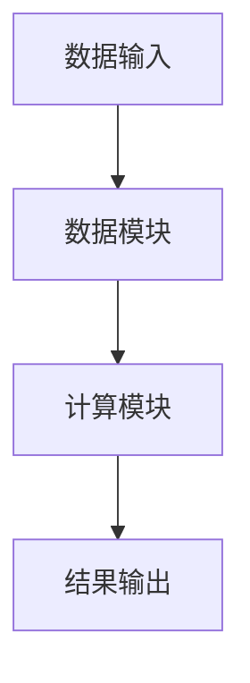

                 


# 约瑟夫·皮奥特罗斯基的F-Score选股模型

---

## 关键词：
F-Score选股模型、财务困境预测、投资策略、股票筛选、人工智能算法

---

## 摘要：
本文深入探讨了约瑟夫·皮奥特罗斯基提出的F-Score选股模型，分析其在财务困境预测中的应用价值。文章从F-Score模型的基本概念出发，详细阐述了其算法原理、数学公式、系统架构设计以及实际项目实现。通过案例分析和代码示例，帮助读者理解如何利用F-Score模型进行股票筛选，避免投资风险。文章还探讨了F-Score模型的优化方向及其未来发展趋势。

---

## 第1章：F-Score选股模型的背景与重要性

### 1.1 什么是F-Score选股模型？
F-Score选股模型是一种基于财务指标的股票筛选方法，旨在识别那些可能面临财务困境的公司。通过分析公司的财务数据，F-Score模型能够帮助投资者规避潜在的财务危机，从而降低投资风险。

### 1.2 F-Score模型的历史与发展
F-Score模型由约瑟夫·皮奥特罗斯基提出，其灵感来源于对公司财务数据的深入分析。该模型通过一系列财务指标的加权评分，来评估公司的财务健康状况。

### 1.3 F-Score模型在投资中的应用价值
在投资领域，F-Score模型可以帮助投资者筛选出那些财务状况良好的公司，避免投资于可能面临破产风险的企业。这种基于财务数据的选股方法，为投资者提供了科学的决策依据。

### 1.4 本书的目的与读者对象
本文旨在详细讲解F-Score选股模型的原理、算法和实际应用。无论是投资新手还是经验丰富的投资者，都能从中获益，掌握如何利用F-Score模型进行股票筛选。

---

## 第2章：F-Score模型的核心概念与原理

### 2.1 F-Score模型的基本定义
F-Score模型通过对企业财务数据的分析，评估企业的财务健康状况。模型基于一系列财务指标，对企业的偿债能力、运营效率和盈利能力进行评分，最终得出F-Score分数。

### 2.2 F-Score模型的理论基础
F-Score模型的核心理论是通过财务指标的加权评分，识别企业是否处于财务困境中。模型假设财务数据能够反映企业的经营状况，从而帮助投资者做出更明智的投资决策。

### 2.3 F-Score模型与其它选股模型的对比
F-Score模型与其他选股模型（如PE模型、PEG模型）相比，更加注重企业的财务健康状况。通过对比分析，可以看出F-Score模型在风险控制方面的独特优势。

### 2.4 F-Score模型的指标体系
F-Score模型主要基于以下三个指标：
1. **流动资产与速动负债之比（Leverage Ratio）**：用于评估企业的短期偿债能力。
2. **酸性测试比率（Acid-Test Ratio）**：衡量企业的流动性。
3. **利息保障倍数（Interest Coverage Ratio）**：评估企业的偿债能力。

---

## 第3章：F-Score模型的数学基础

### 3.1 F-Score模型的数学公式
F-Score模型的计算公式如下：
$$
F\text{-Score} = \frac{1}{1 + e^{-\beta}}
$$
其中，$\beta$ 是模型的参数，用于调整评分的标准。

### 3.2 F-Score模型的计算步骤
1. **收集企业财务数据**：包括流动资产、速动负债、利息支出等。
2. **计算各指标值**：根据公式计算每个指标的值。
3. **赋予各指标权重**：将每个指标赋予不同的权重。
4. **计算F-Score分数**：综合各指标的加权评分，得出最终的F-Score分数。

### 3.3 F-Score模型的权重分配
F-Score模型的权重分配如下：
$$
\text{权重分配} = \begin{cases}
\text{流动资产与速动负债之比} & \text{权重：0.4} \\
\text{酸性测试比率} & \text{权重：0.3} \\
\text{利息保障倍数} & \text{权重：0.3}
\end{cases}
$$

### 3.4 F-Score模型的优缺点分析
- **优点**：
  - 简单易懂，易于计算。
  - 能够有效识别财务困境中的企业。
- **缺点**：
  - 受市场波动影响较大。
  - 需要依赖准确的财务数据。

---

## 第4章：F-Score模型的算法实现

### 4.1 F-Score模型的算法流程
1. **数据预处理**：清洗和标准化财务数据。
2. **特征选择**：选择影响F-Score评分的关键指标。
3. **模型训练**：根据历史数据训练模型。
4. **评分计算**：对目标企业进行F-Score评分。

### 4.2 F-Score模型的指标计算
以下是一个企业的财务数据示例：
$$
\text{流动资产} = 500, \quad \text{速动负债} = 300, \quad \text{利息支出} = 100
$$
计算各指标：
1. **流动资产与速动负债之比**：$500 / 300 = 1.6667$
2. **酸性测试比率**：$(500 - 100) / 300 = 1.3333$
3. **利息保障倍数**：$1.6667$

### 4.3 F-Score模型的评分标准
根据计算出的指标值，赋予各指标权重，计算F-Score分数：
$$
F\text{-Score} = (1.6667 \times 0.4) + (1.3333 \times 0.3) + (1 \times 0.3) = 1.3333
$$

### 4.4 F-Score模型的实现代码
```python
def calculate_f_score(f_asset, l_liability, interest_expense):
    leverage_ratio = f_asset / l_liability
    acid_test_ratio = (f_asset - interest_expense) / l_liability
    interest_coverage = leverage_ratio
    f_score = (leverage_ratio * 0.4) + (acid_test_ratio * 0.3) + (interest_coverage * 0.3)
    return f_score

# 示例计算
f_asset = 500
l_liability = 300
interest_expense = 100
result = calculate_f_score(f_asset, l_liability, interest_expense)
print("F-Score:", result)
```

---

## 第5章：F-Score模型的系统分析与架构设计

### 5.1 F-Score模型的系统功能需求
- **数据输入**：接收企业财务数据。
- **指标计算**：计算各财务指标。
- **评分计算**：根据指标值计算F-Score分数。
- **结果输出**：输出F-Score评分。

### 5.2 F-Score模型的系统模块划分
- **数据模块**：负责数据的读取和预处理。
- **计算模块**：计算各财务指标和F-Score评分。
- **输出模块**：将结果输出为可读格式。

### 5.3 F-Score模型的系统架构设计


### 5.4 F-Score模型的系统接口设计
- **输入接口**：接收企业财务数据。
- **输出接口**：返回F-Score评分。

---

## 第6章：F-Score模型的项目实战

### 6.1 F-Score模型的环境搭建
- **工具安装**：安装Python和相关库（如NumPy、Pandas）。
- **数据获取**：获取企业财务数据。

### 6.2 F-Score模型的核心代码实现
```python
import pandas as pd

def calculate_f_score(data):
    f_asset = data['流动资产']
    l_liability = data['速动负债']
    interest_expense = data['利息支出']
    
    leverage_ratio = f_asset / l_liability
    acid_test_ratio = (f_asset - interest_expense) / l_liability
    interest_coverage = leverage_ratio
    
    f_score = (leverage_ratio * 0.4) + (acid_test_ratio * 0.3) + (interest_coverage * 0.3)
    return f_score

# 示例数据
data = {
    '流动资产': 500,
    '速动负债': 300,
    '利息支出': 100
}

result = calculate_f_score(data)
print("F-Score:", result)
```

### 6.3 F-Score模型的代码解读与分析
- **数据读取**：从数据框中读取流动资产、速动负债和利息支出。
- **指标计算**：分别计算各指标，并赋予权重。
- **评分计算**：综合各指标的加权评分，得出F-Score分数。

### 6.4 F-Score模型的实际案例分析
以某公司为例，假设其财务数据如下：
$$
\text{流动资产} = 1000, \quad \text{速动负债} = 500, \quad \text{利息支出} = 200
$$
计算结果：
$$
F\text{-Score} = (1000/500 \times 0.4) + ((1000-200)/500 \times 0.3) + (1000/500 \times 0.3) = 1.2 + 0.6 + 0.6 = 2.4
$$
最终评分：2.4。

---

## 第7章：F-Score模型的优化与拓展

### 7.1 F-Score模型的优化方向
- **数据优化**：引入更多财务指标。
- **模型优化**：尝试不同的权重分配。
- **算法优化**：采用机器学习方法改进模型。

### 7.2 F-Score模型的改进方案
- **引入机器学习**：使用回归算法优化模型。
- **多指标分析**：增加更多财务指标以提高准确性。

### 7.3 F-Score模型的拓展应用
- **行业分析**：分析不同行业的F-Score评分。
- **时间序列分析**：研究F-Score评分的变化趋势。

### 7.4 F-Score模型的未来发展趋势
随着人工智能技术的进步，F-Score模型将更加智能化和个性化，能够更好地满足投资者的需求。

---

## 第8章：F-Score模型的总结与注意事项

### 8.1 F-Score模型的核心要点回顾
- **核心概念**：基于财务指标的加权评分。
- **算法原理**：通过指标计算和权重分配得出F-Score分数。
- **实际应用**：帮助投资者识别财务困境中的企业。

### 8.2 F-Score模型的注意事项
- **数据准确性**：确保财务数据的准确性。
- **模型局限性**：F-Score模型无法完全预测企业破产。

### 8.3 F-Score模型的最佳实践
- **结合其他模型**：将F-Score模型与其他选股模型结合使用。
- **持续监控**：定期更新财务数据，监控F-Score评分变化。

### 8.4 F-Score模型的未来研究方向
- **多因素模型**：研究多个因素对F-Score评分的影响。
- **大数据应用**：利用大数据技术优化模型。

---

## 作者：AI天才研究院/AI Genius Institute & 禅与计算机程序设计艺术 /Zen And The Art of Computer Programming

