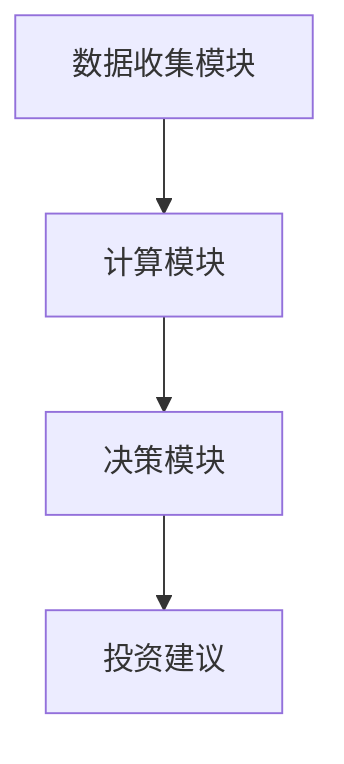

                 


# 约瑟夫·皮奥特罗斯基的F-Score：量化价值投资的尝试

## 关键词：F-Score，价值投资，量化分析，财务指标，投资策略

## 摘要：  
本文深入探讨了约瑟夫·皮奥特罗斯基提出的F-Score方法，这是一种将价值投资理念与量化分析相结合的投资策略。文章从F-Score的核心概念、数学模型、系统架构到实际应用案例进行了全面解析，揭示了其在投资决策中的独特优势和实际价值。

---

# 第一部分: F-Score的核心概念与背景

## 第1章: 价值投资的量化尝试

### 1.1 传统价值投资的局限性  
传统价值投资依赖于对基本面的深度分析和主观判断，但这种模式在面对海量数据和复杂市场环境时显得效率低下，且难以量化。投资者需要一种更高效、可复制的量化方法来辅助决策。

### 1.2 F-Score的起源与核心思想  
约瑟夫·皮奥特罗斯基提出的F-Score是一种基于财务指标的量化价值投资方法。它通过筛选具有强大基本面的公司，帮助投资者识别潜在的优质投资标的。

### 1.3 F-Score的核心目标  
F-Score的核心目标是通过量化分析，筛选出具有稳定增长潜力和估值优势的公司，为投资者提供科学的投资决策依据。

---

## 第2章: F-Score的基本原理

### 2.1 F-Score的定义  
F-Score是一种基于财务指标的量化评分系统，通过对企业财务状况的综合评估，生成一个分数，用以衡量企业的投资价值。

### 2.2 F-Score的核心指标  
F-Score主要关注以下三个核心指标：  
1. **流动资产**：衡量企业的短期偿债能力。  
2. **流动负债**：衡量企业的短期债务水平。  
3. **留存收益**：衡量企业的利润积累能力。  

### 2.3 F-Score的评分标准  
F-Score的评分范围为0到10分，分数越高表示企业的投资价值越大。通常，分数大于6分的企业被视为潜在的投资标的。

---

## 第3章: F-Score的数学模型与计算方法

### 3.1 F-Score的数学公式  
F-Score的计算公式如下：  
$$ F\text{-Score} = \frac{\text{流动资产} - \text{流动负债}}{\text{留存收益}} $$  

### 3.2 F-Score的计算步骤  
1. 收集目标公司的财务数据。  
2. 计算流动资产、流动负债和留存收益。  
3. 代入公式计算F-Score。  
4. 根据F-Score的评分标准进行投资决策。

### 3.3 F-Score的实际应用  
以下是一个F-Score计算的示例：  
假设某公司流动资产为$500万，流动负债为$300万，留存收益为$200万。  
$$ F\text{-Score} = \frac{500 - 300}{200} = 1 $$  
根据评分标准，F-Score为1分的公司不具有投资价值。

---

# 第二部分: F-Score的系统架构与实现

## 第4章: F-Score的系统设计

### 4.1 系统功能模块  
1. 数据收集模块：从财务报表中提取流动资产、流动负债和留存收益。  
2. 计算模块：根据公式计算F-Score。  
3. 决策模块：根据F-Score评分生成投资建议。

### 4.2 F-Score的系统架构  


### 4.3 系统实现细节  
以下是一个Python实现的F-Score计算代码：  
```python
def calculate_f_score(流动资产, 流动负债, 留存收益):
    f_score = (流动资产 - 流动负债) / 留存收益
    return f_score

流动资产 = 500
流动负债 = 300
留存收益 = 200

f_score = calculate_f_score(流动资产, 流动负债, 留存收益)
print(f"公司F-Score为：{f_score}")
```

---

## 第5章: F-Score的投资策略与实战

### 5.1 F-Score的投资策略  
1. 筛选F-Score评分大于6分的公司。  
2. 对目标公司进行深入分析，结合其他指标进一步验证。  

### 5.2 F-Score的实际案例分析  
以下是一个实际案例：  
某公司A的F-Score为7分，某公司B的F-Score为3分。根据评分标准，投资者应优先选择公司A作为投资标的。

---

## 第6章: F-Score的优化与扩展

### 6.1 F-Score的优化方向  
1. 引入更多财务指标，如ROE（净资产收益率）和毛利率。  
2. 结合市场情绪和宏观经济指标进行动态调整。  

### 6.2 F-Score的扩展应用  
1. F-Score在行业间的应用差异。  
2. F-Score与机器学习的结合，提升预测准确性。  

---

## 第7章: F-Score的局限性与注意事项

### 7.1 F-Score的局限性  
1. 过于依赖历史数据，无法预测未来市场变化。  
2. 无法应对市场突发事件（如黑天鹅事件）。  

### 7.2 使用F-Score的注意事项  
1. F-Score仅作为投资参考，需结合其他指标进行综合判断。  
2. 定期更新财务数据，确保评分的准确性。  

---

## 结语

F-Score是一种简单而有效的量化价值投资方法，它通过财务指标的综合评估，帮助投资者筛选出具有潜力的优质公司。然而，F-Score也存在一定的局限性，投资者在实际应用中需结合其他因素进行综合判断。未来，随着技术的进步，F-Score将与更多量化方法结合，为投资决策提供更强大的支持。

---

## 作者：AI天才研究院/AI Genius Institute & 禅与计算机程序设计艺术 /Zen And The Art of Computer Programming

