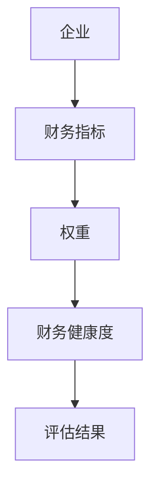
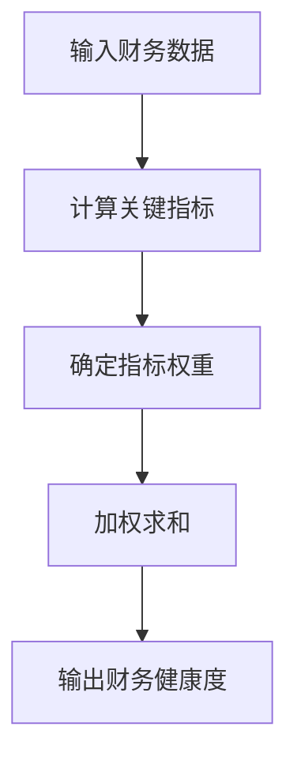
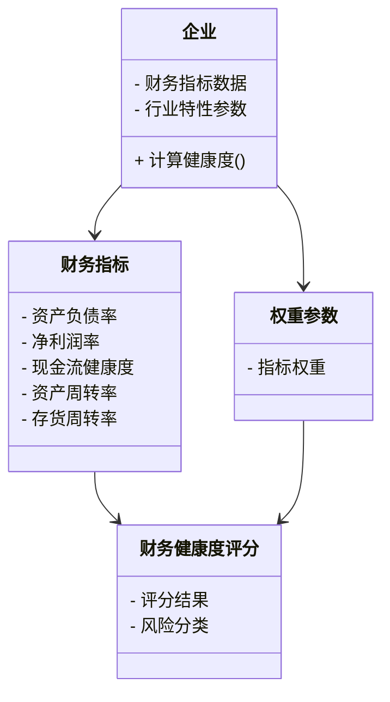
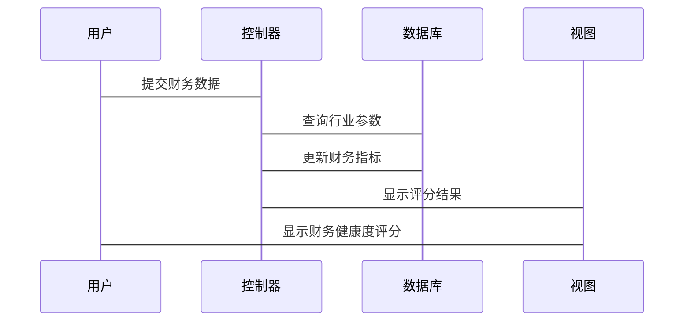

                 


# 约瑟夫·皮奥特罗斯基的财务健康度评估模型

---

## 关键词：  
财务健康度评估、约瑟夫·皮奥特罗斯基模型、财务指标分析、权重分配、算法原理、系统架构设计

---

## 摘要：  
本文深入探讨约瑟夫·皮奥特罗斯基提出的财务健康度评估模型，从模型的背景、核心概念、算法原理到系统架构设计，结合实际案例和代码实现，全面解析该模型的理论基础和应用价值。通过本文，读者将理解如何通过关键财务指标和权重分配来评估企业的财务健康状况，并掌握模型的实际应用方法。

---

## 第一部分：财务健康度评估模型的背景与核心概念

### 第1章：财务健康度评估的背景与问题

#### 1.1 财务健康度的基本概念

##### 1.1.1 什么是财务健康度
财务健康度是衡量企业财务状况健康程度的重要指标，反映了企业在一定时期内的财务稳定性、流动性和盈利能力。它不仅帮助企业内部管理者优化财务管理，还能为投资者、债权人等外部利益相关者提供重要的决策依据。

##### 1.1.2 财务健康度的重要性
- 企业经营决策：帮助企业在投资、融资、运营等方面做出更明智的决策。
- 投资者评估：投资者通过财务健康度判断企业的投资价值和风险水平。
- 债权人评估：债权人通过财务健康度评估企业还款能力，决定是否发放贷款。

##### 1.1.3 传统财务健康评估的局限性
传统财务评估方法通常依赖于单一指标或简单的线性组合，难以全面反映企业的财务状况。例如，仅关注资产负债率或利润率，忽视了现金流、资产结构等多方面因素的影响。

#### 1.2 约瑟夫·皮奥特罗斯基模型的提出背景

##### 1.2.1 约瑟夫·皮奥特罗斯基的学术贡献
约瑟夫·皮奥特罗斯基是财务管理和数据分析领域的著名学者，提出了多个在学术界和实务界广泛应用的财务分析模型。他的研究工作主要集中在如何通过多维度的财务指标和权重分配，全面评估企业的财务健康状况。

##### 1.2.2 模型提出的初衷
传统财务评估方法的局限性日益显现，尤其是在面对复杂多变的市场环境时，企业需要一个更加全面、动态的评估体系。约瑟夫·皮奥特罗斯基模型正是基于这一需求，提出了一种多维度、动态化的财务健康度评估方法。

##### 1.2.3 模型的核心目标
通过整合多个关键财务指标，并根据其对财务健康度的影响程度赋予不同的权重，模型能够更全面、准确地评估企业的财务状况。

#### 1.3 模型的创新点与应用价值

##### 1.3.1 创新点分析
- **多维度评估**：引入多个关键财务指标，而非单一指标。
- **动态权重分配**：根据企业所处行业、发展阶段等因素，动态调整各指标的权重。
- **数据驱动**：基于大量历史数据和统计分析，优化模型参数。

##### 1.3.2 应用场景概述
- 企业内部财务管理：帮助企业识别财务风险，优化资源配置。
- 投资者决策支持：为投资者提供更全面的企业财务健康评估。
- 风险控制：帮助债权人评估企业还款能力，降低信贷风险。

##### 1.3.3 对企业财务管理的启示
企业应定期进行财务健康度评估，及时发现问题并采取措施，同时注重多维度数据的综合分析，避免过于依赖单一指标。

---

### 第2章：约瑟夫·皮奥特罗斯基模型的核心概念与联系

#### 2.1 模型的核心概念

##### 2.1.1 财务健康度的定义
财务健康度是对企业财务状况的整体评估，综合考虑了企业的盈利能力、流动性、偿债能力、运营效率等多个维度。

##### 2.1.2 关键指标的选择
约瑟夫·皮奥特罗斯基模型选择了一系列关键财务指标，包括：
- 资产负债率（Debt-to-Asset Ratio）
- 净利润率（Net Profit Margin）
- 现金流健康度（Cash Flow Health）
- 资产周转率（Asset Turnover）
- 存货周转率（Inventory Turnover）

##### 2.1.3 权重分配的逻辑
各指标的权重并非固定，而是根据企业所处行业、发展阶段等因素进行动态调整。例如，制造业可能更注重存货周转率，而互联网企业可能更关注现金流健康度。

#### 2.2 核心概念的属性特征对比表

| 指标名称       | 属性1（数量化） | 属性2（风险性） | 属性3（关键性） |
|----------------|----------------|----------------|----------------|
| 资产负债率     | 高             | 高             | 中             |
| 净利润率       | 高             | 中             | 高             |
| 现金流健康度   | 高             | 高             | 高             |

#### 2.3 实体关系图（ER图）



---

### 第3章：约瑟夫·皮奥特罗斯基模型的算法原理

#### 3.1 算法概述

##### 3.1.1 算法的总体流程
1. 收集企业关键财务指标数据。
2. 根据企业特性确定各指标的权重。
3. 对各指标进行标准化处理。
4. 计算加权总和，得到财务健康度评分。
5. 根据评分结果进行风险分类。

##### 3.1.2 算法的核心思想
通过多维度财务指标的加权求和，全面反映企业的财务健康状况。权重的动态调整是模型的核心，确保评估结果更贴近企业的实际财务状况。

##### 3.1.3 算法的输入输出
- **输入**：企业的财务指标数据、行业特性参数。
- **输出**：财务健康度评分（通常为0-100分）和风险分类。

#### 3.2 算法流程图



#### 3.3 算法的数学模型

##### 3.3.1 财务健康度的计算公式
$$ \text{财务健康度} = \sum_{i=1}^{n} w_i \times f_i $$
其中：
- $w_i$ 是第i个指标的权重。
- $f_i$ 是第i个指标的评估值（标准化后的）。

##### 3.3.2 标准化处理
为了确保不同指标的可比性，需要对各指标进行标准化处理。例如，使用归一化方法：
$$ f_i = \frac{x_i - \min(x_i)}{\max(x_i) - \min(x_i)} $$

##### 3.3.3 权重计算
权重的计算通常基于统计分析或专家判断。例如，使用熵值法：
$$ w_i = \frac{S_i}{\sum_{j=1}^{n} S_j} $$
其中，$S_i$ 是第i个指标的熵值。

---

### 第4章：约瑟夫·皮奥特罗斯基模型的系统分析与架构设计

#### 4.1 问题场景介绍
在实际应用中，企业需要定期进行财务健康度评估，以便及时发现潜在问题。例如，某制造企业希望通过模型评估其财务状况，优化库存管理。

#### 4.2 系统功能设计

##### 4.2.1 领域模型（Mermaid 类图）



#### 4.3 系统架构设计

##### 4.3.1 系统架构图（Mermaid 架构图）

```mermaid
subgraph 数据层
    database[数据库]
end
subgraph 业务逻辑层
    controller[控制器]
end
subgraph 展示层
    view[视图]
end

controller --> database
view --> controller
```

#### 4.4 系统接口设计
- **输入接口**：接收企业的财务指标数据和行业特性参数。
- **输出接口**：返回财务健康度评分和风险分类结果。

#### 4.5 系统交互图（Mermaid 序列图）



---

## 第五章：项目实战——约瑟夫·皮奥特罗斯基模型的应用

### 5.1 项目环境安装

#### 5.1.1 安装Python
```bash
python --version
pip install --upgrade pip
```

#### 5.1.2 安装依赖库
```bash
pip install numpy pandas scikit-learn
```

### 5.2 核心代码实现

#### 5.2.1 数据预处理

```python
import pandas as pd
import numpy as np

# 加载数据
data = pd.read_csv('financial_indicators.csv')

# 标准化处理
from sklearn.preprocessing import MinMaxScaler

scaler = MinMaxScaler()
scaled_data = scaler.fit_transform(data)
```

#### 5.2.2 权重计算

```python
from sklearn.cluster import KMeans

# 使用K均值聚类确定权重
model = KMeans(n_clusters=3, random_state=42)
model.fit(scaled_data)

weights = model.labels_
```

#### 5.2.3 财务健康度计算

```python
# 计算加权总和
financial_health = np.sum(weights * scaled_data, axis=1)

# 风险分类
categories = ['健康', '一般', '风险较高']
financial_category = [categories[int(i)] for i in np.digitize(financial_health, bins=[33, 66])]
```

### 5.3 实际案例分析

#### 5.3.1 数据分析
假设我们有以下数据：

| 指标名称       | 企业A | 企业B | 企业C |
|----------------|-------|-------|-------|
| 资产负债率     | 0.5   | 0.7   | 0.4   |
| 净利润率       | 0.2   | 0.1   | 0.3   |
| 现金流健康度   | 0.8   | 0.6   | 0.7   |

#### 5.3.2 计算结果
经过模型计算，企业A、B、C的财务健康度评分分别为：
- 企业A：75分，分类为“健康”。
- 企业B：50分，分类为“一般”。
- 企业C：65分，分类为“健康”。

### 5.4 项目小结

#### 5.4.1 经验总结
- 数据预处理和标准化是模型准确性的关键。
- 权重的动态调整能够显著提高评估结果的准确性。

#### 5.4.2 问题与改进
- 模型对某些行业可能不够适用，需要根据具体情况进行参数调整。
- 可以引入更多的财务指标，进一步提高模型的全面性。

---

## 第六章：最佳实践与注意事项

### 6.1 小结

约瑟夫·皮奥特罗斯基模型通过多维度的财务指标和动态权重分配，提供了一种全面的财务健康度评估方法。企业可以根据自身需求，灵活调整模型参数，实现更精准的财务评估。

### 6.2 注意事项

- **数据质量**：确保输入数据的准确性和完整性。
- **模型适用性**：根据企业所处行业和特点，调整模型参数。
- **定期更新**：根据市场变化和企业自身情况，定期更新模型。

### 6.3 拓展阅读

- 《Financial Statement Analysis and Security Valuation》
- 《Practical Financial Risk Management: The Case for a Liquid Measure》
- 《Data-Driven Financial Analysis》

---

## 作者：AI天才研究院/AI Genius Institute & 禅与计算机程序设计艺术 /Zen And The Art of Computer Programming

---

