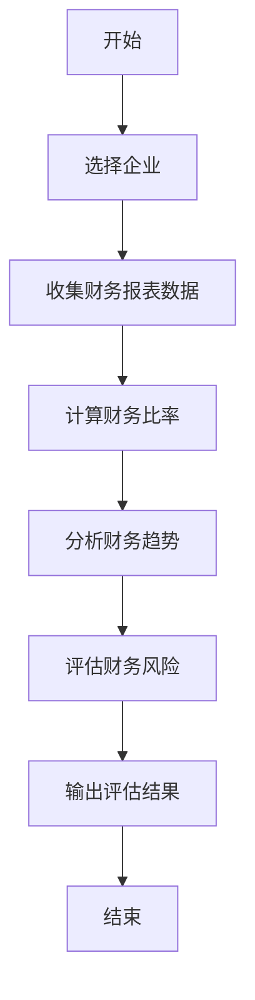
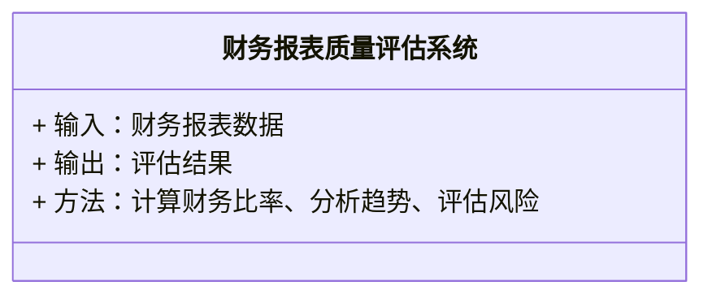
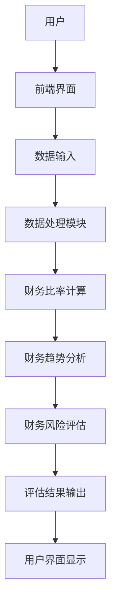

                 


# 约瑟夫·皮奥特罗斯基的财务报表质量评估

**关键词**：财务报表质量评估，约瑟夫·皮奥特罗斯基，财务分析，财务比率，趋势分析，风险评估

**摘要**：本文深入探讨了约瑟夫·皮奥特罗斯基的财务报表质量评估方法，从背景介绍、核心概念、算法原理到系统设计和项目实战，全面解析了这一方法的原理、应用和实现。通过详细讲解和实际案例，帮助读者理解如何有效评估企业财务报表的质量。

---

# 第一部分: 财务报表质量评估的背景与核心概念

## 第1章: 财务报表质量评估的背景与问题背景

### 1.1 财务报表质量评估的基本概念

#### 1.1.1 财务报表的基本组成与作用

财务报表是企业在一定会计期间内财务状况、经营成果和现金流量的总结。主要包括资产负债表、利润表和现金流量表。财务报表的作用在于反映企业的财务状况，评估企业经营效率和偿债能力。

#### 1.1.2 财务报表质量评估的定义与目标

财务报表质量评估是对财务报表的准确性、完整性和可靠性进行分析的过程。其目标是通过分析财务报表，识别潜在的财务风险，评估企业的财务健康状况，为决策提供依据。

#### 1.1.3 约瑟夫·皮奥特罗斯基方法的核心思想

约瑟夫·皮奥特罗斯基提出了一种基于财务比率和趋势分析的财务报表质量评估方法。这种方法强调通过分析财务比率的变化趋势，识别企业财务状况的变化，预测未来的财务风险。

### 1.2 财务报表质量评估的必要性

#### 1.2.1 企业财务健康状况的重要性

企业的财务健康状况直接影响其生存和发展。通过评估财务报表质量，可以及时发现潜在问题，采取措施改善财务状况。

#### 1.2.2 传统财务分析方法的局限性

传统财务分析方法主要依赖于单个财务比率的分析，难以全面反映企业的财务状况。而约瑟夫·皮奥特罗斯基的方法通过结合财务比率和趋势分析，提供了更全面的评估。

#### 1.2.3 约瑟夫·皮奥特罗斯基方法的优势

该方法通过分析财务比率的变化趋势，能够发现企业财务状况的变化趋势，预测未来的财务风险。这种方法更加动态和全面，能够提供更准确的评估结果。

### 1.3 问题背景与问题描述

#### 1.3.1 企业财务报表中的常见问题

企业在财务报表中可能存在数据不准确、信息不完整等问题，导致财务分析结果不可靠。此外，企业可能面临财务风险，如偿债能力不足、盈利能力下降等。

#### 1.3.2 财务报表质量评估的核心问题

如何准确评估财务报表的质量，识别潜在的财务风险，是财务报表质量评估的核心问题。约瑟夫·皮奥特罗斯基的方法通过分析财务比率和趋势，解决了这一问题。

#### 1.3.3 约瑟夫·皮奥特罗斯基方法的应用场景

该方法适用于各种类型的企业，尤其适用于那些需要动态评估财务状况的企业。它可以帮助企业在经营过程中及时发现和解决财务问题。

### 1.4 问题解决与边界

#### 1.4.1 财务报表质量评估的主要解决思路

通过分析财务比率和趋势，识别企业财务状况的变化趋势，预测未来的财务风险。同时，结合企业的经营环境和行业特点，进行综合评估。

#### 1.4.2 约瑟夫·皮奥特罗斯基方法的适用边界

该方法适用于所有类型的企业，但需要注意数据的完整性和准确性。在应用过程中，还需要结合企业的实际情况进行调整。

#### 1.4.3 方法的局限性与改进方向

尽管约瑟夫·皮奥特罗斯基方法具有优势，但在实际应用中仍可能存在一些局限性，如数据的主观性、模型的复杂性等。未来可以通过引入更多数据和模型优化，进一步提高评估的准确性。

### 1.5 本章小结

本章介绍了约瑟夫·皮奥特罗斯基财务报表质量评估方法的背景、核心概念和必要性。通过分析财务比率和趋势，该方法能够全面评估企业的财务状况，识别潜在风险。

---

## 第2章: 约瑟夫·皮奥特罗斯基方法的核心概念与联系

### 2.1 核心概念的原理

#### 2.1.1 财务比率分析的原理

财务比率分析是通过计算各种财务比率，评估企业的偿债能力、运营效率和盈利能力。常见的财务比率包括流动比率、速动比率、净利率等。

#### 2.1.2 财务趋势分析的原理

财务趋势分析是通过分析财务比率的变化趋势，评估企业的财务状况变化。这种方法可以帮助识别企业的财务问题，预测未来的财务风险。

#### 2.1.3 财务风险评估的原理

财务风险评估是通过分析企业的财务状况和经营环境，评估企业面临的风险。约瑟夫·皮奥特罗斯基方法通过结合财务比率和趋势分析，全面评估企业的财务风险。

### 2.2 核心概念的属性特征对比

#### 2.2.1 财务比率的分类与特征

财务比率可以分为偿债能力、运营效率和盈利能力三类。每类比率都有其独特的特征和作用，可以帮助全面评估企业的财务状况。

#### 2.2.2 财务趋势的分析维度

财务趋势分析可以从时间维度、企业内部维度和行业对比维度进行。通过多维度分析，可以更准确地评估企业的财务状况变化。

#### 2.2.3 财务风险的评估维度

财务风险评估可以从企业的偿债能力、盈利能力、运营效率和外部环境等多个维度进行。通过综合评估，可以全面识别企业的潜在风险。

### 2.3 ER实体关系图

```mermaid
erDiagram
    actor 企业财务报表
    actor 评估指标
    actor 财务风险
    actor 财务趋势
    actor 财务比率
    actor 评估结果
    企业财务报表 --> 评估指标 : 提供
    评估指标 --> 财务比率 : 计算
    评估指标 --> 财务趋势 : 分析
    评估指标 --> 财务风险 : 评估
    财务比率 --> 评估结果 : 影响
```

---

## 第3章: 约瑟夫·皮奥特罗斯基方法的算法原理

### 3.1 算法流程



### 3.2 数学模型与公式

#### 3.2.1 流动比率计算公式

$$ \text{流动比率} = \frac{\text{流动资产}}{\text{流动负债}} $$

#### 3.2.2 净利率计算公式

$$ \text{净利率} = \frac{\text{净利润}}{\text{营业收入}} $$

#### 3.2.3 财务趋势分析模型

$$ \text{趋势变化率} = \frac{\text{本期数值} - \text{上期数值}}{\text{上期数值}} \times 100\% $$

---

## 第4章: 系统分析与架构设计

### 4.1 系统功能设计



### 4.2 系统架构设计



---

## 第5章: 项目实战

### 5.1 环境安装与配置

#### 5.1.1 Python环境安装

需要安装Python 3.8及以上版本，建议使用Anaconda分布。

#### 5.1.2 依赖库安装

安装Pandas、NumPy、Matplotlib等库：

```bash
pip install pandas numpy matplotlib
```

### 5.2 核心代码实现

#### 5.2.1 财务比率计算

```python
import pandas as pd

def calculate_financial_ratios(finance_data):
    # 计算流动比率
    current_ratio = finance_data['流动资产'] / finance_data['流动负债']
    # 计算净利率
    net_profit_margin = finance_data['净利润'] / finance_data['营业收入']
    return current_ratio, net_profit_margin
```

#### 5.2.2 财务趋势分析

```python
import matplotlib.pyplot as plt

def analyze_financial_trend(trend_data):
    plt.plot(trend_data['年份'], trend_data['流动比率'], label='流动比率')
    plt.plot(trend_data['年份'], trend_data['净利率'], label='净利率')
    plt.xlabel('年份')
    plt.ylabel('比率')
    plt.legend()
    plt.show()
```

### 5.3 实际案例分析

以某公司2020-2022年的财务数据为例，计算流动比率和净利率，并绘制趋势图：

```python
data = {
    '年份': [2020, 2021, 2022],
    '流动资产': [1000, 1200, 1300],
    '流动负债': [500, 600, 650],
    '净利润': [100, 150, 200],
    '营业收入': [500, 600, 700]
}

df = pd.DataFrame(data)
current_ratios, net_profit_margins = calculate_financial_ratios(df)
analyze_financial_trend(df)
```

### 5.4 代码解读与分析

上述代码首先计算流动比率和净利率，然后绘制趋势图。流动比率和净利率的变化趋势可以帮助识别企业的财务状况变化。

### 5.5 项目小结

通过实际案例分析，展示了约瑟夫·皮奥特罗斯基方法的实际应用。代码实现了财务比率计算和趋势分析，帮助识别企业的财务问题。

---

## 第6章: 最佳实践与注意事项

### 6.1 最佳实践

- 数据的准确性和完整性是关键，确保输入数据无误。
- 在分析趋势时，应结合企业的经营环境和行业特点。
- 定期更新数据，及时发现潜在问题。

### 6.2 注意事项

- 避免仅依赖单一财务比率进行评估，需结合多维度分析。
- 在实际应用中，需根据企业实际情况调整分析模型。
- 注意数据的时态性，确保分析结果的及时性。

### 6.3 拓展阅读

建议进一步阅读约瑟夫·皮奥特罗斯基的原著，深入理解其方法论。同时，可以研究其他财务分析方法，如杜邦分析法、EVA分析法等。

---

## 作者：AI天才研究院/AI Genius Institute & 禅与计算机程序设计艺术/Zen And The Art of Computer Programming

---

以上是《约瑟夫·皮奥特罗斯基的财务报表质量评估》的技术博客文章的完整目录和内容框架。文章详细讲解了约瑟夫·皮奥特罗斯基的财务报表质量评估方法，从理论到实践，帮助读者全面理解和应用这一方法。

