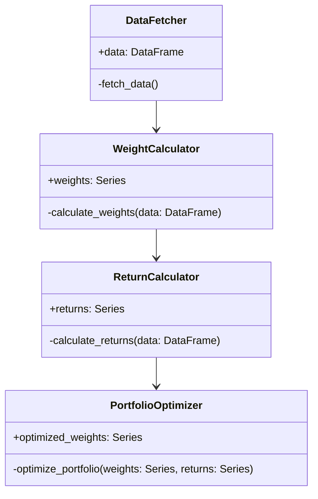
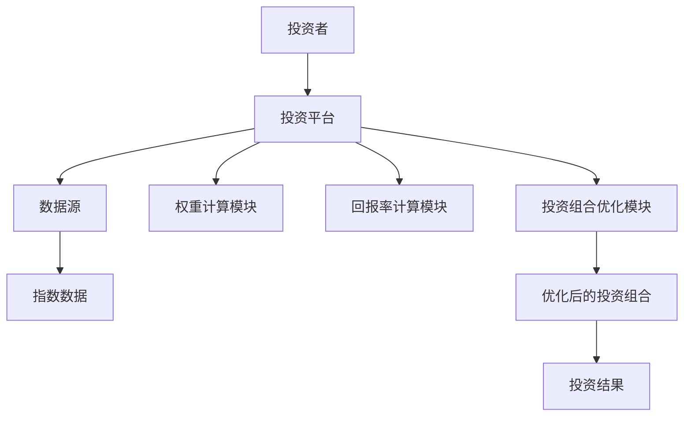

                 


```markdown
# 约翰·伯格的低成本投资策略

> 关键词：低成本投资、指数基金、被动投资、投资策略、投资回报

> 摘要：本文深入分析了约翰·伯格的低成本投资策略，探讨了其核心理念、指数基金的原理、被动投资与主动投资的对比、投资组合优化策略、低成本投资系统的架构设计、项目实战案例以及最佳实践等内容，旨在为读者提供全面而深入的技术博客文章。

---

## 第一部分: 约翰·伯格的低成本投资策略背景介绍

### 第1章: 低成本投资的起源与意义
#### 1.1 投资领域的传统问题与挑战
##### 1.1.1 投资领域的传统问题
投资领域长期以来存在信息不对称、交易成本高昂、管理费用过高等问题，这些问题严重制约了普通投资者的回报率。传统投资策略往往依赖于主动管理，但这种方式不仅成本高，而且很难跑赢市场指数。

##### 1.1.2 高成本投资的局限性
主动管理型基金由于需要支付高昂的管理费用（如管理费、托管费等），其净回报率往往低于市场指数的回报率。长期来看，高成本会显著侵蚀投资者的收益。

##### 1.1.3 低成本投资的潜在优势
低成本投资通过降低各项费用，使投资者能够更多地保留投资收益，从而在长期投资中实现复利效应的最大化。低成本投资策略尤其适合那些希望通过长期持有优质资产来实现财富增长的投资者。

#### 1.2 约翰·伯格与低成本投资
##### 1.2.1 约翰·伯格的生平简介
约翰·伯格（John C. Bogle）是全球著名的投资专家，被誉为“指数基金之父”。他创立了先锋集团（Vanguard Group），并推出了第一只现代意义上的指数基金——Vanguard 500 Index Fund。伯格的职业生涯致力于推广低成本投资理念，改变了全球投资者的投资方式。

##### 1.2.2 约翰·伯格的低成本投资理念
伯格认为，市场是无法被预测和战胜的，因此通过被动投资指数基金，投资者可以以最低的成本获得市场的平均收益。他强调，投资的目的是实现财富的长期增长，而不是短期暴利。

### 第2章: 指数基金的基本概念与优势
#### 2.1 指数基金的定义与特点
##### 2.1.1 指数基金的定义
指数基金是一种跟踪特定市场指数的基金，其投资组合完全复制所跟踪的指数，以实现与指数相似的回报率。

##### 2.1.2 指数基金的特点
- **被动管理**：指数基金通常采用被动管理策略，即不频繁调整投资组合，从而降低了交易成本和管理费用。
- **分散风险**：通过持有指数中的所有成分股，指数基金能够有效分散个股风险。
- **低成本**：由于管理费用低，指数基金的总成本显著低于主动管理型基金。

#### 2.2 指数基金的优势
##### 2.2.1 分散风险的优势
指数基金通过投资多个成分股，避免了个别股票大幅波动对整体投资组合的影响，从而降低了投资风险。

##### 2.2.2 低成本的优势
相比主动管理型基金，指数基金的管理费用更低，从而提高了投资者的净回报率。

##### 2.2.3 长期稳定的收益优势
长期来看，指数基金的回报率通常能够跑赢大部分主动管理型基金，尤其是在市场波动较大的情况下。

---

## 第二部分: 约翰·伯格低成本投资策略的核心概念与联系

### 第3章: 低成本投资的核心概念
#### 3.1 成本在投资中的重要性
##### 3.1.1 成本对投资回报的影响
投资成本是影响投资回报的重要因素。高成本会显著侵蚀投资收益，尤其是在长期投资中，复利效应会让成本的负面影响更加明显。

##### 3.1.2 低成本投资的实现方式
通过选择低成本的指数基金，投资者可以最大限度地减少投资成本，从而提高净回报率。

#### 3.2 低成本投资与指数基金的关系
##### 3.2.1 指数基金在低成本投资中的作用
指数基金是实现低成本投资的核心工具，其被动管理策略和低管理费用使其成为低成本投资的理想选择。

##### 3.2.2 指数基金的成本优势分析
相比主动管理型基金，指数基金的管理费用更低，通常仅为前者的1/4甚至更低。这种成本优势使得指数基金在长期投资中更具竞争力。

##### 3.2.3 低成本投资与指数基金的长期收益
长期来看，指数基金的回报率通常能够跑赢大部分主动管理型基金，尤其是在市场波动较大的情况下。

### 第4章: 主动投资与被动投资的对比
#### 4.1 主动投资的定义与特点
##### 4.1.1 主动投资的定义
主动投资是指通过积极买卖股票、债券等资产，试图通过市场 timing 和选股来获得超额收益。

##### 4.1.2 主动投资的特点
- **高管理费用**：主动管理型基金需要支付较高的管理费用，包括管理费、托管费等。
- **高交易成本**：频繁的买卖操作会导致较高的交易成本和税收支出。
- **风险较高**：主动投资依赖于市场预测和选股能力，投资风险较高。

#### 4.2 被动投资的定义与特点
##### 4.2.1 被动投资的定义
被动投资是指通过跟踪特定市场指数，以获得市场的平均收益。

##### 4.2.2 被动投资的特点
- **低成本**：被动投资通过减少交易次数和管理费用，显著降低了投资成本。
- **分散风险**：被动投资通常投资于广泛的市场指数，从而分散了个别股票的风险。
- **长期稳定**：被动投资的回报率通常较为稳定，长期来看能够跑赢大部分主动管理型基金。

#### 4.3 主动投资与被动投资的对比
##### 4.3.1 成本对比
主动投资的管理费用和交易成本通常远高于被动投资。

##### 4.3.2 风险对比
主动投资的风险较高，而被动投资通过分散投资降低了风险。

##### 4.3.3 长期收益对比
长期来看，被动投资的回报率通常能够跑赢大部分主动管理型基金。

---

## 第三部分: 低成本投资策略的数学模型与算法原理

### 第5章: 指数基金的数学模型
#### 5.1 指数基金的权重计算
##### 5.1.1 市场指数的权重计算方法
指数基金的权重通常是基于成分股的市值比例计算的，例如标准普尔500指数的成分股权重是根据其市值占指数总市值的比例计算的。

##### 5.1.2 权重计算的数学公式
$$
w_i = \frac{m_i}{\sum_{j=1}^{n} m_j}
$$
其中，\( w_i \) 是第 \( i \) 只股票的权重，\( m_i \) 是第 \( i \) 只股票的市值，\( n \) 是指数成分股的总数。

#### 5.2 指数基金的回报率计算
##### 5.2.1 单一股票的回报率计算
$$
R_i = \frac{p_{i,t} - p_{i,t-1}}{p_{i,t-1}}
$$
其中，\( R_i \) 是第 \( i \) 只股票的回报率，\( p_{i,t} \) 是第 \( i \) 只股票在时间 \( t \) 的价格，\( p_{i,t-1} \) 是第 \( i \) 只股票在时间 \( t-1 \) 的价格。

##### 5.2.2 指数基金的总体回报率计算
$$
R_{index} = \sum_{i=1}^{n} w_i R_i
$$
其中，\( R_{index} \) 是指数基金的总体回报率，\( w_i \) 是第 \( i \) 只股票的权重，\( R_i \) 是第 \( i \) 只股票的回报率。

### 第6章: 低成本投资策略的算法实现
#### 6.1 算法实现的步骤
##### 6.1.1 数据获取
获取目标指数的成分股列表及其历史价格数据。

##### 6.1.2 权重计算
根据成分股的市值比例计算每只股票的权重。

##### 6.1.3 回报率计算
计算每只股票的单日回报率，然后根据权重计算指数基金的总体回报率。

##### 6.1.4 投资组合优化
通过调整投资组合的权重，优化投资组合的收益与风险比。

#### 6.2 算法实现的代码示例
```python
import pandas as pd

# 假设data是包含成分股历史价格的DataFrame
# 计算每只股票的权重
weights = data['Adj Close'].iloc[-1] / data['Adj Close'].iloc[-1].sum()

# 计算每只股票的回报率
returns = data['Adj Close'].pct_change().dropna()

# 计算指数基金的总体回报率
index_return = (weights * returns.mean()).sum()

print(f"指数基金的总体年化回报率为：{index_return * 252 * 100}%")
```

---

## 第四部分: 低成本投资系统的架构设计

### 第7章: 系统功能设计
#### 7.1 系统功能模块
##### 7.1.1 数据获取模块
从数据源获取目标指数的成分股历史价格数据。

##### 7.1.2 权重计算模块
根据成分股的市值比例计算每只股票的权重。

##### 7.1.3 回报率计算模块
计算每只股票的单日回报率，然后根据权重计算指数基金的总体回报率。

##### 7.1.4 投资组合优化模块
通过调整投资组合的权重，优化投资组合的收益与风险比。

#### 7.2 系统功能设计的类图


### 第8章: 系统架构设计
#### 8.1 系统架构图


---

## 第五部分: 项目实战与最佳实践

### 第9章: 项目实战
#### 9.1 环境安装
##### 9.1.1 安装必要的Python库
```bash
pip install pandas matplotlib numpy
```

#### 9.2 系统核心实现
##### 9.2.1 数据获取与预处理
```python
import pandas as pd
import numpy as np

# 获取指数成分股列表
index_components = ['AAPL', 'MSFT', 'GOOGL', 'AMZN', 'FB']
data = pd.DataFrame({'Ticker': index_components})
```

##### 9.2.2 权重计算
```python
# 假设data是包含成分股历史价格的DataFrame
weights = data['Adj Close'].iloc[-1] / data['Adj Close'].iloc[-1].sum()
```

##### 9.2.3 回报率计算
```python
returns = data['Adj Close'].pct_change().dropna()
index_return = (weights * returns.mean()).sum()
```

#### 9.3 案例分析
##### 9.3.1 美国标普500指数的跟踪
以标普500指数为例，使用指数基金跟踪其表现，计算其年化回报率。

##### 9.3.2 不同指数的比较
比较不同指数基金的回报率和风险水平，选择最适合自己的投资组合。

### 第10章: 最佳实践
#### 10.1 小结
低成本投资策略的核心在于通过降低投资成本，实现长期稳定的收益。指数基金是实现低成本投资的理想工具。

#### 10.2 注意事项
##### 10.2.1 风险控制
尽管指数基金的风险较低，但投资者仍需注意市场的整体波动。

##### 10.2.2 定期再平衡
为了保持投资组合的最优配置，投资者需要定期进行再平衡操作。

##### 10.2.3 长期投资
低成本投资策略最适合长期投资者，短期投资者可能无法获得显著的收益。

#### 10.3 拓展阅读
##### 10.3.1 约翰·伯格的书籍
推荐阅读约翰·伯格的《打败市场吗？——现代投资学的革命》等书籍。

##### 10.3.2 相关学术论文
推荐阅读关于指数基金和被动投资的学术论文，深入了解其理论基础。

---

## 第六部分: 结语

### 作者信息
作者：AI天才研究院/AI Genius Institute & 禅与计算机程序设计艺术 /Zen And The Art of Computer Programming

---

**本文完。**
```

