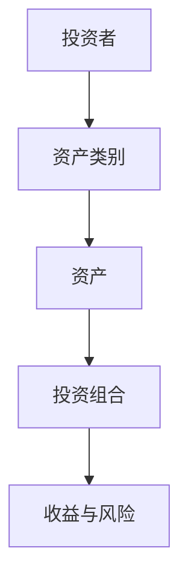
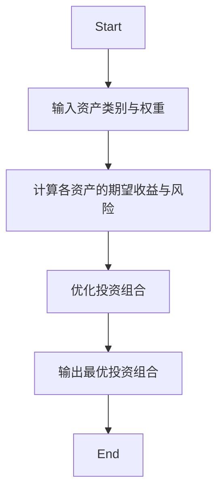
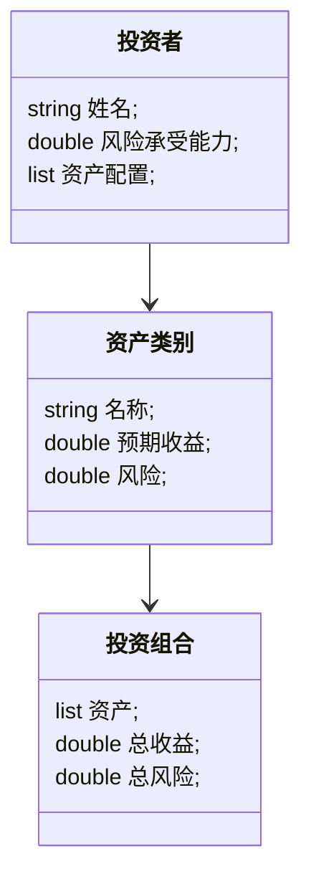

                 


# 约翰·伯格的全球多元化投资理念

## 关键词：
- 多元化投资
- 约翰·伯格
- 资产配置
- 风险管理
- 全球化投资

## 摘要：
本文深入探讨了约翰·伯格的全球多元化投资理念，从其背景、核心概念、算法原理到系统架构和实战案例，层层解析其理论的精髓和实际应用。通过详细的技术分析和案例解读，揭示了如何通过多元化投资实现风险可控下的收益最大化。

---

# 第一部分: 全球多元化投资理念的背景与核心概念

## 第1章: 全球多元化投资理念的背景介绍

### 1.1 投资环境的全球化演变
#### 1.1.1 全球化经济的发展与投资机会的变化
20世纪70年代以来，全球化进程加速，推动了跨国资本流动和金融市场一体化。投资者面临更多元化的投资机会，但也带来了更高的复杂性和风险。

#### 1.1.2 现代金融市场的复杂性与风险
金融市场的波动性增加，单个资产的风险无法通过简单分散化完全消除，需要更复杂的多元策略。

#### 1.1.3 多元化投资的必要性与重要性
通过多元化投资，降低特定资产或市场的风险敞口，提升整体投资组合的稳定性。

### 1.2 约翰·伯格的生平与投资理念的形成
#### 1.2.1 约翰·伯格的个人经历
约翰·伯格是Vanguard集团的创始人，他倡导低成本指数基金和被动投资策略。

#### 1.2.2 伯格投资理念的核心思想
伯格认为，长期投资的成功取决于资产配置和风险控制，而非短期市场择时。

#### 1.2.3 多元化投资策略的起源与发展
伯格的多元化投资理念源于对市场风险的深刻理解，强调通过广泛分散投资降低非系统性风险。

### 1.3 多元化投资理念的理论基础
#### 1.3.1 现代资产组合理论（MPT）
MPT由哈里·马科维茨提出，强调通过分散化投资降低组合风险。

#### 1.3.2 CAPM模型与风险调整后的收益
CAPM模型帮助投资者评估资产的预期收益，考虑其系统性风险。

#### 1.3.3 多元化投资的风险分散机制
通过投资不同资产类别、地区和行业，降低特定风险，仅承担系统性风险。

---

## 第2章: 多元化投资的核心概念与联系

### 2.1 多元化投资的原理与模型
#### 2.1.1 资产配置的数学模型
- **资产配置**：将资金分配到不同资产类别，如股票、债券、房地产等。
- **权重计算**：根据风险承受能力和收益目标确定各类资产的权重。

#### 2.1.2 风险与收益的权衡关系
- **风险-收益曲线**：高风险资产通常带来高收益，但波动性更大。
- **有效前沿**：代表最优风险-收益组合的边界。

#### 2.1.3 投资组合的有效前沿分析
通过有效前沿分析，找到在特定风险水平下收益最高的组合，或在特定收益下风险最小的组合。

### 2.2 多元化投资的核心要素对比
#### 2.2.1 不同资产类别（股票、债券、房地产等）的特征对比
- **股票**：高收益，高波动性。
- **债券**：相对稳定，收益较低。
- **房地产**：实物资产，抵御通胀。

#### 2.2.2 地区与行业分散化的优缺点
- **地区分散**：降低区域经济波动风险。
- **行业分散**：避免单一行业周期性影响。

#### 2.2.3 时间分散与空间分散的异同
- **时间分散**：通过定期投资平滑市场波动。
- **空间分散**：投资全球市场降低地域风险。

### 2.3 多元化投资的ER实体关系图


---

## 第3章: 多元化投资的算法原理与数学模型

### 3.1 多元化投资的算法流程


### 3.2 数学模型与公式
#### 3.2.1 投资组合的期望收益计算
$$ E(r_p) = \sum w_i E(r_i) $$

#### 3.2.2 投资组合的风险计算
$$ \sigma_p^2 = \sum \sum w_i w_j \sigma_{i,j} $$

#### 3.2.3 现代资产组合理论的优化模型
$$ \text{Minimize } \sigma_p^2 \text{ subject to } \sum w_i = 1 $$

### 3.3 实际案例分析
#### 3.3.1 美国与国际股票的分散化效应
通过投资美国和国际股票，降低区域市场风险。

#### 3.3.2 不同债券期限对投资组合风险的影响
短期债券波动性低，长期债券利率风险高。

#### 3.3.3 房地产与传统资产类别的相关性分析
房地产与股票的相关性较低，适合分散投资。

---

## 第4章: 投资组合的系统分析与架构设计

### 4.1 投资组合管理系统架构
#### 4.1.1 系统模块划分
- 数据采集模块：获取市场数据。
- 风险评估模块：计算各资产的风险指标。
- 组合优化模块：生成最优投资组合。
- 报告生成模块：输出投资建议。

#### 4.1.2 系统功能设计（领域模型）


---

## 第5章: 项目实战——基于Python的投资组合优化

### 5.1 环境安装
- **Python版本**：3.8以上。
- **依赖库安装**：`pandas`, `numpy`, `scipy`, `matplotlib`。

### 5.2 核心实现源代码
```python
import numpy as np
import pandas as pd
from scipy.optimize import minimize

# 示例数据：各资产的预期收益和协方差矩阵
n_assets = 5
mu = np.random.rand(n_assets) * 0.1
Sigma = np.random.randn(n_assets, n_assets).dot(np.random.randn(n_assets, n_assets)) * 0.2

# 定义优化目标函数
def portfolio_variance(weights, mu, Sigma):
    return np.dot(weights.T, np.dot(Sigma, weights))

# 约束条件
cons = ({'type': 'eq', 'fun': lambda w: np.sum(w) - 1})

# 初始权重
w0 = np.ones(n_assets) / n_assets

# 求解优化问题
result = minimize(portfolio_variance, w0, args=(mu, Sigma), constraints=cons)

# 输出最优权重
print("最优权重:", result.x)
```

### 5.3 代码应用解读与分析
- **数据输入**：各资产的预期收益和协方差矩阵。
- **优化目标**：最小化投资组合的方差（风险）。
- **约束条件**：权重之和为1。

### 5.4 实际案例分析
- **案例背景**：假设5种资产，计算最优权重。
- **结果解读**：输出的权重表示每种资产在投资组合中的配置比例。

---

## 第6章: 总结与展望

### 6.1 约翰·伯格的多元化投资理念总结
伯格的理念强调长期、分散和低成本投资，为投资者提供了稳健的投资框架。

### 6.2 对未来投资理念的展望
随着市场的发展，多元化投资将更加依赖于技术驱动的量化分析和动态调整。

---

## 最佳实践 Tips

- **分散投资**：不要将所有资金投入单一资产或市场。
- **长期持有**：避免频繁交易，减少费用和税收影响。
- **定期再平衡**：定期调整投资组合，维持目标配置。

---

## 小结

通过本文的详细分析，读者可以深入了解约翰·伯格的全球多元化投资理念，并通过实际案例和代码实现，掌握其在现代投资中的应用。

---

## 注意事项

- 投资有风险，本文内容仅为理论分析，不构成投资建议。
- 代码示例为简化版本，实际应用需结合更多市场数据和复杂因素。

---

## 拓展阅读

- 《投资学》（书籍）
- 现代资产组合理论（MPT）深度解析
- Python在量化投资中的应用

---

## 作者

作者：AI天才研究院/AI Genius Institute & 禅与计算机程序设计艺术 /Zen And The Art of Computer Programming

