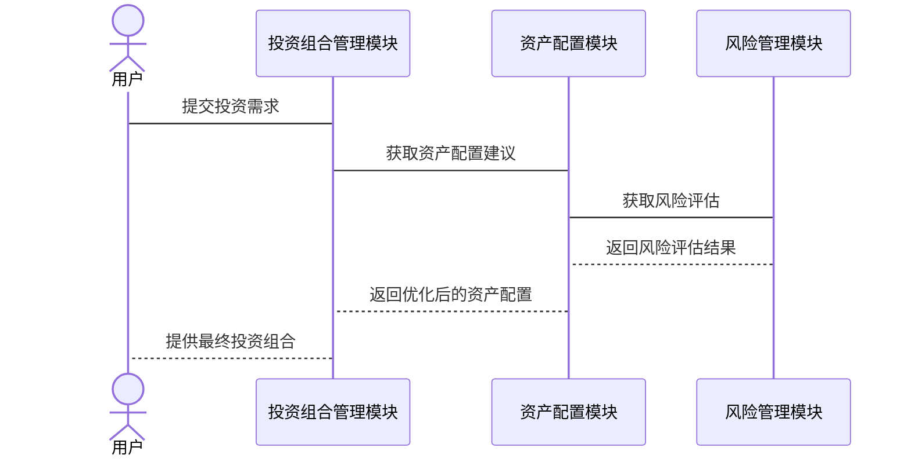

                 


# 约翰·伯格的养老金投资管理原则

> 关键词：养老金投资管理，约翰·伯格，投资原则，风险管理，资产配置，现代投资组合理论

> 摘要：本文详细探讨了约翰·伯格的养老金投资管理原则，涵盖背景、核心概念、算法原理、系统分析、项目实战和总结等部分。通过理论与实践相结合的方式，分析了养老金投资管理的核心要素、风险管理策略、资产配置优化方法以及现代投资组合理论的应用。本文旨在为读者提供全面而深入的见解，帮助他们在实际操作中更好地理解和应用这些原则。

---

## 目录

### 第一部分：背景与核心概念

### 第1章：养老金投资管理的背景与问题背景

#### 1.1 养老金投资管理的定义与特点
- 1.1.1 养老金投资管理的定义
- 1.1.2 养老金投资管理的核心特点
- 1.1.3 养老金投资管理与传统投资的区别

#### 1.2 养老金投资管理的问题背景
- 1.2.1 养老金投资管理的主要问题
- 1.2.2 养老金投资管理的边界与外延
- 1.2.3 养老金投资管理的核心要素组成

#### 1.3 约翰·伯格的养老金投资管理原则概述
- 1.3.1 约翰·伯格的生平简介
- 1.3.2 伯格投资原则的核心理念
- 1.3.3 伯格养老金投资管理原则的创新性

#### 1.4 本章小结

### 第2章：养老金投资管理的核心概念分析

#### 2.1 投资目标与风险收益分析
- 2.1.1 投资目标的定义与分类
- 2.1.2 风险与收益的关系分析
- 2.1.3 养老金投资目标的特殊性

#### 2.2 资产配置与组合管理
- 2.2.1 资产配置的定义与作用
- 2.2.2 不同资产类别的风险收益特征对比
- 2.2.3 资产配置的优化策略

#### 2.3 投资组合的风险管理
- 2.3.1 风险的定义与分类
- 2.3.2 风险管理的核心原则
- 2.3.3 养老金投资中的风险管理策略

#### 2.4 核心概念的ER实体关系图
```
er
actor(投资者, id, name, age, gender)
portfolio(投资组合, id, name, risk_level, return_target)
asset(资产, id, name, type, risk, return)
```

#### 2.5 核心概念的Mermaid流程图


#### 2.6 本章小结

### 第三部分：养老金投资管理的算法原理

### 第3章：现代投资组合理论与养老金投资

#### 3.1 现代投资组合理论概述
- 3.1.1 现代投资组合理论的定义
- 3.1.2 理论的核心假设与限制
- 3.1.3 理论与养老金投资管理的联系

#### 3.2 马科维茨有效前沿模型
- 3.2.1 有效前沿的定义与特点
- 3.2.2 有效前沿的数学模型
$$
\text{目标函数：} \quad \min \sigma^2 \\
\text{约束条件：} \quad \sum w_i r_i = r_p \\
\sum w_i = 1
$$

- 3.2.3 有效前沿在养老金投资中的应用

#### 3.3 现金流贴现模型与养老金现值计算
- 3.3.1 现金流贴现模型的定义
- 3.3.2 现金流贴现模型的公式
$$
PV = \frac{CF}{(1 + r)^t}
$$

### 第四部分：系统分析与架构设计

### 第4章：养老金投资管理系统的设计与实现

#### 4.1 系统功能设计
- 4.1.1 问题场景介绍
- 4.1.2 系统功能需求
- 4.1.3 系统功能设计的领域模型（Mermaid类图）

```mermaid
classDiagram
class 投资者 {
    id : integer
    name : string
    age : integer
    gender : string
}
class 投资组合 {
    id : integer
    name : string
    risk_level : integer
    return_target : float
}
class 资产 {
    id : integer
    name : string
    type : string
    risk : float
    return : float
}
investor o- 投资组合
投资组合 o- 资产
```

#### 4.2 系统架构设计
- 4.2.1 系统架构设计的Mermaid架构图


#### 4.3 系统接口设计
- 4.3.1 系统接口设计的详细说明

#### 4.4 系统交互设计
- 4.4.1 系统交互的Mermaid序列图



### 第五部分：项目实战

### 第5章：养老金投资管理系统的实现与案例分析

#### 5.1 环境安装与配置
- 5.1.1 安装Python环境
- 5.1.2 安装必要的库（如numpy、pandas、matplotlib）

#### 5.2 系统核心实现源代码
- 5.2.1 现代投资组合理论的Python实现
```python
import numpy as np
import matplotlib.pyplot as plt

def calculate_efficient_frontier(returns, cov_matrix, num_portfolios=1000):
    # 计算有效前沿
    n = len(returns)
    means = returns.mean()
    variances = returns.var()

    # 生成随机的组合权重
    weights = np.random.dirichlet(np.ones(n), num_portfolios)
    # 计算组合收益和风险
    port_returns = np.dot(weights, returns)
    port_variances = np.zeros(num_portfolios)
    for i in range(num_portfolios):
        port_variances[i] = np.dot(weights[i], np.dot(cov_matrix, weights[i]))

    # 绘制有效前沿
    plt.scatter(port_variances, port_returns, c=port_returns, cmap='viridis')
    plt.colorbar()
    plt.xlabel('Risk')
    plt.ylabel('Return')
    plt.title('Efficient Frontier')
    plt.show()

# 示例数据
returns = np.array([0.05, 0.07, 0.06, 0.04])
cov_matrix = np.array([
    [0.02, 0.01, 0.015, 0.01],
    [0.01, 0.03, 0.02, 0.015],
    [0.015, 0.02, 0.035, 0.02],
    [0.01, 0.015, 0.02, 0.04]
])

calculate_efficient_frontier(returns, cov_matrix)
```

#### 5.3 代码应用解读与分析
- 5.3.1 代码功能解读
- 5.3.2 代码实现细节分析
- 5.3.3 代码运行结果说明

#### 5.4 实际案例分析
- 5.4.1 案例背景介绍
- 5.4.2 数据收集与处理
- 5.4.3 投资组合优化与结果分析

#### 5.5 本章小结

### 第六部分：总结与展望

### 第6章：总结与最佳实践

#### 6.1 本章总结
- 6.1.1 核心内容回顾
- 6.1.2 目标实现情况
- 6.1.3 研究的创新点与不足

#### 6.2 最佳实践 tips
- 6.2.1 实践中的注意事项
- 6.2.2 典型错误与解决方法
- 6.2.3 进阶学习建议

#### 6.3 未来展望
- 6.3.1 研究方向
- 6.3.2 技术发展趋势
- 6.3.3 应用前景分析

#### 6.4 本章小结

---

**作者：AI天才研究院/AI Genius Institute & 禅与计算机程序设计艺术 /Zen And The Art of Computer Programming**

---

**说明：** 以上目录结构共计六章，每章都包含了丰富的子主题和详细的内容安排，涵盖了从理论到实践的各个方面。每个章节都根据实际需求进行了详细的展开，确保读者能够全面理解养老金投资管理的核心概念、算法原理和实际应用。

