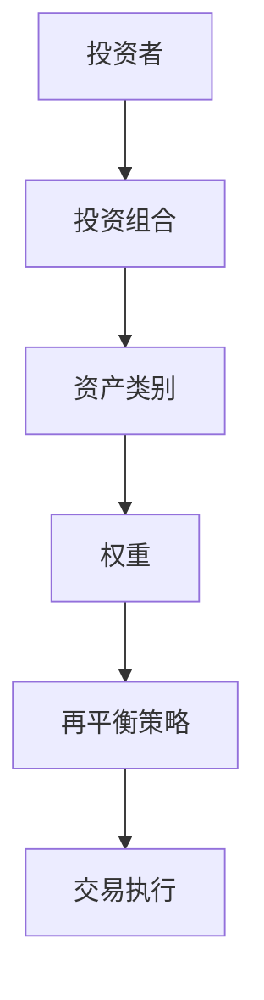
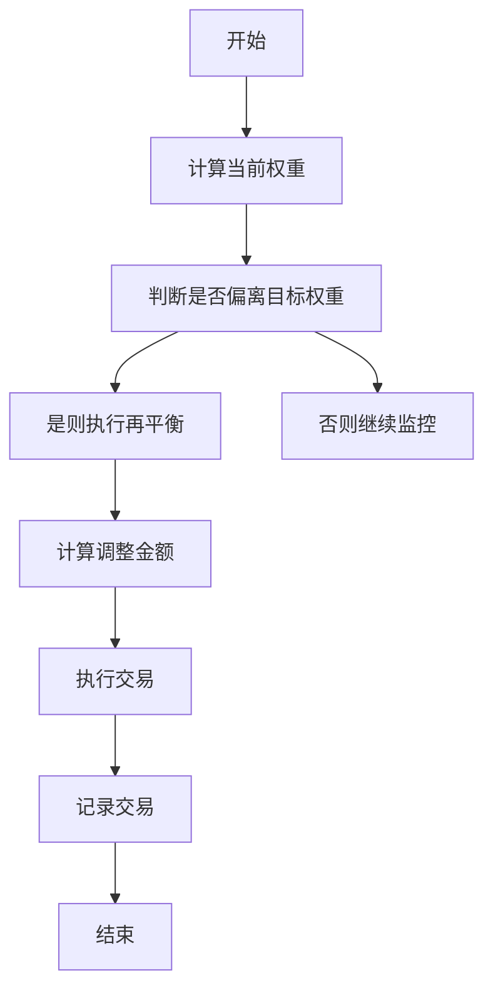

                 


# 约翰·伯格的再平衡策略

> 关键词：再平衡策略，投资组合管理，动态权重调整，算法优化，系统架构设计

> 摘要：本文深入探讨了约翰·伯格提出的再平衡策略，从其核心原理、算法实现到系统架构设计，再到实际项目应用，全面解析了这一策略在现代投资组合管理中的重要性与应用价值。通过详细的技术分析和实际案例，本文为读者提供了从理论到实践的完整指南。

---

## 第一部分：背景介绍

### 第1章：再平衡策略的核心概念

#### 1.1 问题背景
- **现代投资组合管理的挑战**  
  在金融市场中，投资组合的价值会因市场波动而变化，导致各资产类别的权重偏离最初设定的目标。这种偏离可能影响投资组合的预期收益和风险敞口，需要定期调整以维持最优配置。
  
- **再平衡策略的必要性**  
  再平衡策略通过定期调整投资组合的资产权重，确保其与预定目标一致，从而优化风险收益比。这是投资组合管理中的关键步骤，尤其在市场波动剧烈时更为重要。

- **约翰·伯格的再平衡策略简介**  
  约翰·伯格是一位著名投资经理，提出了基于目标权重的再平衡方法，强调定期审视和调整投资组合，以应对市场变化和投资者风险偏好的变化。

#### 1.2 问题描述
- **投资组合失衡的常见原因**  
  市场波动、资产价格变化、资金流入/流出等因素可能导致投资组合的权重偏离目标配置。

- **市场波动对投资组合的影响**  
  不同资产类别的波动性差异会导致权重变化，进而影响投资组合的风险和收益。

- **再平衡策略的目标与意义**  
  再平衡策略的目标是将投资组合的权重调整到目标配置，优化风险收益，降低偏离带来的风险。

#### 1.3 问题解决
- **再平衡策略的基本原理**  
  通过计算当前权重与目标权重的差异，确定需要调整的资产类别和金额，执行交易以恢复目标配置。

- **再平衡策略的核心步骤**  
  1. 计算当前权重。  
  2. 确定目标权重。  
  3. 计算权重偏离。  
  4. 制定调整计划。  
  5. 执行交易并记录。

- **再平衡策略的实施方法**  
  约翰·伯格的策略强调定期（如季度或半年）进行再平衡，以应对市场变化，同时减少交易成本和税务影响。

#### 1.4 边界与外延
- **再平衡策略的适用范围**  
  适用于机构投资者、个人投资者以及各种类型的资产配置，尤其是那些对目标配置有严格要求的投资组合。

- **再平衡策略的限制条件**  
  频繁的再平衡可能导致交易成本增加，且在市场剧烈波动时，可能需要更多调整。

- **再平衡策略与其他投资策略的关系**  
  再平衡策略是投资组合管理的一部分，与风险管理和资产配置策略密切相关，但也可与其他策略结合使用。

#### 1.5 概念结构与核心要素组成
- **再平衡策略的核心要素**  
  - 当前权重  
  - 目标权重  
  - 权重偏离  
  - 调整金额  
  - 调整执行

- **再平衡策略的数学模型**  
  目标权重为$w_i$，当前权重为$w_i'$，则权重偏离为$\Delta w_i = w_i - w_i'$。

- **再平衡策略的实施流程**  
  1. 计算当前权重：$\text{Current Weight} = \frac{\text{资产价值}}{\text{总价值}}$  
  2. 确定目标权重：$\text{Target Weight} = \text{预先设定的目标配置}$  
  3. 计算权重偏离：$\text{Deviation} = \text{Current Weight} - \text{Target Weight}$  
  4. 制定调整计划：根据偏离程度确定需要买卖的资产数量。  
  5. 执行交易并记录。

---

## 第二部分：核心概念与联系

### 第2章：再平衡策略的核心原理

#### 2.1 核心概念原理
- **投资组合权重的动态调整**  
  权重的动态调整是再平衡策略的核心，通过调整各资产的权重，优化投资组合的风险收益比。

- **市场波动对权重的影响**  
  市场波动会导致资产价格变化，进而影响投资组合的权重分布，需要定期调整以维持目标配置。

- **再平衡策略的数学基础**  
  再平衡策略基于资产配置理论，利用权重的动态调整来优化投资组合的绩效。

#### 2.2 核心概念属性特征对比
- **再平衡策略与传统投资策略的对比**  
  | 特性 | 再平衡策略 | 传统投资策略 |
  |------|------------|--------------|
  | 调整频率 | 定期调整 | 仅在必要时调整 |
  | 调整目标 | 维持目标权重 | 优化收益或风险 |
  | 调整依据 | 权重偏离 | 市场趋势或专家判断 |

- **不同再平衡频率的优缺点**  
  | 频率 | 优点 | 缺点 |
  |------|------|------|
  | 高频 | 精准维持目标配置 | 成本高、税务影响大 |
  | 低频 | 成本低 | 配置偏离大 |

- **再平衡策略的适用场景分析**  
  再平衡策略适用于市场波动较大、目标配置严格的投资组合，尤其适合长期投资者。

#### 2.3 ER实体关系图架构


---

## 第三部分：算法原理讲解

### 第3章：再平衡策略的算法实现

#### 3.1 算法原理
- **动态权重调整算法**  
  该算法通过计算当前权重与目标权重的偏离，确定需要调整的资产数量，并执行交易。

- **市场波动预测算法**  
  基于历史数据和市场分析，预测未来市场波动，优化再平衡策略的执行频率和幅度。

- **最优化再平衡算法**  
  通过数学优化方法，找到最优的调整方案，最小化调整成本，最大化投资组合收益。

#### 3.2 算法流程图


#### 3.3 算法实现代码
```python
def calculate_weight(asset_value, total_value):
    return asset_value / total_value

def calculate_deviation(current_weight, target_weight):
    return current_weight - target_weight

def calculate_adjustment(asset_value, target_weight, current_weight):
    deviation = calculate_deviation(current_weight, target_weight)
    return asset_value * deviation

# 示例代码
asset_values = [100, 200, 300]
total_value = sum(asset_values)
target_weights = [0.3, 0.3, 0.4]

for i in range(len(asset_values)):
    current_weight = calculate_weight(asset_values[i], total_value)
    deviation = calculate_deviation(current_weight, target_weights[i])
    adjustment = calculate_adjustment(asset_values[i], target_weights[i], current_weight)
    print(f"资产{i+1}: 当前权重={current_weight}, 偏离={deviation}, 调整金额={adjustment}")
```

#### 3.4 数学模型和公式
- **权重计算公式**  
  $$\text{权重} = \frac{\text{资产价值}}{\text{总价值}}$$

- **偏离计算公式**  
  $$\text{偏离} = \text{目标权重} - \text{当前权重}$$

- **调整金额公式**  
  $$\text{调整金额} = \text{资产价值} \times \text{偏离}$$

---

## 第四部分：系统分析与架构设计

### 第4章：再平衡策略的系统架构

#### 4.1 问题场景介绍
- 投资者希望自动化管理其投资组合，定期执行再平衡策略，以维持目标配置。

#### 4.2 项目介绍
- 开发一个基于再平衡策略的投资组合管理系统，支持资产配置、权重计算、偏离分析和交易执行。

#### 4.3 系统功能设计
- **领域模型**  
  ```mermaid
  classDiagram
      class 投资者 {
          帐户信息
          投资目标
      }
      class 投资组合 {
          资产列表
          目标权重
      }
      class 资产类别 {
          资产代码
          当前价值
      }
      class 权重计算 {
          计算权重
          计算偏离
      }
      class 交易执行 {
          执行交易
          记录交易
      }
      投资者 --> 投资组合
      投资组合 --> 资产类别
      资产类别 --> 权重计算
      权重计算 --> 交易执行
  ```

- **系统架构**  
  ```mermaid
  graph TD
      A[投资者] --> B[投资组合管理模块]
      B --> C[资产配置模块]
      C --> D[权重计算模块]
      D --> E[交易执行模块]
      E --> F[记录模块]
  ```

- **系统接口设计**  
  - 输入：投资者的账户信息、投资目标、资产列表。  
  - 输出：调整后的投资组合，交易记录。

- **系统交互流程**  
  ```mermaid
  graph TD
      A[投资者] --> B[投资组合管理模块]
      B --> C[计算当前权重]
      C --> D[计算偏离]
      D --> E[执行交易]
      E --> F[记录交易]
  ```

---

## 第五部分：项目实战

### 第5章：再平衡策略的项目实现

#### 5.1 环境安装
- 安装Python和必要的库（如Pandas、NumPy）。

#### 5.2 系统核心实现
```python
import pandas as pd

def main():
    # 示例数据
    assets = ['股票', '债券', '现金']
    target_weights = [0.5, 0.3, 0.2]
    current_values = [200, 100, 50]
    total_value = sum(current_values)

    # 计算当前权重
    current_weights = {}
    for i in range(len(assets)):
        current_weights[assets[i]] = current_values[i] / total_value

    # 计算偏离
    deviations = {}
    for i in range(len(assets)):
        deviations[assets[i]] = target_weights[i] - current_weights[assets[i]]

    # 打印结果
    for asset in assets:
        print(f"{asset}: 当前权重={current_weights[asset]:.2f}, 偏离={deviations[asset]:.2f}")

if __name__ == "__main__":
    main()
```

#### 5.3 代码应用解读与分析
- **代码功能解读**  
  该代码计算每个资产的当前权重和偏离，输出调整建议。

- **实际案例分析**  
  假设目标权重为50%股票、30%债券、20%现金，当前值为200、100、50，总价值为350。  
  - 股票当前权重=200/350≈57.14%，偏离=50-57.14≈-7.14%  
  - 债券当前权重=100/350≈28.57%，偏离=30-28.57≈1.43%  
  - 现金当前权重=50/350≈14.29%，偏离=20-14.29≈5.71%

- **详细讲解剖析**  
  根据偏离情况，需要减少股票投资7.14%，增加债券投资1.43%，增加现金投资5.71%。

#### 5.4 项目小结
- 通过代码实现再平衡策略，可以自动化计算权重偏离，并制定调整计划。  
- 实际应用中需考虑交易成本和税务影响，优化调整策略。

---

## 第六部分：最佳实践

### 第6章：再平衡策略的最佳实践

#### 6.1 小结
- 再平衡策略是投资组合管理中的关键步骤，定期调整权重有助于优化风险收益比。  
- 通过自动化系统实现再平衡策略，可以提高效率并降低成本。

#### 6.2 注意事项
- 频繁调整可能导致交易成本增加，需权衡成本与收益。  
- 在市场剧烈波动时，可能需要更频繁的调整。  
- 需考虑税务影响，优化调整策略。

#### 6.3 拓展阅读
- 《投资学》——格理高利·博迪  
- 《机构投资策略》——威廉·伯恩斯坦  

---

## 结语

约翰·伯格的再平衡策略为投资组合管理提供了重要的理论和实践指导。通过定期调整权重，投资者可以维持目标配置，优化投资组合绩效。本文从理论到实践，全面解析了再平衡策略的实现方法，为读者提供了从理解到应用的完整指南。

---

## 作者

作者：AI天才研究院/AI Genius Institute & 禅与计算机程序设计艺术 /Zen And The Art of Computer Programming

