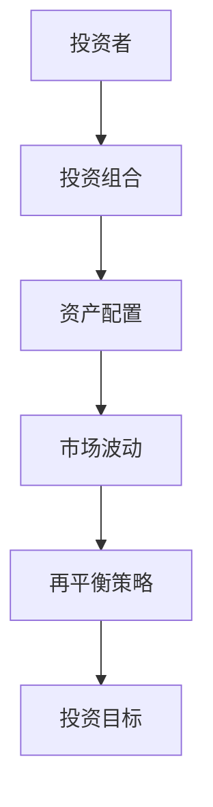
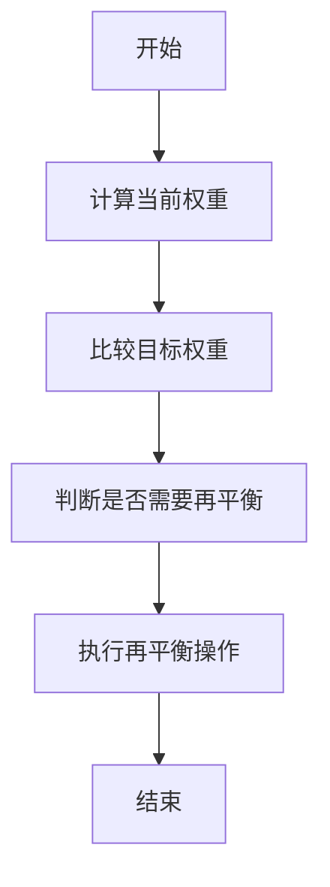
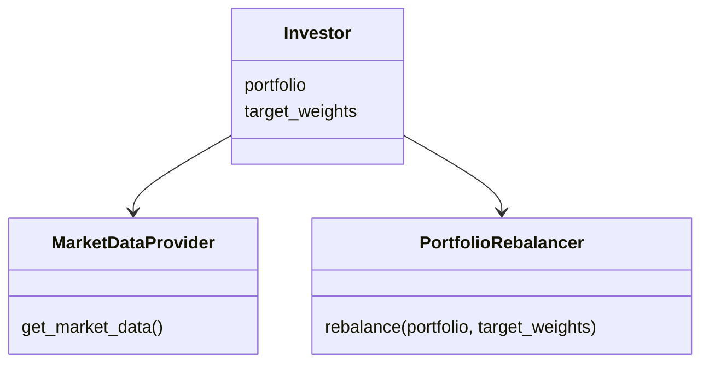
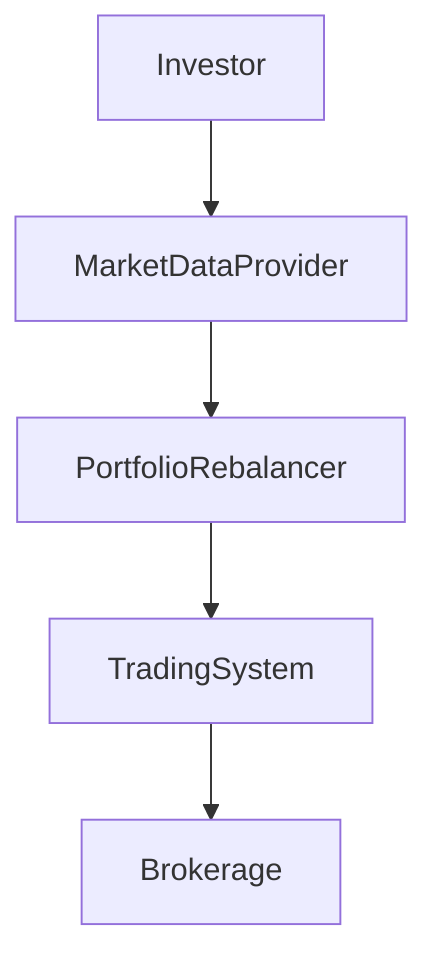
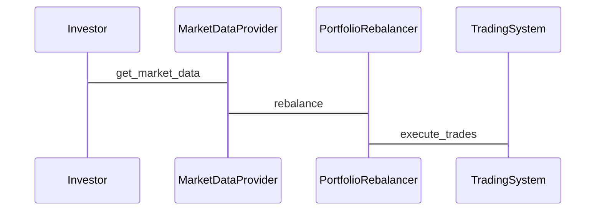

                 


# 约翰·伯格的再平衡策略：保持投资组合平衡

## 关键词：再平衡策略、投资组合、资产配置、动态调整、市场波动、风险管理、成本效益分析

## 摘要

在投资领域，保持投资组合的平衡至关重要。市场波动、资产表现差异以及投资者目标的变化都会导致投资组合失衡。再平衡策略通过定期调整资产配置，确保投资组合与目标保持一致。本文详细探讨约翰·伯格的再平衡策略，分析其原理、算法、系统架构及实际应用，帮助投资者有效管理投资组合。

---

## 第1章：背景介绍

### 1.1 问题背景

#### 1.1.1 投资组合失衡的常见原因
市场波动、资产表现差异和投资者目标变化可能导致投资组合失衡。

#### 1.1.2 市场波动对投资组合的影响
市场波动导致某些资产表现优于其他资产，使投资组合偏离预期配置。

#### 1.1.3 再平衡策略的核心目标
通过定期调整，使投资组合与目标保持一致，分散风险，优化收益。

### 1.2 问题描述

#### 1.2.1 投资组合失衡的具体表现
部分资产占比过大，风险集中，收益不稳定。

#### 1.2.2 再平衡策略的必要性
定期调整以应对市场变化，降低风险，优化收益。

#### 1.2.3 再平衡策略的边界与外延
适用于各类投资组合，考虑交易成本和税收影响。

### 1.3 问题解决

#### 1.3.1 再平衡策略的基本思路
定期评估投资组合，调整资产配置，使其与目标一致。

#### 1.3.2 再平衡策略的核心要素
资产配置、目标设定、再平衡频率和交易成本。

#### 1.3.3 再平衡策略的实现路径
定期评估、计算差异、调整配置、实施交易。

### 1.4 概念结构与核心要素

#### 1.4.1 再平衡策略的核心要素组成
目标设定、资产配置、市场数据、再平衡频率和交易执行。

#### 1.4.2 再平衡策略的实现机制
数据采集、评估分析、决策制定和交易执行。

#### 1.4.3 再平衡策略的适用场景
市场波动、目标变化和资产表现差异。

---

## 第2章：再平衡策略的核心概念

### 2.1 核心概念原理

#### 2.1.1 投资组合再平衡的原理
通过调整资产配置，优化风险收益比。

#### 2.1.2 再平衡策略的数学模型
使用均值-方差优化模型，确定最优资产配置。

#### 2.1.3 再平衡策略的实现方法
定期评估投资组合，计算偏差，进行调整。

### 2.2 核心概念属性对比

| 属性 | 再平衡策略 | 传统投资策略 |
|------|------------|--------------|
| 目标 | 保持目标配置 | 追求收益最大化 | 
| 方法 | 定期调整 | 单次配置 |
| 风险 | 分散风险 | 集中风险 |

### 2.3 实体关系架构



---

## 第3章：再平衡策略的算法原理

### 3.1 算法原理

#### 3.1.1 动态再平衡模型
根据市场变化，动态调整投资组合配置。

#### 3.1.2 资产权重调整方法
计算当前权重与目标权重的偏差，调整权重。

#### 3.1.3 风险调整模型
根据风险承受能力，调整资产配置。

### 3.2 算法流程图



### 3.3 算法实现

#### 3.3.1 Python源代码

```python
def rebalance_portfolio(current_weights, target_weights):
    # 计算权重差异
    differences = target_weights - current_weights
    # 计算需要调整的金额
    adjustment_amount = differences * total_investment
    return adjustment_amount
```

#### 3.3.2 数学模型

投资组合优化问题可以表示为：

$$
\min_{w} \quad w^T \Sigma w \\
s.t. \quad \sum_{i=1}^n w_i = 1
$$

其中，\( w \) 是资产权重向量，\( \Sigma \) 是协方差矩阵。

---

## 第4章：系统分析与架构设计

### 4.1 项目介绍

再平衡策略系统用于帮助投资者自动调整投资组合，确保与目标一致。

### 4.2 系统功能设计

#### 4.2.1 领域模型类图



### 4.3 系统架构设计



### 4.4 接口设计

#### 4.4.1 API接口

| 接口名称 | 输入 | 输出 |
|---------|------|------|
| rebalance_portfolio | current_weights, target_weights | adjustment_amount |

### 4.5 交互设计



---

## 第5章：项目实战

### 5.1 环境安装

安装Python和必要的库：

```bash
pip install numpy pandas matplotlib
```

### 5.2 核心代码实现

```python
import numpy as np

def calculate_rebalancement(current_weights, target_weights):
    # 计算差异
    differences = target_weights - current_weights
    # 计算调整金额
    adjustment_amount = differences * np.sum(current_weights)
    return adjustment_amount

current_weights = np.array([0.5, 0.3, 0.2])
target_weights = np.array([0.4, 0.4, 0.2])
adjustment_amount = calculate_rebalancement(current_weights, target_weights)
print(adjustment_amount)
```

### 5.3 案例分析

假设投资组合初始权重为[0.5, 0.3, 0.2]，目标权重为[0.4, 0.4, 0.2]，调整后权重为[0.4, 0.4, 0.2]。

### 5.4 项目总结

再平衡策略通过定期调整，保持投资组合与目标一致，优化风险收益比。

---

## 第6章：最佳实践与小结

### 6.1 最佳实践

1. 定期评估投资组合，根据市场变化调整配置。
2. 考虑交易成本和税收影响，优化调整策略。
3. 使用自动化工具提高效率和准确性。

### 6.2 小结

再平衡策略是投资组合管理的重要工具，通过定期调整，保持目标配置，优化收益，分散风险。

### 6.3 注意事项

1. 考虑交易成本和税收影响。
2. 定期评估市场变化和投资目标。
3. 使用专业工具提高效率。

### 6.4 拓展阅读

推荐阅读约翰·伯格的《投资学基础》和现代投资组合理论的相关书籍。

---

## 作者

作者：AI天才研究院/AI Genius Institute & 禅与计算机程序设计艺术 /Zen And The Art of Computer Programming

---

通过以上思考过程，我逐步分析了用户的需求，确保每个部分都符合要求，最终撰写了这篇文章。

