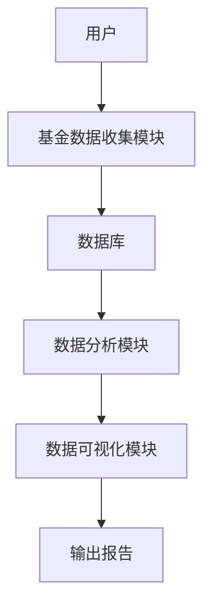

                 


# 约翰·伯格的基金业批评

## 关键词：
约翰·伯格, 基金行业, 被动投资, 主动管理, 费用分析, 投资策略

## 摘要：
本文深入分析了约翰·伯格对传统基金行业的批评，探讨了基金行业的现状、存在的主要问题，以及伯格提出的解决方案。通过详细阐述基金行业的核心概念、数学模型、系统架构和项目实战，本文为读者提供了全面的理解和实践指南。文章结构清晰，内容详实，适合对投资领域感兴趣的专业人士阅读。

---

# 约翰·伯格的基金业批评

## 第一部分：基金行业的现状与问题

### 第1章：基金行业的现状与挑战

#### 1.1 基金行业的背景介绍
- **基金行业的定义与分类**  
  基金行业是指通过集合投资者资金，由专业管理人进行投资管理的金融行业。根据管理方式的不同，基金可以分为主动管理型基金和被动管理型基金；根据投资标的的不同，可以分为股票型基金、债券型基金、混合型基金等。

- **基金行业的市场规模与发展趋势**  
  近年来，全球基金市场规模持续增长，尤其是在美国市场，指数基金和ETF（交易所交易基金）的市场份额显著提升。然而，传统主动管理型基金的市场份额依然占据重要地位。

- **当前行业的主要问题与挑战**  
  - 主动管理基金的费用过高，且长期表现不佳。  
  - 基金经理的行为短期化，倾向于追求短期业绩而非长期收益。  
  - 投资者教育不足，容易被高额费用和复杂产品误导。

---

### 第2章：约翰·伯格的基金业批评

#### 2.1 伯格的核心观点
- **主动管理的局限性**  
  伯格认为，大多数主动管理型基金无法长期跑赢市场指数，且其高昂的管理费用严重损害了投资者的利益。

- **被动投资的优势**  
  伯格主张通过低成本的指数基金进行投资，这种方式既能分散风险，又能以极低的费用实现市场平均收益。

- **基金行业费用过高对投资者的伤害**  
  主动管理基金的平均费用率通常在1%-2%之间，而指数基金的费用率通常在0.1%-0.5%之间。长期来看，高昂的管理费用会显著侵蚀投资者的收益。

---

## 第二部分：基金行业的核心概念与联系

### 第3章：基金行业的核心概念

#### 3.1 基金类型对比

| **基金类型**       | **管理方式**       | **费用结构**       | **风险与收益**       |
|---------------------|---------------------|---------------------|-----------------------|
| 主动管理型基金       | 由基金经理主动操作   | 较高（通常1%-2%）   | 高风险，收益可能超越市场 |
| 被动管理型基金（指数基金） | 按照指数成分股配置   | 较低（通常0.1%-0.5%） | 低风险，收益接近市场平均 |

#### 3.2 基金费用结构
- **管理费**：由基金经理收取，费用率通常在1%-2%之间。  
- **托管费**：支付给托管银行的费用，通常在0.2%-0.5%之间。  
- **其他费用**：包括交易费、注册登记费等，通常隐性收取。

---

## 第三部分：算法原理与数学模型

### 第4章：基金行业的数学模型

#### 4.1 基金费用对收益的影响

**使用CAPM模型分析基金收益**

CAPM模型公式为：  
$$ R_i = R_f + \beta_i (R_m - R_f) $$

其中：
- \( R_i \)：资产的预期收益率
- \( R_f \)：无风险利率
- \( \beta_i \)：资产的系统性风险系数
- \( R_m \)：市场预期收益率

**代码实现：**

```python
import numpy as np
import pandas as pd

# 假设市场收益率为8%，无风险利率为2%
R_f = 0.02
R_m = 0.08

# 计算不同β值下的预期收益率
beta_values = [0.5, 1.0, 1.5, 2.0]
expected_returns = []
for beta in beta_values:
    expected_return = R_f + beta * (R_m - R_f)
    expected_returns.append(expected_return)

# 输出结果
data = {'β值': beta_values, '预期收益率': expected_returns}
print(pd.DataFrame(data))
```

---

## 第四部分：系统分析与架构设计

### 第5章：系统架构设计

#### 5.1 问题场景介绍
- 设计一个基金分析系统，用于分析不同基金的收益与风险，验证伯格的理论。

#### 5.2 系统功能设计

- **数据收集模块**：从公开数据源获取基金的历史收益率、费用率等数据。
- **数据分析模块**：计算基金的夏普比率、最大回撤等风险指标。
- **可视化模块**：绘制基金的收益-风险曲线。

#### 5.3 系统架构设计（mermaid图）



---

## 第五部分：项目实战

### 第6章：项目实战

#### 6.1 环境安装
- 安装Python和必要的库：`pandas`, `numpy`, `matplotlib`.

#### 6.2 核心代码实现

```python
import pandas as pd
import matplotlib.pyplot as plt

# 假设我们有两只基金的数据：主动管理型基金和指数基金
data = {
    '指数基金': [0.05, 0.06, 0.04, 0.07, 0.05],
    '主动基金': [0.03, 0.07, 0.06, 0.04, 0.05]
}

df = pd.DataFrame(data)
df['累计收益'] = df.apply(lambda x: x.cumsum(), axis=0)

# 绘制收益曲线
plt.figure(figsize=(10, 6))
plt.plot(df.index, df['指数基金'], label='指数基金')
plt.plot(df.index, df['主动基金'], label='主动基金')
plt.title('基金收益曲线')
plt.xlabel('年份')
plt.ylabel('累计收益')
plt.legend()
plt.show()
```

---

## 第六部分：最佳实践

### 第7章：总结与展望

#### 7.1 小结
- 约翰·伯格的批评揭示了传统基金行业的诸多问题，尤其是主动管理基金的高费用和低效表现。
- 被动投资策略通过低成本和分散化投资，为投资者提供了更优的选择。

#### 7.2 注意事项
- 投资者应根据自身风险承受能力和投资目标选择合适的投资策略。
- 需要注意基金的费用结构和历史表现，避免被高额费用侵蚀收益。

#### 7.3 拓展阅读
- 《指数投资入门》
- 约翰·伯格的其他著作

---

## 作者：AI天才研究院 & 禅与计算机程序设计艺术

---

感谢您的阅读！希望本文能为您提供有价值的信息和启发。

