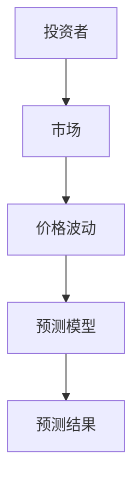
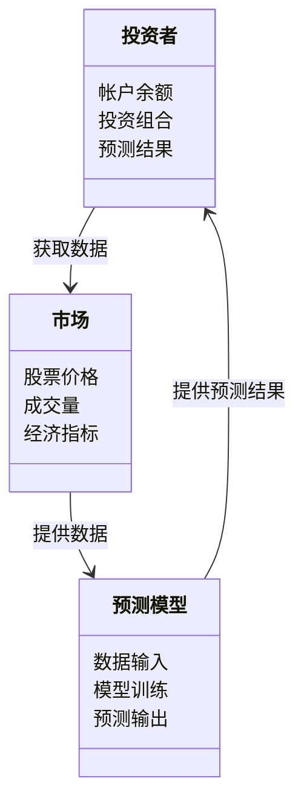

                 


```markdown
# 约翰·伯格的市场预测警告：为什么不要试图择时

## 关键词：市场预测、投资策略、约翰·伯格、价值投资、技术分析、基本面分析、风险管理

## 摘要：本文深入探讨了市场预测的难度与不确定性，分析了约翰·伯格对市场预测的批判及其长期投资策略的重要性。通过技术分析、基本面分析和机器学习算法的原理与局限性，结合系统架构设计和项目实战，强调了避免短期择时、关注长期价值投资的必要性。

---

## 第1章：市场预测的难度与不确定性

### 1.1 市场预测的核心概念

#### 1.1.1 什么是市场预测
市场预测是通过对历史数据、经济指标和技术指标的分析，试图预测未来市场走势的过程。它旨在帮助投资者做出更明智的投资决策。

#### 1.1.2 市场预测的边界与外延
市场预测的边界包括数据的局限性、模型的假设和市场的非线性关系。外延则涉及宏观经济、行业趋势和政策变化等因素。

#### 1.1.3 市场预测的核心要素组成
- 数据：历史价格、成交量、经济指标等。
- 方法：技术分析、基本面分析、算法模型。
- 结果：预测价格、趋势分析、风险评估。

### 1.2 市场预测的背景与问题背景

#### 1.2.1 市场波动的不可预测性
市场波动受多种因素影响，包括经济政策、公司财报、突发事件等，这些因素往往难以量化和预测。

#### 1.2.2 投资者对市场预测的需求
投资者希望通过预测市场走势，抓住投资机会或规避风险。然而，这种需求常常导致过度交易和短期行为。

#### 1.2.3 市场预测与投资决策的关系
市场预测为投资决策提供参考，但过度依赖预测可能导致误判，尤其是在市场波动剧烈时。

### 1.3 约翰·伯格的市场预测警告

#### 1.3.1 伯格的投资理念概述
约翰·伯格是价值投资的代表人物，主张通过长期持有优质股票，避免频繁交易。

#### 1.3.2 伯格对市场预测的批判
伯格认为市场预测本质上是不可靠的，市场的短期波动难以预测，长期趋势更应关注公司的基本面。

#### 1.3.3 伯格的长期投资策略
伯格强调通过分散投资和长期持有，降低短期波动的影响，实现稳定的长期收益。

---

## 第2章：市场预测的核心概念与联系

### 2.1 市场预测的原理

#### 2.1.1 技术分析与基本面分析
- **技术分析**：通过分析历史价格和成交量数据，预测未来走势。
- **基本面分析**：研究公司的财务状况、行业地位和宏观经济环境。

#### 2.1.2 市场预测的数学模型
- **线性回归模型**：用于分析变量之间的线性关系。
- **时间序列分析**：预测未来的趋势和周期性变化。

#### 2.1.3 市场预测的不确定性
市场预测的不确定性来源于数据的噪声、模型的简化假设以及市场的不可预测性。

### 2.2 市场预测的核心概念对比

#### 2.2.1 技术分析与基本面分析的对比
| 对比维度 | 技术分析 | 基本面分析 |
|----------|----------|------------|
| 数据来源 | 历史价格 | 公司财报、宏观经济 |
| 方法 | 图表模式、技术指标 | 财务指标、行业分析 |
| 适用场景 | 短期趋势 | 长期投资 |

#### 2.2.2 不同预测方法的优缺点
- **技术分析**：快速识别趋势，但缺乏对根本原因的分析。
- **基本面分析**：提供公司内在价值，但需要大量数据和分析。

#### 2.2.3 市场预测的复杂性与不可控性
市场预测的复杂性源于多因素的相互作用，而不可控性则来自突发事件和市场参与者的非理性行为。

### 2.3 市场预测的ER实体关系图



---

## 第3章：市场预测算法的原理与局限性

### 3.1 常见的市场预测算法

#### 3.1.1 线性回归模型
$$ y = \beta_0 + \beta_1x + \epsilon $$

#### 3.1.2 时间序列分析
$$ ARIMA(p, d, q) $$

#### 3.1.3 机器学习算法
$$ y = f(x) $$

### 3.2 算法原理的数学模型

#### 3.2.1 线性回归模型
线性回归用于预测连续变量，假设自变量与因变量之间存在线性关系。

#### 3.2.2 时间序列模型
ARIMA模型适用于预测具有趋势和周期性的数据。

#### 3.2.3 机器学习模型
机器学习通过复杂算法捕捉数据中的非线性关系，但需要大量数据支持。

### 3.3 算法原理的代码实现

#### 3.3.1 线性回归代码示例
```python
import numpy as np
from sklearn.linear_model import LinearRegression

# 生成数据
X = np.array([i for i in range(100)]).reshape(-1, 1)
y = 2 * X + 1 + np.random.randn(100).reshape(-1, 1)

# 训练模型
model = LinearRegression()
model.fit(X, y)

# 预测
y_pred = model.predict(X)
print("回归系数:", model.coef_)
```

#### 3.3.2 时间序列分析代码示例
```python
from statsmodels.tsa.arima_model import ARIMA

# 生成数据
data = [1, 2, 3, 4, 5, 6, 7, 8, 9, 10]

# 训练模型
model = ARIMA(data, order=(1, 1, 1))
model_fit = model.fit()

# 预测
forecast = model_fit.forecast(steps=5)
print("预测值:", forecast)
```

---

## 第4章：系统分析与架构设计

### 4.1 问题场景介绍
设计一个市场预测系统，旨在通过历史数据预测未来走势，帮助投资者做出决策。

### 4.2 系统功能设计

#### 4.2.1 领域模型类图


### 4.3 系统架构设计

#### 4.3.1 架构图


---

## 第5章：项目实战

### 5.1 环境安装与配置
安装必要的库：`numpy`, `pandas`, `scikit-learn`, `statsmodels`。

### 5.2 核心功能实现

#### 5.2.1 数据获取与处理
使用Yahoo Finance API获取股票数据。

```python
import pandas_datareader as pdr
data = pdr.get_data_yahoo('AAPL', start='2020-01-01', end='2023-12-31')
```

#### 5.2.2 预测模型训练与预测
训练ARIMA模型并生成预测结果。

```python
from statsmodels.tsa.arima_model import ARIMA

# 训练模型
model = ARIMA(data['Adj Close'], order=(5,1,0))
model_fit = model.fit()

# 预测
forecast = model_fit.forecast(steps=30)
```

### 5.3 代码应用与解读
解读代码的功能，分析预测结果的准确性，并讨论其在实际投资中的应用。

### 5.4 实际案例分析
以苹果公司股票为例，分析预测结果与实际走势的差异，探讨模型的局限性。

### 5.5 项目小结
总结项目实现的关键点，强调模型的局限性和实际应用中的注意事项。

---

## 第6章：最佳实践、小结与注意事项

### 6.1 最佳投资策略
- 长期投资：避免频繁交易，减少交易成本。
- 分散投资：降低单一投资的风险。

### 6.2 风险管理技巧
- 设置止损点：限制潜在损失。
- 定期调整：根据市场变化调整投资组合。

### 6.3 投资者的自我管理
- 控制情绪：避免贪婪和恐惧影响决策。
- 持续学习：不断提升自己的市场认知和分析能力。

### 6.4 拓展阅读推荐
- 《价值》——约翰·伯格
- 《投资学精要》——加里·布莱利

---

## 作者：AI天才研究院/AI Genius Institute & 禅与计算机程序设计艺术/Zen And The Art of Computer Programming
```

