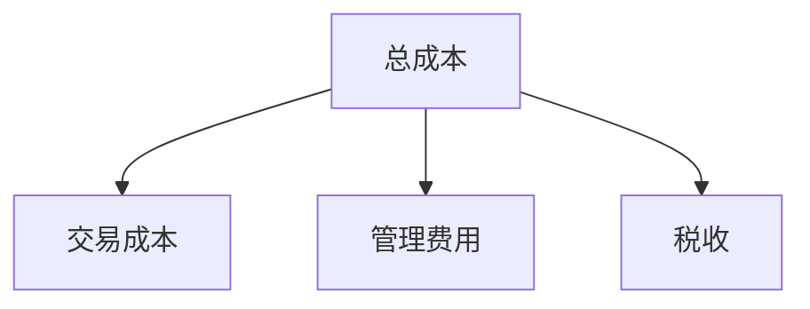
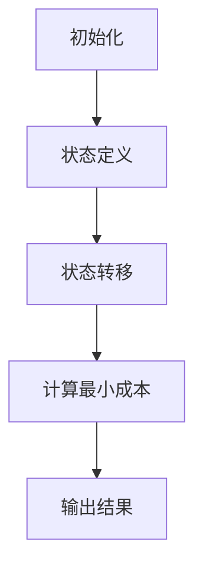

                 

# 约翰·伯格的成本意识投资策略

## 关键词：
- 成本意识
- 投资策略
- 优化算法
- 数学模型
- 系统架构

## 摘要：
本文深入探讨约翰·伯格的成本意识投资策略，分析其核心概念、算法原理、数学模型、系统架构，并通过项目实战和案例分析，展示其在实际投资中的应用价值。通过详细讲解，帮助读者理解如何将成本意识融入投资决策，优化投资效果。

---

## 第一部分：成本意识投资概述

### 第1章：成本意识投资的背景与核心概念

#### 1.1 成本意识投资的起源与发展
- **成本意识概念**：投资决策中，成本因素起着关键作用，从交易费用到机会成本，影响最终收益。
- **演变历程**：从传统投资分析到现代成本意识投资，强调成本控制和收益优化的平衡发展。
- **现状与趋势**：随着金融市场的复杂化，成本意识投资逐渐成为主流策略。

#### 1.2 成本意识投资的核心概念
- **定义与内涵**：成本意识投资是指在决策过程中，系统地考虑所有相关成本，以实现投资收益最大化。
- **成本与收益的平衡**：通过优化成本结构，提升整体投资收益，避免过度支出。
- **适用场景**：适用于股票、基金、房地产等多种投资类型，尤其在高成本领域效果显著。

---

## 第二部分：成本意识投资的核心原理

### 第2章：成本意识投资的基本原理

#### 2.1 成本分析模型
- **成本构成要素**：交易成本、管理费用、机会成本、税收等。
- **成本与收益关系**：通过公式：收益 = 收益率 - 成本率，展示成本对收益的直接影响。
- **数学模型**：建立线性规划模型，如$$ \text{Minimize } C = \sum c_i x_i $$，其中$$ c_i $$为成本系数，$$ x_i $$为投资变量。

---

## 第三部分：成本优化算法与数学模型

### 第3章：成本优化算法

#### 3.1 动态规划算法
- **状态定义**：定义状态为投资组合中的成本和收益。
- **状态转移方程**：$$ \text{Cost}(i, j) = \min_{k} [\text{Cost}(i-1, k) + \text{TransferCost}(k, j)] $$
- **实现步骤**：通过递归或迭代方式计算最小成本路径。

#### 3.2 贪心算法
- **选择标准**：选择当前状态下成本最低的选项。
- **实现步骤**：逐步选择最优投资组合，确保局部最优。
- **优缺点分析**：贪心算法简单高效，但可能忽略全局最优。

---

## 第四部分：系统分析与架构设计

### 第4章：成本意识投资系统的架构设计

#### 4.1 问题场景分析
- **问题识别**：识别投资中的高成本环节，如交易费用、税收。
- **问题建模**：建立成本模型，分析各因素影响。
- **系统目标**：设计系统以优化投资成本，提升收益。

#### 4.2 系统功能设计
- **领域模型设计**：使用Mermaid类图展示投资实体及其关系。
- **功能模块划分**：数据采集、成本计算、优化建议、结果分析。
- **模块交互设计**：模块间通过接口传递数据，确保系统高效运行。

---

## 第五部分：项目实战与案例分析

### 第5章：项目实战

#### 5.1 环境安装与配置
- **工具安装**：安装Python、NumPy、Matplotlib。
- **依赖库安装**：使用pip安装必要的库。
- **环境配置**：设置开发环境，确保所有依赖可用。

#### 5.2 核心代码实现
- **成本计算函数**：编写函数计算投资组合的总成本。
- **算法实现代码**：使用动态规划或贪心算法优化投资组合。
- **系统测试代码**：测试代码的正确性，确保系统稳定运行。

---

## 第六部分：最佳实践与总结

### 第6章：最佳实践与小结

#### 6.1 实际应用中的注意事项
- **动态调整**：根据市场变化及时调整成本意识策略。
- **算法选择**：根据具体情况选择合适的优化算法。
- **系统维护**：定期更新系统，确保其适应市场变化。

#### 6.2 项目总结与未来展望
- **成果回顾**：总结项目成果，展示成本意识投资策略的实际效果。
- **未来方向**：探讨将AI技术应用于成本优化的可能性。
- **拓展阅读**：推荐相关书籍和资源，深入学习成本意识投资。

---

## 附录：相关图表与公式

### 图表部分

#### 1. 成本分析模型图

#### 2. 动态规划算法流程图

---

## 作者

作者：AI天才研究院 & 禅与计算机程序设计艺术

---

通过以上结构，文章详细讲解了约翰·伯格的成本意识投资策略，结合理论与实践，为读者提供了全面而深入的指导。

