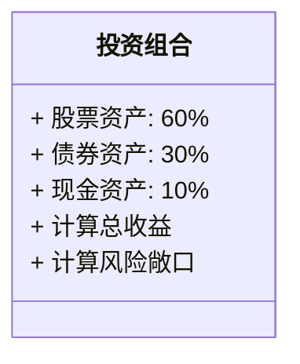
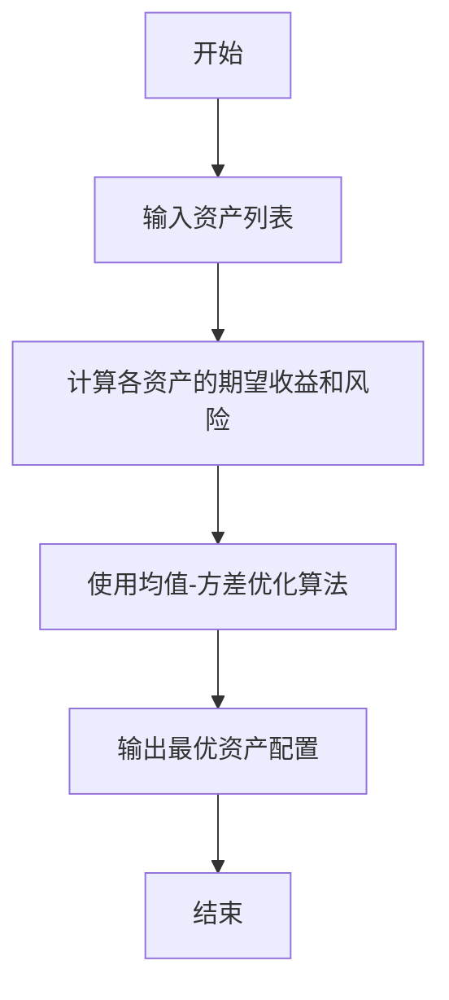
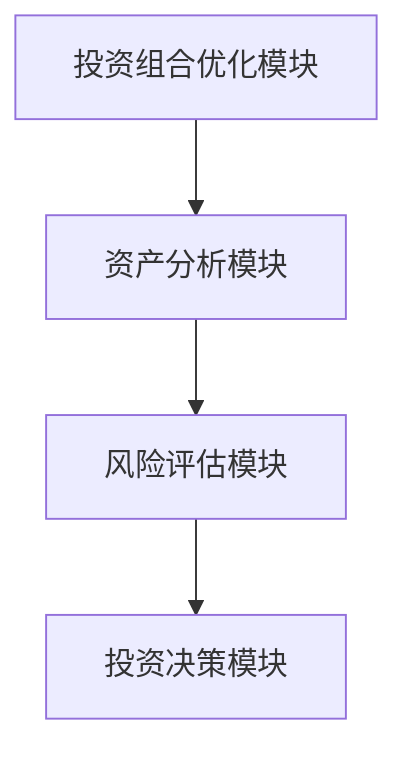

                 


# 约翰·伯格的投资常识：简单胜于复杂

> 关键词：价值投资，投资组合，风险管理，复利效应，长期投资策略

> 摘要：本文深入探讨了约翰·伯格的投资哲学，强调简单投资的重要性。通过分析投资的基本原则、如何选择投资标的、投资心态与行为管理以及长期投资策略，本文为读者提供了一套简单而有效的投资方法论。结合技术语言和专业分析，本文旨在帮助读者理解投资的本质，并在实际操作中实现财富的长期增长。

---

# 第一部分: 背景介绍

## 第1章: 投资的基本概念与重要性

### 1.1 投资的基本定义
投资是指将资金投入到特定资产中，以期获得未来收益的行为。投资的范围广泛，包括股票、债券、房地产、基金等多种资产类别。在现代金融体系中，投资是个人和机构实现财富增长的重要手段。

#### 1.1.1 投资与投机的区别
- **投资**：基于对资产长期价值的分析，注重基本面研究和风险控制，追求稳定收益。
- **投机**：基于市场短期波动的预测，注重技术分析和市场情绪，风险较高，收益不稳定。

#### 1.1.2 长期价值投资的重要性
长期价值投资强调以低于资产内在价值的价格买入优质资产，并长期持有。这种方法通过复利效应实现财富的稳步增长，同时降低了短期波动对投资组合的冲击。

### 1.2 简单投资的重要性
简单投资策略的核心在于避免过度复杂化，减少交易成本和心理负担。复杂的投资策略容易导致决策失误，尤其是在市场波动加剧的情况下。

#### 1.2.1 为什么简单胜于复杂
- 简单策略易于理解和执行。
- 复杂策略容易受到情绪和市场的干扰。
- 简单策略更注重长期价值，减少短期波动的干扰。

### 1.3 约翰·伯格的投资哲学
约翰·伯格是价值投资的代表人物之一，他的投资理念强调长期持有优质资产，避免频繁交易。

#### 1.3.1 长期价值投资的哲学基础
- 质量优先：选择具有强大竞争力和良好财务状况的企业。
- 长期持有：通过复利效应实现财富增长。
- 风险控制：避免过度杠杆和高风险资产。

---

# 第二部分: 核心概念与联系

## 第2章: 投资的基本原则

### 2.1 价值投资的核心原则
价值投资是约翰·伯格投资哲学的核心，其基本原则包括：

#### 2.1.1 股票的内在价值计算
股票的内在价值是基于企业未来现金流的折现值。以下是内在价值计算的简化公式：

$$
\text{内在价值} = \sum_{t=1}^{n} \frac{CF_t}{(1 + r)^t}
$$

其中，\(CF_t\) 是第 \(t\) 年的现金流，\(r\) 是折现率。

#### 2.1.2 安全边际的概念
安全边际是指股票的市场价格低于其内在价值的程度。安全边际越高，投资风险越小。

### 2.2 投资组合的构建与优化
投资组合的构建需要考虑资产配置、风险分散和收益最大化。

#### 2.2.1 投资组合的类图
以下是一个简单的投资组合类图，展示了不同类型资产的关系：



#### 2.2.2 投资组合优化算法
以下是一个简单的投资组合优化算法流程图：



以下是均值-方差优化算法的数学公式：

$$
\text{目标函数：} \quad \text{最小化} \quad \sigma^2
$$

$$
\text{约束条件：} \quad \sum_{i=1}^{n} w_i = 1
$$

其中，\(w_i\) 是第 \(i\) 个资产的权重，\(\sigma^2\) 是投资组合的方差。

### 2.3 风险管理的核心要素
风险管理是投资成功的关键，以下是风险管理的核心要素：

#### 2.3.1 风险的定义与分类
- 系统性风险：影响整个市场的风险，如经济衰退、通货膨胀。
- 非系统性风险：特定资产或行业的风险，如企业经营风险。

#### 2.3.2 风险管理的步骤与方法
1. **识别风险**：分析投资组合中的潜在风险。
2. **量化风险**：计算风险敞口和波动率。
3. **分散风险**：通过资产配置降低非系统性风险。

---

# 第三部分: 系统分析与架构设计

## 第3章: 投资系统的架构设计

### 3.1 项目介绍
本项目旨在构建一个基于约翰·伯格投资哲学的简单投资系统，帮助投资者实现长期财富增长。

#### 3.1.1 系统功能设计
- 资产分析模块：分析股票、债券等资产的基本面。
- 风险评估模块：计算投资组合的风险敞口。
- 投资组合优化模块：基于均值-方差算法优化资产配置。

#### 3.1.2 系统架构设计
以下是系统的架构图：



---

# 第四部分: 项目实战

## 第4章: 投资实战案例

### 4.1 环境安装
安装必要的Python库：

```bash
pip install numpy pandas matplotlib
```

### 4.2 核心代码实现
以下是均值-方差优化算法的Python代码：

```python
import numpy as np

def portfolio_optimization(returns):
    # 计算协方差矩阵
    covariance_matrix = np.cov(returns)
    
    # 计算各资产的期望收益
    expected_returns = np.mean(returns, axis=0)
    
    # 使用均值-方差优化算法
    def objective(w):
        return np.dot(w.T, covariance_matrix.dot(w))
    
    # 约束条件：权重之和为1
    def constraint(w):
        return np.sum(w) - 1
    
    # 使用SciPy求解优化问题
    from scipy.optimize import minimize
    result = minimize(objective, np.ones(len(expected_returns))/len(expected_returns), 
                      method='SLSQP', constraints=[{'type': 'eq', 'fun': constraint}])
    
    return result.x

# 示例数据
returns = np.array([[0.1, 0.2, 0.15],
                    [0.05, 0.1, 0.08],
                    [0.08, 0.12, 0.1]])

weights = portfolio_optimization(returns)
print(weights)
```

---

# 第五部分: 注意事项与最佳实践

## 第5章: 投资中的注意事项

### 5.1 风险提示
- 投资有风险，需谨慎评估自身风险承受能力。
- 市场波动可能对投资组合产生重大影响。

### 5.2 最佳实践 tips
- 定期审视投资组合，及时调整资产配置。
- 避免频繁交易，减少交易成本和税务负担。
- 保持长期视角，耐心持有优质资产。

---

# 小结

通过本文的分析，我们深入了解了约翰·伯格的投资哲学，掌握了简单投资策略的核心要点。在实际操作中，投资者应注重基本面分析和风险管理，避免复杂化投资策略。通过长期持有优质资产，投资者可以在复利效应的推动下实现财富的稳步增长。

---

# 作者

作者：AI天才研究院/AI Genius Institute & 禅与计算机程序设计艺术/Zen And The Art of Computer Programming

