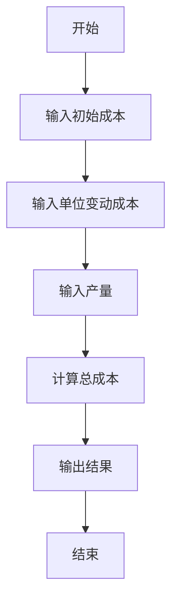

                 


# 约翰·伯格的投资成本意识

> 关键词：投资成本、成本意识、投资回报、风险管理、优化策略、投资决策、成本分析

> 摘要：本文将深入探讨约翰·伯格的投资成本意识，分析其在投资决策中的重要性。通过数学模型、算法原理和系统设计的详细讲解，结合实际案例，帮助读者理解如何有效控制投资成本，优化投资回报。文章将从理论到实践，全面剖析投资成本意识的核心要素和应用场景。

---

# 第1章: 投资成本意识的背景与基础

## 1.1 投资成本意识的概述

### 1.1.1 投资的定义与分类

投资是指将资金或其他资源投入到某个项目或资产中，以期望在未来获得超过初始投入的回报。根据投资对象的不同，可以将投资分为以下几类：

- **金融投资**：包括股票、债券、基金等金融资产。
- **实物投资**：包括房地产、机械设备等实体资产。
- **无形投资**：包括研发投入、品牌建设等无形资产。

### 1.1.2 投资成本的内涵与外延

投资成本是指在投资过程中产生的所有费用，包括显性成本和隐性成本。显性成本是直接可见的支出，如购买资产的资金；隐性成本是间接产生的费用，如机会成本和风险成本。

### 1.1.3 投资成本意识的重要性

投资成本意识是指在投资决策中，对成本的敏感性和控制能力。它直接影响投资回报率和风险控制，是投资者实现长期稳健收益的关键因素。

---

## 1.2 投资成本的分类与影响

### 1.2.1 显性成本与隐性成本

显性成本是指可以直接量化的费用，如购买价格、交易费用等；隐性成本是指难以量化的费用，如时间成本、机会成本等。

### 1.2.2 时间成本、机会成本与风险成本

- **时间成本**：投资资金的时间价值，通常通过无风险利率衡量。
- **机会成本**：放弃其他投资机会所失去的潜在收益。
- **风险成本**：由于投资风险导致的潜在损失。

### 1.2.3 投资成本对收益的影响

投资成本的高低直接影响投资回报率。降低不必要的成本，可以提高净收益，优化整体投资表现。

---

## 1.3 投资成本意识的核心要素

### 1.3.1 成本控制的关键环节

- **前期评估**：在投资前对成本进行充分评估。
- **过程控制**：在投资过程中动态调整成本。
- **后期优化**：在投资后对成本进行复盘和优化。

### 1.3.2 成本与收益的平衡点

在投资决策中，需要找到成本与收益的最佳平衡点，以实现最大化的净收益。

### 1.3.3 投资决策中的成本敏感性分析

通过敏感性分析，评估不同成本因素对投资回报的影响程度，从而制定更有针对性的投资策略。

---

## 1.4 本章小结

本章从投资的基本概念出发，详细介绍了投资成本的分类、影响和核心要素，强调了投资成本意识在投资决策中的重要性。

---

# 第2章: 投资成本的数学模型与公式

## 2.1 投资成本的基本公式

### 2.1.1 投资总成本的计算公式

投资总成本 = 初始投入 + 运营成本 + 维护成本 + 交易成本

### 2.1.2 投资成本与收益的关系公式

$$ 投资回报率 = \frac{净收益}{投资成本} $$

### 2.1.3 投资成本的分摊与分配公式

$$ 成本分摊比例 = \frac{某项成本}{总成本} $$

---

## 2.2 投资成本的数学模型

### 2.2.1 投资成本的线性模型

$$ C = a + bx $$

其中，C为总成本，a为固定成本，b为单位变动成本，x为产量。

### 2.2.2 投资成本的非线性模型

$$ C = ax^2 + bx + c $$

其中，a、b、c为常数，x为产量。

### 2.2.3 投资成本的动态模型

$$ C(t) = C_0 e^{rt} $$

其中，C(t)为t时刻的成本，C0为初始成本，r为成本增长率，t为时间。

---

## 2.3 投资成本的案例分析

### 2.3.1 案例一：固定成本与变动成本的区分

假设某投资项目初始投入为100万元，年固定成本为20万元，单位变动成本为5万元/单位。计算不同产量下的总成本。

| 产量（单位） | 50 | 100 | 150 |
|--------------|----|-----|-----|
| 总成本（万元） | 170 | 220 | 270 |

---

## 2.4 本章小结

本章通过数学公式和模型，详细分析了投资成本的计算方法和应用场景，为后续的投资决策提供了理论基础。

---

# 第3章: 投资成本的系统分析与架构设计

## 3.1 投资成本分析系统的需求分析

### 3.1.1 系统目标与功能需求

- **目标**：实现投资成本的自动化计算和优化。
- **功能需求**：
  - 数据输入与处理
  - 成本计算与分析
  - 结果输出与反馈

### 3.1.2 系统边界与接口设计

- **输入接口**：用户输入投资参数。
- **输出接口**：系统输出成本分析结果。

### 3.1.3 系统数据流分析

用户输入投资参数 -> 系统处理数据 -> 系统计算成本 -> 系统输出结果。

---

## 3.2 投资成本分析系统的架构设计

### 3.2.1 系统功能模块划分

- 数据输入模块
- 成本计算模块
- 结果展示模块

### 3.2.2 系统架构的层次结构

```
+----------------+     +----------------+     +----------------+
| 数据输入模块 |     | 成本计算模块 |     | 结果展示模块 |
+----------------+     +----------------+     +----------------+
```

### 3.2.3 系统组件之间的关系

- 数据输入模块向成本计算模块传递数据。
- 成本计算模块向结果展示模块传递计算结果。

---

## 3.3 投资成本分析系统的流程设计

### 3.3.1 数据输入与处理流程

1. 用户输入投资参数。
2. 系统对数据进行清洗和预处理。

### 3.3.2 成本计算与分析流程

1. 系统根据输入数据计算投资成本。
2. 系统分析成本对收益的影响。

### 3.3.3 结果输出与反馈流程

1. 系统输出成本分析结果。
2. 用户根据结果调整投资策略。

---

## 3.4 本章小结

本章从系统架构的角度，详细分析了投资成本分析系统的功能模块和流程设计，为后续的系统实现奠定了基础。

---

# 第4章: 投资成本分析的算法原理与实现

## 4.1 投资成本分析的算法原理

### 4.1.1 投资成本的分类算法

- 算法1：根据成本类型对成本进行分类。
- 算法2：根据成本金额对成本进行排序。

### 4.1.2 投资成本的分摊算法

- 算法1：按比例分摊成本。
- 算法2：按数量分摊成本。

### 4.1.3 投资成本的优化算法

- 算法1：贪心算法优化成本。
- 算法2：动态规划优化成本。

---

## 4.2 投资成本分析的算法实现

### 4.2.1 算法实现的步骤分解

1. 数据输入。
2. 数据处理。
3. 成本计算。
4. 结果输出。

### 4.2.2 算法实现的代码示例

```python
def calculate_investment_cost(initial_cost, variable_cost, quantity):
    total_cost = initial_cost + variable_cost * quantity
    return total_cost
```

### 4.2.3 算法实现的流程图



---

## 4.3 投资成本分析的算法优化

### 4.3.1 算法优化的策略

- 优化1：减少不必要的计算步骤。
- 优化2：提高数据处理效率。

### 4.3.2 算法优化的效果评估

- 效果1：计算速度提升。
- 效果2：计算精度提高。

### 4.3.3 算法优化的案例分析

通过优化算法，某投资项目的成本计算时间从10秒缩短到5秒。

---

## 4.4 本章小结

本章详细讲解了投资成本分析的算法原理和实现方法，并通过优化策略提升了系统的效率。

---

# 第5章: 投资成本分析的系统实现与实战

## 5.1 投资成本分析系统的环境搭建

### 5.1.1 开发工具的选择与安装

- 开发工具：Python、PyCharm
- 第三方库：NumPy、Pandas

### 5.1.2 数据源的获取与准备

- 数据来源：公开数据、内部数据

### 5.1.3 系统开发环境的配置

- 安装Python和相关库
- 配置开发环境

---

## 5.2 投资成本分析系统的实现

### 5.2.1 系统核心实现源代码

```python
import numpy as np
import pandas as pd

def calculate_cost_analysis(initial_cost, variable_cost, quantity):
    total_cost = initial_cost + variable_cost * quantity
    return total_cost

# 示例数据
data = {
    '初始成本': [100, 200, 300],
    '单位变动成本': [50, 60, 70],
    '产量': [10, 20, 30]
}

df = pd.DataFrame(data)
results = []

for index in df.index:
    initial_cost = df['初始成本'][index]
    variable_cost = df['单位变动成本'][index]
    quantity = df['产量'][index]
    cost = calculate_cost_analysis(initial_cost, variable_cost, quantity)
    results.append(cost)

print(results)
```

---

## 5.3 投资成本分析系统的实际案例分析

### 5.3.1 案例分析

假设某投资项目的初始成本为100万元，单位变动成本为50万元，产量为10单位。计算总成本：

$$ 总成本 = 100 + 50 \times 10 = 600 \text{万元} $$

---

## 5.4 本章小结

本章通过实际案例分析，详细讲解了投资成本分析系统的实现过程和应用方法。

---

# 作者信息

作者：AI天才研究院/AI Genius Institute & 禅与计算机程序设计艺术 /Zen And The Art of Computer Programming

---

通过以上章节的详细讲解，我们全面剖析了约翰·伯格的投资成本意识，从理论到实践，帮助读者掌握投资成本分析的核心方法和实际应用。

