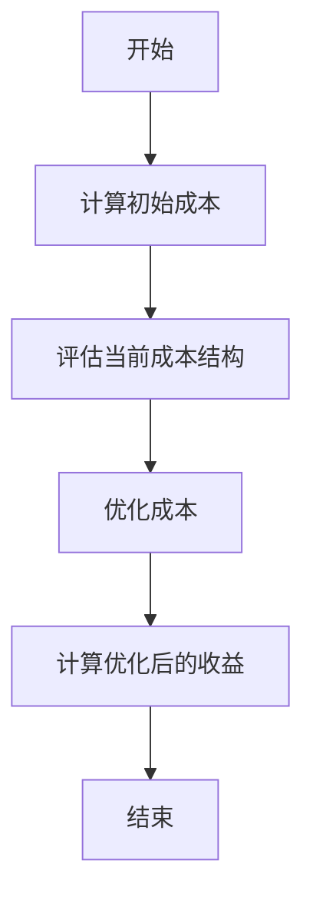
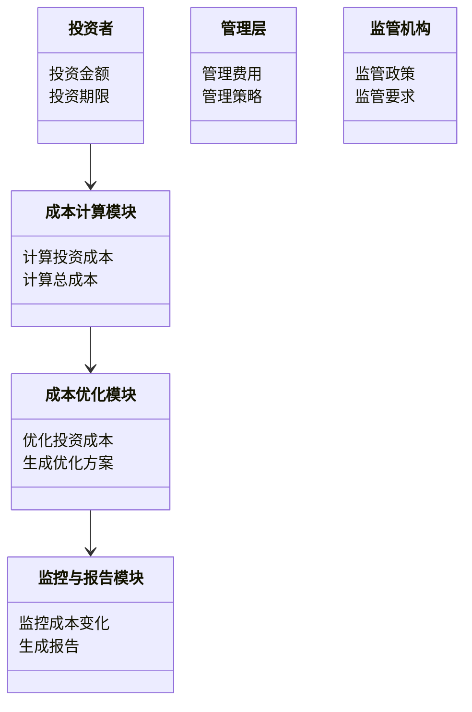
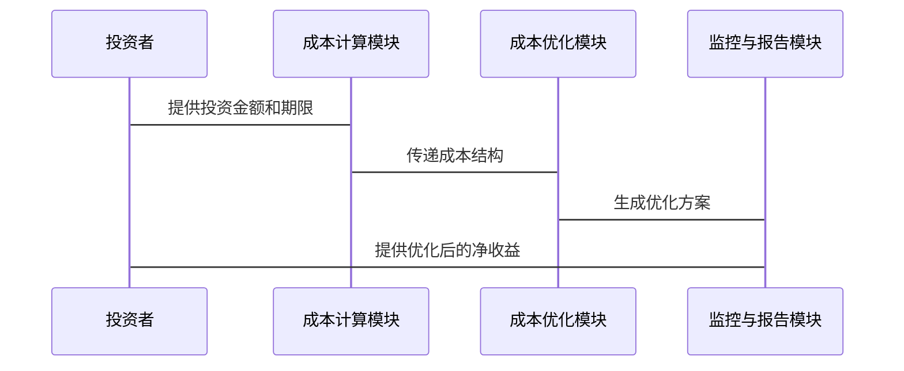

                 


# 约翰·伯格的投资成本控制理论

## 关键词：投资成本控制，约翰·伯格，投资理论，成本模型，优化算法，系统架构

## 摘要

本文深入探讨了约翰·伯格的投资成本控制理论，分析其核心概念、算法原理、系统架构，并通过项目实战展示其应用。文章从投资成本控制的背景出发，详细解释了伯格的理论，包括成本构成、数学模型和优化算法，最后结合实际案例，总结最佳实践和应用注意事项。

---

## 第一部分：投资成本控制的背景与基础

### 第1章：投资成本控制的背景介绍

#### 1.1 投资成本控制的背景与意义

- **1.1.1 投资成本控制的背景**
  在金融市场中，投资成本直接影响投资收益，降低无效成本是提高投资效率的关键。传统投资方法忽视了成本控制的重要性，导致投资收益被侵蚀。

- **1.1.2 投资成本控制的重要性**
  通过有效控制成本，投资者可以提升整体收益，增强投资组合的竞争力。在竞争激烈的市场中，成本优势是长期成功的关键因素。

- **1.1.3 约翰·伯格的理论贡献**
  伯格提出了一套系统性的投资成本控制理论，强调通过优化投资流程和决策来降低不必要的成本，其理论在现代投资管理中具有重要地位。

#### 1.2 投资成本控制的基本概念

- **1.2.1 投资成本的定义**
  投资成本指投资者在投资过程中产生的所有费用，包括管理费、交易费、税费等。

- **1.2.2 投资成本的分类**
  成本通常分为显性成本（如管理费）和隐性成本（如机会成本）。

- **1.2.3 投资成本控制的目标**
  最终目标是将总成本降至最低，同时确保投资收益的最大化，实现成本与收益的最佳平衡。

#### 1.3 投资成本控制的理论基础

- **1.3.1 投资成本控制的核心原理**
  通过系统化的方法分析和优化每个成本环节，消除低效和浪费，提升整体投资效率。

- **1.3.2 投资成本控制的数学模型**
  建立成本与收益的数学关系，通过优化模型找到成本最小化的策略。

- **1.3.3 投资成本控制的边界与外延**
  明确成本控制的范围和限制条件，确保理论在实际应用中的可行性。

### 第2章：投资成本控制的核心概念与联系

#### 2.1 投资成本控制的核心概念

- **2.1.1 投资成本的构成要素**
  包括管理费、交易费、税费、咨询费等。

- **2.1.2 投资成本与收益的关系**
  成本的增加会侵蚀收益，因此需要在两者之间找到平衡点。

- **2.1.3 投资成本控制的关键因素**
  管理效率、交易策略、税务规划是影响成本的关键因素。

#### 2.2 投资成本控制的原理与联系

- **2.2.1 投资成本控制的原理分析**
  分析每个成本环节，优化资源配置，降低整体成本。

- **2.2.2 投资成本控制的核心要素**
  包括成本分析、优化策略、监控机制。

- **2.2.3 投资成本控制的系统架构**
  通过系统化的架构设计，实现对成本的全面管理。

#### 2.3 投资成本控制的ER实体关系图

```mermaid
erDiagram
    actor 投资者 {
        <属性> 投资金额
        <属性> 投资期限
    }
    actor 管理层 {
        <属性> 管理费用
        <属性> 管理策略
    }
    actor 监管机构 {
        <属性> 监管政策
        <属性> 监管要求
    }
    投资者 --> 管理层 : 委托管理
    管理层 --> 监管机构 : 遵守监管
```

## 第二部分：投资成本控制的算法与数学模型

### 第3章：投资成本控制的算法

#### 3.1 投资成本控制的数学模型

投资成本与收益的关系可以用以下公式描述：

$$
\text{总收益} = \text{投资收益} - \text{投资成本}
$$

通过优化模型，找到使总收益最大的投资成本控制策略：

$$
\min C \quad \text{subject to} \quad R - C \geq R_{\text{min}}
$$

其中，\( C \) 是投资成本，\( R \) 是投资收益，\( R_{\text{min}} \) 是最低收益要求。

#### 3.2 投资成本控制算法的实现

使用Python编写优化算法，实现对投资成本的控制：

```python
import numpy as np

def investment_cost_optimization(initial_investment, return_rate, cost_structure):
    """
    计算投资成本优化后的收益
    :param initial_investment: 初始投资
    :param return_rate: 预期年化收益率
    :param cost_structure: 成本结构（管理费、交易费等）
    :return: 优化后的净收益
    """
    total_cost = sum(cost_structure.values())
    net_return = initial_investment * (return_rate - total_cost/initial_investment)
    return net_return

# 示例应用
initial_investment = 1000000
return_rate = 0.12
cost_structure = {'管理费': 0.01, '交易费': 0.002, '税费': 0.0015}

optimized_return = investment_cost_optimization(initial_investment, return_rate, cost_structure)
print(f"优化后的净收益为: ${optimized_return:.2f}")
```

#### 3.3 投资成本控制算法的流程图



---

## 第三部分：投资成本控制的系统架构与实现

### 第4章：投资成本控制系统的架构设计

#### 4.1 系统功能设计

- **4.1.1 成本计算模块**
  计算各项投资成本，包括管理费、交易费等。

- **4.1.2 成本优化模块**
  使用优化算法降低投资成本，提高收益。

- **4.1.3 监控与报告模块**
  监控成本变化，生成成本分析报告。

#### 4.2 系统架构设计



#### 4.3 系统接口设计

- **输入接口**
  - 接收投资者的投资金额和期限
  - 接收管理层的管理策略和费用

- **输出接口**
  - 提供优化后的投资成本
  - 生成成本分析报告

#### 4.4 系统交互流程



---

## 第四部分：投资成本控制的项目实战

### 第5章：项目实战

#### 5.1 项目背景与目标

假设我们管理一个100万美元的投资组合，目标是通过优化投资成本，提高整体收益。

#### 5.2 环境安装

- 安装Python和必要的库（如numpy、pandas）

#### 5.3 核心代码实现

```python
import numpy as np

def calculate_investment_cost(investment, costs):
    """
    计算投资成本
    :param investment: 投资金额
    :param costs: 成本结构（字典）
    :return: 总成本
    """
    total_cost = sum(costs.values())
    return investment * total_cost

# 示例应用
investment = 1000000
costs = {'管理费': 0.01, '交易费': 0.002, '税费': 0.0015}
total_cost = calculate_investment_cost(investment, costs)
print(f"总成本为: ${total_cost:.2f}")
```

#### 5.4 代码解读与分析

代码通过计算各分项成本，得出总成本，帮助投资者了解成本结构。

#### 5.5 案例分析

假设优化后，总成本降低5%，则投资收益提升，净收益增加。

---

## 第五部分：投资成本控制的总结与展望

### 第6章：总结与展望

#### 6.1 最佳实践

- 定期审查和优化成本结构
- 选择高效的管理策略
- 利用技术工具辅助成本管理

#### 6.2 小结

约翰·伯格的投资成本控制理论提供了一套系统的方法，帮助投资者在激烈的市场竞争中降低成本，提升收益。

#### 6.3 注意事项

- 成本控制需要系统化的分析和优化
- 注意成本降低可能带来的风险
- 定期监控和调整成本结构

#### 6.4 拓展阅读

建议深入研究现代投资组合理论和量化投资方法，进一步提升成本控制能力。

---

## 作者

作者：AI天才研究院/AI Genius Institute & 禅与计算机程序设计艺术/Zen And The Art of Computer Programming

